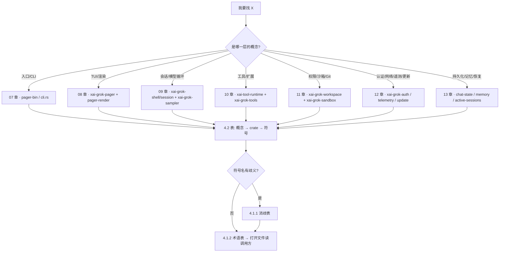

[上一篇：跨模块完整运行链与场景](15-跨模块完整运行链与场景.md) · [总目录](README.md) · [下一篇：可靠性与通用技术实现说明书](可靠性与通用技术实现说明书.md)

# 16 · 术语表与源码查找手册

> **场景**：你拿到了一个需求 / 一个 bug / 一个「这功能在哪实现」的问题，但面对 **101 个 workspace 成员**（`Cargo.toml` `members`，`awk '/^members = \[/,/^\]/' Cargo.toml | grep -c '"'` → 101）不知从哪下手。本章给你三份速查表——**同名异义消歧表**（一个词在几个 crate 里各有含义）、**术语表**（名词→含义）、**源码查找手册**（概念→crate→符号）。把它当字典用。
>
> **阅读说明**：源码基准 `HEAD = 6c01b90c`（2026-09-20）。工具版本：Rust `1.94.0`（`rust-toolchain.toml:11`）、`ratatui 0.29` / `ratatui-core 0.1` / `tokio full` / `agent-client-protocol 0.10.4`（`Cargo.toml` `[workspace.dependencies]`）。
>
> **锚点记法**：本文一律写「路径 · 符号(+偏移)」。`+0` 就是该 `struct` / `enum` / `trait` / `fn` 的定义行，偏移相对定义行计算，例如 `handle.rs · SessionHandle(+0)` 表示定义行本身、`+47` 表示定义行往下第 47 行。**绝对行号随版本漂移，不要把它写进脚本或测试断言**；需要行号时以当前工作区重新 `rg -n` 为准。
>
> **本次刷新修正**（旧版基于 `d5a0335a`，已失实）：① workspace 成员 **93 → 101**；② 旧版列的 `CompoundResolver`（`resolver.rs:215`）在当前源码中**已不存在**，多路工具源聚合改由 `FinalizedToolset` + `impl ToolDispatch for InnerDispatchForToolset` 承担；③ 旧版列的 `PermissionManager`（`manager/mod.rs:1404`）在当前源码中**已不存在**，取而代之的是 `PermissionHandle`（枚举，含 `Actor` / `AllowAll` 两态）。

---

## 第一层 · 简单框架（系统骨架）

三张表 + 两张图：左边消歧、中间释义、右边定位，三者用同一套符号名对齐。

```
┌────────────────────────────┐   ┌────────────────────────────┐   ┌────────────────────────────────┐
│ ① 同名异义消歧表             │   │ ② 术语表 (Glossary)          │   │ ③ 源码查找手册 (Source Map)      │
│   词 → 在哪些 crate 各是什么  │←→ │   名词 → 一句话含义           │←→ │   概念 → crate → 符号(+偏移)     │
└────────────────────────────┘   └────────────────────────────┘   └────────────────────────────────┘
        │                                    │                                 │
        │  「这个词是哪个？」                  │  「这词什么意思？」                │  「这功能在哪？」
        └────────────────┬───────────────────┴─────────────────┬───────────────┘
                         ▼                                     ▼
              先查 ① 消歧 → 再查 ② 释义              查 ③ 拿路径 → 打开符号 → 读调用方
                         └─────────────────┬───────────────────┘
                                           ▼
                              改代码前：跑 4.3 的「找实现 / 找引用」
```

| 我要解决的问题 | 用哪张表 | 典型提问 |
|---|---|---|
| 同一个名字，指哪一个？ | ① 4.1.1 | 「`SessionEvent` 是遥测事件还是回放缓冲事件？」 |
| 这个词什么意思？ | ② 4.1.2 | 「`fail-closed` 是什么？」 |
| 这个功能在哪个文件？ | ③ 4.2 | 「权限裁决在哪？」 |
| 这个符号被谁用？ | 配方 4.3 | 「`ToolDispatch` 有几个实现？」 |



---

## 第二层 · 一个完整例子（全路径走读）

「我想加一个内置工具，应该改哪？」——查表流程（每一步的锚点都在当前 HEAD 核实过）：

```
问：内置工具在哪？
  → 4.2 表: 概念=「内置工具实现」
  → crates/codegen/xai-grok-tools/src/implementations/grok_build/   (bash/ read_file/ grep/ task/ todo/ workflow/ ...)
  → 同名目录还有 codex/、opencode/、skills/、memory/、lsp/、search_tool/ 等移植来源

问：工具要满足什么接口？
  → 4.1.2: Tool = 「身份 + 描述 + 强类型入参 + 强类型出参 + 执行」
  → crates/common/xai-tool-runtime/src/tool.rs · trait Tool(+0)
     · description(+23)  fn description(&self, _ctx: &ListToolsContext) -> ToolDescription
     · execute(+51)      fn execute(...) -> ToolStream<Self::Output>      (强类型路径)
     · run(+65)          fn run(...)                                       (默认/便捷路径)

问：模型侧怎么调到它（对象安全）？
  → 4.1.2: ToolDyn = 类型擦除 blanket，JSON ↔ 泛型的唯一边界
  → tool.rs · trait ToolDyn(+285) / execute(+312)
  → 4.1.2: ToolDispatch = 对象安全派发契约 call(tool_id, args, ctx) -> ToolStream<TypedToolOutput>
  → crates/common/xai-tool-runtime/src/dispatch.rs · trait ToolDispatch(+0)
     · call(+3)          必须恰好一个 Terminal
     · call_terminal(+18) 默认实现：丢弃 Progress，遇到第一个 Terminal 短路

问：多个工具源（内置 + MCP + 插件）怎么合成一个派发入口？
  → 4.1.2: FinalizedToolset = ToolRegistryBuilder 的产物，parking_lot::RwLock<Vec<FinalizedTool>>
  → crates/codegen/xai-grok-tools/src/registry/types.rs · FinalizedToolset(+0)
  → 同一文件 · ToolRegistryBuilder(+74)  builder 阶段
  → 同一文件 · impl ToolDispatch for InnerDispatchForToolset(+885)  ← 这就是旧的 CompoundResolver 位置

问：工具搜索（自然语言 → 相关工具）在哪？
  → crates/common/xai-tool-runtime/src/search.rs · trait ToolSearchIndex(+0)

问：执行前要过什么门？
  → 4.1.2: 权限（谁允许）与沙箱（OS 允许什么）是两层，不要混
  → crates/codegen/xai-grok-workspace/src/permission/manager/mod.rs · PermissionHandle(+0)
     · request(+202)      async fn request(&self, PermissionRequest) -> PermissionResolution
  → crates/codegen/xai-grok-workspace/src/permission/gate_preflight.rs · GatePreflight(+0)
     · evaluate(+13)      合并「直接规则 + bash 安全门」，保留 Ask 溯源
  → crates/codegen/xai-grok-sandbox/src/lib.rs · SandboxManager(+0)
     · apply(+20)        对当前进程生效，**不可逆**
     · install(+90)      装子进程 seccomp 等

问：会话侧在哪把工具调用真正发出去？
  → crates/codegen/xai-grok-shell/src/session/acp_session_impl/tool_dispatch.rs · dispatch_tool(+0)
  → 同一模块 · tool_calls / sampler_turn 负责一轮里的批量调用与重试

问：MCP 工具怎么注册进来？
  → crates/codegen/xai-grok-mcp/src/servers.rs · start_mcp_server(+0) / start_mcp_servers(+185)
```

一张表即可从「想法」走到「具体文件」。注意最后一跳：**工具的实现细节在 `xai-grok-tools`，派发契约在 `xai-tool-runtime`，聚合在 `registry/types.rs`，门禁在 `xai-grok-workspace`，调用点在 `xai-grok-shell`**——五个 crate，缺一不可。

---

## 第三层 · 详细逐步说明（主链路拆解）

### 步骤 1 — 先定性：是哪一层的概念

按 00–15 章节主题粗分（本章不重复各章内容，只给「该翻哪一章」）：

| 你手里的问题 | 翻哪章 | 主要 crate |
|---|---|---|
| `grok` 有哪些子命令 / 参数怎么解析 | 07 | `xai-grok-pager-bin`、`xai-grok-pager`（`app/cli.rs`） |
| 按键怎么变成界面变化 / 怎么重绘 | 08 | `xai-grok-pager`、`xai-grok-pager-render`、`xai-ratatui-*` |
| 一轮模型循环 / 采样 / 流式增量 | 09 | `xai-grok-shell`（`session/acp_session_impl/`）、`xai-grok-sampler`、`xai-chat-state` |
| 工具接口 / 派发 / 搜索 / MCP / Hook / 技能 | 10 | `xai-tool-runtime`、`xai-grok-tools`、`xai-grok-mcp`、`xai-grok-hooks` |
| 权限裁决 / OS 沙箱 / 文件与 Git 操作 | 11 | `xai-grok-workspace`、`xai-grok-workspace-client`、`xai-grok-sandbox`、`xai-hunk-tracker` |
| 登录 / 凭证 / 重试 / 遥测 / 自更新 | 12 | `xai-grok-auth`、`xai-grok-login`、`xai-grok-http`、`xai-grok-telemetry`、`xai-grok-update` |
| 会话落盘 / 恢复 / 记忆 / 检索 | 13 | `xai-grok-shell`（`session/persistence.rs`）、`xai-grok-memory`、`xai-grok-active-sessions`、`xai-grok-session-search` |
| 构建 / 测试 / 第三方 vendoring / 许可证 | 14 | `xai-proto-build`、`xai-grok-test-support`、`third_party/` |
| 跨模块串起来看一遍 | 15 | —— |

### 步骤 2 — 用源码查找手册定位 crate

手册（4.2）按概念列出 crate 与符号锚点，直接跳转。**先找 crate 再找符号**，不要全局盲搜：同名符号在 101 个成员里非常常见（见 4.1.1）。

### 步骤 3 — 用术语表确认语义

遇到不认识的名词（如 `FinalizedToolset`、`GatePreflight`、`PermissionHandle`、`HunkSource`），回 4.1.2 确认它在系统中的角色；若这个词有多个同名定义，先过 4.1.1 消歧，**避免改错 crate**。

### 步骤 4 — 确认「谁调用谁」（这是最容易改错的一步）

以会话收到一次 prompt 为例（跨 4 个 crate，全部来自当前源码）：

```
pager (TUI)                      shell (agent)                         workspace / hunk
─────────────                    ─────────────                         ─────────────────
Action::SendPrompt
  ↓ dispatch/router.rs · dispatch(+0)
Effect::SendPromptNow
  ↓ effects/mod.rs · execute(+0)          ← 返回 (bool, EffectMeta)，spawn 进 JoinSet<TaskResult>
ACP 请求 ──(agent-client-protocol)──▶
                                 acp_session.rs · SessionActor(+0)
                                   ↓ run_loop.rs · run_session(+0)  读 SessionCommand
                                   ↓ SessionCommand::Prompt（commands.rs · SessionCommand(+0)）
                                   ↓ sampler_turn.rs · call_with_auth_retry(+0) → 采样
                                   ↓ tool_calls.rs · dispatch_tool(+0)
                                   ├─ permission/manager/mod.rs · PermissionHandle::request(+202)
                                   ├─ permission/gate_preflight.rs · GatePreflight::evaluate(+13)
                                   ├─ sandbox/lib.rs · SandboxManager::apply(+20)
                                   ├─ hunk-tracker/handle.rs · record_agent_write(+0)
                                   └─ workspace-client/lib.rs · WorkspaceClient(+0)  → workspace.* RPC
                                   ↓ turn_end.rs · 收尾 / turn_task.rs · TurnCompletionMsg
                                 PromptCompletionKind（commands.rs · +0）
                                 ↓
ACP 通知 ─────────────────────▶ pager 渲染
```

要点：**跨 `await` 与 channel 的边界只有三处**——`SessionCommand` 的 mpsc、`JoinSet<TaskResult>` 的 spawn、以及 ACP 的网关 channel（`xai-acp-lib/src/gateway.rs · acp_gateway(+0)`）。定位性能或死锁问题时，先在这三处打点。

---

## 第四层 · 补全所有逻辑与技术要点

### 4.1 术语表（Glossary）

#### 4.1.1 同名异义消歧表（**先查这张**）

上游重同步后，最坑的不是「不知道」，而是「知道一个同名的错的那个」。下表每个词都在当前源码里核实过。

| 词 | 含义 A（及锚点） | 含义 B（及锚点） | 含义 C（及锚点） | 怎么快速分辨 |
|---|---|---|---|---|
| **Handle** | `SessionHandle`：`Clone + Send` 的会话代理，持 `cmd_tx: mpsc::UnboundedSender<SessionCommand>`。`xai-grok-shell/src/session/handle.rs · SessionHandle(+0)` | `WorkspaceHandle`：持有 workspace 共享状态（sessions / MCP 快照 / tool config / event bus），负责建/分叉/删会话。`xai-grok-workspace/src/handle.rs · WorkspaceHandle(+0)` | `PermissionHandle`：**枚举** `Actor{..} \| AllowAll`。`xai-grok-workspace/src/permission/manager/mod.rs · PermissionHandle(+0)`；另有 `HunkTrackerHandle`（`xai-hunk-tracker/src/handle.rs · +0`）、`ChatStateHandle`（`xai-chat-state/src/handle.rs · +0`）、`SessionSignalsHandle`（`xai-grok-shell/src/session/signals.rs · +0`） | `Handle` **不是** actor 本身，而是「发消息的代理」。它一定是 `Clone` 的，且字段里通常有 `cmd_tx` / `Arc<...>`。找到 `Handle` 后要再找它对应的 `Actor`。 |
| **Actor** | `SessionActor`：会话单写者，`state: TokioMutex<State>`。`xai-grok-shell/src/session/acp_session.rs · SessionActor(+0)` | `HunkTrackerActor`（`xai-hunk-tracker/src/actor/mod.rs · +0`）、`SessionSignalsActor`（`xai-grok-shell/src/session/signals.rs · +0`）、`ChatStateActor`（`xai-chat-state/src/actor/mod.rs · +0`） | **权限侧没有 `PermissionActor` 结构体**：权限 actor 是消费 `PermissionCommand`（`permission/types.rs · +0`）的任务，对外只暴露 `PermissionHandle::Actor` 变体 | 「有 `Actor` 结构体」不等于「有对应的 `XxxCommand` 枚举」也成立，反之亦然。判据是**谁 `recv()` 那个 channel**。 |
| **Command** | ①**CLI 子命令**：clap 的 `Command`，24 个变体（`Agent / Inspect / Doctor / Leader / Logout / Login / Mcp / Plugin / Memory / Models / Sessions / Usage / Setup / Share / Wrap / Export / Trace / Update / Version / Completions / Worktree / DiskUsage / Workspace / Dashboard`）。`xai-grok-pager/src/app/cli.rs · Command(+0)` | ②**actor 消息**：`SessionCommand`（`session/commands.rs · +0`）、`PermissionCommand`（`permission/types.rs · +0`）、`HunkTrackerCommand`（`xai-hunk-tracker/src/commands.rs · +0`）、`ChatStateCommand`（`xai-chat-state/src/commands.rs · +0`） | —— | 看文件位置：`pager/app/cli.rs` 是给用户敲的；`*/commands.rs` 或 `*/types.rs` 是给 actor 收的。 |
| **Event** | `SamplingEvent`：采样器单次请求内的事件（`StreamStarted` / `FirstToken` / `ChannelToken` / `ToolCallDelta` …）。`xai-grok-sampler/src/events.rs · SamplingEvent(+0)` | `Event`：**遥测**事件（`TurnStarted` / `PhaseChanged` / …，`EVENT_SCHEMA_VERSION = "1.0"`）。`xai-grok-session-events/src/types.rs · Event(+0)` | `HunkEvent`（`xai-hunk-tracker/src/events.rs · +0`）、`SignalEvent`（`xai-grok-shell/src/session/signals.rs · +0`）、`SandboxEventType`（`xai-grok-sandbox/src/types.rs · +0`）、`TimedInputEvent`（`xai-grok-pager/src/app/event_loop.rs · +0`） | 看是不是要上报：`Event` 在 `xai-grok-session-events` 里且 `Serialize`，是遥测；其余是进程内信号。 |
| **SessionEvent**（三处同名！） | ①**回放缓冲**（crate 内可见）：`SessionEvent::Notification(..) \| FlushReplay{respond_to}`。`xai-grok-shell/src/session/replay_events.rs · SessionEvent(+0)` | ②**hub 线协议**：`xai-tool-protocol/src/session_event.rs · SessionEvent(+0)` | ③**pager 滚动块**：`xai-grok-pager/src/scrollback/blocks/session_event.rs · SessionEvent(+0)` | 三个都在，只是可见性与层不同。`use crate::session::replay_events::{SessionEvent, ..}` 出现时是 ①；`xai_tool_protocol::` 前缀是 ②。 |
| **Session** | `SessionId` 也**有三处**：hub 侧 `xai-tool-protocol/src/ids.rs · SessionId(+0)`（带保留前缀 `HUB_RESERVED_SESSION_PREFIX = "__hub:"` 校验）、workspace 侧 `xai-grok-workspace-types/src/identity.rs · SessionId(+0)`、ACP 侧 `agent_client_protocol::SessionId` | 磁盘上的 session：一个**可恢复的日志**，本身没有终态字段；「活着」= 常驻 + 轮次状态，不是 pid。见 `SessionLiveState`（`session/handle.rs · +0`，变体 `Working / IdleResident / Dormant / Completed / DeadFailed / Attaching`） | 会话元数据：`Info`（注意名字是 `Info` 不是 `SessionInfo`），`xai-grok-shared/src/session/info.rs · Info(+0)` | 别假设「一个 session 一个 pid」。`DeadFailed` = actor panic 且磁盘无终态标记，**可直接回收**，下次扫描降级为 `Dormant`。 |
| **Turn** | **当前源码里没有叫 `Turn` 的结构体或枚举。** 一轮由这些分散表达：完成类型 `PromptCompletionKind`（`Completed / StationarityEnded / Cancelled / MaxTurnsReached / Rewound / RemovedFromQueue`，`session/commands.rs · +0`）、结果 `PromptTurnOk`（`session/commands.rs · +0`）、结果别名 `PromptTurnResult = Result<PromptTurnOk, acp::Error>`（`session/commands.rs · +0`） | 轮内增量快照 `TurnDeltaSnapshot`（`session/signals.rs · +0`）；用量 `TurnUsage`（`session/usage_file.rs · +0`）；遥测标签 `TurnOutcomeLabel`（`xai-grok-session-events/src/types.rs · +0`） | 轮的生命周期代码在 `session/acp_session_impl/turn_task.rs`、`turn_end.rs`、`turn_end_hooks.rs` | 搜 `Turn` 只会搜到一堆「词素」而不是一个类型。想改「一轮结束时干什么」，去 `turn_end.rs`，不是找 `Turn`。 |
| **Workspace** | `WorkspaceHandle`：进程内共享状态所有者（见上） | `WorkspaceClient`：`workspace.*` RPC 的**客户端**，持 `ToolHarness`。`xai-grok-workspace-client/src/lib.rs · WorkspaceClient(+0)` | `WorkspaceRpcHandler`：**服务端**，`impl ToolServerHandler`，把 `workspace.*` JSON-RPC 派发到 `WorkspaceHandle`。`xai-grok-workspace/src/hub_server.rs · WorkspaceRpcHandler(+0)`；另有 `xai-grok-workspace-daemon`（daemonize / preview_supervisor） | 按「谁调谁」判断：`Client` 发请求、`Handler` 收请求、`Handle` 持状态、`Daemon` 托管进程。 |
| **Sandbox** | `SandboxManager`：**OS 级**沙箱（Linux Landlock / macOS Seatbelt + 子进程 seccomp），`apply()` **不可逆**。`xai-grok-sandbox/src/lib.rs · SandboxManager(+0)`；`ProfileName`（`sandbox/profiles.rs · +0`）、`SandboxConfig`（`sandbox/profiles.rs · +0`） | **权限层**（常被口语混称为「沙箱」但代码里是另一套）：`AccessKind` / `Decision` / `PermissionRequest`（`permission/types.rs · +0 起`） | 子进程网络限制在 `sandbox/child_net.rs`（`install(+0)` 装 seccomp filter）；hook 写保护在 `sandbox/hook_write_deny.rs` | 问「是谁拒绝的」：`PermissionHandle` 拒绝 → 用户/规则层；`SandboxManager` 拒绝 → 内核返回 `EPERM/ENOSYS`，通常表现为工具报错而非弹窗。 |
| **Hunk** | `Hunk`：**一段连续变更**（`id / path / line_info / source / old_text / new_text / patch / created_at / selected`）。`xai-hunk-tracker/src/types.rs · Hunk(+0)`；配套 `HunkAction`（`Accept \| Reject`）、`HunkUpdate`（`Added \| Removed \| Moved`）、`HunkSource`、`HunkTrackerSnapshot` | `HunkId` 也有**两处**：hunk-tracker 内部 `pub struct HunkId(pub Arc<str>)`（`xai-hunk-tracker/src/types.rs · +0`）与 wire 侧 `xai-grok-workspace-types/src/identity.rs · HunkId(+0)`——后者源码里带 `TODO: align with xai_hunk_tracker::HunkId when that wire surface moves here` | 事件 `HunkEvent::HunkAdded / HunkRemoved`（`xai-hunk-tracker/src/events.rs · +0`）；`HunkRemovalReason`（同文件 · +0） | 不要跨 crate 直接传 `HunkId`：两边是不同类型，需转换。 |
| **ToolCallId** | **wire/workspace 侧**：`pub struct ToolCallId(pub(crate) String)`，注释写明「Unique tool call identifier within a session」。`xai-grok-workspace-types/src/identity.rs · ToolCallId(+0)` | **hub 协议侧**：`xai-tool-protocol/src/ids.rs · ToolCallId(+0)`，`opaque_id!` 生成，建议用 UUID v7（`ToolCallId::new_v7`） | **ACP 侧**：`agent_client_protocol::ToolCallId` | 三处同名、互不 `From` 的场合要注意显式转换；写跨层代码时以「谁在 `_meta` 里定义」为准。 |
| **ToolId** | 只有一个权威定义：`xai-tool-protocol/src/ids.rs · ToolId(+0)`，格式 `{namespace}:{name}` 或 `{name}`，每段 `[a-zA-Z0-9_-]+`，由 `is_well_formed_tool_id` 校验 | `ToolIdentity`（工具分类/身份，`xai-grok-tools/src/tool_taxonomy.rs · +0`）是另一回事，别混 | —— | `ToolId` 是字符串型不透明 ID；`ToolIdentity` 是分类信息。 |
| **Info** | 会话元数据就叫 `Info`（**不叫 `SessionInfo`**）：`xai-grok-shared/src/session/info.rs · Info(+0)`，经 `xai-grok-shell/src/session/mod.rs` 的 `pub use xai_grok_shared::session::info;` 暴露为 `crate::session::info` | —— | —— | 搜 `pub struct SessionInfo` 会一无所获，这不是 bug。 |

#### 4.1.2 核心术语总表

| 术语 | 含义 | 关键符号（路径 · 符号(+偏移)） |
|------|------|---------|
| **ACP** | Agent Client Protocol：TUI ↔ Agent 的线协议；`agent-client-protocol 0.10.4`（`features = ["unstable"]`）。协议适配层在本仓库 | `xai-acp-lib/src/lib.rs` · `AcpChannel` / `AcpAgentMessage` / `AcpMethod`；网关 `xai-acp-lib/src/gateway.rs` · `acp_gateway(+0)` |
| **TUI / pager** | 终端 UI（ratatui 0.29）；主循环是 `tokio::select!`，所有输入路由/渲染/状态都委托给 `AppView` | `xai-grok-pager/src/app/event_loop.rs` · `run(+0)`；渲染原语在 `xai-grok-pager-render`（`render/`、`input/`、`theme/`、`terminal/`） |
| **Action** | TUI 内同步的用户/系统意图，是纯函数 `dispatch` 的输入 | `xai-grok-pager/src/app/actions.rs` · `Action(+0)`；`app/dispatch/router.rs` · `dispatch(+0)` |
| **Effect** | `dispatch` 的输出、异步执行单元，spawn 进 `JoinSet<TaskResult>` | `actions.rs` · `Effect(+0)`；执行器 `app/effects/mod.rs` · `execute(+0)` |
| **TaskResult** | 异步任务完成结果，回到 `Action::TaskComplete` | `actions.rs` · `TaskResult(+0)`；`event_loop.rs` · `tasks: JoinSet<TaskResult>` |
| **Actor（会话）** | 单写者会话模型：`SessionHandle` / `SessionCommand` / `SessionActor` | `session/handle.rs` · `SessionHandle(+0)`；`session/commands.rs` · `SessionCommand(+0)`；`session/acp_session.rs` · `SessionActor(+0)` |
| **SessionLiveState** | 会话粗粒度生命周期（`Working / IdleResident / Dormant / Completed / DeadFailed / Attaching`），供 leader/agent 花名册使用 | `session/handle.rs` · `SessionLiveState(+0)`（crate 内可见） |
| **SessionCommand** | 发给会话 actor 的消息枚举（`Prompt` / `ReplaceSystemPrompt` / `SetSessionModel` / `ParentAgentMessage` / `TitleRenamed` / …），多数带 `respond_to: oneshot::Sender<..>` | `session/commands.rs` · `SessionCommand(+0)` |
| **PromptCompletionKind** | 一轮结束的**类型**：`Completed` / `StationarityEnded` / `Cancelled` / `MaxTurnsReached` / `Rewound` / `RemovedFromQueue`；经 `_meta.completionKind` 回传 | `session/commands.rs` · `PromptCompletionKind(+0)`；常量 `COMPLETION_KIND_KEY`、`REMOVED_FROM_QUEUE_KIND`（同文件） |
| **SamplingEvent** | 采样器单次请求内的事件流；会话把它翻译成 ACP 通知 | `xai-grok-sampler/src/events.rs` · `SamplingEvent(+0)` |
| **ChatState** | 会话的对话状态 actor：消息、token、计时、持久化；也透明存凭证 | `xai-chat-state/src/handle.rs` · `ChatStateHandle(+0)`；`actor/mod.rs` · `ChatStateActor(+0)`；`commands.rs` · `ChatStateCommand(+0)` |
| **Tool** | 一种工具的「身份 + 描述 + 强类型入参 + 强类型出参 + 执行」；带关联类型，**不是对象安全的** | `xai-tool-runtime/src/tool.rs` · `Tool(+0)`（`description(+23)` / `execute(+51)` / `run(+65)`） |
| **ToolDyn** | `Tool` 的类型擦除 blanket：JSON ↔ 泛型的**唯一**边界；对象安全 | `xai-tool-runtime/src/tool.rs` · `ToolDyn(+285)` |
| **ToolDispatch** | 对象安全派发契约：`call(tool_id, args, ctx) -> ToolStream<TypedToolOutput>`；默认 `call_terminal` 会 drain 流 | `xai-tool-runtime/src/dispatch.rs` · `ToolDispatch(+0)`（`call(+3)` / `call_terminal(+18)`） |
| **ToolStream / ToolStreamItem** | `[Progress(_)*, Terminal(Result<T, ToolError>)]`；`Terminal` **恰好一个且最后** | `xai-tool-runtime/src/tool.rs` · `ToolStream(+80)` / `ToolStreamItem(+84)` |
| **TypedToolOutput** | 带 `model_output` 的类型擦除输出；`model_output` 保证非空（MCP 合规）；可选 `chat_completion_output` | `xai-tool-runtime/src/tool.rs` · `TypedToolOutput(+225)` |
| **ToolSearchIndex** | 自然语言 → 相关工具的搜索接口 | `xai-tool-runtime/src/search.rs` · `ToolSearchIndex(+0)` |
| **FinalizedToolset** | 多路工具源聚合后的产物：`RwLock<Vec<FinalizedTool>>` + reminders + resources + `LocalRegistry`；读锁只做微秒级查找，**绝不跨 `.await`** | `xai-grok-tools/src/registry/types.rs` · `FinalizedToolset(+0)`；构建期 `ToolRegistryBuilder(+74)`；派发实现 `impl ToolDispatch for InnerDispatchForToolset(+885)` |
| **WorkspaceClient** | `workspace.*` RPC 的**类型化客户端**；clone 共享 harness 与 connected latch，致命传输错误后快速失败 | `xai-grok-workspace-client/src/lib.rs` · `WorkspaceClient(+0)` |
| **WorkspaceHandle** | 进程内 workspace 共享状态所有者（sessions / MCP 快照 / tool config / event bus） | `xai-grok-workspace/src/handle.rs` · `WorkspaceHandle(+0)` |
| **PermissionHandle** | 权限双层裁决句柄（枚举 `Actor{..} \| AllowAll`）；`Actor` 内持 `yolo_state` / `auto_state` / `yolo_pin` / `deny_read_globs` / `in_flight` | `xai-grok-workspace/src/permission/manager/mod.rs` · `PermissionHandle(+0)`（`request(+202)`） |
| **GatePreflight** | 合并「直接规则 + bash 安全门」，保留 Ask 溯源 | `permission/gate_preflight.rs` · `GatePreflight(+0)`（`evaluate(+13)`） |
| **auto mode / yolo** | 两种自动放行：`auto` 是 LLM 分类器（互斥于 yolo），`yolo` 是全局放行；`yolo_pin` 可把客户端传来的 yolo 夹回非 yolo | `permission/auto_mode.rs` · `LlmPermissionClassifier` / `HeuristicPermissionClassifier` / `PermissionClassifier`；`PermissionHandle::set_yolo_mode` / `set_auto_mode` |
| **SandboxManager** | OS 级沙箱；`apply()` 后 `install()`，`apply` **不可逆**，平台不支持时降级并 warn | `xai-grok-sandbox/src/lib.rs` · `SandboxManager(+0)`（`apply(+20)` / `install(+90)`）；`profiles.rs` · `ProfileName(+0)` / `SandboxConfig(+0)` |
| **HunkTracker** | 逐 hunk 追踪 agent 写盘与 fs 变更，支持 accept/reject | `xai-hunk-tracker/src/handle.rs` · `HunkTrackerHandle(+0)`；`actor/mod.rs` · `HunkTrackerActor(+0)`；`types.rs` · `Hunk(+0)` / `HunkAction(+0)` / `HunkUpdate(+0)` |
| **AuthCredentialProvider** | 认证的依赖倒置 seam：数据层依赖 trait、壳层提供实现 | `xai-grok-auth/src/auth_provider.rs` · `AuthCredentialProvider(+0)` |
| **AuthRetryMiddleware** | bearer 注入 + 401 刷新重试 | `xai-grok-auth/src/retry_middleware.rs` · `AuthRetryMiddleware(+0)` |
| **TelemetryClient / TelemetryEvent** | 遥测采集与上报总线 / 所有遥测事件的 trait | `xai-grok-telemetry/src/client.rs` · `TelemetryClient(+0)`；`events/mod.rs` · `TelemetryEvent(+0)` |
| **auto_update** | 后台检测 / 下载 / 安装 / 重启 | `xai-grok-update/src/auto_update.rs` · `auto_update_target(+0)` |
| **memory（v1 / v2）** | 跨会话记忆有**两条互不相通的管线**：legacy（`~/.grok/memory/`，Markdown + `blake3(cwd)[..16]` 分桶）与 v2（`~/.grok/memory-v2/`，topics + observation inbox + 生成 `MEMORY.md`） | `xai-grok-memory/src/lib.rs`（模块级文档说明两条管线）；`backend.rs` · `MemoryBackendImpl(+0)`；`v2.rs` · `V2Manifest(+0)` / `V2MemoryScope(+0)` |
| **active_sessions** | 崩溃恢复：登记 `(session_id, pid)`，扫描孤儿 | `xai-grok-active-sessions/src/lib.rs` · `ActiveSession(+0)`（`register(+0)` / `collect_crashed(+0)`） |
| **session_search** | 本地会话全文检索（FTS5） | `xai-grok-session-search/src/manager.rs` · `SearchIndexManager(+0)` / `SessionSearchRequest(+0)` / `execute_search(+0)`；`fts.rs` · `SessionSearchIndex(+0)` |
| **XaiProtoBuilder** | protobuf → Rust / pbjson 代码生成 | `xai-proto-build/src/lib.rs` · `XaiProtoBuilder(+0)` |
| **fail-closed** | 默认收紧、显式放行（权限 / 沙箱 / 检索一致） | 11 / 13 章 |
| **单写者 Actor** | 并发收敛到单点串行（会话 / 解析 / 权限 / chat-state 一致） | 09 / 10 / 11 章 |
| **ToolId / SessionId** | 不透明字符串 ID，`opaque_id!` 宏生成，带格式校验 | `xai-tool-protocol/src/ids.rs` · `ToolId(+0)` / `SessionId(+0)` |

### 4.2 源码查找手册（概念 → crate → 符号）

> 全部锚点在 `HEAD = 6c01b90c` 核实。`+0` 为定义行。

| 我想找… | 去哪（crate / 路径） | 锚点（符号(+偏移)） |
|---------|------|------|
| 程序入口 / `grok` 子命令 | `xai-grok-pager-bin`、`xai-grok-pager/src/app/cli.rs` | `main.rs`；`Command(+0)`（**24 个变体**，`Agent`…`Dashboard`） |
| 键盘事件主循环 | `xai-grok-pager/src/app/event_loop.rs` | `run(+0)`、`tokio::select!` 主循环；输入事件 `TimedInputEvent(+0)` |
| Action→Effect 纯函数 | `xai-grok-pager/src/app/dispatch/router.rs` | `dispatch(+0)`、`dispatch_action_result(+0)` |
| Effect 异步执行 | `xai-grok-pager/src/app/effects/mod.rs` | `execute(+0)` → `JoinSet<TaskResult>` |
| 会话 actor 启动 | `xai-grok-shell/src/session/acp_session_impl/spawn.rs` | `spawn_session_actor(+0)`、`spawn_session_on_thread(+0)` |
| 会话主循环 | `xai-grok-shell/src/session/acp_session_impl/run_loop.rs` | `run_session(+0)` |
| 会话句柄 / 状态 / 命令 | `xai-grok-shell/src/session/` | `handle.rs` · `SessionHandle(+0)` / `SessionLiveState(+0)`；`commands.rs` · `SessionCommand(+0)`；`acp_session.rs` · `SessionActor(+0)` |
| 一轮模型循环 | `xai-grok-shell/src/session/acp_session_impl/sampler_turn.rs` | `call_with_auth_retry(+0)`；`impl SessionActor(+0)` |
| 批量工具调用 | `xai-grok-shell/src/session/acp_session_impl/tool_calls.rs` | `dispatch_tool(+0)`（另有 `tool_dispatch.rs`） |
| 轮次收尾 / 完成回调 | `xai-grok-shell/src/session/acp_session_impl/turn_end.rs`、`turn_task.rs`、`turn_end_hooks.rs` | `TurnCompletionMsg`、`turn_end_queue` |
| 工具统一接口 | `crates/common/xai-tool-runtime/src/tool.rs` | `Tool(+0)`（`description(+23)` / `execute(+51)` / `run(+65)`） |
| 工具类型擦除 | 同上 | `ToolDyn(+285)`、`TypedToolOutput(+225)`、`ToolStream(+78)` |
| 派发契约 | `xai-tool-runtime/src/dispatch.rs` | `ToolDispatch(+0)` |
| 工具搜索 | `xai-tool-runtime/src/search.rs` | `ToolSearchIndex(+0)` |
| 多源聚合 | `xai-grok-tools/src/registry/types.rs` | `FinalizedToolset(+0)`、`ToolRegistryBuilder(+74)`、`impl ToolDispatch for InnerDispatchForToolset(+885)` |
| 内置工具实现 | `xai-grok-tools/src/implementations/grok_build/` | `bash/`、`read_file/`、`grep/`、`search_replace/`、`task/`、`todo/`、`workflow/`、`web_search/`、`web_fetch/`、`monitor/`、`lsp/`、`scheduler/`、`ask_user_question/`、`enter_plan_mode/`、`exit_plan_mode/`、`update_goal/`、`image_gen/`、`image_edit/`、`video_gen/` |
| 移植工具（codex / opencode） | `xai-grok-tools/src/implementations/codex/`、`opencode/` | `opencode/edit/`、`opencode/bash/`、`opencode/skill/` |
| 输出截断阈值 | `xai-grok-tools/src/lib.rs` | `DEFAULT_TOOL_OUTPUT_BYTES(+0)`（40 000）、`DEFAULT_TOOL_OUTPUT_CHARS(+0)`（20 000）、`MCP_MAX_OUTPUT_BYTES` |
| 工具 ID 格式 | `crates/common/xai-tool-protocol/src/ids.rs` | `ToolId(+0)`、`SessionId(+0)`、`ToolCallId(+0)`、`is_well_formed_tool_id(+0)` |
| 协议版本 | `xai-tool-protocol/src/handshake.rs` | `PROTOCOL_VERSION(+0)` = `"1.0.0"` |
| MCP 启动 | `xai-grok-mcp/src/servers.rs` | `start_mcp_server(+0)`、`start_mcp_servers(+185)`、`mcp_server_name(+0)` |
| Hook 加载 / 执行 | `xai-grok-hooks/src/` | `discovery.rs` · `load_hooks_from_sources(+0)` / `load_hooks(+0)`；`runner/mod.rs` · `run_hook(+0)`、`RunContext(+0)` |
| 技能发现 / 调用 | `xai-grok-tools/src/implementations/skills/`、`xai-grok-tools/src/reminders/skill_discovery.rs` | `skills/{discovery,skill,types,mod}.rs` |
| 文件 / Git 操作 | `xai-grok-workspace-client`、`xai-grok-workspace` | `workspace-client/lib.rs` · `WorkspaceClient(+0)`；`xai-grok-workspace/src/git_odb.rs`、`fs_notify.rs`、`worktree/` |
| workspace RPC 服务端 | `xai-grok-workspace/src/hub_server.rs` | `WorkspaceRpcHandler(+0)`（`impl ToolServerHandler(+681)`） |
| 权限裁决 | `xai-grok-workspace/src/permission/manager/mod.rs` | `PermissionHandle(+0)`、`request(+202)` |
| 预检合并 | `xai-grok-workspace/src/permission/gate_preflight.rs` | `GatePreflight(+0)`、`evaluate(+13)`、`policy_decision(+48)`、`shell_forced_prompt(+62)` |
| 权限数据结构 | `xai-grok-workspace/src/permission/types.rs` | `AccessKind(+0)`、`Decision(+0)`、`PermissionRequest(+0)`、`PermissionCommand(+0)` |
| 自动模式 / yolo | `permission/auto_mode.rs`、`permission/manager/mod.rs` | `PermissionClassifier`、`set_yolo_mode`、`set_auto_mode`、`clamp_yolo` |
| bash 风险与拆分 | `permission/exec_risk.rs`、`permission/bash_command_splitting.rs`、`permission/bash_permission_script.rs` | —— |
| OS 沙箱 | `xai-grok-sandbox/src/lib.rs`、`profiles.rs`、`child_net.rs` | `SandboxManager(+0)`（`apply(+20)` / `install(+90)`）、`ProfileName(+0)`、`SandboxConfig(+0)` |
| hunk 追踪 | `xai-hunk-tracker/src/` | `handle.rs` · `HunkTrackerHandle(+0)`；`types.rs` · `Hunk(+0)` / `HunkAction(+0)` / `HunkUpdate(+0)`；`events.rs` · `HunkEvent(+0)` |
| 认证 seam | `xai-grok-auth/src/auth_provider.rs` | `AuthCredentialProvider(+0)` |
| 登录流 / 设备码 / OIDC | `xai-grok-shell/src/auth/`、`xai-grok-login` | `auth/` 下 `flow` / `device_code` / `oidc` |
| 网络重试 | `xai-grok-auth/src/retry_middleware.rs` | `AuthRetryMiddleware(+0)` |
| 遥测上报 | `xai-grok-telemetry/src/` | `client.rs` · `TelemetryClient(+0)`；`events/mod.rs` · `TelemetryEvent(+0)` |
| 遥测事件词汇 | `xai-grok-session-events/src/types.rs` | `Event(+0)`、`EVENT_SCHEMA_VERSION(+0)`、`Phase(+0)`、`TurnOutcomeLabel(+0)`、`CancellationCategory(+0)` |
| 自更新 | `xai-grok-update/src/auto_update.rs` | `auto_update_target(+0)` |
| 跨会话记忆 | `xai-grok-memory/src/` | `lib.rs`（v1/v2 布局文档）、`backend.rs` · `MemoryBackendImpl(+0)`、`v2.rs` · `V2Manifest(+0)` |
| 崩溃恢复 | `xai-grok-active-sessions/src/lib.rs` | `ActiveSession(+0)`、`register(+0)`、`collect_crashed(+0)` |
| 会话检索 | `xai-grok-session-search/src/` | `manager.rs` · `SearchIndexManager(+0)`、`execute_search(+0)`；`fts.rs` · `SessionSearchIndex(+0)` |
| 会话元数据 | `xai-grok-shared/src/session/info.rs` | `Info(+0)`（**不叫 `SessionInfo`**） |
| 会话落盘 | `xai-grok-shell/src/session/persistence.rs`、`storage/` | `PersistenceMsg`、`persistence_*_tests.rs` |
| 对话状态 | `xai-chat-state/src/` | `handle.rs` · `ChatStateHandle(+0)`；`actor/mod.rs` · `ChatStateActor(+0)`；`commands.rs` · `ChatStateCommand(+0)` |
| 采样客户端 | `xai-grok-sampler/src/` | `client.rs`、`events.rs` · `SamplingEvent(+0)`、`actor/`、`retry.rs` |
| ACP 通道 / 网关 | `xai-acp-lib/src/` | `lib.rs`（`AcpChannel` 等 re-export）、`gateway.rs` · `acp_gateway(+0)`、`message.rs`、`channel.rs` |
| 配置合并 / 路径 | `xai-grok-config/src/` | `lib.rs`、`loader.rs`、`paths.rs`、`env_overlay.rs`、`config_layers.rs` |
| protobuf 生成 | `crates/build/xai-proto-build/src/lib.rs` | `XaiProtoBuilder(+0)` |
| 测试支撑 | `xai-grok-test-support/src/` | `acp_client.rs`、`acp_scripted_client.rs`、`acp_transcript.rs`、`conversation.rs`、`conversation_replay.rs`、`mock_server` 类文件 |
| PTY 端到端测试 | `xai-grok-pager-pty-harness/src/` | `pty.rs`、`pty_spawn.rs`、`flows.rs`、`content.rs` |
| 第三方 vendoring | `third_party/` | `dagre_rust`、`mermaid-to-svg`、`graphlib_rust`、`ordered_hashmap` |
| 许可证 | 仓库根 | `LICENSE`、`THIRD-PARTY-NOTICES`、`third_party/NOTICE` |

### 4.3 `rg` / `cargo` 查找配方

以下命令**在本仓库实测通过**（ripgrep 15.1.0，工作区根目录执行）。注意：`rg` 可能不在 `PATH` 上（本机在 `~/.cargo/bin/rg`），先 `export PATH="$HOME/.cargo/bin:$PATH"`；无 `rg` 时把 `rg -n PATTERN PATH` 换成 `grep -rn PATTERN PATH` 即可。

```bash
export PATH="$HOME/.cargo/bin:$PATH"   # 若 rg 不在 PATH

# ── 1. 找定义（最高频）──────────────────────────────────────────────
rg -n "pub struct SessionHandle" crates/          # → xai-grok-shell/src/session/handle.rs
rg -n "pub enum SessionCommand" crates/           # → xai-grok-shell/src/session/commands.rs
rg -n "pub trait ToolDispatch" crates/            # → crates/common/xai-tool-runtime/src/dispatch.rs

# 定义 + 后续 N 行（看枚举变体、结构体字段，最实用）
rg -n "pub enum HunkEvent" -A 8 crates/codegen/xai-hunk-tracker/src/events.rs

# ── 2. 找实现（改 trait 前必跑）─────────────────────────────────────
rg -n "impl ToolDispatch for" crates/             # → InnerDispatchForToolset 等
rg -n "impl ToolServerHandler for" crates/        # → WorkspaceRpcHandler / QualifiedMcpToolHandler 等

# ── 3. 找引用（改签名前必跑）───────────────────────────────────────
rg -n "SessionCommand::Prompt" crates/            # 谁在发这条命令
rg -n "\.request\(PermissionRequest" crates/      # 谁在请求权限（含测试与 manager 自身）

# ── 4. 只列文件（先看影响面）───────────────────────────────────────
rg -l "pub struct HunkTrackerHandle" crates/      # → xai-hunk-tracker/src/handle.rs
rg -l "ToolCallId" crates/codegen/                # 跨层同名 ID 的散布面

# ── 5. 按 crate 目录找概念（不知道符号名时）───────────────────────
ls crates/codegen | grep -i sandbox               # → xai-grok-sandbox
ls crates/codegen | grep -iE "hunk|memory|search"

# ── 6. 限定语言 / 排除测试（结果更干净）───────────────────────────
rg -n "pub enum Command" crates/codegen/xai-grok-pager/src/app/cli.rs
rg -n "fn dispatch_tool" crates/ -g '!*_tests.rs'

# ── 7. 统计 / 计数（避免手工数错）─────────────────────────────────
awk '/^members = \[/,/^\]/' Cargo.toml | grep -c '"'    # workspace 成员数 = 101
grep -nE '^    [A-Z][A-Za-z0-9]*' crates/codegen/xai-grok-pager/src/app/cli.rs | head -40   # Command 变体清单
grep -n "channel" rust-toolchain.toml                    # → channel = "1.94.0"
```

`cargo` 侧（**反向依赖是定位「谁在用」最快的工具**，实测输出）：

```bash
# 谁依赖 xai-hunk-tracker（-i = invert）
cargo tree -p xai-grok-shell -i xai-hunk-tracker --depth 1
# 实测输出：
#   xai-hunk-tracker v0.1.0 (.../crates/codegen/xai-hunk-tracker)
#   ├── xai-grok-shell v1.0.38 (.../crates/codegen/xai-grok-shell)
#   └── xai-grok-workspace v0.1.220-alpha.4 (.../crates/codegen/xai-grok-workspace)

# 某个 crate 的直接依赖
cargo tree -p xai-grok-shell --depth 1

# 整个工作区成员（JSON，便于脚本处理；配合 python -c 或 jq）
cargo metadata --no-deps --format-version 1

# 只做类型检查，快速验证「改了符号名有没有漏改调用方」
cargo check -p xai-grok-shell --all-targets
cargo check --all-targets --workspace          # rust-toolchain.toml 注释里推荐的完整检查
cargo clippy --all-targets --workspace

# 生成文档（含 trait 实现列表，适合看「谁 impl 了这个 trait」）
cargo doc -p xai-tool-runtime --no-deps --open
```

> **三条纪律**
> 1. 先用「概念 → crate」定位，再 `rg` 符号名；直接全局搜一个常见词（`Event`、`Handle`、`Command`）会被同名定义淹没（见 4.1.1）。
> 2. 任何 `file:line` 都要在**当前工作区**重新核验：本文基准 `HEAD = 6c01b90c`，上游每次 "Synced from monorepo" 都可能改名或搬目录（例如 `CompoundResolver`、`PermissionManager` 就是在一次重同步里消失的）。
> 3. 改 trait / 改签名前，**先跑「找实现」和「找引用」两条配方**，再动代码。

---

[上一篇：跨模块完整运行链与场景](15-跨模块完整运行链与场景.md) · [总目录](README.md) · [下一篇：可靠性与通用技术实现说明书](可靠性与通用技术实现说明书.md)
