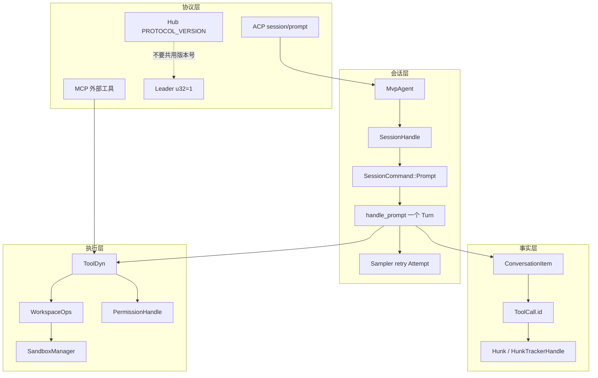
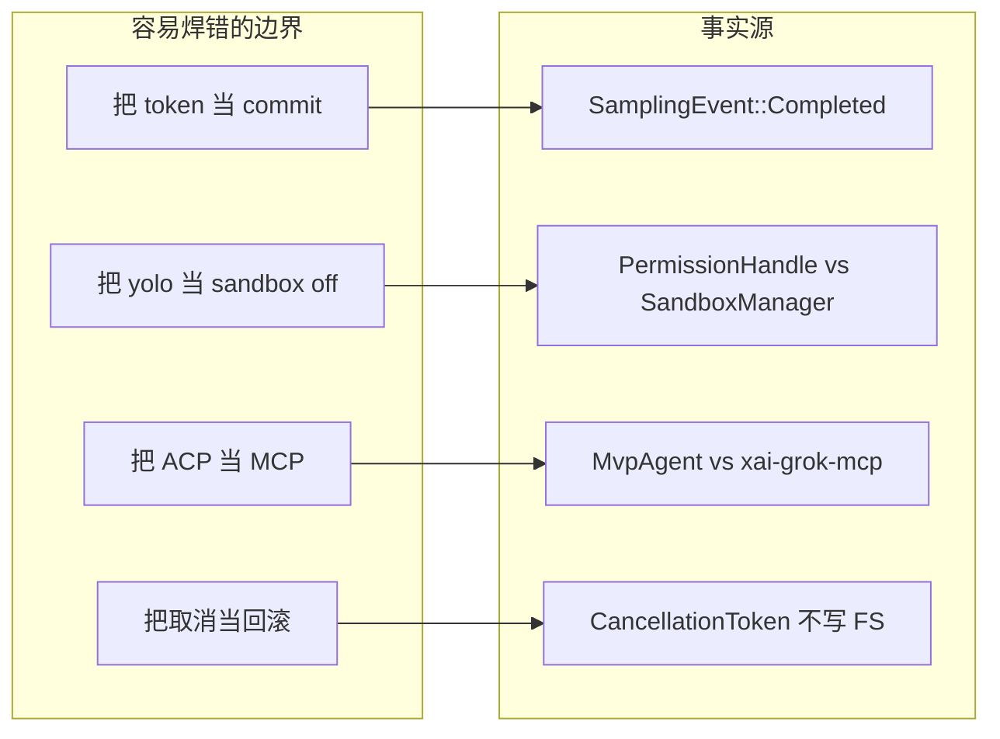
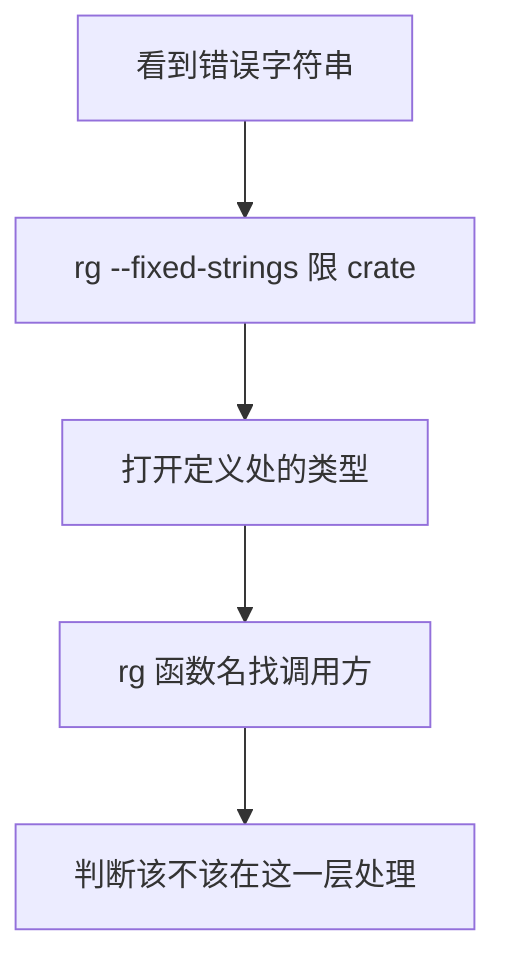

# 16 · 术语表与源码查找手册

> 读完本篇应能：把 Prompt / Turn / Attempt / Session / Agent 分开，并从行为、错误字符串或 CLI flag 用 `rg` 反查到真实符号。上一篇：[15-从零重实现路线图.md](15-从零重实现路线图.md)

## 快速摘要

### 架构总览（模块与依赖）

本手册是查找入口，不是架构说明书。术语按**责任层**分组：协议（ACP/MCP/Hub）、会话（Session/Agent/Prompt/Turn/Attempt）、事实（ConversationItem/ToolCall/Hunk）、执行（ToolDyn/Workspace/Permission/Sandbox）、UI（Action/Effect）、基础设施（oneshot/mpsc/CancellationToken）、配置（GROK_HOME/managed_config/requirements.toml）。同一英文词在不同 crate 里往往不是同一对象。

### 核心调用序列（逐步逻辑）

查找时应沿这条链，而不是按文件名字母序：

1. 行为 → 先猜责任层（UI / ACP / Session / ChatState / Sampler / Tool / Workspace）。
2. 用本表把口语映射到类型名。
3. `rg` 类型名或错误字符串，限制在对应 crate。
4. 打开定义后，再 `rg` 调用方（谁 `send` / 谁 `dispatch` / 谁 `execute`）。
5. 用 `cargo test -p <crate>` 验证你改的那一层，而不是整仓。

### 易错点与边界条件

- Prompt、Turn、Attempt 三个词在注释里经常连写，但取消、重试、计费的粒度不同。
- Agent 既是 ACP 门面 `MvpAgent`，也是 CLI `Command::Agent`，还是 TUI 里的 `AgentId`。
- Hub 的 `PROTOCOL_VERSION = "1.0.0"` 与 Leader 的 `LEADER_PROTOCOL_VERSION: u32 = 1` 不是同一个数。
- `ToolSpec` 是给模型看的 JSON Schema；`ToolDyn` 是运行时对象。
- 错误文案会改，但 `rg` 字面量仍是最快的定位手段——定位后要以类型为准。

---

## 目录

1. [Why：为什么要消歧](#why为什么要消歧)
2. [术语关系图](#术语关系图)
3. [术语表](#术语表)
4. [常见误解表](#常见误解表)
5. [从行为反查](#从行为反查)
6. [从错误字符串反查](#从错误字符串反查)
7. [从 CLI flag 反查](#从-cli-flag-反查)
8. [推荐 cargo test -p](#推荐-cargo-test--p)
9. [文件表](#文件表)
10. [自检](#自检)

## Why：为什么要消歧

Grok Build 的代码评论、ACP 方法名、TUI 文案、遥测字段共用一批短词。若把 “prompt” 理解成“用户敲的那一行”，你会在 `handle_prompt` 里找不到压缩；若把 “session” 理解成“一次对话”，你会把 `SessionLiveState::Dormant` 当成“用户走了”。

消歧规则：

1. **以类型名为准**，不以 UI 文案为准。
2. **以发送通道为准**：`oneshot` 是一次请求-应答；`unbounded mpsc` 是命令队列；ACP notification 是观察。
3. **以提交屏障为准**：流式 token 不是事实；`SamplingEvent::Completed` 和 `ChatPersistence::persist_message` 才是。

## 术语关系图



---

## 术语表

每一条格式：口语 → 代码实体 → 不是什么 → 查找入口。

### Prompt

**是什么**：一次用户（或合成源）提交给会话的输入，对应 `SessionCommand::Prompt { prompt_id, prompt_blocks, respond_to, persist_ack, ... }`。ACP 方法名是 `session/prompt`。客户端生成 `prompt_id`（TUI 在 `Effect::SendPrompt.prompt_id`）。

**不是什么**：不是一次模型 HTTP 调用（那是 Attempt）；不是整个会话；不是 ChatState 里的 `prompt_index`（那是回合计数，压缩/rewind 用）。

**源码**：`crates/codegen/xai-grok-shell/src/session/commands.rs` 的 `SessionCommand::Prompt`；`MvpAgent::prompt`；`Effect::SendPrompt`。

`PromptOrigin`（`session/mod.rs`）区分 `User`、`TaskCompleted`、`SubagentCompleted`、`NotificationDrain` 等。合成 prompt 仍走同一 `Prompt` 命令，但 `from_prompt_id` 会标 origin。

### Turn

**是什么**：`SessionActor::handle_prompt` 从入队到 `PromptTurnResult` 的一次执行。内部可多次调用 sampler、多次跑工具批次。结束种类是 `PromptCompletionKind`。

**不是什么**：不是 UI 上的“一条气泡”（一条 turn 可含 reasoning + 多个 tool call + 最终文本）；不是 `prompt_index` 本身，虽然 `IncrementPromptIndex` 通常在 turn 开始时发生。

**源码**：`acp_session_impl/turn.rs` 的 `handle_prompt`；`run_turn_via_sampler`；`PromptTurnOk`。

`TurnActiveGuard` 在 turn 期间把 `is_turn_active` 置位，用于拒绝 `RepairHistory`。

### Attempt

**是什么**：一次针对同一 `ConversationRequest`（或轻微变换后的请求，如 strip images）的 HTTP 采样。`SamplingEvent::Retrying { attempt, max_retries, kind, ... }` 的 `attempt` 是重试计数。`classify_error` 的 `retry_count` 表示“已经重试了几次”（首次失败时为 0）。

**不是什么**：不是用户再按一次 Enter（那是新 Prompt）；不是工具重跑。401 恢复后的再发送由 `AuthRetrySchedule` 的 `attempt` 计数，与 sampler 的 `retry_count` 分离。

**源码**：`xai-grok-sampler/src/retry.rs`；`events.rs` 的 `Retrying`；`auth_retry.rs` 的 `AuthRetrySchedule::MAX_RETRIES = 3`。

### Session

**是什么**：磁盘上可恢复的对话日志 + 可选的内存 Actor。标识为 `SessionId`（`xai-grok-workspace-types`）或 ACP `acp::SessionId`。存活状态是 `SessionLiveState::{Working, IdleResident, Dormant, Completed, DeadFailed, Attaching}`——注释写明：session 没有自己的终端 status 字段，liveness 是 residency + turn-state，不是 pid。

**不是什么**：不是进程；不是 Leader 连接；不是 TUI 窗口。进程死了，Dormant 会话仍在 `$GROK_HOME` 的 session 目录里。

**源码**：`session/handle.rs`；`agent/mvp_agent/session_registry.rs`。

### Agent

**是什么**：至少三层，必须写全称：

| 说法 | 实体 | 路径 |
|---|---|---|
| ACP 门面 | `MvpAgent` | `agent/mvp_agent/mod.rs` |
| CLI 子命令 | `Command::Agent(Box<AgentArgs>)` + `AgentCmd` | `app/cli.rs` |
| TUI 槽位 | `AgentId` | `app/actions.rs` / `app/agent.rs` |
| 配置里的 harness | `--agent` / `ModelSwitchIncompatibleAgentError` | 模型切换 |

**不是什么**：不是 SessionActor。一个 `MvpAgent` 持有 `SessionRegistry`，里面有许多 session。

### ToolCall

**是什么**：模型要求客户端执行的一次调用。采样层 `xai_grok_sampling_types::ToolCall { id, name, arguments }`；流式碎片是 `SamplingEvent::ToolCallDelta`（`arguments_delta` 单独不必是合法 JSON）。闭合时必须用**同一个** `id` 写入 `ConversationItem::ToolResult`。Workspace 另有 newtype `ToolCallId`。

**不是什么**：不是 `ToolSpec`（那是工具定义）；不是 Hub 线上的 `ToolCallParams`（那是 `xai-tool-protocol` 的 JSON-RPC 帧）；不是后端已执行的 `ConversationItem::BackendToolCall`（客户端不要再跑）。

**源码**：`xai-grok-sampling-types/src/conversation.rs`；`execute_tool_calls_batch`。

### Hunk

**是什么**：会话对工作区文件改动的一块 diff，由 `HunkTrackerHandle` / `HunkTrackerActor` 单写。类型 `Hunk`、`HunkId`、`HunkTurnDelta`。rewind 按 `prompt_index` 截断。

**不是什么**：不是 git commit；不是 `search_replace` 工具的一次调用（一次调用可产生多个 hunk）。不要和 UI scrollback 的“一段渲染块”混淆。

**源码**：`crates/codegen/xai-hunk-tracker/src/{handle,types,commands}.rs`。

### Leader

**是什么**：可选的共享后台进程，让多个客户端（TUI、headless）挂到同一组 session。协议版本 `LEADER_PROTOCOL_VERSION: u32 = 1`（`leader/protocol.rs`）。CLI：`Command::Leader`、`AgentCmd::Leader`、`--leader-socket`、`grok leader list|info|kill`。

**不是什么**：不是 ACP 宿主；不是 Computer Hub；不是 `Workspace` 子命令（Workspace 是把工作区暴露给 Hub）。

**源码**：`xai-grok-shell/src/leader/`；`connect_or_spawn`。

### ACP

**是什么**：Agent Client Protocol。本仓库经 `agent_client_protocol` crate 与 `xai-acp-lib`。核心方法：`session/new`、`session/prompt`、`session/cancel`、`session/load`、notifications。TUI 和 stdio 都是 ACP 客户端。

**不是什么**：不是 MCP。ACP 管“编辑器/TUI ↔ 本 agent”；MCP 管“本 agent ↔ 外部工具服务器”。

**源码**：`MvpAgent` 的 `async fn prompt`；`run_stdio_agent`。

### MCP

**是什么**：Model Context Protocol。crate `xai-grok-mcp`。外部工具进入同一 `ToolDyn`。名字解析 `parse_mcp_tool_name`。输出另有 `MCP_MAX_OUTPUT_BYTES`。CLI：`Command::Mcp`。

**不是什么**：不是 Hub；不是 hooks。MCP 工具失败仍须用 call id 闭合。

### Hub

**是什么**：Computer Hub，远程工具/工作区的 WebSocket 协议。握手 `HelloMsg.protocol_version`，常量 `xai_tool_protocol::PROTOCOL_VERSION = "1.0.0"`。`WorkspaceOps::Proxy` 走 Hub。

**不是什么**：不是 Leader socket。版本字符串 `"1.0.0"` 与 Leader 的整数 `1` 不可互换。

**源码**：`crates/common/xai-tool-protocol/src/handshake.rs`；`xai-computer-hub-sdk`。

### Compaction

**是什么**：上下文超限时用摘要替换历史。`CompactionMode::{Summary, Transcript, Segments}`（`xai-chat-state/src/compaction_mode.rs`）。环境变量 `GROK_COMPACTION_MODE` / `GROK_COMPACTION_DETAIL`；CLI `--compaction-mode` 在 `async_main` 里 `set_var`。实现上是 `ChatStateCommand::ReplaceConversation { is_compaction: true }`。

**不是什么**：不是删除 session；不是 git squash。`Summary` 默认不回指旧 transcript。

### Interjection

**是什么**：turn 进行中插入的用户转向，不取消当前 turn。crate `xai-interjection-core`（`InterjectionBuffer`、`format_interjection`）。ChatState 里 `SyntheticReason::Interjection`。TUI：Ctrl+Enter / `Action` 走 `dispatch/interject.rs`，常变成 `Effect::SendPromptNow`。idle 时 interject 为 noop。

**不是什么**：不是 `session/cancel`；不是队列里下一条 Prompt（那是 queue + `send_now`）。

### Subagent

**是什么**：由 Task 工具拉起的子会话。解析 crate `xai-grok-subagent-resolution`。完成时 `PromptOrigin::SubagentCompleted`。子 agent 通过 `SetToolOverrides` 继承 cutoff。`Command` 有 `--no-subagents`。

**不是什么**：不是 MCP 服务器进程；不是 Leader 子进程。子会话仍是一个 `SessionHandle`。

### Workspace

**是什么**：宿主副作用边界。`WorkspaceOps::{Local, Proxy}`；本地 `WorkspaceHandle`。CLI 隐藏子命令 `Command::Workspace`（需 `GROK_WORKSPACE_COMMAND=1`）是“把工作区暴露给 Hub”，不是“当前目录”本身。

**不是什么**：不是 git working tree（那是 worktree）；不是 `GROK_HOME`。

### Sandbox

**是什么**：OS 层强制隔离。`SandboxManager` + `ProfileName::{Workspace, Devbox, ReadOnly, Strict, Off, Custom}`。CLI `--sandbox` / `GROK_SANDBOX`。`apply` 在启动时调用。进程级网络保持开放。

**不是什么**：不是 Permission。Allow 之后沙箱仍可拒绝路径。

### Permission

**是什么**：产品层决策。`PermissionHandle::{Actor, AllowAll}`，`request` → `Decision::{Allow, Ask, Reject, PolicyDeny, Cancelled, ...}`。Ask 走 `AcpPrompter`，TUI 渲染 `PermissionViewState`。`--always-approve` / `--yolo` / `--allow` / `--deny`。

**不是什么**：不是 Landlock。`AllowAll` 跳过询问，不卸载 sandbox。

### Effect

**是什么**：`dispatch` 返回的异步副作用枚举。`event_loop` spawn 后以 `TaskResult` 回来。例如 `Effect::SendPrompt { prompt_id, text, session_id, ... }`、`CreateSession`、`CancelTurn`。

**不是什么**：不是 `Action`（Action 同步、无 IO）；不是 `SamplingEvent`（那是模型流）。

### Action

**是什么**：用户意图的同步枚举。由 input 从按键产生，由 `dispatch(Action, &mut AppView) -> Vec<Effect>` 消费。`dispatch` 内禁止 `.await`。

**不是什么**：不是 crossterm `Event`；不是 ACP 方法。

### SamplingEvent

**是什么**：sampler 对**一个 in-flight request** 发出的观察事件：`StreamStarted`、`ChannelToken`、`ToolCallDelta`、`Completed`、`Retrying`、`Failed`。Session 把它们翻译成 ACP notification。

**不是什么**：不是 `ChatStateEvent`（那是对话事实层：`PromptIndexChanged`、`TokensUpdated`、`ConversationReset`）。不要在 `ChannelToken` 上 persist Assistant。

### ConversationItem

**是什么**：对话日志的规范条目：`System` / `User` / `Assistant` / `ToolResult` / `BackendToolCall` / `Reasoning`。JSONL 一行一个。`UserItem` 可带 `SyntheticReason`。

**不是什么**：不是 ACP `ContentBlock`（那是 prompt 入参）；不是 UI scrollback entry。

### ToolSpec

**是什么**：给模型的工具清单项：`name`、`description`、`parameters: Value`（JSON Schema）。放进 `ConversationRequest`。

**不是什么**：不是 `Tool` trait 实现；不是运行时 `ArcTool`。`build_request_with_tool_definitions` 测试覆盖“清单进请求”。

### ToolDyn

**是什么**：object-safe 的类型擦除工具。`Tool` 的 blanket impl 把 `Args` JSON 反序列化失败变成 `invalid_arguments`。运行时只调 `execute`。

**不是什么**：不是 `ToolSpec`；不是 `ToolDispatch`（Dispatch 是路由器，Dyn 是单个工具）。

### oneshot

**是什么**：`tokio::sync::oneshot`，一次请求-应答。典型：`SessionCommand::Prompt.respond_to: Sender<PromptTurnResult>`、`persist_ack`、`ChatStateCommand` 的 `reply` 字段、`Permission` 的 prompt outcome。

**不是什么**：不是广播。第二个 receiver 不存在。drop sender 而未 send，receiver 得到 `RecvError`，调用方必须当失败/取消处理。

### mpsc

**是什么**：本仓库 Actor 命令队列几乎全是 `tokio::sync::mpsc::unbounded_channel`：`SessionHandle.cmd_tx`、`ChatStateHandle`、`SamplerHandle`、`HunkTrackerHandle`、`PermissionHandle::Actor.cmd_tx`。事件侧同样常见 unbounded。

**不是什么**：不是有界背压。发送方 `let _ = tx.send(...)` 在 actor 死后静默失败。详见可靠性说明书。

### CancellationToken

**是什么**：`tokio_util::sync::CancellationToken`。进程级、turn 级、子任务级都会 clone。`cancel()` 只停止**尚未开始或可协作检查**的工作，不回滚已发生的 FS/bash/jsonl 写入。

**不是什么**：不是分布式事务 abort；不是 `PromptCompletionKind` 本身（token 取消后由 Actor 决定回 `Cancelled` 还是已完成）。

### GROK_HOME

**是什么**：用户数据根。`xai_grok_config::paths::grok_home()`：环境变量 `GROK_HOME` 否则 `default_grok_home()` = canonicalize(home) + `.grok`。用 `dunce::canonicalize` 避免 Windows `\\?\` 前缀。测试里大量 `serial_test::serial(GROK_HOME)`。

**不是什么**：不是 workspace cwd；不是 git 仓库根。二进制路径在 `$GROK_HOME/bin/grok`。

### managed_config

**是什么**：企业/部署下发的配置层。文件名常量 `MANAGED_CONFIG_FILENAME = "managed_config.toml"`。加载顺序见 `xai-grok-config/src/lib.rs` 注释：`/etc/grok/managed_config.toml` 先于 `$GROK_HOME/managed_config.toml`。`managed_config_layers()` 坏一层跳过，不连坐。同步逻辑在 `xai-grok-shell/src/managed_config.rs`。

**不是什么**：不是用户 `config.toml`；不是 `requirements.toml`（后者是签名策略钉扎）。

### requirements.toml

**是什么**：签名的策略文件（沙箱 profile、permission 规则、版本约束等）。与 `managed_config.toml` 一起从 deployment-config 拉取。`signed_policy` 校验；PTY 测试 `requirements_version_failure_exits_2_with_guidance.rs` 证明版本失败退出码 2。`sandbox_requirements_pin.rs` 证明它可以钉 `profile`。

**不是什么**：不是 Cargo 的 `[workspace]` 依赖；不是用户偏好文件。用户不能用 `config.toml` 覆盖它钉死的字段（具体合并见配置专题）。

---

## 常见误解表

| 误解 | 实际 | 反例/证据 |
|---|---|---|
| Prompt = 一次 HTTP | Prompt 可含多次 Attempt 和多批工具 | `handle_prompt` 里循环 `run_turn_via_sampler` |
| Turn = 一条 UI 消息 | 一条 turn 含 reasoning + tools + 文本 | `SamplingChannel::{Text, Reasoning}` |
| Attempt = 用户重试 | Attempt 是 sampler 内部重试 | `Retrying.attempt` vs 新的 `prompt_id` |
| Session 随进程结束 | 磁盘 jsonl 仍在，状态可 Dormant | `SessionLiveState` 注释 |
| Agent = 一个会话 | `MvpAgent` 持有 registry | `session_handle_waiting_for_load` |
| 流式 token 已持久化 | 只有 Completed / persist_message | ChatState 测试 `build_request_does_not_mutate` |
| ToolCallDelta 是完整参数 | 碎片 JSON | `events.rs` 注释 |
| BackendToolCall 要本地执行 | 服务端已跑完 | `ConversationItem::BackendToolCall` 文档 |
| yolo 关闭沙箱 | 只跳过 Ask | `PermissionHandle::AllowAll` vs `SandboxManager` |
| ACP = MCP | 宿主协议 vs 工具协议 | 不同 crate |
| Hub 1.0.0 = Leader 1 | 字符串 vs u32，不同通道 | `PROTOCOL_VERSION` / `LEADER_PROTOCOL_VERSION` |
| Interjection 会取消 turn | 插入 SyntheticReason::Interjection | `interject_key_when_idle_is_noop` 反向：running 才有效 |
| Compaction 删除文件 | 替换对话事实，可选保留 transcript | `CompactionMode::Transcript` 指向 `updates.jsonl` |
| mpsc send 会反压 | unbounded + `let _ = send` | 各 Handle::noop |
| 取消会 undo bash | 只 stop 未来 | `PromptCompletionKind::Cancelled` 不调 git revert |
| GROK_HOME = 项目目录 | 用户级状态根 | `paths::grok_home` |
| managed_config = config.toml | 策略层压过用户偏好 | loader 顺序 |
| `ToolSpec` 能 `execute` | 只有 schema | 需 `ToolDyn` |
| `Action` 里可以 HTTP | dispatch 必须纯同步 | `actions.rs` 模块文档 |
| `unknown session id` 是崩溃 | ACP `invalid_params` | `MvpAgent::prompt` |
| 401 由 sampler 重试到成功 | sampler `EmitToSession` | `classify_error` + `AuthRetrySchedule` |



---

## 从行为反查

在仓库根执行。路径相对于仓库根。先限制 crate，避免 80 个包的噪声。

### 用户按 Enter 之后谁发 Prompt？

```bash
rg -n "Effect::SendPrompt" crates/codegen/xai-grok-pager/src
rg -n "Action::SendPrompt" crates/codegen/xai-grok-pager/src/app
rg -n "fn dispatch\(" crates/codegen/xai-grok-pager/src/app/dispatch
```

期望：`dispatch/prompt.rs` 产生 Effect；`event_loop.rs` spawn；最终 `MvpAgent::prompt`。

### 权限弹窗从哪来？

```bash
rg -n "PermissionViewState" crates/codegen/xai-grok-pager/src
rg -n "struct PermissionHandle" crates/codegen/xai-grok-workspace/src/permission
rg -n "AcpPrompter" crates/codegen/xai-grok-workspace/src/permission
rg -n "RequestPermission" crates/codegen/xai-grok-pager/src/app
```

链路：`PermissionHandle::request` → Ask → ACP reverse-request → TUI `PermissionViewState` 队列。

### 固定回复/假模型在哪换真 Sampler？

```bash
rg -n "fn run_turn_via_sampler" crates/codegen/xai-grok-shell
rg -n "SamplerHandle" crates/codegen/xai-grok-shell/src/session crates/codegen/xai-grok-sampler/src
```

### 读文件实际走哪？

```bash
rg -n "MAX_LINES_READ" crates/codegen/xai-grok-tools/src/implementations/grok_build/read_file
rg -n "impl Tool for" crates/codegen/xai-grok-tools/src/implementations/grok_build/read_file
rg -n "WorkspaceOps" crates/codegen/xai-grok-workspace/src/workspace_ops.rs
```

### 取消为什么停不掉已经在跑的 bash？

```bash
rg -n "PromptCompletionKind::Cancelled" crates/codegen/xai-grok-shell/src/session
rg -n "SessionCommand::Cancel" crates/codegen/xai-grok-shell/src/session
rg -n "fn cancel\(" crates/codegen/xai-grok-shell/src/session/acp_session_impl/tasks_cancel.rs
```

### 会话恢复读什么文件？

```bash
rg -n "chat_history.jsonl" crates/codegen/xai-chat-state crates/codegen/xai-grok-shell/src/session
rg -n "trait ChatPersistence" crates/codegen/xai-chat-state
```

### 压缩何时触发？

```bash
rg -n "enum CompactionMode" crates/codegen/xai-chat-state
rg -n "GROK_COMPACTION_MODE" crates/codegen
rg -n "ReplaceConversation" crates/codegen/xai-chat-state/src
```

### 插话按键

```bash
rg -n "interject" crates/codegen/xai-grok-pager/src/app/dispatch/interject.rs
rg -n "SyntheticReason::Interjection" crates/codegen/xai-grok-sampling-types
rg -n "InterjectionBuffer" crates/common/xai-interjection-core
```

### 沙箱 profile 名

```bash
rg -n "enum ProfileName" crates/codegen/xai-grok-sandbox
rg -n "GROK_SANDBOX" crates/codegen/xai-grok-pager/src/app/cli.rs
```

### 401 到底谁重试？

```bash
rg -n "EmitToSession" crates/codegen/xai-grok-sampler/src/retry.rs
rg -n "AuthRetrySchedule" crates/codegen/xai-grok-shell/src/session/acp_session_impl/auth_retry.rs
rg -n "shell.turn.auth_retry_backoff" crates/codegen/xai-grok-shell
```

---

## 从错误字符串反查

字符串会改，但当前仓库里这些是稳定锚点。找到后立刻改看类型，不要解析字符串做控制流（TUI 的 `error_display.rs` 是不得已的展示层）。

| 字符串 / 片段 | 定义处 | 含义 |
|---|---|---|
| `unknown session id` | `mvp_agent/acp_agent.rs` `MvpAgent::prompt` | registry 里没有该 ACP session |
| `cannot repair history while a turn is in flight; stop the turn first` | `ChatStateCommand::RepairHistory` / `RepairHistoryBlocked` | turn 进行中禁止修 dangling |
| `Request failed after {} retries.` | `format_sampling_error` in `retry.rs` | sampler 重试耗尽后的人类可读前缀 |
| `Unauthorized (401)` | pager `error_display.rs`、sampler 401 路径 | 凭据被拒；自动恢复见 AuthRetry |
| `Retry failed: Unauthorized (401)` | scrollback `session_event.rs` 注释 | 展示层文案，不是 sampler 函数名 |
| `not_implemented` | `ToolError::not_implemented`；测试 `unimplemented_tool_returns_not_implemented_terminal` | Tool 既没 `run` 也没 `execute` |
| `stream_no_terminal` | `ToolDispatch::call_terminal` | 工具流没以 Terminal 结束 |
| `Tool must implement either \`run\` or \`execute\`` | `Tool::run` 默认实现 | 同上，更长的 detail |
| `Tool execution cancelled due to earlier user cancellation for tool` | `execute_tool_calls_batch` | 同批次后续 call 的合成结果 |
| `Failed to spawn command:` | `BashError::SpawnFailed` | bash 工具 spawn 失败 |
| `Failed to spawn leader:` | `leader/mod.rs` | Leader 子进程 |
| `Failed to spawn child session:` | `subagent/handle_request.rs` | 子 agent |
| `x-should-retry` | `retry.rs` 注释与 `SamplingError` | 服务端否决重试 |
| `dangling` + `tool call` | `repair_dangling_tool_calls` | 未闭合的 ToolCall.id |
| `circuit breaker opened` | `xai-file-utils` `TracingObserver` | 存储上传熔断，target=`circuit_breaker` |

配方：

```bash
rg -n --fixed-strings "unknown session id" crates/codegen/xai-grok-shell
rg -n --fixed-strings "cannot repair history while a turn is in flight" crates/codegen/xai-chat-state
rg -n --fixed-strings "Request failed after" crates/codegen/xai-grok-sampler
rg -n --fixed-strings "stream_no_terminal" crates/common/xai-tool-runtime
rg -n --fixed-strings "Unauthorized (401)" crates/codegen/xai-grok-pager/src/app
rg -n --fixed-strings "shell.turn.auth_retry_backoff" crates/codegen
```

`--fixed-strings` 避免括号在正则里被吃掉。



---

## 从 CLI flag 反查

定义几乎都在 `crates/codegen/xai-grok-pager/src/app/cli.rs`。`async_main` 会把一部分翻译成环境变量。

| Flag / 位置参数 | 字段 | 落到何处 |
|---|---|---|
| `-p` / `--single` / `--print` | `PagerArgs.single` | headless 单轮；测试 `test_built_binary_e2e.rs` |
| `--prompt-json` | `prompt_json` | 与 `-p` 互斥 |
| `--prompt-file` | `prompt_file` | 与 `-p` 互斥 |
| `--verbatim` | `verbatim` | `SessionCommand::Prompt.verbatim` |
| `-m` / `--model` | 模型 id | session 启动 meta |
| `--always-approve` / `--yolo` / `--dangerously-skip-permissions` | `PagerArgs.yolo` | `PermissionHandle::AllowAll` |
| `--allow` / `--allowedTools` | `allow_rules` | permission 规则 |
| `--deny` / `--disallowedTools` | `deny_rules` | permission 规则 |
| `--sandbox` / `GROK_SANDBOX` | sandbox profile | `ProfileName` |
| `--cwd` | `cwd` | `PagerArgs::apply_cwd` |
| `--debug` / `--debug-file` | debug | `async_main` 设 `GROK_DEBUG_LOG` |
| `--leader-socket` | 全局 | `LEADER_SOCKET_ENV` |
| `--leader` / `--no-leader` | 是否接 Leader | `resolve_use_leader` |
| `-s` / `--session-id` | 指定 session | `Effect::CreateSession.preferred_session_id` |
| `-w` / `--worktree` | worktree | `Effect::CreateWorktreeSession` |
| `--worktree-ref` / `--ref` | git ref | 同上 `git_ref` |
| `--compaction-mode` | `compaction_mode` | `GROK_COMPACTION_MODE` |
| `--no-subagents` | 关 Task 子会话 | 工具清单 |
| `--no-memory` / `--experimental-memory` | memory | `xai-grok-memory` |
| `--tools` / `--disallowed-tools` | 工具过滤 | 与 permission `--allow/--deny` 不同层，先 rg 再读 |
| `agent stdio` | `AgentCmd::Stdio` | `run_stdio_agent` |
| `agent headless` | `AgentCmd::Headless` | `run_headless` |
| `agent serve` | `AgentCmd::Serve` | bind 默认 `127.0.0.1:2419` |
| `agent leader` | `AgentCmd::Leader` | `run_leader` |
| `grok leader list` | `LeaderMgmtCommand::List` | 管理已有 leader |
| `--oauth` / `--device-auth` | `Command::Login` | 认证，不是 sampling |

配方：

```bash
rg -n "short = 'p'" crates/codegen/xai-grok-pager/src/app/cli.rs
rg -n "long = \"always-approve\"" crates/codegen/xai-grok-pager/src/app/cli.rs
rg -n "long = \"sandbox\"" crates/codegen/xai-grok-pager/src/app/cli.rs
rg -n "GROK_COMPACTION_MODE" crates/codegen/xai-grok-pager-bin/src/main.rs
rg -n "enum AgentCmd" crates/codegen/xai-grok-pager/src/app/cli.rs
rg -n "fn apply_cwd" crates/codegen/xai-grok-pager
```

环境变量（配置层，常被 CLI 写入）：

```bash
rg -n "env::var\(\"GROK_" crates/codegen/xai-grok-config crates/codegen/xai-grok-pager-bin crates/codegen/xai-grok-sampler/src/retry.rs
```

优先记住：`GROK_HOME`、`GROK_DEBUG_LOG`、`GROK_SANDBOX`、`GROK_COMPACTION_MODE`、`GROK_MAX_RETRIES`、`GROK_TOKIO_WORKER_THREADS`、`GROK_MANAGED_CONFIG_URL`、`GROK_AGENT_SECRET`、`GROK_WORKSPACE_COMMAND`、`GROK_AGENT_DASHBOARD`。

---

## 推荐 cargo test -p

只测你正在读的那一层。整仓测试包含 PTY E2E，不适合当“查符号”的反馈环。

| 你在查什么 | 命令 |
|---|---|
| CLI 解析、flag 互斥 | `cargo test -p xai-grok-pager --lib cli` |
| Action/Effect dispatch | `cargo test -p xai-grok-pager --lib dispatch` |
| ChatState / JSONL / dangling | `cargo test -p xai-chat-state --lib` |
| classify_error / backoff | `cargo test -p xai-grok-sampler --lib retry` |
| Sampler actor + mock SSE | `cargo test -p xai-grok-sampler --test test_actor` |
| Tool trait 流不变量 | `cargo test -p xai-tool-runtime` |
| 熔断状态机 | `cargo test -p xai-circuit-breaker --lib` |
| 权限分类 | `cargo test -p xai-grok-workspace --lib permission` |
| 沙箱 profile 解析 | `cargo test -p xai-grok-sandbox --lib` |
| ACP session 取消/恢复 | `cargo test -p xai-grok-shell --lib acp_session` |
| 401 不在 sampler 死循环 | `cargo test -p xai-grok-shell --lib auth_error_no_retry` |
| bearer 后缀 | `cargo test -p xai-grok-auth --lib bearer` |
| 配置层 / GROK_HOME | `cargo test -p xai-grok-config --lib` |
| 二进制 `-p` e2e（慢） | `cargo test -p xai-grok-shell --test test_built_binary_e2e` |
| PTY 弹窗/插话（更慢） | `cargo test -p xai-grok-pager --test pty_e2e` 需看具体 `[[test]]` 名 |

过滤建议：

```bash
cargo test -p xai-grok-sampler --lib classify_error
cargo test -p xai-chat-state --lib build_request_repairs_dangling
cargo test -p xai-tool-runtime --test tool_blocking
```

没有跑过的测试不要在文档里写“已通过”。上面是**推荐入口**，不是本次分析的执行记录。

---

## 文件表

| 路径 | 术语锚点 |
|---|---|
| `crates/codegen/xai-grok-pager/src/app/cli.rs` | `PagerArgs`、`Command`、`AgentCmd`、几乎全部 flag |
| `crates/codegen/xai-grok-pager/src/app/actions.rs` | `Action`、`Effect`、`TaskResult` |
| `crates/codegen/xai-grok-pager/src/views/permission_view.rs` | `PermissionViewState` |
| `crates/codegen/xai-grok-shell/src/agent/mvp_agent/mod.rs` | `MvpAgent` |
| `crates/codegen/xai-grok-shell/src/session/commands.rs` | Prompt / Turn 结果 / Cancel |
| `crates/codegen/xai-grok-shell/src/session/handle.rs` | `SessionLiveState` |
| `crates/codegen/xai-grok-shell/src/session/mod.rs` | `PromptOrigin` |
| `crates/codegen/xai-chat-state/src/commands.rs` | `ChatStateCommand` |
| `crates/codegen/xai-chat-state/src/compaction_mode.rs` | `CompactionMode` |
| `crates/codegen/xai-grok-sampler/src/events.rs` | `SamplingEvent` |
| `crates/codegen/xai-grok-sampling-types/src/conversation.rs` | `ConversationItem`、`ToolCall`、`ToolSpec`、`SyntheticReason` |
| `crates/common/xai-tool-runtime/src/tool.rs` | `Tool`、`ToolDyn` |
| `crates/common/xai-tool-protocol/src/handshake.rs` | Hub `PROTOCOL_VERSION` |
| `crates/codegen/xai-grok-shell/src/leader/protocol.rs` | `LEADER_PROTOCOL_VERSION` |
| `crates/codegen/xai-grok-config/src/paths.rs` | `grok_home`、`default_grok_home` |
| `crates/codegen/xai-grok-config/src/loader.rs` | `managed_config.toml` 层 |
| `crates/codegen/xai-grok-config/src/lib.rs` | 合并顺序注释（含 `/etc/grok/requirements.toml`） |
| `crates/codegen/xai-hunk-tracker/src/types.rs` | `Hunk` |
| `crates/common/xai-interjection-core/src/lib.rs` | `InterjectionBuffer` |

## 自检

- [x] Prompt / Turn / Attempt / Session / Agent 五词分开，并指向真实类型
- [x] ACP / MCP / Hub / Leader 四个协议未混用版本号
- [x] ToolCall / ToolSpec / ToolDyn 三层分开
- [x] Action vs Effect vs SamplingEvent 分开
- [x] GROK_HOME / managed_config / requirements.toml 分开
- [x] 误解表有源码证据列
- [x] 行为 / 错误字符串 / CLI 三类 `rg` 配方使用仓库相对路径
- [x] `cargo test -p` 按 crate 推荐，未谎称已执行
- [x] 未写入本机绝对路径

配套阅读：[15-从零重实现路线图](15-从零重实现路线图.md) 决定实现顺序；[可靠性与通用技术实现说明书](可靠性与通用技术实现说明书.md) 决定失败语义。
