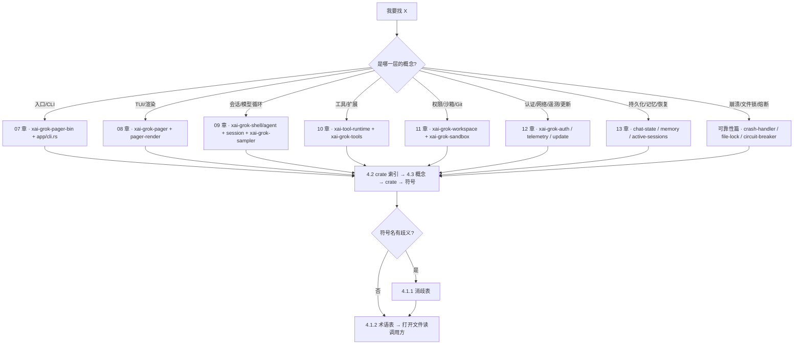

[上一篇：跨模块完整运行链与场景](15-跨模块完整运行链与场景.md) · [总目录](README.md) · [下一篇：可靠性与通用技术实现说明书](可靠性与通用技术实现说明书.md)

# 16 · 术语表与源码查找手册

> **第 16 / 18 篇** · 工具版本：Rust 1.94.0（rust-toolchain.toml:11）
>
> **场景**：你拿到了一个需求 / 一个 bug / 一个「这功能在哪实现」的问题，但面对 **102 个 workspace 成员**（`Cargo.toml` 的 `members`，`awk '/^members = \[/,/^\]/' Cargo.toml | grep -c '"'` → **102**）不知从哪下手。本章给你四份速查表——**同名异义消歧表**（一个词在几个 crate 里各有含义）、**术语表**（名词→含义）、**crate 索引表**（crate → 职责 → 关键入口）、**源码查找手册**（概念 → crate → 符号）。把它当字典用。
>
> **阅读说明**：源码基准 `HEAD = 2178c69c`（main，2026-09-23）。工作区依赖版本（`Cargo.toml` `[workspace.dependencies]`）：`ratatui 0.29` / `ratatui-core 0.1` / `tokio full` / `agent-client-protocol 0.10.4`（`features = ["unstable"]`，`Cargo.toml:118`）/ `tree-sitter 0.26`（`Cargo.toml:296`，被 `xai-codebase-graph` 与 `xai-grok-workspace` 用于代码图索引 / AST 解析）。
>
> **目录约定**：核心 crate 的**物理路径在 `crates/codegen/` 下**（这是 xAI monorepo 的目录约定，**不是**「生成代码」子目录）；公共层在 `crates/common/`；vendored 第三方在 `third_party/`。下文锚点用 crate 内相对路径（如 `xai-grok-shell/src/session/commands.rs`），省略 `crates/codegen/` 前缀以免冗长；表 4.2 给出完整物理路径。
>
> **锚点记法**：本文一律写「路径 · 符号(+偏移)」。`+0` 就是该 `struct` / `enum` / `trait` / `fn` / `const` 的定义行，偏移相对**该符号自身**的定义行计算，例如 `SessionHandle(+0)` 表示 `SessionHandle` 的定义行、`+47` 表示该定义行往下第 47 行。**绝对行号随版本漂移，不要把它写进脚本或测试断言**；需要行号时以当前工作区重新 `rg -n` 为准。
>
> **本次刷新修正**（旧版基于 `HEAD = 6c01b90c`、101 members，已失实）：① workspace 成员 **101 → 102**，新增 `xai-grok-file-lock`（`crates/codegen/xai-grok-file-lock`，grok-home 文件的**有界非阻塞** advisory 文件锁，取锁前经过 machine-local acquire slot）；② `xai-grok-active-sessions` 的公开 API **整体改写**：旧版的 `collect_crashed()` / `collect_crashed_in()` 在当前源码中**已不存在**，改为「`register` 时顺带按 PID 剪枝 + `try_unregister` 非阻塞注销 + `list_in` 只读列出」；③ `SessionCommand` 变体从旧版列出的十余个增长到 **108 个**，`ChatStateCommand` 为 **66 个**；④ `PermissionHandle::request` 仍是 `manager/mod.rs · PermissionHandle::request(+0)`，但 `Decision` **不再** `#[derive(Default)]`（默认 `Ask` 的落点只剩 `EditPolicy::Ask`）；⑤ 旧版列出的 `CompoundResolver`（`xai-computer-hub-core/src/resolver.rs`）与 `PermissionManager`（`manager/mod.rs`）在当前源码中**均已不存在**。

---

## 第一层 · 简单框架（系统骨架）

四张表 + 两张图：左边消歧、中间释义、下面是 crate 索引与定位手册，四者用同一套符号名对齐。

```
┌────────────────────────────┐   ┌────────────────────────────┐
│ ① 同名异义消歧表             │   │ ② 术语表 (Glossary)          │
│   词 → 在哪些 crate 各是什么  │←→ │   名词 → 一句话含义           │
└────────────────────────────┘   └────────────────────────────┘
┌────────────────────────────┐   ┌────────────────────────────────┐
│ ③ crate 索引表               │   │ ④ 源码查找手册 (Source Map)      │
│   crate → 职责 → 关键入口     │←→ │   概念 → crate → 符号(+偏移)     │
└────────────────────────────┘   └────────────────────────────────┘
        │                                    │
        │  「这词是哪个？」                    │  「这功能在哪？」
        └────────────────┬───────────────────┴───────────────┘
                         ▼
              先查 ① 消歧 → 再查 ② 释义 → 用 ③ 找 crate → 用 ④ 找符号
                         └─────────────────┬───────────────────┘
                                           ▼
                              改代码前：跑 4.4 的「找实现 / 找引用」
```

| 我要解决的问题 | 用哪张表 | 典型提问 |
|---|---|---|
| 同一个名字，指哪一个？ | ① 4.1.1 | 「`SessionEvent` 是遥测事件、回放缓冲事件，还是 pager 滚动块？」 |
| 这个词什么意思？ | ② 4.1.2 | 「`fail-closed` 是什么？」 |
| 这个 crate 负责什么？ | ③ 4.2 | 「`xai-grok-file-lock` 干什么的？」 |
| 这个功能在哪个文件？ | ④ 4.3 | 「权限裁决在哪？」 |
| 这个符号被谁用？ | 配方 4.4 | 「`ToolDispatch` 有几个实现？」 |



---

## 第二层 · 一个完整例子（全路径走读）

「我想加一个内置工具，应该改哪？」——查表流程（每一步的锚点都在当前 HEAD 核实过）：

```
问：内置工具在哪？
  → 4.3 表: 概念=「内置工具实现」
  → crates/codegen/xai-grok-tools/src/implementations/grok_build/   (bash/ read_file/ grep/ task/ todo/ workflow/ ...)
  → 同名目录还有 codex/、opencode/、skills/、memory/、lsp/、search_tool/ 等移植来源

问：工具要满足什么接口？
  → 4.1.2: Tool = 「身份 + 描述 + 强类型入参 + 强类型出参 + 执行」
  → crates/common/xai-tool-runtime/src/tool.rs · trait Tool(+0)
     · description(+0)  fn description(&self, _ctx: &ListToolsContext) -> ToolDescription
     · execute(+0)      fn execute(...) -> ToolStream<Self::Output>      (强类型路径)
     · run(+0)          fn run(...)                                       (默认/便捷路径)
  → 同一文件 · trait ToolFamily(+0)（同族工具成组注册）

问：模型侧怎么调到它（对象安全）？
  → 4.1.2: ToolDyn = 类型擦除 blanket，JSON ↔ 泛型的唯一边界
  → tool.rs · trait ToolDyn(+0) / execute(+0)
  → 4.1.2: ToolDispatch = 对象安全派发契约 call(tool_id, args, ctx) -> ToolStream<TypedToolOutput>
  → crates/common/xai-tool-runtime/src/dispatch.rs · trait ToolDispatch(+0)
     · call(+0)          必须恰好一个 Terminal
     · call_terminal(+0) 默认实现：丢弃 Progress，遇到第一个 Terminal 短路
                        流结束仍无 Terminal → ToolError::Custom { code: "stream_no_terminal" }

问：多个工具源（内置 + MCP + 插件）怎么合成一个派发入口？
  → 4.1.2: FinalizedToolset = ToolRegistryBuilder 的产物，parking_lot::RwLock<Vec<FinalizedTool>>
  → crates/codegen/xai-grok-tools/src/registry/types.rs · FinalizedToolset(+0)
  → 同一文件 · ToolRegistryBuilder(+0)  builder 阶段
  → 同一文件 · struct InnerDispatchForToolset(+0) / impl ToolDispatch for InnerDispatchForToolset(+0)

问：工具搜索（自然语言 → 相关工具）在哪？
  → crates/common/xai-tool-runtime/src/search.rs · trait ToolSearchIndex(+0)

问：执行前要过什么门？
  → 4.1.2: 权限（谁允许）与沙箱（OS 允许什么）是两层，不要混
  → crates/codegen/xai-grok-workspace/src/permission/manager/mod.rs · PermissionHandle(+0)
     · request(+0)        async fn request(&self, PermissionRequest) -> PermissionResolution
  → crates/codegen/xai-grok-workspace/src/permission/gate_preflight.rs · GatePreflight(+0)
     · evaluate(+0)       合并「直接规则 + bash 安全门」，保留 Ask 溯源
     · policy_decision(+0) / shell_forced_prompt(+0)
  → crates/codegen/xai-grok-sandbox/src/lib.rs · SandboxManager(+0)
     · apply(+0)          对当前进程生效，**不可逆**
     · install(+0)        装子进程 seccomp 等
     · restrict_child_network(+0)  子进程封网开关

问：会话侧在哪把工具调用真正发出去？
  → crates/codegen/xai-grok-shell/src/session/acp_session_impl/tool_dispatch.rs · dispatch_tool
  → 同一模块 · tool_calls.rs / sampler_turn.rs 负责一轮里的批量调用与重试

问：MCP 工具怎么注册进来？
  → crates/codegen/xai-grok-mcp/src/servers.rs · start_mcp_server(+0) / start_mcp_servers(+0)
```

一张表即可从「想法」走到「具体文件」。注意最后一跳：**工具的实现细节在 `xai-grok-tools`，派发契约在 `xai-tool-runtime`，聚合在 `registry/types.rs`，门禁在 `xai-grok-workspace`，调用点在 `xai-grok-shell`**——五个 crate，缺一不可。

---

## 第三层 · 详细逐步说明（主链路拆解）

### 步骤 1 — 先定性：是哪一层的概念

按 00–16 章节主题粗分（本章不重复各章内容，只给「该翻哪一章」）：

| 你手里的问题 | 翻哪章 | 主要 crate |
|---|---|---|
| `grok` 有哪些子命令 / 参数怎么解析 | 07 | `xai-grok-pager-bin`、`xai-grok-pager`（`app/cli.rs`） |
| 按键怎么变成界面变化 / 怎么重绘 | 08 | `xai-grok-pager`、`xai-grok-pager-render`、`xai-ratatui-*` |
| 一轮模型循环 / 采样 / 流式增量 | 09 | `xai-grok-shell`（`agent/mvp_agent/`、`session/acp_session_impl/`）、`xai-grok-sampler`、`xai-chat-state` |
| 工具接口 / 派发 / 搜索 / MCP / Hook / 技能 | 10 | `xai-tool-runtime`、`xai-grok-tools`、`xai-grok-mcp`、`xai-grok-hooks` |
| 权限裁决 / OS 沙箱 / 文件与 Git 操作 | 11 | `xai-grok-workspace`、`xai-grok-workspace-client`、`xai-grok-sandbox`、`xai-hunk-tracker` |
| 登录 / 凭证 / 重试 / 遥测 / 自更新 | 12 | `xai-grok-auth`、`xai-grok-login`、`xai-grok-http`、`xai-grok-telemetry`、`xai-grok-update` |
| 会话落盘 / 恢复 / 记忆 / 检索 | 13 | `xai-grok-shell`（`session/persistence.rs`）、`xai-grok-memory`、`xai-grok-active-sessions`、`xai-grok-session-search` |
| 构建 / 测试 / 第三方 vendoring / 许可证 | 14 | `xai-proto-build`、`xai-grok-test-support`、`third_party/` |
| 跨模块串起来看一遍 | 15 | —— |
| 崩溃 / 文件锁 / 熔断 / 幂等 / 断线重放 | 可靠性篇 | `xai-crash-handler`、`xai-grok-file-lock`、`xai-circuit-breaker`、`xai-computer-hub-sdk` |

### 步骤 2 — 用 crate 索引表（4.2）定位 crate

**先找 crate 再找符号**，不要全局盲搜：同名符号在 102 个成员里非常常见（见 4.1.1）。4.2 给出每个成员的职责（取自各自 `Cargo.toml` 的 `description`）与关键入口。

### 步骤 3 — 用术语表确认语义

遇到不认识的名词（如 `FinalizedToolset`、`GatePreflight`、`PermissionHandle`、`HunkSource`、`LockOptions`），回 4.1.2 确认它在系统中的角色；若这个词有多个同名定义，先过 4.1.1 消歧，**避免改错 crate**。

### 步骤 4 — 确认「谁调用谁」（这是最容易改错的一步）

以会话收到一次 prompt 为例（跨多个 crate，全部来自当前源码）。**调用关系同时标调用方与被调用方**：

```
调用方 (pager/TUI)               被调用方 (shell/agent)              被调用方 (workspace / hunk)
─────────────────                ─────────────────────              ───────────────────────────
Action::SendPrompt
  ↓ 调用 xai-grok-pager/src/app/dispatch/router.rs · dispatch(+0)
Effect::SendPromptNow
  ↓ 调用 xai-grok-pager/src/app/effects/mod.rs · execute(+0)   ← 返回 (bool, EffectMeta)，spawn 进 JoinSet<TaskResult>
ACP 请求 ──(agent-client-protocol 0.10.4)──▶
                                 xai-grok-shell/src/session/acp_session.rs · SessionActor(+0)
                                   ↓ 调用 session/acp_session_impl/spawn.rs · spawn_session_actor(+0)
                                   ↓ 调用 session/acp_session_impl/run_loop.rs · run_session(+0) 读 SessionEvent
                                   ↓ 收到 SessionCommand::Prompt（session/commands.rs · SessionCommand(+0)）
                                   ↓ 调用 session/acp_session_impl/sampler_turn.rs · call_with_auth_retry
                                   ↓ 调用 session/acp_session_impl/tool_calls.rs · dispatch_tool
                                   ├─ 调用 workspace/src/permission/manager/mod.rs · PermissionHandle::request(+0)
                                   ├─ 调用 workspace/src/permission/gate_preflight.rs · GatePreflight::evaluate(+0)
                                   ├─ 调用 xai-grok-sandbox/src/lib.rs · SandboxManager::apply(+0)
                                   ├─ 调用 xai-hunk-tracker/src/handle.rs · HunkTrackerHandle(+0)
                                   └─ 调用 workspace-client/src/lib.rs · WorkspaceClient(+0)  → workspace.* RPC
                                   ↓ 调用 session/acp_session_impl/turn_end.rs / turn_task.rs 收尾
                                 PromptCompletionKind（session/commands.rs · +0）
                                 ↓
ACP 通知 ─────────────────────▶ pager 渲染（被调用方：xai-grok-pager/src/app/event_loop.rs · run(+0)）
```

要点：**跨 `await` 与 channel 的边界只有三处**——`SessionCommand` 的 mpsc、`JoinSet<TaskResult>` 的 spawn、以及 ACP 的网关 channel（`xai-acp-lib/src/gateway.rs · acp_gateway(+0)`）。定位性能或死锁问题时，先在这三处打点。

---

## 第四层 · 补全所有逻辑与技术要点

### 4.1 术语表（Glossary）

#### 4.1.1 同名异义消歧表（**先查这张**）

上游重同步后，最坑的不是「不知道」，而是「知道一个同名的错的那个」。下表每个词都在当前源码里核实过。

| 词 | 含义 A（及锚点） | 含义 B（及锚点） | 含义 C（及锚点） | 怎么快速分辨 |
|---|---|---|---|---|
| **Handle** | `SessionHandle`：`Clone + Send` 的会话代理，持 `cmd_tx: mpsc::UnboundedSender<SessionCommand>`。`xai-grok-shell/src/session/handle.rs · SessionHandle(+0)` | `WorkspaceHandle`：持有 workspace 共享状态（sessions / MCP 快照 / tool config / event bus），负责建/分叉/删会话。`xai-grok-workspace/src/handle.rs · WorkspaceHandle(+0)` | `PermissionHandle`：**枚举** `Actor{..} \| AllowAll`。`xai-grok-workspace/src/permission/manager/mod.rs · PermissionHandle(+0)`；另有 `HunkTrackerHandle`（`xai-hunk-tracker/src/handle.rs · +0`）、`ChatStateHandle`（`xai-chat-state/src/handle.rs · +0`）、`SessionSignalsHandle`（`xai-grok-shell/src/session/signals.rs`） | `Handle` **不是** actor 本身，而是「发消息的代理」。它一定是 `Clone` 的，且字段里通常有 `cmd_tx` / `Arc<...>`。找到 `Handle` 后要再找它对应的 `Actor`。 |
| **Actor** | `SessionActor`：会话单写者，`pub(crate) struct`。`xai-grok-shell/src/session/acp_session.rs · SessionActor(+0)` | `HunkTrackerActor`（`xai-hunk-tracker/src/actor/mod.rs`）、`ChatStateActor`（`xai-chat-state/src/actor/mod.rs · +0`）、`SessionSignalsActor`（`xai-grok-shell/src/session/signals.rs · +0`） | **权限侧没有 `PermissionActor` 结构体**：权限 actor 是消费 `PermissionCommand`（`permission/types.rs`）的任务，对外只暴露 `PermissionHandle::Actor` 变体 | 「有 `Actor` 结构体」不等于「有对应的 `XxxCommand` 枚举」也成立，反之亦然。判据是**谁 `recv()` 那个 channel**。 |
| **Command** | ①**CLI 子命令**：clap 的 `Command`，**24 个变体**（`Agent / Inspect / Doctor / Leader / Logout / Login / Mcp / Plugin / Memory / Models / Sessions / Usage / Setup / Share / Wrap / Export / Trace / Update / Version / Completions / Worktree / DiskUsage / Workspace / Dashboard`）。`xai-grok-pager/src/app/cli.rs · Command(+0)` | ②**actor 消息**：`SessionCommand`（**108 变体**，`xai-grok-shell/src/session/commands.rs · +0`）、`ChatStateCommand`（**66 变体**，`xai-chat-state/src/commands.rs · +0`）、`PermissionCommand`（`xai-grok-workspace/src/permission/types.rs`）、`HunkTrackerCommand`（`xai-hunk-tracker/src/commands.rs · +0`） | —— | 看文件位置：`pager/app/cli.rs` 是给用户敲的；`*/commands.rs` 或 `*/types.rs` 是给 actor 收的。 |
| **Event** | `SamplingEvent`：采样器单次请求内的事件（`StreamStarted` / `FirstToken` / `ChannelToken` / `ToolCallDelta` / `ReasoningCompleted` / `Completed` …）。`xai-grok-sampler/src/events.rs · SamplingEvent(+0)` | `Event`：**遥测**事件（`TurnStarted` / `PhaseChanged` / …，`EVENT_SCHEMA_VERSION`）。`xai-grok-session-events/src/types.rs · Event(+0)` | `HunkEvent`（`xai-hunk-tracker/src/events.rs · +0`）、`SignalEvent`（`xai-grok-shell/src/session/signals.rs`）、`SandboxEventType`（`xai-grok-sandbox/src/types.rs`）、`TimedInputEvent`（`xai-grok-pager/src/app/event_loop.rs · +0`） | 看是不是要上报：`Event` 在 `xai-grok-session-events` 里且 `Serialize`，是遥测；其余是进程内信号。 |
| **SessionEvent**（三处同名！） | ①**回放缓冲**（crate 内可见）：`pub(crate) enum`，含 `Notification(..)` / `FlushReplay{respond_to}`。`xai-grok-shell/src/session/replay_events.rs · SessionEvent(+0)` | ②**hub 线协议**：`xai-tool-protocol/src/session_event.rs · SessionEvent(+0)` | ③**pager 滚动块**：`xai-grok-pager/src/scrollback/blocks/session_event.rs · SessionEvent(+0)` | 三个都在，只是可见性与层不同。`use crate::session::replay_events::{SessionEvent, ..}` 出现时是 ①；`xai_tool_protocol::` 前缀是 ②。 |
| **Session** | `SessionId` 也有**三处**：hub 侧 `xai-tool-protocol/src/ids.rs · SessionId(+0)`（带保留前缀校验，禁止客户端传入 hub 保留值）、workspace 侧 `xai-grok-workspace-types/src/identity.rs · SessionId(+0)`、ACP 侧 `agent_client_protocol::SessionId` | 磁盘上的 session：一个**可恢复的日志**，本身没有终态字段；「活着」= 常驻 + 轮次状态，不是 pid。见 `SessionLiveState`（`xai-grok-shell/src/session/handle.rs · +0`，`pub(crate) enum`，变体 `Working / IdleResident / Dormant / Completed / DeadFailed / Attaching`） | 会话元数据：`Info`（注意名字是 `Info` 不是 `SessionInfo`），`xai-grok-shared/src/session/info.rs · Info(+0)` | 别假设「一个 session 一个 pid」。`DeadFailed` = actor 异常且磁盘无终态标记，**可直接回收**，下次扫描降级为 `Dormant`。 |
| **Turn** | **当前源码里没有叫 `Turn` 的结构体或枚举。** 一轮由这些分散表达：完成类型 `PromptCompletionKind`（`Completed / StationarityEnded / Cancelled{category,context} / MaxTurnsReached{limit} / Rewound / RemovedFromQueue`，`xai-grok-shell/src/session/commands.rs · +0`）、结果 `PromptTurnOk`（同文件 · +0）、结果别名 `PromptTurnResult = Result<PromptTurnOk, acp::Error>`（同文件 · +0） | 轮内增量快照 `TurnDeltaSnapshot`（`session/signals.rs`）；用量 `TurnUsage`（`session/usage_file.rs`）；遥测标签 `TurnOutcomeLabel`（`xai-grok-session-events/src/types.rs`） | 轮的生命周期代码在 `session/acp_session_impl/turn_task.rs`、`turn_end.rs`、`turn_end_hooks.rs` | 搜 `Turn` 只会搜到一堆「词素」而不是一个类型。想改「一轮结束时干什么」，去 `turn_end.rs`，不是找 `Turn`。 |
| **Workspace** | `WorkspaceHandle`：进程内共享状态所有者（见上） | `WorkspaceClient`：`workspace.*` RPC 的**客户端**，持 `ToolHarness`。`xai-grok-workspace-client/src/lib.rs · WorkspaceClient(+0)` | `WorkspaceRpcHandler`：**服务端**，`pub(crate) struct`，`impl ToolServerHandler`，把 `workspace.*` JSON-RPC 派发到 `WorkspaceHandle`。`xai-grok-workspace/src/hub_server.rs · WorkspaceRpcHandler(+0)`；另有 `xai-grok-workspace-daemon`（daemonize / preview_supervisor） | 按「谁调谁」判断：`Client` 发请求、`Handler` 收请求、`Handle` 持状态、`Daemon` 托管进程。 |
| **WorkspaceOps** | 枚举，**恰好两个变体** `Local` / `Proxy`：表示 workspace 操作走本机还是走 hub 代理。`xai-grok-workspace/src/workspace_ops.rs · WorkspaceOps(+0)` | `WorkspaceClient` 是 `Proxy` 路径上的类型化客户端（见上） | `WorkspaceOps` 的分发实现在 `workspace_ops.rs` 内部；`xai-grok-shell` 的 proxy 模式消费它 | 看到 `WorkspaceOps::Local` → 本机直接操作；`::Proxy` → 转发给 hub / workspace-server。 |
| **Sandbox** | `SandboxManager`：**OS 级**沙箱（Linux Landlock / macOS Seatbelt + 子进程 seccomp），`apply()` **不可逆**。`xai-grok-sandbox/src/lib.rs · SandboxManager(+0)`；`ProfileName` / `SandboxConfig`（`sandbox/profiles.rs · +0`） | **权限层**（常被口语混称为「沙箱」但代码里是另一套）：`AccessKind` / `Decision` / `PermissionRequest`（`xai-grok-workspace/src/permission/types.rs · +0 起`） | 子进程网络限制在 `xai-grok-sandbox/src/child_net.rs`（`install(+0)` 装 seccomp filter，`restrict_child_network(+0)` / `restrict_child_network_std(+0)` 两个入口） | 问「是谁拒绝的」：`PermissionHandle` 拒绝 → 用户/规则层；`SandboxManager` 拒绝 → 内核返回 `EPERM/ENOSYS`，通常表现为工具报错而非弹窗。 |
| **Hunk** | `Hunk`：**一段连续变更**（`id / path / line_info / source / old_text / new_text / patch / created_at / selected`）。`xai-hunk-tracker/src/types.rs · Hunk(+0)`；配套 `HunkAction`（`Accept \| Reject`）、`HunkUpdate`（`Added \| Removed \| Moved`）、`HunkSource`、`HunkLineInfo`、`HunkTrackerSnapshot` | `HunkId` 也有**两处**：hunk-tracker 内部 `pub struct HunkId(pub Arc<str>)`（`xai-hunk-tracker/src/types.rs · +0`）与 wire 侧 `xai-grok-workspace-types/src/identity.rs · HunkId(+0)` | 事件 `HunkEvent::HunkAdded / HunkRemoved`（`xai-hunk-tracker/src/events.rs · +0`） | 不要跨 crate 直接传 `HunkId`：两边是不同类型，需转换。 |
| **ToolCallId** | **wire/workspace 侧**：`pub struct ToolCallId(pub(crate) String)`，注释写明「Unique tool call identifier within a session」。`xai-grok-workspace-types/src/identity.rs · ToolCallId(+0)` | **hub 协议侧**：`xai-tool-protocol/src/ids.rs · ToolCallId(+0)`，由 `opaque_id!` 宏生成，建议用 UUID v7（`ToolCallId::new_v7`） | **ACP 侧**：`agent_client_protocol::ToolCallId` | 三处同名、互不 `From` 的场合要注意显式转换；写跨层代码时以「谁在 `_meta` 里定义」为准。 |
| **ToolId** | 只有一个权威定义：`xai-tool-protocol/src/ids.rs · ToolId(+0)`（`opaque_id!` 宏，`ids.rs · opaque_id!(+0)` 展开为 `pub struct $name(String)`），格式 `{namespace}:{name}` 或 `{name}`，由 `is_well_formed_tool_id(+0)` 校验 | `ToolIdentity`（工具分类/身份，`xai-grok-tools/src/tool_taxonomy.rs`）是另一回事，别混 | —— | `ToolId` 是字符串型不透明 ID；`ToolIdentity` 是分类信息。 |
| **Info** | 会话元数据就叫 `Info`（**不叫 `SessionInfo`**）：`xai-grok-shared/src/session/info.rs · Info(+0)`，经 `xai-grok-shell/src/session/mod.rs` 的 `pub use xai_grok_shared::session::info;` 暴露为 `crate::session::info` | —— | —— | 搜 `pub struct SessionInfo` 会一无所获，这不是 bug。 |
| **grok-home** | 真值来源是 `xai-dirs`：`xai-dirs/src/lib.rs · grok_home(+0)`（`$GROK_HOME` 非空则原样用，否则 `<home>/.grok`；内部 `OnceLock` 缓存）、`default_grok_home(+0)`（忽略 `$GROK_HOME` 的默认值，便于调用方检测覆写）、`home_dir(+0)`（USERPROFILE 优先） | `xai-grok-config` 把它**再导出**：`xai-grok-config/src/lib.rs · grok_home`（与 `user_grok_home` / `default_grok_home` / `sessions_cwd_dir` 同批 re-export），所以 `xai_grok_config::grok_home()` 是绝大多数调用点的写法 | 相关目录规则在 `xai-grok-config`（`ensure_sessions_cwd_dir`、`encode_cwd_dirname`、`system_config_dir`） | 「grok home 在哪」不要自己拼路径，用 `grok_home()`；测「用户是否覆写了」用 `default_grok_home()` 对比。 |

#### 4.1.2 核心术语总表

| 术语 | 含义 | 关键符号（路径 · 符号(+偏移)） |
|------|------|---------|
| **ACP** | Agent Client Protocol：TUI ↔ Agent 的线协议；`agent-client-protocol 0.10.4`（`features = ["unstable"]`，`Cargo.toml:118`）。协议适配层在本仓库 | `xai-acp-lib/src/channel.rs` · `AcpChannel(+0)`；网关 `xai-acp-lib/src/gateway.rs` · `acp_gateway(+0)`；消息 `xai-acp-lib/src/message.rs` · `AcpAgentMessageGeneric(+0)` |
| **TUI / pager** | 终端 UI（ratatui 0.29）；主循环是 `tokio::select!`，所有输入路由/渲染/状态都委托给 `AppView` | `xai-grok-pager/src/app/event_loop.rs` · `run(+0)`（`pub(crate) async fn`）；渲染原语在 `xai-grok-pager-render`（`render/`、`input/`、`theme/`、`terminal/`） |
| **Action** | TUI 内同步的用户/系统意图，是纯函数 `dispatch` 的输入 | `xai-grok-pager/src/app/actions.rs` · `Action(+0)`；`app/dispatch/router.rs` · `dispatch(+0)` |
| **Effect** | `dispatch` 的输出、异步执行单元，spawn 进 `JoinSet<TaskResult>` | `xai-grok-pager/src/app/actions.rs` · `Effect(+0)`；执行器 `xai-grok-pager/src/app/effects/mod.rs` · `execute(+0)` |
| **TaskResult** | 异步任务完成结果，回到 `Action::TaskComplete` | `xai-grok-pager/src/app/actions.rs` · `TaskResult(+0)`；`xai-grok-pager/src/app/event_loop.rs` · `JoinSet<TaskResult>` |
| **Actor（会话）** | 单写者会话模型：`SessionHandle` / `SessionCommand` / `SessionActor` | `session/handle.rs` · `SessionHandle(+0)`；`session/commands.rs` · `SessionCommand(+0)`；`session/acp_session.rs` · `SessionActor(+0)` |
| **MvpAgent** | shell 侧的**会话总管 actor**：持有会话花名册、模型配置、权限句柄、工具层，驱动每个会话的 actor 生命周期；ACP 侧请求先进它再落到 `SessionActor` | `xai-grok-shell/src/agent/mvp_agent/mod.rs` · `MvpAgent(+0)`；同目录 `agent_ops.rs` / `session_lifecycle.rs` · `set_session_live_state(+0)` / `session_live_state_for(+0)` / `record_roster_delta(+0)` |
| **SessionLiveState** | 会话粗粒度生命周期（`Working / IdleResident / Dormant / Completed / DeadFailed / Attaching`），供 leader/agent 花名册使用；`pub(crate) enum` | `session/handle.rs` · `SessionLiveState(+0)` |
| **SessionCommand** | 发给会话 actor 的消息枚举（**108 个变体**：`Prompt` / `ReplaceSystemPrompt` / `SetSessionModel` / `ParentAgentMessage` / `TitleRenamed` / `RepairHistory` / `Rewind` / `Cancel` / `Shutdown` / …），多数带 `respond_to: oneshot::Sender<..>` | `session/commands.rs` · `SessionCommand(+0)` |
| **PromptCompletionKind** | 一轮结束的**类型**：`Completed` / `StationarityEnded` / `Cancelled{category,context}` / `MaxTurnsReached{limit}` / `Rewound` / `RemovedFromQueue`；经 `_meta.completionKind` 回传 | `session/commands.rs` · `PromptCompletionKind(+0)`；常量 `COMPLETION_KIND_KEY(+0)`、`REMOVED_FROM_QUEUE_KIND(+0)`（同文件） |
| **SamplingEvent** | 采样器单次请求内的事件流；会话把它翻译成 ACP 通知。`StripReason::{ServerRejected, PayloadHeuristic}` 区分剥除原因 | `xai-grok-sampler/src/events.rs` · `SamplingEvent(+0)` / `StripReason(+0)` |
| **ChatState** | 会话的对话状态 actor：消息、token、计时、持久化；也透明存凭证 | `xai-chat-state/src/handle.rs` · `ChatStateHandle(+0)`；`actor/mod.rs` · `ChatStateActor(+0)`；`commands.rs` · `ChatStateCommand(+0)` |
| **StrictAppendAck / StrictAppendError** | 写盘类操作的**三值语义**：`Appended` / `AlreadyPresent(item)`；错误 `NotCommitted` / `Committed{acknowledgement,source}` / `Indeterminate` | `xai-chat-state/src/commands.rs` · `StrictAppendAck(+0)` / `StrictAppendError(+0)` |
| **Tool** | 一种工具的「身份 + 描述 + 强类型入参 + 强类型出参 + 执行」；带关联类型，**不是对象安全的** | `xai-tool-runtime/src/tool.rs` · `Tool(+0)`（`description(+0)` / `execute(+0)` / `run(+0)`） |
| **ToolDyn** | `Tool` 的类型擦除 blanket：JSON ↔ 泛型的**唯一**边界；对象安全 | `xai-tool-runtime/src/tool.rs` · `ToolDyn(+0)`；同族工具 `ToolFamily(+0)` |
| **ToolDispatch** | 对象安全派发契约：`call(tool_id, args, ctx) -> ToolStream<TypedToolOutput>`；默认 `call_terminal` 会 drain 流 | `xai-tool-runtime/src/dispatch.rs` · `ToolDispatch(+0)`（`call(+0)` / `call_terminal(+0)`） |
| **ToolStream / ToolStreamItem** | `[Progress(_)*, Terminal(Result<T, ToolError>)]`；`Terminal` **恰好一个且最后** | `xai-tool-runtime/src/tool.rs` · `ToolStream(+0)` / `ToolStreamItem(+0)` |
| **TypedToolOutput** | 带 `model_output` 的类型擦除输出；`model_output` 保证非空（MCP 合规）；可选 `chat_completion_output` | `xai-tool-runtime/src/tool.rs` · `TypedToolOutput(+0)` |
| **ToolSearchIndex** | 自然语言 → 相关工具的搜索接口 | `xai-tool-runtime/src/search.rs` · `ToolSearchIndex(+0)` |
| **FinalizedToolset** | 多路工具源聚合后的产物：`RwLock<Vec<FinalizedTool>>` + reminders + resources + `LocalRegistry`；读锁只做微秒级查找，**绝不跨 `.await`** | `xai-grok-tools/src/registry/types.rs` · `FinalizedToolset(+0)`；构建期 `ToolRegistryBuilder(+0)`；派发实现 `InnerDispatchForToolset(+0)` |
| **WorkspaceClient** | `workspace.*` RPC 的**类型化客户端**；clone 共享 harness 与 connected latch，致命传输错误后快速失败 | `xai-grok-workspace-client/src/lib.rs` · `WorkspaceClient(+0)` |
| **WorkspaceHandle** | 进程内 workspace 共享状态所有者（sessions / MCP 快照 / tool config / event bus） | `xai-grok-workspace/src/handle.rs` · `WorkspaceHandle(+0)` |
| **WorkspaceOps** | `Local \| Proxy` 两态，决定 workspace 操作走本机还是 hub 代理 | `xai-grok-workspace/src/workspace_ops.rs` · `WorkspaceOps(+0)` |
| **PermissionHandle** | 权限双层裁决句柄（枚举 `Actor{..} \| AllowAll`）；`Actor` 内持 `yolo_state` / `auto_state` / `side_query_wired` / `yolo_pin` / `deny_read_globs` / `in_flight` / `user_prompt_notify` | `xai-grok-workspace/src/permission/manager/mod.rs` · `PermissionHandle(+0)`（`request(+0)`） |
| **GatePreflight** | 合并「直接规则 + bash 安全门」，保留 Ask 溯源 | `permission/gate_preflight.rs` · `GatePreflight(+0)`（`evaluate(+0)` / `policy_decision(+0)` / `shell_forced_prompt(+0)`） |
| **auto mode / yolo** | 两种自动放行：`auto` 是 LLM 分类器（互斥于 yolo），`yolo` 是全局放行；`yolo_pin` 可把客户端传来的 yolo 夹回非 yolo | `permission/auto_mode/mod.rs` · `PermissionClassifier` / `LlmPermissionClassifier` / `HeuristicPermissionClassifier`；`permission/manager/mod.rs` · `PermissionHandle::set_yolo_mode` / `set_auto_mode`、`clamp_yolo(+0)` |
| **fail-closed** | 默认收紧、显式放行（权限 / 沙箱 / 检索一致） | 11 章 / 可靠性篇 |
| **SandboxManager** | OS 级沙箱；`apply()` 后 `install()`，`apply` **不可逆**，平台不支持时降级并 warn | `xai-grok-sandbox/src/lib.rs` · `SandboxManager(+0)`（`apply(+0)` / `install(+0)`）；`profiles.rs` · `ProfileName(+0)` / `SandboxConfig(+0)` |
| **HunkTracker** | 逐 hunk 追踪 agent 写盘与 fs 变更，支持 accept/reject | `xai-hunk-tracker/src/handle.rs` · `HunkTrackerHandle(+0)`；`actor/mod.rs` · `HunkTrackerActor(+0)`；`types.rs` · `Hunk(+0)` / `HunkAction(+0)` / `HunkUpdate(+0)` / `HunkSource(+0)` / `HunkId(+0)`；`events.rs` · `HunkEvent(+0)` |
| **AuthCredentialProvider** | 认证的依赖倒置 seam：数据层依赖 trait、壳层提供实现 | `xai-grok-auth/src/auth_provider.rs` · `AuthCredentialProvider(+0)` |
| **AuthRetryMiddleware** | bearer 注入 + 401 刷新重试；`StampedBearerSuffix` 把 bearer 尾部片段记进 extensions 供归因 | `xai-grok-auth/src/retry_middleware.rs` · `AuthRetryMiddleware(+0)` / `StampedBearerSuffix(+0)` / `execute_with_stamp(+0)` |
| **TelemetryClient / TelemetryEvent** | 遥测采集与上报总线 / 所有遥测事件的 trait | `xai-grok-telemetry/src/client.rs` · `TelemetryClient(+0)`；`events/mod.rs` · `TelemetryEvent(+0)` |
| **auto_update** | 后台检测 / 下载 / 安装 / 重启 | `xai-grok-update/src/auto_update.rs` · `auto_update_target(+0)` |
| **memory（v1 / v2）** | 跨会话记忆有**两条互不相通的管线**：legacy（`~/.grok/memory/`，Markdown 分桶）与 v2（`~/.grok/memory-v2/`，topics + observation inbox + 生成 manifest；**绝不读写 legacy 树**） | `xai-grok-memory/src/lib.rs`（模块级文档说明两条管线）；`v2.rs` · `V2Manifest(+0)` / `V2ManifestBudget(+0)` |
| **active_sessions** | 打开中的 TUI 会话登记表：`register` 时按 PID 剪枝死条目，干净退出 `try_unregister`，崩溃则留下由下次 `register` 清 | `xai-grok-active-sessions/src/lib.rs` · `ActiveSession(+0)` / `register(+0)` / `try_unregister(+0)` / `list_in(+0)` / `is_pid_alive(+0)` |
| **session_search** | 本地会话全文检索（SQLite FTS5，BM25 排序，lease 保护的全量重建） | `xai-grok-session-search/src/manager.rs` · `SearchIndexManager(+0)` / `execute_search(+0)`；`fts.rs` · `SessionSearchIndex(+0)`；`recovery.rs` · `CACHE_EPOCH(+0)` |
| **XaiProtoBuilder** | protobuf → Rust / pbjson 代码生成 | `xai-proto-build/src/lib.rs` · `XaiProtoBuilder(+0)`（入口 `configure(+0)`） |
| **xai-grok-file-lock** | grok-home 文件的**有界非阻塞** advisory 文件锁：每次尝试都在 machine-local acquire slot 之后进行，网络文件系统卡死时每个锁路径最多卡住一个进程 | `xai-grok-file-lock/src/lock.rs` · `lock_file(+0)`；`options.rs` · `LockOptions(+0)` / `SlotPolicy(+0)` / `Wait(+0)` / `DEFAULT_SLOT_GRACE(+0)`；`error.rs` · `LockError(+0)`；`slot.rs` · `SLOT_DIR_ENV(+0)` / `slot_path_in(+0)`；`locked_file.rs` · `LockedFile(+0)` |
| **单写者 Actor** | 并发收敛到单点串行（会话 / 解析 / 权限 / chat-state 一致） | 09 / 10 / 11 章 |
| **ToolId / SessionId / ToolCallId** | 不透明字符串 ID，`opaque_id!` 宏生成，带格式校验 | `xai-tool-protocol/src/ids.rs` · `ToolId(+0)` / `SessionId(+0)` / `ToolCallId(+0)` / `is_well_formed_tool_id(+0)` |

### 4.2 crate 索引表（crate → 职责 → 关键入口）

> **102 个成员，全量**。职责取自各 crate `Cargo.toml` 的 `description`（无 `description` 的写「（无描述）」）。物理路径完整给出；「关键入口」列只列**已在当前 HEAD 核实过**的符号或文件，未核实到具体符号的写 crate 根文件（`src/lib.rs` / `src/main.rs`，两者必有其一，已全量核对）。crate 内相对路径省略 `crates/codegen/` 或 `crates/common/` 前缀时，以本表路径列为准。

**入口 / 二进制 / PTY 控制（3）**

| crate（物理路径） | 职责 | 关键入口 |
|---|---|---|
| `xai-grok-pager-bin`（`crates/codegen/xai-grok-pager-bin`） | Composition-root 二进制（package 名 `xai-grok-pager-bin`，`[[bin]] name = "xai-grok-pager"`，发行名 `grok`） | `src/main.rs` · 启动序：`install_terminal_restore_only` → `check_previous_crash` → `install` |
| `ptyctl`（`crates/codegen/ptyctl`） | 基于 `alacritty_terminal` 的 headless PTY 控制器 | `src/lib.rs` |
| `ptyctl-cli`（`crates/codegen/ptyctl-cli`） | ptyctl headless PTY 控制器的 CLI | `src/main.rs` |

**TUI / 渲染（9）**

| crate | 职责 | 关键入口 |
|---|---|---|
| `xai-grok-pager`（`crates/codegen/xai-grok-pager`） | （无描述）TUI 应用：事件循环、Action/Effect、视图、滚动块 | `src/app/event_loop.rs · run(+0)`；`src/app/actions.rs · Action(+0)` / `Effect(+0)` / `TaskResult(+0)`；`src/app/dispatch/router.rs · dispatch(+0)`；`src/app/effects/mod.rs · execute(+0)`；`src/app/cli.rs · Command(+0)` |
| `xai-grok-pager-render`（`crates/codegen/xai-grok-pager-render`） | （无描述）渲染原语（render/ input/ theme/ terminal/） | `src/lib.rs` |
| `xai-grok-pager-minimal`（`crates/codegen/xai-grok-pager-minimal`） | （无描述）scrollback-native 极简渲染模式，经 fn-pointer seam 注入 | `src/lib.rs`（`install()`） |
| `xai-grok-pager-diff`（`crates/codegen/xai-grok-pager-diff`） | TUI 的 diff hunk 构造 | `src/lib.rs` |
| `xai-grok-pager-pty-harness`（`crates/codegen/xai-grok-pager-pty-harness`） | pager e2e 测试与基准共享的 PTY harness + 场景库 | `src/pty.rs` / `src/pty_spawn.rs` / `src/flows.rs` / `src/content.rs` |
| `xai-ratatui-inline`（`crates/codegen/xai-ratatui-inline`） | （无描述）ratatui 内联渲染扩展 | `src/lib.rs` |
| `xai-ratatui-textarea`（`crates/codegen/xai-ratatui-textarea`） | （无描述）ratatui 多行文本输入组件 | `src/lib.rs` |
| `xai-grok-markdown`（`crates/codegen/xai-grok-markdown`） | 终端 UI 的流式 Markdown 渲染器 | `src/lib.rs` |
| `xai-grok-markdown-core`（`crates/codegen/xai-grok-markdown-core`） | headless Markdown 分析，复用 Grok Build 的 pulldown-cmark 配置 | `src/lib.rs` |

**应用层：shell / agent / 协议（7）**

| crate | 职责 | 关键入口 |
|---|---|---|
| `xai-grok-shell`（`crates/codegen/xai-grok-shell`） | （无描述）会话 actor、模型循环、工具调用、持久化、leader | `src/agent/mvp_agent/mod.rs · MvpAgent(+0)`；`src/session/acp_session.rs · SessionActor(+0)`；`src/session/acp_session_impl/spawn.rs · spawn_session_actor(+0)` / `spawn_session_on_thread(+0)`；`src/session/acp_session_impl/run_loop.rs · run_session(+0)`；`src/session/commands.rs · SessionCommand(+0)`；`src/leader/lock.rs · LeaderLock(+0)` |
| `xai-grok-agent`（`crates/codegen/xai-grok-agent`） | Agent builder、定义解析与系统提示词装配 | `src/lib.rs` |
| `xai-acp-lib`（`crates/codegen/xai-acp-lib`） | （无描述）ACP 协议适配层：通道、网关、消息编解码 | `src/channel.rs · AcpChannel(+0)`；`src/gateway.rs · acp_gateway(+0)`；`src/message.rs · AcpAgentMessageGeneric(+0)` |
| `xai-agent-lifecycle`（`crates/codegen/xai-agent-lifecycle`） | （无描述）agent 生命周期原语 | `src/lib.rs` |
| `xai-grok-subagent-resolution`（`crates/codegen/xai-grok-subagent-resolution`） | 子 agent 定义 / 运行时 / 提示词 / 恢复的共享解析 | `src/lib.rs` |
| `xai-grok-shell-base`（`crates/codegen/xai-grok-shell-base`） | shell 家族基础模块：环境预设、CPU profiling、进程/文件系统工具 | `src/lib.rs` |
| `xai-grok-shell-terminal`（`crates/codegen/xai-grok-shell-terminal`） | 从 `xai-grok-shell` 抽出的本地 / ACP / PTY 终端 runner | `src/lib.rs` |

**领域层：对话状态 / 采样 / 工具（10）**

| crate | 职责 | 关键入口 |
|---|---|---|
| `xai-chat-state`（`crates/codegen/xai-chat-state`） | 面向 xAI agent 的 actor 式聊天状态管理 | `src/handle.rs · ChatStateHandle(+0)`；`src/actor/mod.rs · ChatStateActor(+0)`；`src/commands.rs · ChatStateCommand(+0)` / `StrictAppendAck(+0)` / `StrictAppendError(+0)` / `RepairHistoryBlocked(+0)` |
| `xai-grok-sampler`（`crates/codegen/xai-grok-sampler`） | actor 式采样/推理层（HTTP 流式 + 重试，无 shell 耦合） | `src/events.rs · SamplingEvent(+0)` / `StripReason(+0)`；`src/handle.rs · SamplerHandle`（`cancel(+0)`）；`src/retry.rs` |
| `xai-grok-sampling-types`（`crates/codegen/xai-grok-sampling-types`） | 采样/chat-completion API 层的纯数据类型 | `src/conversation.rs · DanglingToolCallReason(+0)` / `repair_dangling_tool_calls(+0)` / `repair_dangling_tool_calls_with(+0)`；`src/error.rs`（`RetryPolicy::edge_client().should_retry`） |
| `xai-grok-tools`（`crates/codegen/xai-grok-tools`） | Grok 工具库：内置工具实现、注册表、重试 | `src/registry/types.rs · FinalizedToolset(+0)` / `ToolRegistryBuilder(+0)` / `InnerDispatchForToolset(+0)`；`src/retry.rs · BackoffConfig(+0)` / `execute_with_backoff(+0)`；`src/implementations/grok_build/` |
| `xai-grok-tools-api`（`crates/codegen/xai-grok-tools-api`） | Grok 工具的 protobuf API 定义 | `src/lib.rs` |
| `xai-grok-hooks`（`crates/codegen/xai-grok-hooks`） | 运行时 hook 系统：文件式发现、命令执行、策略强制 | `src/discovery.rs` / `src/runner/mod.rs` |
| `xai-hooks-plugins-types`（`crates/codegen/xai-hooks-plugins-types`） | hooks/plugins ACP 扩展的共享 DTO（仅线格式） | `src/lib.rs` |
| `xai-grok-mcp`（`crates/codegen/xai-grok-mcp`） | MCP 集成：隔离 rmcp + reqwest 0.13，持有 MCP 凭证库与 OAuth 编排 | `src/servers.rs · start_mcp_server(+0)` / `start_mcp_servers(+0)` |
| `xai-workflow`（`crates/codegen/xai-workflow`） | Rhai 脚本化的动态工作流引擎：脚本经 host channel 编排 agent | `src/lib.rs` |
| `xai-prompt-queue`（`crates/codegen/xai-prompt-queue`） | shell 与 pager 共享的 prompt 队列线类型 | `src/lib.rs` |

**端口层：workspace / 权限 / 沙箱 / 文件系统（12）**

| crate | 职责 | 关键入口 |
|---|---|---|
| `xai-grok-workspace`（`crates/codegen/xai-grok-workspace`） | 主机本地 workspace 核心库（FS / VCS / 执行 / 发现） | `src/handle.rs · WorkspaceHandle(+0)`；`src/hub_server.rs · WorkspaceRpcHandler(+0)`；`src/workspace_ops.rs · WorkspaceOps(+0)`；`src/permission/manager/mod.rs · PermissionHandle(+0)`；`src/recovery.rs · run_startup_recovery(+0)` |
| `xai-grok-workspace-client`（`crates/codegen/xai-grok-workspace-client`） | hub 代理的 `workspace.*` RPC 类型化客户端 | `src/lib.rs · WorkspaceClient(+0)` |
| `xai-grok-workspace-types`（`crates/codegen/xai-grok-workspace-types`） | workspace API 线类型（请求/chunk/事件枚举 + 身份类型） | `src/identity.rs · SessionId(+0)` / `ToolCallId(+0)` / `HunkId(+0)` |
| `xai-grok-workspace-daemon`（`crates/codegen/xai-grok-workspace-daemon`） | workspace-server 守护进程生命周期：自 daemonize、单实例 pidfile 锁、preview-proxy 子进程托管 | `src/daemonize.rs` |
| `xai-grok-sandbox`（`crates/codegen/xai-grok-sandbox`） | 基于内核原语（Landlock / Seatbelt，经 nono）的 OS 级沙箱 | `src/lib.rs · SandboxManager(+0)`；`src/profiles.rs · SandboxConfig(+0)`；`src/child_net.rs · restrict_child_network(+0)` |
| `xai-grok-file-lock`（`crates/codegen/xai-grok-file-lock`） | grok-home 文件的有界非阻塞 advisory 文件锁，取锁前经 machine-local acquire slot | `src/lib.rs`（re-export）；`src/lock.rs · lock_file(+0)`；`src/options.rs · LockOptions(+0)` |
| `xai-file-utils`（`crates/codegen/xai-file-utils`） | 本地数据采集：上传队列与 blob 存储（含断路器保护的存储客户端） | `src/storage_client.rs`（`CircuitBreaker` / `RetryPolicy::edge_client`） |
| `xai-fsnotify`（`crates/codegen/xai-fsnotify`） | 本地文件系统事件源：单一因果流的语义化 `FsEvent` | `src/lib.rs` |
| `xai-fuzzy-file-search`（`crates/codegen/xai-fuzzy-file-search`） | 目录树模糊文件搜索：ignore-aware walker + nucleo 匹配器 + 后台 daemon | `src/lib.rs` |
| `xai-fast-worktree`（`crates/codegen/xai-fast-worktree`） | 用 CoW 克隆做高性能 git worktree 创建 | `src/lib.rs` |
| `xai-gix-status`（`crates/codegen/xai-gix-status`） | 共享 gix status 助手：在 `RLIMIT_NPROC` 下控制线程预算，避免 `panic=abort` 时 spawn abort | `src/lib.rs` |
| `xai-hunk-tracker`（`crates/codegen/xai-hunk-tracker`） | 追踪文件 hunk（diff）并做 agent / 外部归因 | `src/handle.rs · HunkTrackerHandle(+0)`；`src/types.rs · Hunk(+0)` / `HunkSource(+0)`；`src/commands.rs · HunkTrackerCommand(+0)` |

**端口层：认证 / 网络 / 配置 / 遥测 / 更新 / 模型（20）**

| crate | 职责 | 关键入口 |
|---|---|---|
| `xai-grok-auth`（`crates/codegen/xai-grok-auth`） | 认证依赖倒置 seam：`HttpAuth` + `AuthCredentialProvider` trait | `src/auth_provider.rs · AuthCredentialProvider(+0)`；`src/retry_middleware.rs · AuthRetryMiddleware(+0)` |
| `xai-grok-login`（`crates/codegen/xai-grok-login`） | shell 家族的认证子系统：登录流、token 刷新、凭证 provider 与存储 | `src/lib.rs` |
| `xai-grok-http`（`crates/codegen/xai-grok-http`） | 共享 reqwest 客户端与 User-Agent 构造 | `src/lib.rs · send_with_retry_escaping_pool(+0)` / `TransportFailureKind(+0)` |
| `xai-grok-extra-ca`（`crates/codegen/xai-grok-extra-ca`） | TLS 策略：rustls backend 固定、进程 crypto provider、共享 root store、可选 `GROK_EXTRA_CA_BUNDLE` | `src/lib.rs` |
| `xai-grok-config`（`crates/codegen/xai-grok-config`） | 共享配置加载：`grok_home`、有效配置（requirements > user > managed）、TOML 合并 | `src/lib.rs`（re-export `grok_home` / `default_grok_home` / `sessions_cwd_dir`）、`src/loader.rs` / `src/paths.rs` |
| `xai-grok-config-types`（`crates/codegen/xai-grok-config-types`） | 从 `xai-grok-shell` 抽出的叶子配置值类型（依赖倒置） | `src/lib.rs` |
| `xai-grok-env`（`crates/codegen/xai-grok-env`） | 后端环境：endpoint URL 预设、共享 `GROK_*`/`XAI_*` 读取器、凭证路径解析 | `src/lib.rs` |
| `xai-grok-paths`（`crates/codegen/xai-grok-paths`） | 绝对/相对 UTF-8 路径的类型安全包装 | `src/lib.rs` |
| `xai-dirs`（`crates/codegen/xai-dirs`） | home 目录解析：USERPROFILE 优先的 `home_dir`，加 grok-home（`$GROK_HOME` 或 `<home>/.grok`） | `src/lib.rs · grok_home(+0)` / `default_grok_home(+0)` / `home_dir(+0)` |
| `xai-grok-telemetry`（`crates/codegen/xai-grok-telemetry`） | 遥测引擎：产品事件 + Mixpanel 发送 + Sentry 错误上报 | `src/client.rs · TelemetryClient(+0)`；`src/events/mod.rs · TelemetryEvent(+0)` |
| `xai-grok-otel`（`crates/codegen/xai-grok-otel`） | OpenTelemetry 基础：W3C trace-context 传播、OTLP HTTP 客户端、tracing→OTLP span 层 | `src/lib.rs` |
| `xai-grok-session-events`（`crates/codegen/xai-grok-session-events`） | 类型化的 per-session 事件日志（JSON lines） | `src/types.rs · Event(+0)` / `EVENT_SCHEMA_VERSION(+0)` |
| `xai-mixpanel`（`crates/codegen/xai-mixpanel`） | 轻量 Mixpanel HTTP 客户端（替代 mixpanel-rs 以避开 reqwest 0.11） | `src/lib.rs` |
| `xai-grok-secrets`（`crates/codegen/xai-grok-secrets`） | 出站数据（Sentry / Mixpanel / product-event）的正则脱敏器 | `src/lib.rs` |
| `xai-grok-update`（`crates/codegen/xai-grok-update`） | （无描述）自更新：检测 / 下载 / 安装 / 重启 | `src/auto_update.rs · auto_update_target(+0)` |
| `xai-grok-version`（`crates/codegen/xai-grok-version`） | 与 grok CLI 锁步的版本号 | `src/lib.rs` |
| `xai-grok-models`（`crates/codegen/xai-grok-models`） | grok CLI 的默认模型 ID（内嵌 `default_models.json`） | `src/lib.rs` |
| `xai-grok-announcements`（`crates/codegen/xai-grok-announcements`） | Grok CLI 应用共享的公告类型、持久化与格式化 | `src/lib.rs` |
| `xai-grok-diag-server`（`crates/codegen/xai-grok-diag-server`） | 独立 workspace-server 的 guest 内诊断 HTTP 服务（`/ready`、`/statusz`、`/logs`） | `src/lib.rs` |
| `xai-grok-plugin-marketplace`（`crates/codegen/xai-grok-plugin-marketplace`） | （无描述）插件市场 | `src/lib.rs` |

**持久化 / 记忆 / 检索 / 会话恢复（7）**

| crate | 职责 | 关键入口 |
|---|---|---|
| `xai-grok-memory`（`crates/codegen/xai-grok-memory`） | （无描述）跨会话记忆：legacy 与 v2 两条互不相通的管线 | `src/lib.rs`（布局文档）；`src/v2.rs · V2Manifest(+0)`；`src/backend.rs` |
| `xai-grok-session-search`（`crates/codegen/xai-grok-session-search`） | 本地会话的 SQLite FTS5 索引：lease 保护的 bootstrap、去抖增量 upsert、BM25 排序查询 | `src/manager.rs · SearchIndexManager(+0)` / `execute_search(+0)`；`src/fts.rs · SessionSearchIndex(+0)`；`src/recovery.rs · CACHE_EPOCH(+0)` / `is_unusable_db_error(+0)` |
| `xai-grok-active-sessions`（`crates/codegen/xai-grok-active-sessions`） | grok-home 下锁保护 JSON 文件中的「打开中的 TUI 会话」登记表 | `src/lib.rs · ActiveSession(+0)` / `register(+0)` / `try_unregister(+0)` / `list_in(+0)` / `is_pid_alive(+0)` |
| `xai-sqlite-journal`（`crates/codegen/xai-sqlite-journal`） | 文件系统感知的 SQLite journal 模式选择：本地盘用 WAL，网络挂载用 rollback journal | `src/lib.rs` |
| `xai-grok-dashboard-store`（`crates/codegen/xai-grok-dashboard-store`） | SQLite 持久化的 dashboard workspace：成员、布局秩、分组 | `src/lib.rs` |
| `xai-compaction-transcript`（`crates/codegen/xai-compaction-transcript`） | 压缩后对话段的 Markdown 渲染与磁盘 segment-store 命名约定 | `src/lib.rs` |
| `xai-grok-foreign-sessions`（`crates/codegen/xai-grok-foreign-sessions`） | 有界的、仅元数据的「外部编码 agent 会话」发现 | `src/lib.rs` |

**会话支撑 / 输出 / 系统集成（13）**

| crate | 职责 | 关键入口 |
|---|---|---|
| `xai-grok-shell-session-support`（`crates/codegen/xai-grok-shell-session-support`） | shell 家族的会话支撑模块：托管 MCP gateway 目录/调用缓存、文件访问追踪 | `src/lib.rs` |
| `xai-grok-shared`（`crates/codegen/xai-grok-shared`） | （无描述）shell/pager 共享的会话与类型定义 | `src/session/info.rs · Info(+0)` |
| `xai-grok-status-line`（`crates/codegen/xai-grok-status-line`） | 状态行契约：用户写的 `[ui.status_line]` 配置 + agent 发给客户端的载荷 | `src/lib.rs` |
| `xai-token-estimation`（`crates/codegen/xai-token-estimation`） | 纯共享 token 估算原语 | `src/lib.rs` |
| `xai-grok-image`（`crates/codegen/xai-grok-image`） | Grok 工具与客户端共享的图片校验与转码 | `src/lib.rs` |
| `xai-grok-voice`（`crates/codegen/xai-grok-voice`） | Grok Build CLI 的语音听写（流式 STT） | `src/lib.rs` |
| `xai-grok-mermaid`（`crates/codegen/xai-grok-mermaid`） | 经可替换 engine trait 把 Mermaid 源渲染为光栅 PNG | `src/lib.rs` |
| `xai-grok-bundle`（`crates/codegen/xai-grok-bundle`） | 校验和追踪的磁盘缓存：已发布 subagent bundle（personas / roles / agents / skills） | `src/lib.rs` |
| `xai-grok-feedback`（`crates/codegen/xai-grok-feedback`） | 共享反馈分类法、本地草稿持久化、会话 trace 归档构造 | `src/lib.rs` |
| `xai-system-power`（`crates/codegen/xai-system-power`） | 跨平台系统休眠/唤醒（suspend）通知，用于跨 suspend 边界推迟工作 | `src/lib.rs` |
| `xai-codebase-graph`（`crates/codegen/xai-codebase-graph`） | 用 tree-sitter 查询做高性能代码图生成 | `src/lib.rs` |
| `xai-grok-gboom`（`crates/codegen/xai-grok-gboom`） | `/gboom` 彩蛋：grok CLI pager 的 raycaster 小游戏 | `src/lib.rs` |
| `xai-tty-utils`（`crates/codegen/xai-tty-utils`） | 为 TTY 安全服务的进程启动工具：脱离控制终端、抑制交互式分页器、进程组生命周期 | `src/lib.rs` |

**基础设施 / 崩溃 / 追踪 / 并发（5）**

| crate | 职责 | 关键入口 |
|---|---|---|
| `xai-crash-handler`（`crates/codegen/xai-crash-handler`） | 跨平台崩溃处理器（Unix 信号 + Windows SEH）与启动期崩溃检测 | `src/lib.rs · install(+0)` / `check_previous_crash(+0)` / `CrashReport(+0)` / `MAX_HISTORY(+0)` |
| `xai-tracing-macros`（`crates/codegen/xai-tracing-macros`） | 基于 tracing 的实用宏：带时间戳日志与计时 | `src/lib.rs` |
| `xai-tracing`（`crates/common/xai-tracing`） | （无描述）追踪初始化与采样 | `src/lib.rs` |
| `xai-circuit-breaker`（`crates/common/xai-circuit-breaker`） | （无描述）共享熔断器：滑动窗口 + 最小样本，协议无关 | `src/breaker.rs · CircuitBreaker(+0)`；`src/config.rs · BreakerConfig(+0)`；`src/retry_policy.rs · RetryPolicy(+0)`；`src/registry.rs · CircuitBreakerRegistry(+0)` |
| `xai-grok-test-support`（`crates/codegen/xai-grok-test-support`） | grok-build crate 的共享测试支撑：mock 推理服务、SSE 生成器、ACP stdio 客户端、headless runner、env sandbox | `src/acp_client.rs` / `src/conversation.rs` / `src/sandbox.rs` |

**工具协议层（`crates/common`，12）**

| crate | 职责 | 关键入口 |
|---|---|---|
| `xai-tool-runtime`（`crates/common/xai-tool-runtime`） | 统一 Tool trait、dispatch trait、错误分类、通知、搜索索引 | `src/tool.rs · Tool(+0)` / `ToolDyn(+0)` / `TypedToolOutput(+0)`；`src/dispatch.rs · ToolDispatch(+0)`；`src/search.rs · ToolSearchIndex(+0)` |
| `xai-tool-protocol`（`crates/common/xai-tool-protocol`） | Computer Hub 线协议类型 | `src/ids.rs · ToolId(+0)` / `SessionId(+0)` / `ToolCallId(+0)`；`src/session_event.rs · SessionEvent(+0)`；`src/handshake.rs` |
| `xai-tool-types`（`crates/common/xai-tool-types`） | xAI 平台的规范工具描述类型 | `src/lib.rs` |
| `xai-computer-hub-sdk`（`crates/common/xai-computer-hub-sdk`） | Computer Hub SDK：连接池、透明重连、tool harness、tool-server 运行时 | `src/connection.rs · HubConnection(+0)`；`src/pool.rs · HubConnectionPool(+0)`；`src/admission.rs · admit(+0)` / `overloaded_response(+0)` |
| `xai-computer-hub-core`（`crates/common/xai-computer-hub-core`） | Computer Hub 的传输、ToolRegistry 与 resolver 抽象 | `src/lib.rs` |
| `xai-computer-hub-mcp-adapter`（`crates/common/xai-computer-hub-mcp-adapter`） | MCP server 与 Computer Hub 之间的桥：把 MCP 发现的工具注册为 hub 原生工具 | `src/bridge.rs` |
| `xai-grok-compaction`（`crates/common/xai-grok-compaction`） | Grok chat 与 Grok Build 共享的传输无关压缩引擎 | `src/lib.rs` |
| `xai-interjection-core`（`crates/common/xai-interjection-core`） | 客户端与服务端 agent loop 共享的轮内插话缓冲与格式化 | `src/lib.rs` |
| `xai-message-delivery-core`（`crates/common/xai-message-delivery-core`） | （无描述）消息投递原语 | `src/lib.rs` |
| `xai-test-utils`（`crates/common/xai-test-utils`） | 共享测试工具：hermetic git、可选 runfiles 助手 | `src/lib.rs` |
| `xai-proto-build`（`crates/build/xai-proto-build`） | 构建 protobuf | `src/lib.rs · XaiProtoBuilder(+0)` |
| `prod-mc-cli-chat-proxy-types`（`prod/mc/cli-chat-proxy-types`） | cli-chat-proxy API 的轻量请求/响应类型 | `src/lib.rs` |

**第三方 vendored（4）**

| crate | 职责 | 关键入口 |
|---|---|---|
| `dagre_rust`（`third_party/dagre_rust`） | Rust 版 Dagre 布局（vendored，仅库） | `src/lib.rs` |
| `graphlib_rust`（`third_party/graphlib_rust`） | Dagre 的 graphlib（vendored，仅库） | `src/lib.rs` |
| `mermaid-to-svg`（`third_party/mermaid-to-svg`） | 经 dagre 布局端口把 Mermaid 源转 SVG（vendored，仅库） | `src/lib.rs` |
| `ordered_hashmap`（`third_party/ordered_hashmap`） | 保序 HashMap（vendored，仅库） | `src/lib.rs` |

### 4.3 源码查找手册（概念 → crate → 符号）

> 全部锚点在 `HEAD = 2178c69c` 核实。`+0` 为定义行。

| 我想找… | 去哪（crate / 路径） | 锚点（符号(+偏移)） |
|---------|------|------|
| 程序入口 / `grok` 子命令 | `xai-grok-pager-bin`、`xai-grok-pager/src/app/cli.rs` | `main.rs`；`Command(+0)`（**24 个变体**，`Agent`…`Dashboard`） |
| 启动期崩溃检测 | `xai-grok-pager-bin/src/main.rs` | `install_terminal_restore_only` → `check_previous_crash` → `install` |
| 键盘事件主循环 | `xai-grok-pager/src/app/event_loop.rs` | `run(+0)`（`pub(crate) async fn`）、`tokio::select!` 主循环；输入事件 `TimedInputEvent(+0)` |
| Action→Effect 纯函数 | `xai-grok-pager/src/app/dispatch/router.rs` | `dispatch(+0)`、`dispatch_action_result(+0)` |
| Effect 异步执行 | `xai-grok-pager/src/app/effects/mod.rs` | `execute(+0)` → `JoinSet<TaskResult>` |
| 会话 actor 启动 | `xai-grok-shell/src/session/acp_session_impl/spawn.rs` | `spawn_session_actor(+0)`、`spawn_session_on_thread(+0)` |
| 会话主循环 | `xai-grok-shell/src/session/acp_session_impl/run_loop.rs` | `run_session(+0)` |
| 会话句柄 / 状态 / 命令 | `xai-grok-shell/src/session/` | `session/handle.rs` · `SessionHandle(+0)` / `SessionLiveState(+0)`；`session/commands.rs` · `SessionCommand(+0)`；`session/acp_session.rs` · `SessionActor(+0)` |
| 会话总管（花名册 / 权限 / 工具层） | `xai-grok-shell/src/agent/mvp_agent/` | `agent/mvp_agent/mod.rs` · `MvpAgent(+0)`；`agent/mvp_agent/session_lifecycle.rs` · `set_session_live_state(+0)` / `session_live_state_for(+0)` |
| 一轮模型循环 | `xai-grok-shell/src/session/acp_session_impl/sampler_turn.rs` | `call_with_auth_retry`；`auth_retry.rs` |
| 批量工具调用 | `xai-grok-shell/src/session/acp_session_impl/tool_calls.rs` | `dispatch_tool`（另有 `tool_dispatch.rs`） |
| 轮次收尾 / 完成回调 | `xai-grok-shell/src/session/acp_session_impl/turn_end.rs`、`turn_task.rs`、`turn_end_hooks.rs` | `TurnCompletionMsg`、`turn_end_queue` |
| 工具统一接口 | `crates/common/xai-tool-runtime/src/tool.rs` | `Tool(+0)`（`description(+0)` / `execute(+0)` / `run(+0)`）、`ToolFamily(+0)` |
| 工具类型擦除 | 同上 | `ToolDyn(+0)`、`TypedToolOutput(+0)`、`ToolStream(+0)` / `ToolStreamItem(+0)` |
| 派发契约 | `xai-tool-runtime/src/dispatch.rs` | `ToolDispatch(+0)`、`call_terminal(+0)`（缺终态 → `"stream_no_terminal"`） |
| 工具搜索 | `xai-tool-runtime/src/search.rs` | `ToolSearchIndex(+0)` |
| 多源聚合 | `xai-grok-tools/src/registry/types.rs` | `FinalizedToolset(+0)`、`ToolRegistryBuilder(+0)`、`InnerDispatchForToolset(+0)` |
| 内置工具实现 | `xai-grok-tools/src/implementations/grok_build/` | `bash/`、`read_file/`、`grep/`、`search_replace/`、`task/`、`todo/`、`workflow/`、`web_search/`、`web_fetch/`、`monitor/`、`lsp/`、`scheduler/`、`ask_user_question/`、`enter_plan_mode/`、`exit_plan_mode/`、`update_goal/`、`image_gen/`、`image_edit/`、`video_gen/` |
| 移植工具（codex / opencode） | `xai-grok-tools/src/implementations/codex/`、`opencode/` | `opencode/edit/`、`opencode/bash/`、`opencode/skill/` |
| 输出截断阈值 | `xai-grok-tools/src/lib.rs` | `DEFAULT_TOOL_OUTPUT_BYTES`、`DEFAULT_TOOL_OUTPUT_CHARS`、`MCP_MAX_OUTPUT_BYTES` |
| 工具 ID 格式 | `crates/common/xai-tool-protocol/src/ids.rs` | `ToolId(+0)`、`SessionId(+0)`、`ToolCallId(+0)`、`is_well_formed_tool_id(+0)` |
| 协议版本 | `xai-tool-protocol/src/handshake.rs` | `PROTOCOL_VERSION` |
| MCP 启动 | `xai-grok-mcp/src/servers.rs` | `start_mcp_server(+0)`、`start_mcp_servers(+0)` |
| Hook 加载 / 执行 | `xai-grok-hooks/src/` | `discovery.rs` · `load_hooks_from_sources` / `load_hooks`；`runner/mod.rs` · `run_hook`、`RunContext` |
| 技能发现 / 调用 | `xai-grok-tools/src/implementations/skills/`、`xai-grok-tools/src/reminders/skill_discovery.rs` | `skills/{discovery,skill,types,mod}.rs` |
| 文件 / Git 操作 | `xai-grok-workspace-client`、`xai-grok-workspace` | `xai-grok-workspace-client/src/lib.rs` · `WorkspaceClient(+0)`；`xai-grok-workspace/src/git_odb.rs`、`fs_notify.rs`、`worktree/` |
| workspace RPC 服务端 | `xai-grok-workspace/src/hub_server.rs` | `WorkspaceRpcHandler(+0)`、`impl ToolServerHandler for WorkspaceRpcHandler(+0)` |
| workspace 操作模式 | `xai-grok-workspace/src/workspace_ops.rs` | `WorkspaceOps(+0)`（`Local` / `Proxy`） |
| 权限裁决 | `xai-grok-workspace/src/permission/manager/mod.rs` | `PermissionHandle(+0)`、`request(+0)`、`clamp_yolo(+0)` |
| 预检合并 | `xai-grok-workspace/src/permission/gate_preflight.rs` | `GatePreflight(+0)`、`evaluate(+0)`、`policy_decision(+0)`、`shell_forced_prompt(+0)` |
| 权限数据结构 | `xai-grok-workspace/src/permission/types.rs` | `AccessKind`、`Decision`、`EditPolicy(+0)`（`#[default] Ask`）、`PermissionRequest`、`PermissionCommand` |
| 自动模式 / yolo | `permission/auto_mode/mod.rs`、`permission/manager/mod.rs` | `PermissionClassifier`、`set_yolo_mode`、`set_auto_mode`、`clamp_yolo` |
| bash 风险与拆分 | `permission/exec_risk.rs`、`permission/bash_command_splitting.rs`、`permission/bash_permission_script.rs` | —— |
| OS 沙箱 | `xai-grok-sandbox/src/lib.rs`、`profiles.rs`、`child_net.rs` | `SandboxManager(+0)`（`apply(+0)` / `install(+0)`）、`SandboxConfig(+0)`、`restrict_child_network(+0)` |
| hunk 追踪 | `xai-hunk-tracker/src/` | `handle.rs` · `HunkTrackerHandle(+0)`；`types.rs` · `Hunk(+0)` / `HunkAction(+0)` / `HunkUpdate(+0)` / `HunkSource(+0)`；`events.rs` · `HunkEvent(+0)`；`commands.rs` · `HunkTrackerCommand(+0)` |
| 认证 seam | `xai-grok-auth/src/auth_provider.rs` | `AuthCredentialProvider(+0)` |
| 登录流 / 设备码 / OIDC | `xai-grok-login/src/` | `flow.rs`、`device_code.rs`、`oidc/`、`refresh/oidc_refresher.rs`、`manager.rs`、`storage.rs`（`xai-grok-shell/src/auth/` 在当前源码中**已不存在**） |
| 网络重试 | `xai-grok-auth/src/retry_middleware.rs` | `AuthRetryMiddleware(+0)`、`StampedBearerSuffix(+0)`、`execute_with_stamp(+0)` |
| 遥测上报 | `xai-grok-telemetry/src/` | `client.rs` · `TelemetryClient(+0)`；`events/mod.rs` · `TelemetryEvent(+0)` |
| 遥测事件词汇 | `xai-grok-session-events/src/types.rs` | `Event(+0)`、`EVENT_SCHEMA_VERSION(+0)`、`Phase`、`TurnOutcomeLabel`、`CancellationCategory` |
| 自更新 | `xai-grok-update/src/auto_update.rs` | `auto_update_target(+0)` |
| 跨会话记忆 | `xai-grok-memory/src/` | `lib.rs`（v1/v2 布局文档）、`v2.rs` · `V2Manifest(+0)` / `V2ManifestBudget(+0)` |
| 崩溃处理与留痕 | `xai-crash-handler/src/lib.rs` | `install(+0)`、`check_previous_crash(+0)`、`CrashReport(+0)`、`CrashHandlerConfig(+0)`、`MAX_HISTORY(+0)` |
| grok-home 文件锁 | `xai-grok-file-lock/src/` | `lock.rs` · `lock_file(+0)`；`options.rs` · `LockOptions(+0)` / `SlotPolicy(+0)` / `Wait(+0)`；`error.rs` · `LockError(+0)`；`locked_file.rs` · `LockedFile(+0)`；`slot.rs` · `SLOT_DIR_ENV(+0)` |
| leader 单实例锁 | `xai-grok-shell/src/leader/lock.rs` | `LeaderLock(+0)`、`try_acquire(+0)`（消费 `xai_grok_file_lock`） |
| 熔断 / 重试分类 | `crates/common/xai-circuit-breaker/src/` | `breaker.rs` · `CircuitBreaker(+0)`；`config.rs` · `BreakerConfig(+0)`；`retry_policy.rs` · `RetryPolicy(+0)` / `Disposition(+0)`；`registry.rs` · `CircuitBreakerRegistry(+0)` |
| 会话打开登记（孤儿检测） | `xai-grok-active-sessions/src/lib.rs` | `ActiveSession(+0)`、`register(+0)`、`try_unregister(+0)`、`list_in(+0)`、`is_pid_alive(+0)` |
| 会话检索 | `xai-grok-session-search/src/` | `manager.rs` · `SearchIndexManager(+0)`、`execute_search(+0)`；`fts.rs` · `SessionSearchIndex(+0)`；`recovery.rs` · `CACHE_EPOCH(+0)` |
| 会话元数据 | `xai-grok-shared/src/session/info.rs` | `Info(+0)`（**不叫 `SessionInfo`**） |
| 会话落盘 | `xai-grok-shell/src/session/persistence.rs`、`xai-grok-shell/src/session/storage/` | `PersistenceMsg`、`session/storage/jsonl/mod.rs` · `append_cwd_switch_line_sync_with(+0)` / `find_cwd_switch_generation(+0)` |
| 对话状态 | `xai-chat-state/src/` | `handle.rs` · `ChatStateHandle(+0)`；`actor/mod.rs` · `ChatStateActor(+0)`；`commands.rs` · `ChatStateCommand(+0)` / `StrictAppendAck(+0)` / `StrictAppendError(+0)` |
| 采样客户端 | `xai-grok-sampler/src/` | `client.rs`、`events.rs` · `SamplingEvent(+0)`、`handle.rs` · `SamplerHandle`（`cancel(+0)`）、`retry.rs` |
| 悬空 tool_call 修复 | `xai-grok-sampling-types/src/conversation.rs` | `DanglingToolCallReason(+0)`、`repair_dangling_tool_calls(+0)` |
| 背压准入 / 断线重放 | `crates/common/xai-computer-hub-sdk/src/` | `admission.rs` · `admit(+0)` / `overloaded_response(+0)`；`connection.rs` · `HubConnection(+0)` / `reconnect_and_replay(+0)`；`pool.rs` · `HubConnectionPool(+0)` |
| ACP 通道 / 网关 | `xai-acp-lib/src/` | `channel.rs` · `AcpChannel(+0)`；`gateway.rs` · `acp_gateway(+0)`；`message.rs`、`lib.rs` |
| 配置合并 / 路径 | `xai-grok-config/src/` | `lib.rs`（re-export `grok_home` 等）、`loader.rs`、`paths.rs`、`env_overlay.rs`、`config_layers.rs` |
| grok-home 解析 | `xai-dirs/src/lib.rs` | `grok_home(+0)`、`default_grok_home(+0)`、`home_dir(+0)` |
| protobuf 生成 | `crates/build/xai-proto-build/src/lib.rs` | `XaiProtoBuilder(+0)`、`configure(+0)` |
| 测试支撑 | `xai-grok-test-support/src/` | `acp_client.rs`、`acp_scripted_client.rs`、`acp_transcript.rs`、`conversation.rs`、`conversation_replay.rs`、`sandbox.rs` |
| PTY 端到端测试 | `xai-grok-pager-pty-harness/src/` | `pty.rs`、`pty_spawn.rs`、`flows.rs`、`content.rs` |
| 第三方 vendoring | `third_party/` | `dagre_rust`、`mermaid-to-svg`、`graphlib_rust`、`ordered_hashmap` |
| 许可证 | 仓库根 | `LICENSE`、`THIRD-PARTY-NOTICES`、`third_party/NOTICE` |

### 4.4 `rg` / `cargo` 查找配方

以下命令**在本仓库实测通过**（ripgrep，工作区根目录执行）。注意：`rg` 可能不在 `PATH` 上（本机在 `~/.cargo/bin/rg`），先 `export PATH="$HOME/.cargo/bin:$PATH"`；无 `rg` 时把 `rg -n PATTERN PATH` 换成 `grep -rn PATTERN PATH` 即可。

```bash
export PATH="$HOME/.cargo/bin:$PATH"   # 若 rg 不在 PATH

# ── 1. 找定义（最高频）──────────────────────────────────────────────
rg -n "pub struct SessionHandle" crates/          # → xai-grok-shell/src/session/handle.rs
rg -n "pub enum SessionCommand" crates/           # → xai-grok-shell/src/session/commands.rs
rg -n "pub trait ToolDispatch" crates/            # → crates/common/xai-tool-runtime/src/dispatch.rs
rg -n "pub fn lock_file" crates/                  # → xai-grok-file-lock/src/lock.rs

# 定义 + 后续 N 行（看枚举变体、结构体字段，最实用）
rg -n "pub enum HunkEvent" -A 8 crates/codegen/xai-hunk-tracker/src/events.rs

# ── 2. 找实现（改 trait 前必跑）─────────────────────────────────────
rg -n "impl ToolDispatch for" crates/             # → InnerDispatchForToolset 等
rg -n "impl.*ToolServerHandler for" crates/       # → WorkspaceRpcHandler / QualifiedMcpToolHandler / McpToolHandler

# ── 3. 找引用（改签名前必跑）───────────────────────────────────────
rg -n "SessionCommand::Prompt" crates/            # 谁在发这条命令
rg -n "\.request\(PermissionRequest" crates/      # 谁在请求权限（含测试与 manager 自身）
rg -n "xai_grok_file_lock" crates/                # 谁在用文件锁（当前只有 xai-grok-shell）

# ── 4. 只列文件（先看影响面）───────────────────────────────────────
rg -l "pub struct HunkTrackerHandle" crates/      # → xai-hunk-tracker/src/handle.rs
rg -l "ToolCallId" crates/codegen/                # 跨层同名 ID 的散布面

# ── 5. 按 crate 目录找概念（不知道符号名时）───────────────────────
ls crates/codegen | grep -iE "sandbox|file-lock"   # → xai-grok-sandbox / xai-grok-file-lock
ls crates/codegen | grep -iE "hunk|memory|search"

# ── 6. 限定语言 / 排除测试（结果更干净）───────────────────────────
rg -n "pub enum Command" crates/codegen/xai-grok-pager/src/app/cli.rs
rg -n "fn dispatch_tool" crates/ -g '!*_tests.rs'

# ── 7. 统计 / 计数（避免手工数错）─────────────────────────────────
awk '/^members = \[/,/^\]/' Cargo.toml | grep -c '"'    # workspace 成员数 = 102
grep -nE '^    [A-Z][A-Za-z0-9]*' crates/codegen/xai-grok-pager/src/app/cli.rs | head -40   # Command 变体清单
grep -n "channel" rust-toolchain.toml                    # → channel = "1.94.0"（第 11 行）
```

`cargo` 侧（**反向依赖是定位「谁在用」最快的工具**）：

```bash
# 谁依赖 xai-hunk-tracker（-i = invert）
cargo tree -p xai-grok-shell -i xai-hunk-tracker --depth 1
# 预期：xai-hunk-tracker → xai-grok-shell / xai-grok-workspace

# 谁依赖新增的文件锁 crate（当前只有 shell）
cargo tree -i xai-grok-file-lock --depth 1

# 某个 crate 的直接依赖
cargo tree -p xai-grok-shell --depth 1

# 整个工作区成员（JSON，便于脚本处理；配合 python -c 或 jq）
cargo metadata --no-deps --format-version 1

# 只做类型检查，快速验证「改了符号名有没有漏改调用方」
cargo check -p xai-grok-shell --all-targets
cargo check --all-targets --workspace          # rust-toolchain.toml 注释里推荐的完整检查
cargo clippy --all-targets --workspace

# 生成文档（含 trait 实现列表，适合看「谁 impl 了这个 trait」）
cargo doc -p xai-tool-runtime --no-deps --open
```

> **三条纪律**
> 1. 先用「概念 → crate」定位（4.2 索引表），再 `rg` 符号名；直接全局搜一个常见词（`Event`、`Handle`、`Command`）会被同名定义淹没（见 4.1.1）。
> 2. 任何 `file:line` 都要在**当前工作区**重新核验：本文基准 `HEAD = 2178c69c`，上游每次 "Synced from monorepo" 都可能改名或搬目录（例如 `CompoundResolver`、`PermissionManager`、`active_sessions::collect_crashed` 就是在重同步里消失的）。
> 3. 改 trait / 改签名前，**先跑「找实现」和「找引用」两条配方**，再动代码。

---

[上一篇：跨模块完整运行链与场景](15-跨模块完整运行链与场景.md) · [总目录](README.md) · [下一篇：可靠性与通用技术实现说明书](可靠性与通用技术实现说明书.md)
