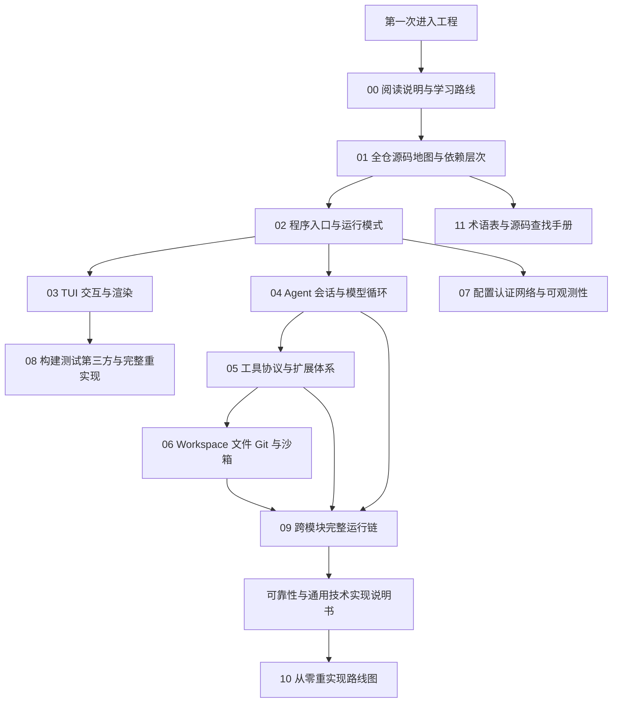

# Grok Build 源码精读与重实现手册

这套文档面向第一次阅读大型 Rust 异步工程的开发者。它的目标不是翻译源码注释，而是建立一套能够指导重新实现的系统模型：入口如何组合，状态由谁拥有，事件怎样流动，工具如何产生副作用，失败和取消怎样收敛，以及每个 crate 为什么存在。

## 一页阅读地图



## 文档目录

| 顺序 | 文档 | 主要问题 |
|---:|---|---|
| 00 | [阅读说明与学习路线](00-阅读说明与学习路线.md) | 如何阅读、覆盖口径、Rust 新手预备知识 |
| 01 | [全仓源码地图与依赖层次](01-全仓源码地图与依赖层次.md) | 80 余个 crate 如何分层、谁依赖谁 |
| 02 | [程序入口与运行模式](02-程序入口与运行模式.md) | `main`、CLI、Tokio、TUI/headless/stdio/leader/ACP |
| 03 | [TUI 交互与渲染](03-TUI交互与渲染.md) | Action/Effect、事件循环、输入、scrollback、modal、PTY |
| 04 | [Agent 会话与模型循环](04-Agent会话与模型循环.md) | Session Actor、ChatState、Sampler、队列、压缩和记忆 |
| 05 | [工具协议与扩展体系](05-工具协议与扩展体系.md) | Tool runtime、Hub、MCP、Hook、Plugin、Subagent、Workflow |
| 06 | [Workspace 文件 Git 与沙箱](06-Workspace文件Git与沙箱.md) | RPC、FS、命令、Git、worktree、hunk、搜索、沙箱和存储 |
| 07 | [配置认证网络与可观测性](07-配置认证网络与可观测性.md) | 配置、签名、认证、HTTP、模型目录、Trace、熔断和更新 |
| 08 | [构建测试第三方与完整重实现](08-构建测试第三方与完整重实现.md) | 构建、测试矩阵、vendored Mermaid、许可证和阶段验收 |
| 09 | [跨模块完整运行链](09-跨模块完整运行链.md) | 一次 Prompt 如何穿过全部核心边界并返回屏幕 |
| 横切 | [可靠性与通用技术实现说明书](可靠性与通用技术实现说明书.md) | 承诺点、幂等、重试、取消、结果未知、背压和故障注入 |
| 10 | [从零重实现路线图](10-从零重实现路线图.md) | 从空 workspace 到完整产品的分阶段实现顺序 |
| 11 | [术语表与源码查找手册](11-术语表与源码查找手册.md) | 术语、常见误解、从行为/错误反查源码的方法 |

## 三条使用路径

### 路径 A：第一次理解工程

```text
00 → 01 → 02 → 04 → 05 → 06 → 09
```

这条路线先忽略大量 UI 和基础设施细节，尽快建立 Prompt → Model → Tool → Workspace → Model 的核心回边。

### 路径 B：准备维护现有代码

```text
00 → 01 → 目标专题 → 11 → 对应测试索引 → 可靠性说明
```

先确定事实源和责任层，再修改局部代码。不要根据 UI 文案或错误字符串猜控制流。

### 路径 C：从零重新实现

```text
01 → 09 → 可靠性说明 → 10 → 02/04/05/06 → 03/07/08
```

先理解边界和不变量，再按阶段实现。原仓库的 crate 数量是演进结果，不需要在第一天复制。

## 核心心智模型

```text
用户输入
  → TUI 单写者状态机
  → ACP 协议适配
  → Session Actor
  → ChatState 请求视图
  → Sampler 模型流
  → ToolCall
  → Tool Registry / Permission
  → Workspace 主机副作用
  → ToolResult
  → 下一轮采样或最终回复
  → ACP notification/response
  → TUI 渲染
```

必须始终记住：

1. UI 状态、会话状态、对话事实和文件事实由不同模块拥有。
2. 模型增量 token 不是规范完成消息。
3. 每个工具调用都必须由相同 call id 的结果闭合。
4. 权限决定和 OS 沙箱是两层，不可互相替代。
5. 取消只停止未来工作，不自动撤销已经发生的副作用。
6. 结果未知时先对账，不盲目重试。

## 源码覆盖概览

仓库约有 2494 个 Rust 文件；按路径排除显式 `tests/`、`benches/`、`fuzz/` 后仍约 2085 个。文档采用下面的覆盖方式：

- 每个 workspace member 都在全仓地图或专题中归类；
- 核心 crate 提供生产文件地图、关键类型/函数和调用关系；
- 大量同类测试按行为矩阵总结，并保留代表性路径；
- 平台分支和 vendored 算法按实现族说明；
- 每个专题包含新手解释、失败路径和重实现顺序。

这里的“全部源码阅读”不等于逐行中文翻译，而是让每个源码域都能从文档进入，并能沿关键符号继续跟读。

## 阅读时的证据优先级

```text
具体生产调用点
> 类型/trait/协议定义
> 对应测试表达的行为
> Cargo 依赖和 feature
> README/设计文档
> 仅由文件名得出的推断
```

若文档与当前源码冲突，以源码和可复现测试为准。仓库会持续演进，阅读时可利用 [术语表与源码查找手册](11-术语表与源码查找手册.md) 中的命令重新定位符号。

## 重实现前的最低检查

- 能画出一次 Prompt 的完整时序；
- 能指出 UI、Session、ChatState、Workspace 的事实源；
- 能解释 Prompt、Turn、Attempt 的区别；
- 能解释 `mpsc` 与 `oneshot` 在会话中的不同角色；
- 能解释 `Completed` 为什么是模型流的提交屏障；
- 能解释 ToolSpec 与运行时 dispatcher 为什么必须同版本；
- 能解释文件写入结果未知时为什么不能直接重试；
- 能解释 Permission 与 Sandbox 的区别；
- 能列出退出时需要恢复/回收的终端和进程资源；
- 能按 [从零重实现路线图](10-从零重实现路线图.md) 切出第一个端到端纵切片。

