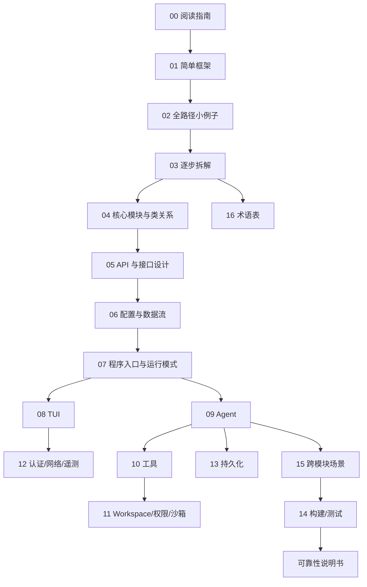

# Grok Build 新手重构级源码指南（4 层规范版）

> **范围**：本文档库是 Grok Build（终端 AI coding agent，二进制 `xai-grok-pager`，发行安装名 `grok`）的**重构级完整源码指南**。它按「先简单框架、再一条全路径小例子、再逐步拆解、最后补齐全部逻辑」四层推进，目标是让读者仅凭本库就能重新实现功能等价的系统。
> **工具版本**：Rust `1.94.0`（`rust-toolchain.toml:11`，组件 `rustfmt`/`clippy`）；`cargo` 随工具链；`ratatui = 0.29`、`tokio = full`、`agent-client-protocol = 0.10.4`（见根 `Cargo.toml` `[workspace.dependencies]`）。
> **阅读说明**：本文讲**调用关系与数据流**，不把行号当稳定 API。行号来自当前工作区快照，随版本变化；若你本地已有后续修改，**以当前源码为准**。每篇结论都给出 `crate/path:line` 源码索引，便于定位与复现。

---

## 本库内容（按四层分组）

| 层 | 序号 | 文档 | 一句话定位 |
|---|---|---|---|
| 方法 | `00` | [阅读指南与文档地图](00-阅读指南与文档地图.md) | 怎么读、Rust 预备、证据优先级、四条路径 |
| **第一层 · 简单框架** | `01` | [简单框架-系统骨架](01-简单框架-系统骨架.md) | 有哪些进程/模块、各自职责、谁依赖谁、数据从哪进到哪出 |
| **第二层 · 全路径小例子** | `02` | [简单例子-全路径走读](02-简单例子-全路径走读.md) | 选一条最小例子（TUI 输入一条 prompt → 回答上屏），从入口追到返回 |
| **第三层 · 逐步拆解** | `03` | [详细逐步说明-主链路拆解](03-详细逐步说明-主链路拆解.md) | 把第二层的主链按调用顺序逐跳展开，配时序图 |
| 第四层 · 补齐全部逻辑 | `04` | [核心模块与类关系](04-核心模块与类关系.md) | Handle / Actor / Command / Event 真实类型与关系 |
| 第四层 | `05` | [API 与接口设计](05-API与接口设计.md) | CLI、ACP、Tool 端口、Workspace RPC、Sampler 端口、Auth、Persistence |
| 第四层 | `06` | [配置与数据流](06-配置与数据流.md) | 配置合并优先级、环境变量、会话数据、Prompt/工具/权限数据流 |
| 第四层 | `07` | [程序入口与运行模式](07-程序入口与运行模式.md) | `main()`→`async_main()` 分发、TUI/headless/leader/workspace 等模式 |
| 第四层 | `08` | [TUI 交互循环与渲染](08-TUI交互循环与渲染.md) | Action/Effect 事件循环、Ratatui 渲染、PTY/alternate screen |
| 第四层 | `09` | [Agent 会话与模型循环](09-Agent会话与模型循环.md) | Session Actor 回合循环、采样、工具批次、压缩、取消 |
| 第四层 | `10` | [工具协议与扩展体系](10-工具协议与扩展体系.md) | Tool trait、MCP、Computer Hub、Hooks、Plugins、Skills |
| 第四层 | `11` | [Workspace 权限沙箱与 Git](11-Workspace权限沙箱与Git.md) | WorkspaceOps、权限双层模型、OS 沙箱、Git、Hunk |
| 第四层 | `12` | [认证网络遥测与更新](12-认证网络遥测与更新.md) | Auth、HTTP 客户端、重试、Telemetry、Crash、Update |
| 第四层 | `13` | [持久化记忆与会话恢复](13-持久化记忆与会话恢复.md) | JSONL 持久化、崩溃恢复、fork/rewind、Memory |
| 第四层 | `14` | [构建测试第三方与许可证](14-构建测试第三方与许可证.md) | 构建、测试矩阵、vendored、许可证 |
| 第四层 | `15` | [跨模块完整运行链与场景](15-跨模块完整运行链与场景.md) | 8 个端到端场景（读文件、编辑+权限、bash+沙箱、取消、压缩、MCP…） |
| 方法 | `16` | [术语表与源码查找手册](16-术语表与源码查找手册.md) | 术语消歧 + `rg`/`cargo` 查找配方 |
| 实施 | — | [可靠性与通用技术实现说明书](可靠性与通用技术实现说明书.md) | 失败/重试/取消/背压/幂等/结果未知的统一语义 |

---

## 推荐阅读路径

- **路径 A（第一次理解工程）**：`00 → 01 → 02 → 03 → 04 → 09 → 10 → 11 → 15`。
- **路径 B（准备维护现有代码）**：`16 → 04 → 05 → 目标专题（07–13）→ 对应测试索引`。
- **路径 C（从零重新实现）**：`01 → 04 → 05 → 06 → 可靠性说明书 → 14 → 07/09/10/11 → 08/12/13`。

---

## 编写约定（本库所有文档遵守）

1. **真实符号**：写 crate 名、文件路径、类型名、函数名；禁止只写「某模块负责某某」。
2. **Why → What → How**：每主题先讲设计初衷，再讲结构，最后拆实现。
3. **图表分工**：端到端协议/网络流用 **ASCII 框线图**；代码/调用关系/架构用 **Mermaid**（`flowchart`/`classDiagram`/`sequenceDiagram`）。
4. **调用关系写全**：谁调用谁、参数、返回、错误、是否跨 `await`/channel。
5. **失败路径与成功路径同等篇幅**。
6. **不省略核心逻辑**：不用「同上」「略」「类似」。
7. **源码索引**：每关键结论给 `crate/path:line`；行号随版本变化，以当前源码为准。
8. **与源码冲突时以源码和可复现测试为准**。

---

## 源码规模（阅读时的心理预期）

- Workspace members：约 89 个（见根 `Cargo.toml` `[workspace].members`，`Cargo.toml:8-103`），分布在 `crates/codegen/`、`crates/common/`、`crates/build/`、`prod/mc/`、`third_party/`。
- 核心生产 crate 集中在 `crates/codegen/`（`xai-grok-pager`、`xai-grok-shell`、`xai-grok-sampler`、`xai-chat-state`、`xai-grok-tools`、`xai-grok-workspace`）与 `crates/common/`（`xai-tool-runtime`、`xai-tool-types`、`xai-tool-protocol`）。
- 组合根只有一个 `main.rs`：`crates/codegen/xai-grok-pager-bin/src/main.rs`，有意不放领域逻辑。
- 工具链：`rust-toolchain.toml:11` 钉死 `1.94.0`。

---

## 核心心智模型（全库共用）

```mermaid
flowchart LR
    INPUT["Terminal / ACP / CLI"] --> VIEW["Pager AppView / Headless reducer"]
    VIEW --> ACTION["Action"]
    ACTION --> DISPATCH["dispatch::dispatch"]
    DISPATCH --> EFFECT["Effect::SendPrompt"]
    EFFECT --> ACP["ACP transport → acp_send"]
    ACP --> CMD["SessionCommand::Prompt"]
    CMD --> TURN["SessionActor::handle_prompt"]
    TURN --> BUILD["ChatStateHandle::build_request"]
    BUILD --> SAMPLE["SamplerHandle / SamplingEvent"]
    SAMPLE --> CALLS["execute_tool_calls_batch"]
    CALLS --> TOOL["ToolDyn::execute"]
    TOOL --> WS["WorkspaceOps / Permission / Sandbox"]
    WS --> RESULT["ToolRunResult"]
    RESULT --> BUILD
    SAMPLE -->|Completed| RESP["PromptTurnResult"]
    RESP --> VIEW
```

六条不变量：

1. UI 状态、会话状态、对话事实、文件事实由不同模块拥有。
2. 模型增量 token 不是规范完成消息；`Completed` 才是提交屏障。
3. 每个工具调用必须由相同 call id 的结果闭合。
4. 权限决定和 OS 沙箱是两层。
5. 取消不自动撤销已经发生的副作用。
6. 结果未知时先对账，不盲目重试。
