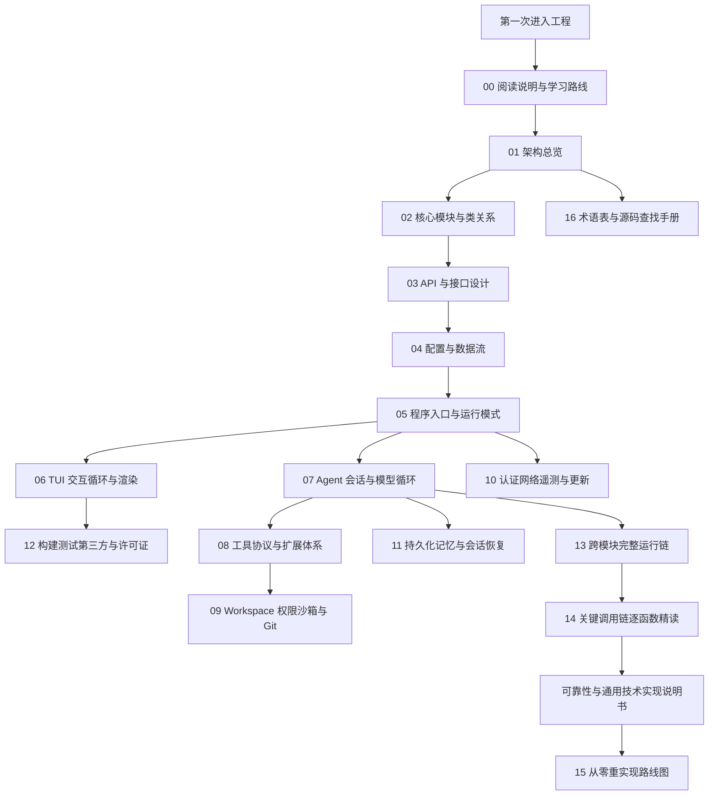

# Grok Build 新手重构级源码指南

本目录是 Grok Build 的 **规范源码精读入口**。它按「先框架、再一条全路径小例子、再逐步展开、最后补齐源码逻辑」写成，目标是让开发者仅凭这套文档就能重新实现功能等价系统。

同目录族：

| 目录 | 用途 |
|---|---|
| `docs/adrian/sourceReader/` | **本目录**：重构级完整指南（规范入口） |
| `docs/adrian/sourceReader1/` | 同结构底稿，编号与本目录对齐 |
| `docs/adrian/sourceReader2/` | 更短的新手地图（原 `docs/sourcecode1/`） |

- 工程：Grok Build（终端 AI coding agent）
- 官方二进制组合根：`crates/codegen/xai-grok-pager-bin/src/main.rs`
- 产物名：`xai-grok-pager`（发行安装名为 `grok`）
- 工具链：`rust-toolchain.toml` 钉死 `1.94.0`
- 许可证：Apache-2.0（第一方代码）
- 同步标记：根目录 `SOURCE_REV`

## 这套文档要解决什么

读完并按图跟完源码后，读者应能独立回答并动手实现：

1. 进程从 `main()` 怎样分发到 TUI / headless / stdio ACP / leader。
2. 一次用户 Prompt 怎样穿过 Action → Effect → ACP → SessionActor → ChatState → Sampler → Tool → Workspace，再回到屏幕。
3. UI 状态、会话状态、对话事实、文件事实分别由谁拥有。
4. 工具调用如何用同一个 `ToolCallId` 闭合。
5. 权限决策与 OS 沙箱为什么是两层，不能互相替代。
6. 取消、重试、结果未知、崩溃恢复分别停在哪一层。
7. 如何从空 Cargo workspace 分阶段重建功能等价系统。

## 文档权威层次

| 层次 | 文档 | 回答的问题 |
|---|---|---|
| 方法 | `00`、`16` | 怎么读、怎么搜、Rust 预备知识 |
| 全局结构 | `01`、`02` | 分层、crate、类/Actor/trait 关系 |
| 契约 | `03`、`04` | 对外接口、配置合并、数据所有权 |
| 领域实现 | `05`–`12` | 入口、TUI、Agent、工具、Workspace、认证、持久化、构建 |
| 执行过程 | `13`、`14` | 概念运行链 + 逐函数调用链 |
| 实施 | `15`、可靠性说明书 | 分阶段重实现、失败语义、验收 |

## 目录结构

```text
docs/adrian/sourceReader/
├── README.md                                 # 本文件：总目录、大纲、阅读路线
├── 00-阅读说明与学习路线.md
├── 01-架构总览.md
├── 02-核心模块与类关系.md
├── 03-API与接口设计.md
├── 04-配置与数据流.md
├── 05-程序入口与运行模式.md
├── 06-TUI交互循环与渲染.md
├── 07-Agent会话与模型循环.md
├── 08-工具协议与扩展体系.md
├── 09-Workspace权限沙箱与Git.md
├── 10-认证网络遥测与更新.md
├── 11-持久化记忆与会话恢复.md
├── 12-构建测试第三方与许可证.md
├── 13-跨模块完整运行链.md
├── 14-关键调用链逐函数精读.md
├── 15-从零重实现路线图.md
├── 16-术语表与源码查找手册.md
└── 可靠性与通用技术实现说明书.md
```

## 一页阅读地图



## 三条使用路径

### 路径 A：第一次理解工程

```text
00 → 01 → 02 → 05 → 07 → 08 → 09 → 13 → 14
```

先建立分层和符号关系，再沿 Prompt 主链走一遍，最后用逐函数精读核对。

### 路径 B：准备维护现有代码

```text
16 → 02 → 03 → 目标专题（05–12）→ 对应测试索引
```

先确定事实源和责任层，再改局部代码。不要根据 UI 文案或错误字符串猜控制流。

### 路径 C：从零重新实现

```text
01 → 02 → 03 → 04 → 可靠性说明书 → 15 → 05/07/08/09 → 06/10/11/12
```

先理解边界和不变量，再按阶段实现。原仓库 80 余个 crate 是演进结果，第一天不需要复制 crate 数量。

---

## 各文件大纲

### `00-阅读说明与学习路线.md`

**目标**：让 Rust 新手知道这套文档怎么用，以及“读完全部源码”在工程上意味着什么。

**大纲**：

1. Why：为什么不能按文件树从头读到尾。
2. 覆盖口径：`crates/codegen/`、`crates/common/`、`crates/build/`、`prod/mc/`、`third_party/`。
3. 三种代码不要混：生产代码、测试/harness、vendored 源码。
4. 每次打开一个 `.rs` 必须回答的 9 个问题（定位、契约、主路径、状态、异步、失败、Rust 机制、验证、下一跳）。
5. Rust 预备：workspace、trait object、Actor（mpsc + oneshot）、Stream、CancellationToken。
6. 证据优先级：生产调用点 > 类型/trait > 测试 > Cargo 依赖 > README。
7. 与 `docs/design/`、用户手册、`sourceReader2` 的关系。
8. 重实现前最低检查清单。

**必须映射的源码**：`Cargo.toml` workspace members、`rust-toolchain.toml`、`SOURCE_REV`、`crates/codegen/xai-grok-pager-bin/src/main.rs`。

### `01-架构总览.md`

**目标**：用一张分层图和若干部署图，把 80 余个 crate 收成可记忆的系统。

**大纲**：

1. Why：组合根、展示层、应用层、领域层、端口层、适配器层各自解决什么耦合。
2. 系统上下文：开发者、ACP 宿主、xAI API、MCP、本地仓库、遥测。
3. 逻辑分层规则：谁可以依赖谁，谁不该承担什么。
4. 物理拓扑：默认单进程；可选 Leader / Workspace Server / MCP 子进程 / ACP stdio。
5. 核心运行回边：Terminal Event → Action → Effect → SessionCommand → SamplingEvent → ToolResult。
6. 信任边界：模型输出、仓库内容、MCP 返回值都不可信。
7. 技术选型表：Tokio、Ratatui、Reqwest、ACP、MCP、SQLite、tree-sitter、gix。
8. 重实现时哪些边界必须先画出来。

**必须映射的源码**：`xai-grok-pager-bin`、`xai-grok-pager`、`xai-grok-shell`、`xai-chat-state`、`xai-grok-sampler`、`xai-tool-runtime`、`xai-grok-workspace`。

### `02-核心模块与类关系.md`

**目标**：把“模块图”落到真实类型：Handle、Actor、Command、Event、Trait。

**大纲**：

1. Why：大型异步程序用 Actor 而不是到处加锁。
2. 三类对象：Handle（调用端口）、Actor（单写者）、Event（观察端口）。
3. 类图：`SessionHandle` / `SessionActor` / `SessionCommand`。
4. 类图：`ChatStateHandle` / `ChatStateActor` / `ChatStateCommand` / `ChatStateEvent`。
5. 类图：`SamplerHandle` / `SamplerActor` / `SamplingEvent`。
6. 类图：`Tool` / `ToolDyn` / `ToolDispatch` / `WorkspaceOps`。
7. TUI 三元组：`Action` / `Effect` / `TaskResult`。
8. 谁拥有什么状态（UI / Session / ChatState / FS / Permission）。
9. 跨 crate 边用的是直接调用、channel、trait 还是 wire protocol。
10. 重实现最小对象集。

**必须映射的源码**：

- `crates/codegen/xai-grok-shell/src/session/handle.rs`
- `crates/codegen/xai-grok-shell/src/session/commands.rs`
- `crates/codegen/xai-chat-state/src/lib.rs`
- `crates/codegen/xai-grok-sampler/src/lib.rs`
- `crates/common/xai-tool-runtime/src/tool.rs`
- `crates/codegen/xai-grok-pager/src/app/actions.rs`

### `03-API与接口设计.md`

**目标**：列出所有稳定端口，使重实现时不会把 UI 和 OS 细节焊死在一起。

**大纲**：

1. Why：端口（trait / wire enum）是可替换适配器的前提。
2. CLI：`PagerArgs`、`Command`、`AgentCmd`（`app/cli.rs`）。
3. ACP：`session/new`、`session/prompt`、`session/cancel`、notifications。
4. Tool 端口：`Tool::id/description/run/execute`、`ToolCallContext`、`ToolDispatch`。
5. Hub wire：`xai-tool-protocol` 的 `PROTOCOL_VERSION`、Hello、ToolCall、Notification。
6. Workspace RPC：`WorkspaceRpc` trait、`WorkspaceOps` Local/Proxy。
7. Sampler 端口：`SamplingClient`、三层 API、`SamplingEvent`。
8. Auth 端口：`HttpAuth`、`AuthCredentialProvider`。
9. Persistence 端口：`ChatPersistence`。
10. 每个接口的输入、输出、错误、幂等和版本约束。

### `04-配置与数据流.md`

**目标**：说清配置从哪里来、合并优先级、运行时数据谁写谁读。

**大纲**：

1. Why：配置分层是为了企业策略压过用户偏好，而不是为了“多几个 toml”。
2. 合并顺序：`/etc/grok/managed_config.toml` → `$GROK_HOME/managed_config.toml` → `config.toml` → signed `requirements.toml` → MDM。
3. 路径：`xai-grok-config::paths::{grok_home, default_grok_home}`。
4. 环境变量覆盖：`GROK_HOME`、`GROK_DEBUG_LOG`、`GROK_COMPACTION_MODE`、sandbox 相关。
5. 会话数据：`chat_history.jsonl`、metadata、hunk tracker、memory sqlite。
6. Prompt 数据流：用户输入 → ContentBlock → ConversationItem → ConversationRequest → HTTP SSE → SamplingEvent → ACP notification → scrollback。
7. 工具数据流：ToolCallDelta → 完整 args → Tool::execute → ToolResult → ChatState append。
8. 权限数据流：Tool 请求 → PermissionManager → Prompter → 规则缓存。
9. 事实源表：每类数据的唯一写入者。

### `05-程序入口与运行模式.md`

**目标**：把 `main()` 到各运行模式的分发写成可照抄的启动状态机。

**大纲**：

1. Why：一个二进制要同时服务交互 TUI、CI headless、编辑器 ACP、后台 leader。
2. `main()` 逐步：telemetry mark、mermaid/voice 子进程、parse CLI、jemalloc、crash handler、Tokio runtime、`async_main`。
3. `async_main` 的 Command match：Agent / Doctor / Inspect / Setup / Mcp / Plugin / Leader / Workspace / Sessions / Update / TUI 默认路径。
4. `run_agent_command`：headless、stdio、leader、serve。
5. Tokio worker 计算：`cli_worker_threads` / `GROK_WORKER_THREADS`。
6. 退出路径：`shutdown_and_flush_telemetry`、终端恢复、更新安装。
7. 每种模式的进程图、stdin/stdout 所有权、失败码。
8. 重实现第一步：先做一个能分发 4 种模式的空壳 `main`。

### `06-TUI交互循环与渲染.md`

**目标**：让读者能重写一个 Action/Effect 事件循环，而不是“会用 Ratatui”。

**大纲**：

1. Why：同步 dispatch + 异步 effects，才能让 UI 逻辑可单测。
2. 模块地图：`app/mod.rs`、`event_loop.rs`、`dispatch/`、`effects.rs`、`scrollback/`、`views/`。
3. 输入：crossterm event → `input` → `Action`。
4. `dispatch::dispatch(Action) -> Vec<Effect>`。
5. `effects` 把 Effect 变成 spawn 的 task，完成后再变成 `TaskResult`。
6. 渲染：`AppView` draw、`xai-grok-pager-render`、markdown 流式渲染、Mermaid worker。
7. Prompt 编辑：`xai-ratatui-textarea`。
8. PTY / Kitty keyboard / alternate screen 的进入与退出。
9. Slash commands 注册与执行。
10. 失败：终端损坏、部分重绘、粘贴风暴、取消正在绘制的流。

### `07-Agent会话与模型循环.md`

**目标**：把 Session Actor 的回合循环写成可实现的伪代码和真实函数链。

**大纲**：

1. Why：会话必须是单写者，否则历史、工具结果、压缩会竞态。
2. `spawn_session_actor`、`SessionHandle`、`SessionLiveState`。
3. `SessionCommand::Prompt` 字段逐项解释。
4. `handle_prompt` → `ChatStateHandle::build_request` → `run_turn_via_sampler`。
5. `SamplingEvent` 到 ACP notification 的翻译。
6. 工具批次：`execute_tool_calls_batch`、call id 闭合。
7. 压缩：`xai-grok-compaction`、`CompactionMode`。
8. 插话：`xai-interjection-core`、`PromptOrigin`。
9. Subagent：`xai-grok-subagent-resolution`、Task 工具。
10. 取消：`session/cancel`、CancellationToken、不撤销已发生副作用。
11. `PromptTurnResult` / `PromptCompletionKind`。

### `08-工具协议与扩展体系.md`

**目标**：实现一套与现系统兼容的工具运行时，而不是堆一堆函数。

**大纲**：

1. Why：内置工具、MCP、Hub 远程工具必须走同一 `Tool` trait。
2. `xai-tool-types` / `xai-tool-protocol` / `xai-tool-runtime` 三层。
3. `Tool::execute` 默认包装 `run`；Stream 不变量：任意 Progress + 恰好一个 Terminal。
4. `ToolDispatch`、`ToolSearchIndex`、`CompoundResolver`。
5. 内置工具谱：`xai-grok-tools/src/implementations/grok_build/`（bash、read_file、search_replace、grep、task、todo、web_search…）。
6. MCP：`xai-grok-mcp`、stdio/HTTP、OAuth。
7. Computer Hub：`xai-computer-hub-core/sdk`。
8. Hooks：`xai-grok-hooks`。
9. Plugins / marketplace：`xai-grok-plugin-marketplace`。
10. Skills / Workflow。
11. 输出截断：`DEFAULT_TOOL_OUTPUT_BYTES`、MCP cap。

### `09-Workspace权限沙箱与Git.md`

**目标**：把所有宿主副作用收口到 Workspace，并讲清权限与沙箱的双层模型。

**大纲**：

1. Why：Agent 不能直接 `std::fs` / `Command`，否则无法代理、无法审计。
2. `WorkspaceOps` Local vs Proxy。
3. `WorkspaceHandle`、`connect_local_workspace`。
4. FS：`file_system`、`xai-grok-paths`、`xai-fsnotify`。
5. Git：`session/git`、`xai-gix-status`、`xai-fast-worktree`。
6. Hunk：`xai-hunk-tracker`。
7. Permission：`permission/manager`、rules、prompter、auto_mode。
8. Sandbox：`xai-grok-sandbox`（OS 层）。
9. Worktree pool。
10. Workspace Server / Hub 暴露。
11. 结果未知时的对账，而不是盲目重试写文件。

### `10-认证网络遥测与更新.md`

**目标**：重实现登录、HTTP 客户端、观测和自更新，而不把密钥写进配置。

**大纲**：

1. Why：HTTP 只依赖 `HttpAuth`，才能替换静态 token / OAuth 刷新 / 宿主凭据。
2. `xai-grok-auth`：`AuthCredentialProvider`、`CredentialSnapshot`。
3. Login 路径：OAuth（auth.x.ai）与 device-code。
4. `xai-grok-http`：Reqwest、rustls ring、User-Agent、`TransportFailureKind`。
5. Sampler 重试：`classify_error`、`retry_backoff_with_jitter`、401 归因。
6. Telemetry：`xai-grok-telemetry`（Sentry、OTEL、debug log、unified_log）。
7. Mixpanel：`xai-mixpanel`。
8. Crash handler：`xai-crash-handler`。
9. Update：`xai-grok-update`、channel（stable/alpha/enterprise）。
10. 敏感数据：token 只打 suffix（`BEARER_SUFFIX_LEN`）。

### `11-持久化记忆与会话恢复.md`

**目标**：会话能崩溃恢复、能 fork/rewind，记忆能跨会话检索。

**大纲**：

1. Why：会话是磁盘上的可恢复日志，不是进程内对象。
2. `ChatPersistence`、JSONL append、generation-aware 目录切换。
3. `SessionLiveState`：Working / IdleResident / Dormant / Completed / DeadFailed / Attaching。
4. Resume / fork / rewind。
5. `xai-grok-memory`：chunk、embedding、SQLite vec、MMR、dream。
6. `xai-sqlite-journal`：WAL vs rollback。
7. 崩溃会话收集：`active_sessions::collect_crashed`。
8. 恢复不变量：dangling tool calls 必须先闭合或标记。

### `12-构建测试第三方与许可证.md`

**目标**：能在干净机器上构建、测试、处理 vendored 代码和许可证。

**大纲**：

1. Why：根 `Cargo.toml` 是生成的，应改各 crate 的 `Cargo.toml`。
2. 构建：DotSlash + `bin/protoc`、`cargo run -p xai-grok-pager-bin`。
3. Feature：jemalloc、release-dist。
4. 测试矩阵：单 crate unit、PTY E2E（`xai-grok-pager-pty-harness` / `ptyctl`）、fuzz、bench。
5. `third_party/`：Mermaid 栈（dagre_rust、graphlib_rust、mermaid-to-svg）。
6. 工具移植：codex apply_patch、opencode grep/glob/edit（`THIRD_PARTY_NOTICES`）。
7. 重实现验收清单。

### `13-跨模块完整运行链.md`

**目标**：用一张时序图讲完“用户敲回车到屏幕出现回答”的全部边界穿越。

**大纲**：

1. 场景 1：普通问答（无工具）。
2. 场景 2：读文件再回答。
3. 场景 3：编辑文件 + 权限确认。
4. 场景 4：bash 命令 + 沙箱。
5. 场景 5：取消正在跑的 turn。
6. 场景 6：上下文超限触发压缩。
7. 场景 7：MCP 工具。
8. 场景 8：headless `-p`。
9. 每条链标注：调用者、被调函数、参数、返回、channel 类型、错误如何冒泡。

### `14-关键调用链逐函数精读.md`

**目标**：把 `13` 的概念链展开成真实函数名序列，可对着源码单步。

**大纲**：

1. 启动链：`main` → `async_main` → TUI `run`。
2. 发送 Prompt 链：`Action` → `dispatch` → `Effect::SendPrompt` → `MvpAgent::prompt` → `SessionCommand::Prompt`。
3. 采样链：`build_request` → `SamplerHandle` → `stream_*` → `SamplingEvent::Completed`。
4. 工具链：`execute_tool_calls_batch` → `ToolDyn::execute` → `WorkspaceOps`。
5. 权限链：classification → rules → prompter → decision。
6. 取消链：Esc → `session/cancel` → token cancel → `PromptCompletionKind::Cancelled`。
7. 退出链：终端 restore、leader 通知、telemetry flush。
8. 每个步骤给出文件路径和函数签名要点。

### `15-从零重实现路线图.md`

**目标**：给出 8 个可交付阶段，每阶段有接口、最小实现、测试和禁止事项。

**大纲**：

1. 阶段 0：空 workspace、CLI 分发、假 TUI。
2. 阶段 1：ACP 最小 session/prompt，固定回复。
3. 阶段 2：ChatState Actor + JSONL。
4. 阶段 3：Sampler HTTP SSE。
5. 阶段 4：Tool trait + read_file/bash。
6. 阶段 5：Permission + sandbox。
7. 阶段 6：真实 TUI Action/Effect。
8. 阶段 7：MCP / hooks / memory / worktree。
9. 每个阶段的完成定义（DoD）和常见抄错点。

### `16-术语表与源码查找手册.md`

**目标**：术语消歧 + `rg` 查找配方，避免把 Prompt/Turn/Attempt 混为一谈。

**大纲**：

1. 术语：Prompt、Turn、Attempt、Session、Agent、ToolCall、Hunk、Leader、ACP、MCP、Hub。
2. 常见误解表。
3. 从行为反查：例如“权限弹窗从哪来”。
4. 从错误字符串反查。
5. 从 CLI flag 反查。
6. 推荐 `rg`/`cargo test -p` 命令。

### `可靠性与通用技术实现说明书.md`

**目标**：失败、重试、取消、背压、幂等、结果未知、故障注入的统一语义，供所有专题引用。

**大纲**：

1. 承诺点（commit point）定义。
2. 幂等：读可重试，写必须有对账键。
3. 取消只停止未来工作。
4. 结果未知先 reconcile。
5. 通道背压：unbounded mpsc 的风险与缓解。
6. 超时、熔断（`xai-circuit-breaker`）。
7. 审计与红action。
8. 重实现时每层必须写的失败测试。

---

## 编写约定（本目录所有文档遵守）

1. **真实符号**：写 crate 名、文件路径、类型名、函数名；禁止只写“某模块负责某某”。
2. **Why → What → How**：每个主题先讲设计初衷，再讲结构，最后拆实现。
3. **Mermaid 必现**：架构用 `flowchart`，对象用 `classDiagram`，交互用 `sequenceDiagram`。
4. **调用关系写全**：谁调用谁、参数、返回、错误、是否跨 await/channel。
5. **失败路径与成功路径同等篇幅**。
6. **不省略核心逻辑**：不用“同上”“略”“类似”。
7. **与源码冲突时以源码和可复现测试为准**。

## 源码规模（阅读时的心理预期）

- Workspace members：约 80+（见根 `Cargo.toml` `[workspace].members`）
- 核心生产 crate 集中在 `crates/codegen/` 与 `crates/common/`
- 最大应用 crate：`xai-grok-shell`、`xai-grok-pager`、`xai-grok-tools`、`xai-grok-workspace`
- 组合根只有一个 `main.rs`，有意不放领域逻辑

## 核心心智模型（全目录共用）

```mermaid
flowchart LR
    INPUT["Terminal / ACP / CLI"] --> VIEW["Pager AppView / Headless reducer"]
    VIEW --> ACTION["Action"]
    ACTION --> DISPATCH["dispatch::dispatch"]
    DISPATCH --> EFFECT["Effect::SendPrompt"]
    EFFECT --> ACP["ACP / MvpAgent::prompt"]
    ACP --> CMD["SessionCommand::Prompt"]
    CMD --> TURN["SessionActor::handle_prompt"]
    TURN --> BUILD["ChatStateHandle::build_request"]
    BUILD --> SAMPLE["SamplerHandle / SamplingEvent"]
    SAMPLE --> CALLS["execute_tool_calls_batch"]
    CALLS --> TOOL["ToolDyn::execute"]
    TOOL --> WS["WorkspaceOps / Permission / Sandbox"]
    WS --> RESULT["ToolResult"]
    RESULT --> BUILD
    SAMPLE -->|Completed| RESP["PromptTurnResult"]
    RESP --> VIEW
```



六条不变量：

1. UI 状态、会话状态、对话事实、文件事实由不同模块拥有。
2. 模型增量 token 不是规范完成消息；`Completed` 才是提交屏障。
3. 每个工具调用必须由相同 call id 的结果闭合。
4. 权限决定和 OS 沙箱是两层。
5. 取消不自动撤销已经发生的副作用。
6. 结果未知时先对账，不盲目重试。
