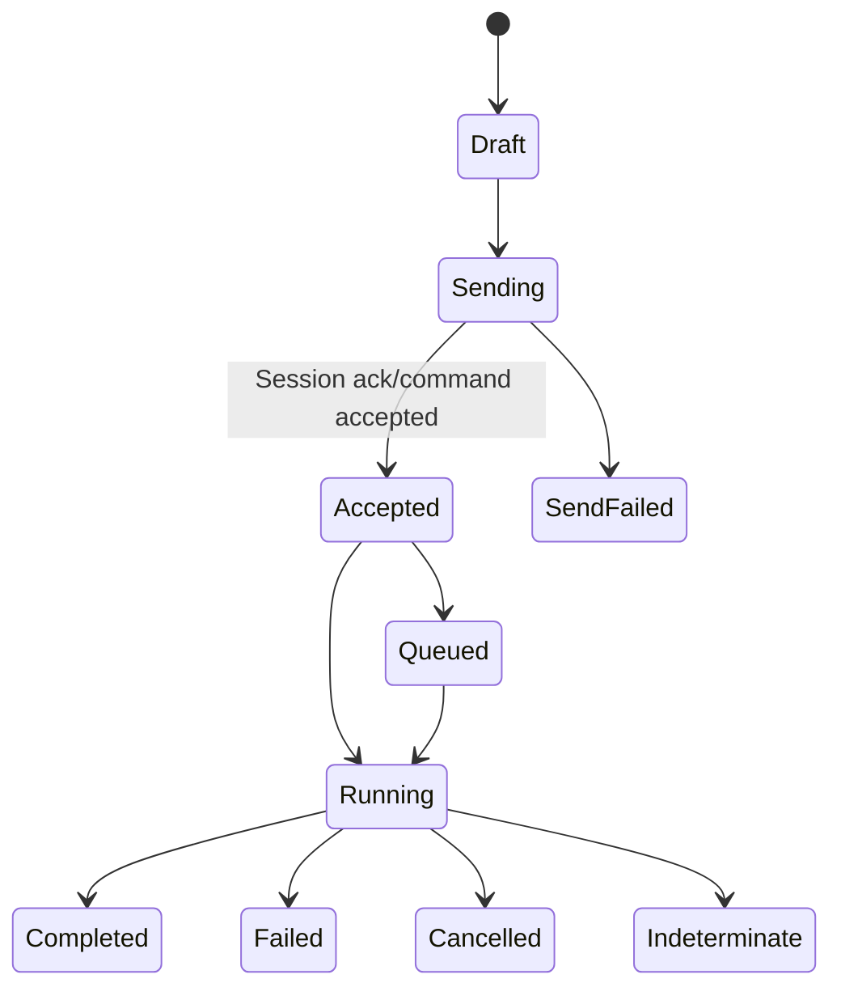
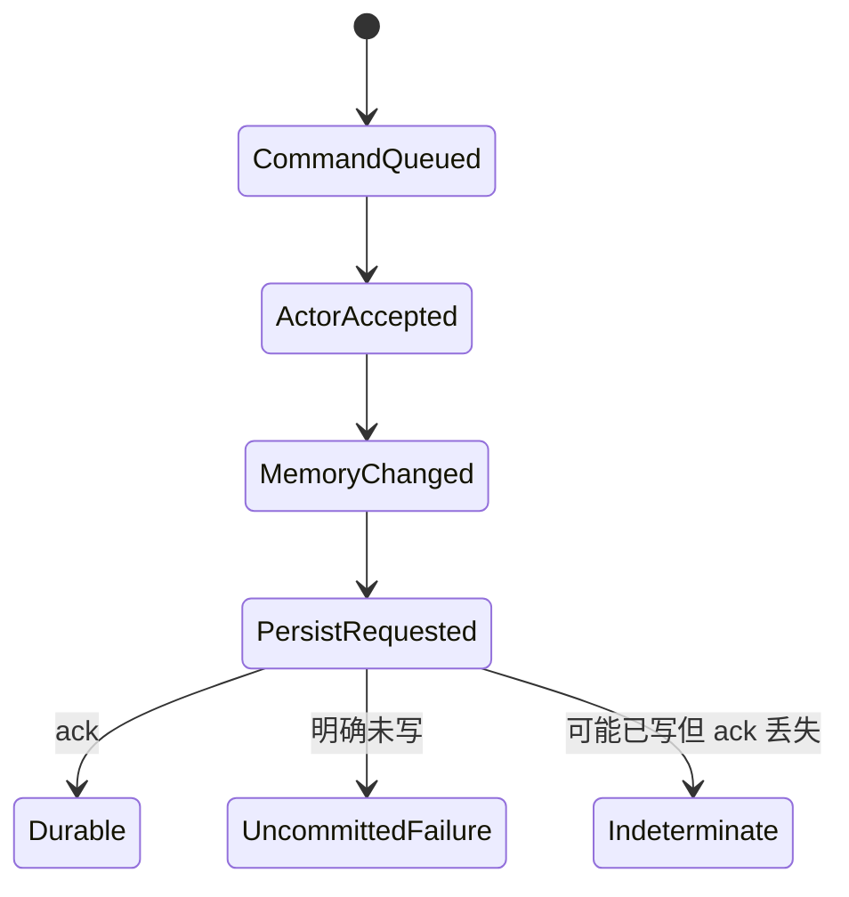
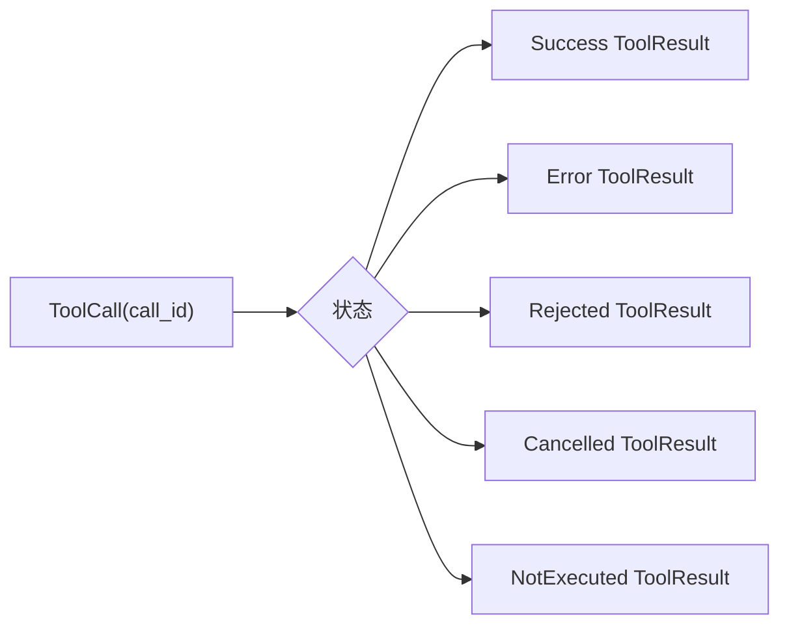
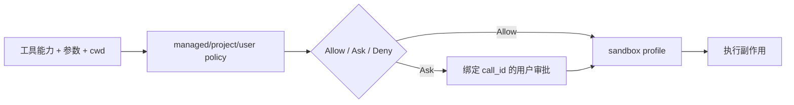

# Grok Build 可靠性与通用技术实现说明书

> 可靠性规则对应的具体调用边可从 [源码符号关系总览](12-源码符号关系总览.md) 定位；取消、失败、恢复和退出的逐函数路径见 [关键调用链逐函数精读](13-关键调用链逐函数精读.md)。本文仍是承诺点、重试、结果未知和故障验收的权威来源。

> 本文从源码阅读和重实现角度描述可靠性。它区分当前源码可确认的机制、不能由代码结构直接推断的承诺，以及重实现时应建立的开发级规则。本文不宣称系统提供分布式 exactly-once。

## 1. 目标与非目标

### 1.1 目标

- 用户输入不会因为 UI 状态切换而静默丢失；
- 每个 Prompt 有可关联的运行、完成、失败或取消结果；
- 模型流只提交一个规范 terminal result；
- 每个 tool call 都被 ToolResult 闭合；
- 权限和沙箱失败时采用保守行为；
- 已发生但结果未知的副作用不会被盲目重复；
- 进程退出时终端、子进程、writer 和持久化任务有界清理；
- 会话恢复能识别截断、旧版本和不完整工具调用；
- 遥测、公告、更新等辅助依赖故障不应破坏核心会话事实。

### 1.2 非目标

- 不保证所有外部系统 exactly-once；
- 不把取消等同于事务回滚；
- 不把 `mpsc::send`、HTTP 2xx、MQ/transport ACK 或 UI 已渲染当成业务事实提交；
- 不假设多个文件修改与对话历史共享一个原子事务；
- 不在缺少源码证据时虚构 SLO、RPO、RTO 或容量数值。

## 2. 承诺点

| 边界 | 已发生的最小事实 | 尚未保证 |
|---|---|---|
| 编辑器 → UI action | event loop 收到提交意图 | ACP 已发送 |
| UI → ACP transport | 请求进入传输层 | Agent 已接受 |
| ACP → Session channel | 命令排队成功 | Prompt 已开始/完成 |
| Session → ChatState | Actor 已处理命令 | 数据已持久化 |
| Persistence ack | 适配器确认写入 | OS/介质级 durability 需看实现 |
| Session → Sampler | 请求任务已启动 | 模型形成规范回复 |
| 增量 token | 可用于展示 | 可提交 Assistant message |
| `Completed` | 本 attempt 有规范结果 | 后续持久化/工具已完成 |
| Tool syscall success | 主机副作用发生 | ToolResult 已写回会话 |
| ToolResult append | 对话已闭合调用 | 外部副作用可逆 |
| UI final render | 用户看到结果 | 所有后台辅助上传成功 |

## 3. 关联标识

重实现至少要贯穿以下标识：

| 标识 | 作用 |
|---|---|
| `session_id` | 路由会话命令和事件 |
| `prompt_id` | 区分同一会话中的用户请求 |
| sampling `request_id/attempt` | 隔离重试前后的模型流 |
| tool `call_id` | 闭合模型工具调用与结果 |
| permission request id | 绑定审批与原工具调用 |
| task/subagent id | 管理子任务树和取消 |
| trace/span id | 跨模块诊断，不作为业务幂等键 |

标识应进入结构化日志和事件，但 secret、完整 Prompt、凭据和敏感文件内容必须脱敏或避免记录。

## 4. 请求可靠接收与幂等

### 4.1 Prompt 接收状态



客户端重试 Prompt 时，需要稳定的 `prompt_id` 或幂等键。服务端应记录请求摘要，区分：

- 同一 key + 同一摘要：返回已接受/已完成状态；
- 同一 key + 不同摘要：冲突并拒绝；
- 无记录：正常接受。

若当前源码路径没有持久化幂等表，则不能宣称跨进程重试无重复；文档和 UI 应把断连后的状态标记为未知并通过会话事实对账。

### 4.2 不使用 trace id 代替幂等键

Trace 可能因重试而变化，也可能跨多个业务操作。业务幂等键必须由稳定请求身份产生，并与请求摘要绑定。

## 5. ChatState 与持久化

ChatState Actor 通过单写者避免字段级竞态，但内存修改与磁盘写入仍有多个阶段：



### 5.1 严格追加应包含

- 稳定 record id 或可比较语义键；
- schema/version；
- append 完成 ack；
- duplicate/already-present 语义；
- flush 策略；
- Actor 内存与磁盘失败后的收敛策略。

### 5.2 JSONL 恢复

- 尾部截断：可恢复完整前缀并报告修复；
- 中部损坏：不能静默跳过关键记录后继续构造虚假历史；
- 未知新字段：按兼容策略保留或忽略；
- 缺失旧字段：只有定义了安全默认时才能升级；
- tool call 无结果：幂等地补合成 cancelled/not-executed 结果；
- running 状态：进程恢复后转成 interrupted，而不是继续假装运行。

## 6. 模型流与重试

### 6.1 事件顺序不变量

1. 每个 attempt 有明确开始；
2. 增量事件携带 request/attempt 关联；
3. 一个 attempt 只有一个有效 `Completed` 或 `Failed`；
4. `Completed` 之后的迟到增量被忽略；
5. 重试时旧 attempt 的内容不得与新 attempt 拼接为规范响应；
6. 只有 terminal response 可以提交 ChatState。

### 6.2 错误分类

| 类别 | 示例 | 默认动作 |
|---|---|---|
| 输入/配置 | 非法模型参数、schema 错误 | 立即失败，修正后再试 |
| 认证 | 401、token 过期 | 交给认证层刷新，次数受限 |
| 限流 | 429 | 遵守有上限的 `Retry-After` |
| 瞬时传输 | connect reset、部分 5xx | 有限指数退避 |
| 流协议 | SSE 格式错误、无 terminal event | 分类后失败或新 attempt |
| 用户取消 | cancellation token | 立即停止，不重试 |
| deadline | 总预算耗尽 | 停止并返回 typed timeout |
| 内部不变量 | 重复 terminal event | 诊断、隔离、失败 |

### 6.3 退避算法

```text
raw_delay = min(cap, base * 2^attempt)
actual_delay = random_between(0, raw_delay)  # full jitter 示例
```

实际是否继续还要同时满足：

```text
attempt < max_attempts
elapsed + actual_delay < total_deadline
request budget 未耗尽
cancellation 未触发
错误被分类为可重试
Retry-After 不超过策略上限
```

Sampler、HTTP middleware、Session 三层不能各自无界重试。应指定唯一责任层，其他层只上报 typed error。

## 7. Tool call 完整性

若 Assistant 产生 N 个工具调用，对话恢复前必须能解释 N 个 call id 的状态：



如果并行工具中第二项触发拒绝并使后续取消，已经成功的结果必须保留，被拒绝项必须明确，未执行项也必须闭合。修复算法必须按 call id 幂等。

## 8. 外部副作用与结果未知

### 8.1 文件写入

建议状态：

```text
Prepared(expected_hash, desired_change)
→ Writing
→ Applied(observed_hash)
→ Attributed
→ Reported
```

在 `Writing` 后崩溃，恢复时重新读取目标并比较 hash/diff。不要直接重复 patch。

### 8.2 Shell/PTY

子进程启动后应记录 pid/process handle、调用身份和时间。连接丢失时先检查进程状态；对任意 shell 命令无法通用判断幂等，因此结果未知时默认不自动重复。

### 8.3 MCP/HTTP 写操作

若 provider 支持 operation id/idempotency key，应在调用意图中先记录并在重试时复用。若 provider 可查询，先对账；无法查询的高风险操作转人工确认。

### 8.4 Git 操作

通过 HEAD、index、worktree 状态确认操作是否已经发生。commit、checkout、merge 等不能仅凭客户端超时判断失败。

## 9. 权限与沙箱

权限判定与 OS 强制是两层：



安全默认：

- managed policy 加载失败不能扩大权限；
- 无 UI 的 Ask 不能默认 Allow；
- sandbox 创建失败时敏感操作不能裸执行；
- project 配置不能覆盖更高层 deny；
- 路径要规范化并防 symlink/rename TOCTOU；
- 迟到审批必须校验原 `session_id/prompt_id/call_id` 仍有效。

## 10. 取消和任务树

每个 Prompt 应有结构化任务树：

```text
Prompt task
├── sampling attempt
├── zero or more tool tasks
│   └── process/PTY/readers
├── persistence acknowledgements
└── UI/ACP progress producers
```

取消流程：

1. Session 标记 prompt cancelling，阻止启动新步骤；
2. 触发共享 cancellation token；
3. 等待采样和工具在检查点退出；
4. 对 child 先发送温和中断，再按超时升级 kill；
5. 回收 stdout/stderr reader 和 writer；
6. 为未闭合工具生成明确结果；
7. 提交 Cancelled completion；
8. 再启动队列下一项。

取消后已写文件不会自动回滚。若产品提供 rewind，应作为显式恢复操作并展示影响预览。

## 11. 超时预算

| 超时 | 保护范围 | 结束后 |
|---|---|---|
| connect timeout | DNS/TCP/TLS 建连 | 可分类重试 |
| header/request timeout | 服务迟迟无首响应 | 取消 attempt |
| stream idle timeout | 流无事件 | 新 attempt 或失败 |
| tool timeout | 单个工具 | 取消工具和子进程 |
| permission timeout | 用户长期不响应 | 拒绝/取消 |
| prompt deadline | 整体 Prompt | 取消整棵任务树 |
| shutdown grace | 进程退出清理 | 超时后强制终止并记录 |

内层超时必须小于外层剩余预算；重试等待也消耗总 deadline。

## 12. 背压与资源边界

必须监测：

- 每会话 Prompt queue 长度；
- 全局/每会话 sampling 并发；
- 并行 tool 数和 child process 数；
- MCP/Hub 连接和 in-flight request；
- TUI writer channel/frame 合并；
- upload/telemetry queue；
- 单条 tool output 和 transcript 大小；
- 图片、PDF 和 Mermaid 制品内存。

无界 channel 必须有生产速率证明，或者增加合并、丢弃低价值中间事件和硬上限。最终结果、权限请求和错误不能与可丢弃的动画帧使用同一丢弃策略。

## 13. 熔断与隔离舱

`xai-circuit-breaker` 提供 Closed/Open/HalfOpen 模型。重实现时按依赖分别配置，不能共享一个全局熔断状态：

| 依赖 | 熔断后的核心行为 |
|---|---|
| 模型 API | 当前 Prompt 明确失败或等待恢复 |
| MCP server | 只禁用对应 server/tool |
| telemetry | 丢弃/缓冲辅助事件，不阻断会话 |
| update/announcement | 静默降级并记录诊断 |
| remote Workspace/Hub | 阻止相关工具，保持 UI 可退出/恢复 |

## 14. 配置快照与可复现性

长 Prompt 开始时至少固定：

- model/backend/reasoning 配置；
- system/developer prompt 版本；
- finalized tool set 和 schema 版本；
- permission/sandbox policy 摘要；
- cwd/worktree/session identity；
- retry、deadline 和预算；
- memory/compaction 策略版本。

动态配置可以影响下一轮，但不能悄悄改变正在重试的 attempt。Secret 只保存引用或内存凭据，不进入普通配置快照、Prompt 和日志。

## 15. 可观测性

### 15.1 结构化事件

- Prompt accepted/queued/started/completed/failed/cancelled；
- sampling attempt started/retrying/completed/failed；
- tool prepared/permission requested/started/completed/unknown；
- persistence append/flush/repair；
- ACP reconnect/replay/drop；
- child interrupt/kill/reap；
- terminal init/restore failure。

### 15.2 指标建议

数值阈值需通过真实负载确认，不在源码阅读阶段虚构：

- Prompt 端到端延迟、首 token 延迟；
- 重试率与按错误分类的失败率；
- queue 长度和等待时间；
- tool 时长、拒绝、取消、结果未知；
- persistence ack 延迟和恢复修复次数；
- TUI render/write 延迟和丢弃中间帧数；
- 子进程遗留和 shutdown 超时；
- MCP/Hub 连接重建和熔断状态。

## 16. 故障注入矩阵

| 注入点 | 期望行为 |
|---|---|
| ACP 发送后断连 | UI 不误报完成；重连后按 prompt id 查询/对账 |
| Session 接收后进程崩溃 | 恢复时区分 accepted 与 completed |
| JSONL 最后一行截断 | 恢复有效前缀并报告修复 |
| persistence 已写但 ack 丢失 | 返回 indeterminate；按 record id 对账 |
| SSE 中途断开 | 旧 attempt 增量不提交；只在安全条件下重试 |
| 收到 Completed 后迟到 token | 丢弃迟到 token |
| tool #2 被拒绝 | 已完成结果保留，其余 call id 全部闭合 |
| 文件写后 ToolResult 前崩溃 | 读取/hash/diff 对账，不盲目重写 |
| child 忽略 SIGINT | grace 后升级 kill 并 reap |
| sandbox 初始化失败 | 敏感工具不执行 |
| telemetry 长期失败 | 核心会话继续，辅助队列受限 |
| TUI writer 阻塞 | 中间帧合并/背压，最终状态不丢 |

## 17. 当前源码需要继续核对的项目

以下项目必须以具体调用点和测试为准，不能从 crate 名称推断：

- 每种文件编辑工具是否都使用同一按路径并发控制；
- strict persistence 的真实 flush/durability 承诺；
- Leader/ACP 重连是否有 replay window 与去重上限；
- 每个外部写工具是否支持 provider operation id；
- 每个无界 channel 的上界或事件合并策略；
- 各平台 sandbox feature 不可用时的行为；
- upload/telemetry queue 是否持久化以及何时丢弃；
- 终端恢复与 crash handler 的先后顺序。

## 18. 技术验收

重实现版本至少满足：

1. 每个 Prompt 可观测地落入完成、失败、取消或未知状态。
2. sampling attempt 不会产生两个规范 terminal result。
3. 所有 tool call id 在恢复前闭合。
4. 用户取消能停止新步骤并有界回收子进程。
5. 文件写结果未知时执行对账而非重复写。
6. managed deny、无 UI Ask、sandbox 失败均 fail closed。
7. 会话可从尾部截断日志恢复有效前缀。
8. 辅助依赖失败不改变已经提交的核心事实。
9. 日志中不出现 token、secret 或未脱敏敏感载荷。
10. 故障注入矩阵有自动化测试或明确人工演练记录。
