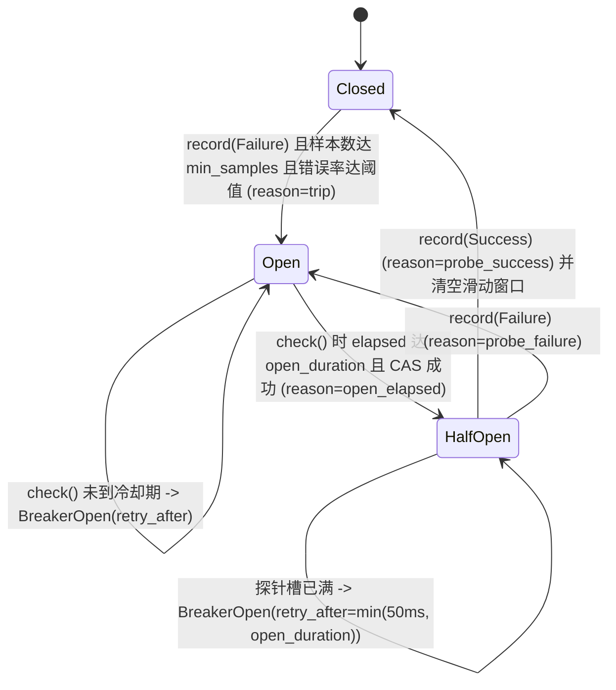

[上一篇：术语表与源码查找手册](16-术语表与源码查找手册.md) · [总目录](README.md) · [下一篇：（完）]

# 可靠性与通用技术实现说明书

> **第 18 / 18 篇** · 工具版本：Rust 1.94.0（rust-toolchain.toml:11）
>
> **场景**：grok-build 是个长期运行、要连网络、要执行命令、要管理状态的终端 Agent。它必须在「模型可能胡来、网络可能断、进程可能崩、文件系统可能卡住、权限必须收紧」的前提下仍然可靠。本章把散落在 07–16 章的**可靠性模式**集中成一份说明书——每条模式给「它解决什么、落哪、怎么实现、失败路径长什么样」。
>
> **阅读说明**：源码基准 `HEAD = 2178c69c`（main，2026-09-23）。**工具版本**：Rust `1.94.0`（`rust-toolchain.toml:11`）、`ratatui 0.29`、`tokio` 特性 `full`、`agent-client-protocol 0.10.4`。定位一律「文件 · 符号(+偏移)」：`+0` 是该符号的定义行，偏移相对符号自身计算；**行号随版本变化，以当前源码为准**。本章是横切参考章，凡与源码冲突以源码为准。
>
> **本次刷新修正**（旧版基于 `HEAD = 6c01b90c`）：① 新增第 ⑬ 类模式**文件锁**——新 crate `xai-grok-file-lock`（`crates/codegen/xai-grok-file-lock`，workspace 第 102 个成员）；② 旧版写的 `xai-grok-active-sessions` 公开 API（`collect_crashed()` / `collect_crashed_in()`）在当前源码中**已不存在**，孤儿回收改由 `register` 顺带剪枝承担（见步骤 11b）；③ 旧版称 `Decision` 的默认落点是 `Ask`——`Decision` 现在**不再** `#[derive(Default)]`，默认 `Ask` 的落点只剩 `EditPolicy::Ask`；④ 旧版列的 `CompoundResolver` 与 `PermissionManager` 在当前源码中**均已不存在**（见步骤 1）。

---

## 第一层 · 简单框架（系统骨架）

可靠性 = **十三类可复用的工程模式**，覆盖「并发 / 边界 / 一致性 / 失败 / 未知 / 崩溃 / 卡死 / 安全」八个维度：

```
┌──────────────────────────────────────────────────────────────────────────────────┐
│  ① 并发收敛        单写者 Actor（会话 / 聊天状态 / 权限 / 编辑追踪 / 工具解析）        │
│  ② 边界收紧        fail-closed（Ask 默认、错误即 Reject、pin 压 yolo、seccomp）       │
│  ③ 一致性          提交屏障 SamplingEvent::Completed / ToolStream 必以 Terminal 收尾   │
│  ④ 失败分类        RetryPolicy::Disposition（Retryable / AuthRefresh / Terminal）     │
│  ⑤ 重试            AuthRetryMiddleware(401) / 逃逸连接池 / 指数退避+抖动                 │
│  ⑥ 熔断            CircuitBreaker 三态 + 半开探针租约 + 每端点 registry                │
│  ⑦ 背压            三层信号量准入（session→conn→global）+ tool_busy(-32016)            │
│  ⑧ 幂等            按 generation 去重（AlreadyPresent）+ bearer stamp 后缀             │
│  ⑨ 结果未知        NotCommitted / Committed{ack} / Indeterminate（必须重试）           │
│  ⑩ 对账修复        悬空 tool_call 补合成结果 / 历史修复报告 / usage 不完整标记            │
│  ⑪ 取消            尽力而为通知 + 重放窗口语义 + sampler Cancel + turn task abort       │
│  ⑫ 崩溃/断线       crash-handler 顺序契约 / PID 孤儿回收 / FTS5 隔离重建 / 断线重放       │
│  ⑬ 文件锁          xai-grok-file-lock：有界非阻塞 flock + machine-local acquire slot    │
└──────────────────────────────────────────────────────────────────────────────────┘
```

| 维度 | 模式 | 主要落点（crate） | 章 |
|------|------|------------------|----|
| 并发 | 单写者 Actor | `xai-grok-shell`、`xai-chat-state`、`xai-grok-workspace`、`xai-hunk-tracker` | 09/10/11 |
| 边界 | fail-closed | `xai-grok-workspace::permission`、`xai-grok-sandbox` | 11 |
| 一致性 | 提交屏障 / 流不变量 | `xai-grok-sampler`、`xai-tool-runtime` | 09/10 |
| 失败 | 状态码分类 | `xai-circuit-breaker::retry_policy` | 本节 4.2 |
| 重试 | 中间件 + 退避 | `xai-grok-auth`、`xai-grok-http`、`xai-grok-sampler`、`xai-grok-tools` | 12 |
| 熔断 | 三态断路器 | `xai-circuit-breaker` | 本节 4.3 |
| 背压 | 三层准入 | `xai-computer-hub-sdk` | 10 |
| 幂等 | generation 去重 | `xai-chat-state`、`xai-grok-shell::session::storage` | 13 |
| 未知 | 三值追加结果 | `xai-chat-state::commands` | 本节 4.4 |
| 对账 | 悬空修复 | `xai-grok-sampling-types`、`xai-chat-state` | 13 |
| 取消 | 窗口化取消 | `xai-grok-shell::session::acp_session_impl::cancel` | 09 |
| 崩溃 | 留痕 + 可救 | `xai-crash-handler`、`xai-grok-active-sessions`、`xai-grok-session-search` | 13 |
| **文件锁** | **有界非阻塞 flock + slot** | **`xai-grok-file-lock`**（消费方 `xai-grok-shell::leader`） | **本节 4.6 / 步骤 12** |
| 卡死 | 网络 FS 不拖垮多进程 | `xai-grok-file-lock::slot` | 本节步骤 12 |

### 可靠性机制总览（调用方 → 被调用方）

这张图把「谁在什么时机调用哪个韧性机制、机制失败后发生什么」画全。**实线箭头 = 调用关系，标注「调用方 → 被调用方」**：

```mermaid
flowchart TD
    subgraph BOOT["启动早期（pager-bin/src/main.rs）"]
      M["main<br/>启动序"]
      M -->|"调用 → xai-crash-handler"| IRO["install_terminal_restore_only()"]
      M -->|"调用 → xai-crash-handler"| CPC["check_previous_crash(crash_dir)"]
      M -->|"调用 → xai-crash-handler"| INS["install(CrashHandlerConfig)"]
      CPC -.->|"顺序契约：必须先于 install<br/>否则 O_TRUNC 抹掉上次证据"| INS
    end

    subgraph LEASE["单实例 / 文件锁"]
      LK["xai-grok-shell::leader::lock<br/>LeaderLock::try_acquire"]
      LK -->|"调用 → xai-grok-file-lock"| LF["lock_file(path, LockOptions)"]
      LF -->|"先取 slot，再 open+flock"| SLOT["slot.rs<br/>machine-local acquire slot"]
      LF -->|"抢不到 → LockError::Contended/AcquireInProgress/Timeout"| LK
    end

    subgraph NET["网络请求"]
      SC["xai-file-utils::storage_client<br/>（上传 / 存储）"]
      SC -->|"调用 → xai-circuit-breaker"| CB["CircuitBreaker::check()"]
      CB -->|"Open 且未到冷却 → Err(BreakerOpen{retry_after})"| SC
      SC -->|"调用 → xai-circuit-breaker"| RP["RetryPolicy::edge_client().should_retry(status)"]
      AR["xai-grok-auth::retry_middleware<br/>AuthRetryMiddleware::handle"]
      AR -->|"调用 → AuthCredentialProvider"| REF["refresh_after_unauthorized()"]
      HUB["xai-computer-hub-sdk::connection<br/>HubConnection"]
      HUB -->|"断线 → 调用"| RR["reconnect_and_replay()"]
      RR -->|"重跑 hello → 重放 serve → 排空缓冲帧"| HUB
    end

    subgraph SESS["会话内（shell）"]
      SA["SessionActor::cancel_running_task"]
      SA -->|"调用 → xai-grok-sampler"| SAMP["SamplerHandle::cancel(request_id)"]
      SA -->|"调用 → 合成 ToolResult"| DANG["repair_dangling_tool_calls(conversation, reason)"]
      CH["ChatStateHandle"]
      CH -->|"调用 → storage/jsonl"| JSONL["append_cwd_switch_line_sync_with(...)<br/>generation 去重 + fsync"]
      CH -->|"actor 不可用 → Indeterminate"| RETRY["调用方按同一 generation 重试"]
    end

    subgraph RECOVER["恢复"]
      PG["xai-grok-pager::app::effects<br/>Effect::RegisterActiveSession"]
      PG -->|"调用 → xai-grok-active-sessions"| AS["register(session)<br/>顺带剪掉 PID 已死的旧条目"]
      SS["xai-grok-session-search"]
      SS -->|"DB 不可用 → 隔离重建"| FTS["recovery.rs::CACHE_EPOCH 自增"]
      WS["xai-grok-workspace::recovery"]
      WS -->|"启动只扫一遍 sidecar"| SHA["sha256 校验 → 幸存者重新入队"]
    end
```



---

## 第二层 · 一个完整例子（全路径走读）

以「grok 在跑一个长任务时进程崩溃 → 用户重启 → 恢复会话 → 网络又断了」为例，把所有模式串一遍（每一步都标了**调用方**与**被调用方**）：

```
① 崩溃瞬间
   被调用方：xai-crash-handler
     Unix 经 sigaction(2) 捕 SIGBUS/SIGSEGV/SIGABRT；Windows 经 SetUnhandledExceptionFilter
     捕访问越界（SIGABRT 捕获仅 Unix）。Cargo.toml [profile.release] 是 panic="abort"，所以
     Rust panic 中止也走 SIGABRT → 仍留下崩溃报告。
     handler.rs 写 last-crash.bin（install 以 O_TRUNC 打开）
     terminal.rs 还原终端（按 TUI 是否启用分 escape / termios 两档）
        │
② 下次启动早期（顺序是硬约束）
   调用方：xai-grok-pager-bin/src/main.rs
     xai_crash_handler::install_terminal_restore_only()      ← 先只装终端还原
     if load_crash_handler_enabled_sync() {                  ← 崩溃处理可被配置关闭
        crash_dir = crash_dir_for(&args)                     ← leader 有独立 crash_dir
        被调用方：check_previous_crash(&crash_dir)
           → format::CrashBlob::parse → symbolicate::resolve_frames → format_report
           → 写 last-crash-report.txt（owner-only）→ archive_report（history/ 保留 MAX_HISTORY=5）
           → 删除 last-crash.bin
        被调用方：install(CrashHandlerConfig { app_version, crash_dir })
           ⚠ 必须在 check 之后：install 以 O_TRUNC 打开 last-crash.bin
     }
        │
③ 同时 active-sessions 登记/剪枝
   调用方：xai-grok-pager::app::effects · Effect::RegisterActiveSession{session_id, cwd}
     被调用方：xai-grok-active-sessions · register(session)
       → register_in(grok_home(), session)：加锁 → retain(自身 id 去重 且 is_pid_alive(pid))
         → push(session) → 写临时文件 + rename 原子替换
       ⚠ 当前源码**没有** collect_crashed()：孤儿清理就是这次 register 的 retain 副作用
       干净退出时：Effect::UnregisterActiveSession → try_unregister（非阻塞，锁竞争返回 Ok(false)）
       信号处理器里也走 try_unregister（signal_handler.rs）
        │
④ 用户恢复会话
   加载 Summary（向后兼容 head_commit/head_branch）
   记忆召回：{workspace_hash}/MEMORY.md + 全局 MEMORY.md
     （xai-grok-memory 现有 legacy 与 v2 两条互不共享的流水线；v2 绝不读写 legacy 树）
   检索历史：xai-grok-session-search 的 FTS5 缓存
     ├─ 可用 → 正常查询（SearchIndexManager::execute_search）
     └─ 损坏 → recovery.rs 分类 unusable 错误 → HEAL_LOCK 隔离 → 重建空库
               → CACHE_EPOCH 自增（调用方据此知道索引被换过）
        │
⑤ 恢复时先对账历史
   被调用方：ChatStateHandle::repair_history(dry_run, turn_active)
     → ChatStateCommand::RepairHistory → Option<Result<HistoryRepairReport, RepairHistoryBlocked>>
     （有 turn 在跑时返回 RepairHistoryBlocked，而不是并发改历史）
   若上一轮是 harness 硬停：ChatStateHandle::repair_dangling_after_harness_halt(class)
     → ChatStateCommand::RepairDanglingAfterHarnessHalt{class, answers}（actor/mod.rs 处理）
     → 底层 repair_dangling_tool_calls(conversation, DanglingToolCallReason::HarnessHalted{class})
   若是用户取消：actor/state.rs 里走 DanglingToolCallReason::UserCancelled
     ← 没有合成 ToolResult 的话，API 会直接拒："No tool output found for function call …"
        │
⑥ 重新跑任务，中途网络断
   被调用方：HubConnection（per-(url, principal) WebSocket actor）
     a. 所有 parked response waiter 立即以 ClientError::NetworkError 快失败（不死锁）
     b. 指数退避 + 全抖动重连（reconnect_delay / reconnect_attempt_budget 兜底预算）
     c. 重跑 hello 握手（send_hello）
     d. ToolServer 经 on_reconnect 回调为每个活跃会话重放 serve{session_id, tools}；
        harness 重放 session_open + 上次成功的每个 session_bind_server
     e. 排空缓冲期内积压的出站帧（OUTBOUND_BUFFER = 256）
        │
⑦ 请求 401：AuthRetryMiddleware
     调用方：任何带 auth 的 HTTP 调用
     被调用方：handle(req, ext, next)：
       先 apply_auth_header（写 Authorization + 把 StampedBearerSuffix 记进 extensions）
       响应 401 且 max_retries > 0 且 req 可 clone
         → 调用 AuthCredentialProvider::refresh_after_unauthorized().await
         → 重新 stamp 后重发（最多 max_retries 次）
     若整个链路还是 401：RetryPolicy::client_storage() 把 401 归类为 AuthRefresh，
       刷新一次后放弃（不无限重试）
        │
⑧ 上游持续 5xx：CircuitBreaker
     被调用方：check() → 已 Open 且未到 open_duration → Err(BreakerOpen{retry_after})
     → 上层按 retry_after 退避，而不是继续打
     冷却期满 → HalfOpen → 只放 half_open_max_probes 个探针
     探针成功 → close（清空滑动窗口）；探针失败 → 重新 trip
        │
⑨ 并发过高：三层准入
     被调用方：admission · admit(session_id)
       session → conn → global 固定顺序拿信号量（共享同一个 deadline）
       压力中等 → 等；压力极高 → deadline 到 → 回 -32016 "tool_busy"（data.retryable = true）
       而不是静默丢请求
        │
⑩ 同时另一进程也在抢 leader 锁（grok-home 可能挂在网络 FS 上）
     调用方：LeaderLock::try_acquire
     被调用方：xai_grok_file_lock::lock_file(path, &LockOptions::new().with_slot(slot))
       先取 machine-local acquire slot（默认 grace 2s），拿到 slot 才 open+flock 目标路径；
       抢不到 slot → LockError::AcquireInProgress（**目标路径根本没被碰过**），
       抢不到 flock → Contended（NoWait）或 Timeout（Poll）
       ⚠ 网络 FS 卡死时，每个锁路径最多卡住一个进程，不会拖垮所有进程
```

这就是「**崩溃不丢证据、恢复不重复副作用、网络断能续上、压力高能回压、文件系统卡死不拖垮全局**」的可靠性闭环。

---

## 第三层 · 详细逐步说明（主链路拆解）

### 步骤 1 — 并发收敛：单写者 Actor

所有可变状态都收敛到「一个处理命令的通道」，命令串行化执行：

| 状态域 | 句柄（调用方持有） | 命令类型（被调用方消费） |
|--------|------|---------|
| 会话 | `SessionHandle`（`xai-grok-shell/src/session/handle.rs` `Struct：SessionHandle`） | `SessionCommand`（`session/commands.rs` `Enum：SessionCommand`，**108 变体**） |
| 聊天历史 | `ChatStateHandle`（`xai-chat-state/src/handle.rs` `Struct：ChatStateHandle`） | `ChatStateCommand`（`xai-chat-state/src/commands.rs` `Enum：ChatStateCommand`，**66 变体**） |
| 权限 | `PermissionHandle`（`xai-grok-workspace/src/permission/manager/mod.rs`） | `PermissionCommand`（`permission/types.rs` `Enum：PermissionCommand`） |
| 编辑追踪 | `HunkTrackerHandle`（`xai-hunk-tracker/src/handle.rs`） | `HunkTrackerCommand`（`xai-hunk-tracker/src/commands.rs`） |
| 会话花名册 | `MvpAgent`（`xai-grok-shell/src/agent/mvp_agent/mod.rs`） | 会话生命周期（`session_lifecycle.rs`） |

设计收益：竞态被消灭在「谁先拿到通道」这一层，而不是靠锁。

> **与旧版的差异**：旧版此表还列了「工具解析 = `CompoundResolver`（`xai-computer-hub-core/src/resolver.rs`）」。**当前源码中 `CompoundResolver` 已不存在**，多路工具源聚合改由 `FinalizedToolset` + `impl ToolDispatch for InnerDispatchForToolset`（`xai-grok-tools/src/registry/types.rs`）承担；`xai-computer-hub-core` 的 `Cargo.toml` 描述仍是「Transport、ToolRegistry 与 resolver 抽象」，但**具体 resolver 类型当前源码无法确定**（`crates/common/xai-computer-hub-core/src/lib.rs` 未见同名结构）。

### 步骤 2 — 边界收紧：fail-closed 的七处落点

1. **权限默认 Ask**：`EditPolicy`（`permission/types.rs` `Enum：EditPolicy`）带 `#[default] Ask`。⚠ **注意**：`Decision`（同文件 `Enum：Decision`，变体 `Allow / Ask / FollowupMessage(String) / Reject(String) / PolicyDeny(String) / Cancelled`）在当前源码里**没有** `#[derive(Default)]`——旧版「`Decision` 的默认落点是 `Ask`」的说法已不成立；`Ask` 仍是「规则未命中」时的落点，但它是**显式构造**的，不是类型默认值。
2. **权限错误路径即拒绝**：`PermissionHandle::request`（`manager/mod.rs` `fn request(+0)`）在命令通道发送失败时返回 `Decision::Reject("permission manager unavailable")`（同文件 `+26` 处）；oneshot 接收失败时返回 `Decision::Reject("failed to receive permission decision")`（同文件 `+36` 处）。
3. **yolo 被 pin 压住**：`clamp_yolo(requested, yolo_pin) -> requested && yolo_pin.is_none()`（`manager/mod.rs` `fn clamp_yolo(+0)`）——**pin 永远赢**，客户端不能在 pin 生效时打开 always-approve。
4. **bash 拆解失败即失败关闭**：`ClassifierSecurityFinding::FailClosedPolicy`（`permission/auto_mode/security_findings.rs`）在 gate 无法把命令拆到可匹配规则时被插入（插入点：`manager/mod.rs` 的 `assessment.insert(ClassifierSecurityFinding::FailClosedPolicy)`），其 `as_str()` 为 `"fail_closed_policy"`。
5. **沙箱不可逆且默认兜底**：`SandboxManager::apply`（`xai-grok-sandbox/src/lib.rs` `fn apply(+0)`）注释明确 **Irreversible**；内核不支持或 apply 失败都**记日志后继续**（不阻断启动），但一旦成功就不可撤销。
6. **子进程封网**：`child_net::restrict_child_network`（`child_net.rs` `fn restrict_child_network(+0)`，另有 `_std(+0)` 变体）装 seccomp BPF——禁 mount 类 syscall、`unshare`/`setns` → `EPERM`，`clone3` → `ENOSYS`，`clone` 带 namespace 位 → `EPERM`。父进程网络保持开放（要连 LLM API）。
7. **工具流缺终态即报错**：`ToolDispatch::call_terminal`（`xai-tool-runtime/src/dispatch.rs` `fn call_terminal(+0)`）在流结束仍无 `Terminal` 时返回 `ToolError::Custom { code: "stream_no_terminal", ... }`（同文件 `+14` 处），而不是挂起或返回空。

### 步骤 3 — 一致性：提交屏障与流不变量

- **提交屏障**：`SamplingEvent::Completed`（`xai-grok-sampler/src/events.rs` `Enum：SamplingEvent` 的变体）是唯一「一轮稳定结果」。`StreamStarted` / `FirstToken` / `ChannelToken` / `ToolCallDelta` / `ResponseStarted` / `ReasoningCompleted` / `BackendToolCallCompleted` 全是过程态。
- **分片不可当整体**：`ToolCallDelta.arguments_delta` 的文档明确写着「任何单个 delta 都不保证是合法 JSON」——所以只能在 `Completed` 后按 `tool_index` 拼装。
- **剥除原因显式化**：`StripReason::{ServerRejected, PayloadHeuristic}`（`sampler/src/events.rs` `Enum：StripReason`）区分「服务器带码拒绝」与「体积/传输启发式或不确定拒绝」；**怎么处理剥除由消费方决定，sampler 只报事实**。
- **工具流形状**：`ToolStream`（`xai-tool-runtime/src/tool.rs` `Type：ToolStream`）严格为 `[Progress*, Terminal]`，`Terminal` 恰好一个（`Enum：ToolStreamItem`）。

### 步骤 4 — 失败分类与重试

**(a) 状态码 → 处置**（`xai-circuit-breaker/src/retry_policy.rs`）：

```rust
enum Disposition { Retryable, AuthRefresh, Terminal }   // Enum：Disposition(+0)
impl RetryPolicy {
    fn classify(&self, status: u16) -> Option<Disposition>   // fn classify(+0)；2xx → None
    fn should_retry(&self, status: u16) -> bool               // fn should_retry(+0)
    const fn server()          // 429 + 任意 5xx 可重试，其余 Terminal
    const fn edge_client()     // 同 server，但 525/526（源站 TLS）→ Terminal
    const fn client_storage()  // 400/403/404/525/526 Terminal；401 AuthRefresh；其余 Retryable
}
```

`classify` 的判定顺序是：先 2xx 短路 → `auth_refresh` 命中 → `terminal` 命中 → `retryable` 命中**或任意 5xx** → 否则 `default`。注意「任意 5xx 都算 Retryable」是硬编码的，不受 `default` 影响。

**谁在用**：`xai-grok-sampling-types/src/error.rs` 用 `RetryPolicy::edge_client().should_retry(status.as_u16())`；`xai-file-utils/src/storage_client.rs` 用 `RetryPolicy::edge_client().should_retry(status)`。

**(b) 401 刷新重发**（`xai-grok-auth/src/retry_middleware.rs`）：

```
AuthRetryMiddleware { credentials: Arc<dyn AuthCredentialProvider>, max_retries }   // Struct：AuthRetryMiddleware(+0)
impl Middleware for AuthRetryMiddleware {
    async fn handle(&self, mut req, extensions, next) -> Result<Response, Error> {   // fn handle(+0)
        if let Some(token) = self.credentials.snapshot().token {
            apply_auth_header(&mut req, token, extensions)   // 写 Authorization + 记 StampedBearerSuffix
        }
        let backup = req.try_clone();                        // 不可 clone → 直接放弃重试
        let resp = next.clone().run(req, extensions).await?;
        if resp.status() != 401 || self.max_retries == 0 { return Ok(resp); }
        for _ in 0..self.max_retries {
            if !self.credentials.refresh_after_unauthorized().await { break; }
            // 重新取 token、重新 stamp、重发；非 401 即返回
        }
        Ok(last_resp)                                        // 仍 401 → 把最后一次响应交回调用方
    }
}
```

**幂等 stamp 的语义**：`StampedBearerSuffix`（同文件 `Struct：StampedBearerSuffix(+0)`）把 bearer 的**尾部片段**记进 request extensions。`execute_with_stamp(client, req) -> (Response, Option<StampedBearerSuffix>)`（同文件 `fn execute_with_stamp(+0)`）让 401 归因方知道**实际发出去的是哪个 bearer**。为什么只存尾部：JWT 头部是共享常量，尾部才可安全入日志；为什么不在归因时重新解析：那会与 401 自己触发的刷新竞争。

**(c) 逃逸连接池的终末重试**（`xai-grok-http/src/lib.rs` `fn send_with_retry_escaping_pool(+0)`）：

```
for attempt in 0..max_attempts {
    if attempt > 0 { backoff(attempt).await; }
    let client = if attempt > 0 && attempt + 1 == max_attempts {
        // 最后一次尝试：用 fresh_http1_client()（http1_only + pool_max_idle_per_host(0)）
        // 目的是逃出可能已被污染的连接池
        // 若 fresh client 建不出来 → warn 并继续用 pooled（降级而非失败）
    } else { shared_client() };
    match op(client).await {
        Ok(v) => return Ok(v),
        Err(e) if is_retryable(&e) => { last_err = Some(e); }   // 继续
        Err(e) => return Err(e),                                 // 不可重试 → 立即返回
    }
}
Err(last_err.expect("ran at least one attempt"))
```

**(d) 推理链路退避**（`xai-grok-sampler/src/retry.rs`）：

| 常量/函数 | 值/语义 |
|-----------|--------|
| `DEFAULT_MAX_RETRIES` | `15`（`resolve_max_retries` 可被模型级 `model_max_retries` 覆盖） |
| `RATE_LIMIT_RETRY_THRESHOLD` / `RATE_LIMIT_RETRY_DISABLED` | `2` / `1` |
| `MAX_RETRY_BACKOFF` | `30s` |
| `TRANSPORT_REBUILD_BACKOFF` | `200ms` |
| `retry_backoff_with_jitter(retry_count)` | `2000ms << (retry_count-1)`，上限 30s，再叠抖动 |
| `jitter_backoff(base)` | 抖动范围 `base/5`，用 `DefaultHasher` + 全局 `JITTER_SEQ` 生成 |
| `doom_loop_backoff(retry_count)` | `0..=250ms` 的随机退避（doom-loop 专用） |
| `retry_after_or_backoff(attempt, retry_after_secs)` | 有 `Retry-After` 用它，否则回落 `retry_backoff_with_jitter` |
| `classify_error(..)` | 把采样错误归类成可重试 / 终态 / 需刷新 |

**(e) 工具侧通用退避**（`xai-grok-tools/src/retry.rs`）：`BackoffConfig { max_retries: 10, base_delay_ms: 1000, max_delay_ms: 30_000 }`（`Struct：BackoffConfig(+0)`，`impl Default(+0)`），`calculate_delay(attempt) = min(base * 2^(attempt-1), max_delay_ms)`（`fn calculate_delay(+0)`）；`execute_with_backoff(config, execute, on_retry)`（`fn execute_with_backoff(+0)`）在每次重试前回调 `on_retry(attempt, max_retries, delay)` 供 UI/遥测上报。`xai-grok-shell/src/tools/retry.rs` 只是向后兼容的别名层（`pub use ... BackoffConfig as RetryConfig`、`execute_with_retry` 包 `anyhow::Error`）。

**(f) 传输失败分类**（`xai-grok-http/src/lib.rs`）：`TransportFailureKind`（`Enum：TransportFailureKind(+0)`）的 `classify(&reqwest::Error)`（`fn classify(+0)`）产出：

| kind | 判定 |
|------|------|
| `CertificateUntrusted` | 错误链里找到 `rustls::CertificateError::UnknownIssuer` |
| `CertificateInvalid` | 其他 `rustls::CertificateError` |
| `Unreachable` | 无证书错误且 `e.is_connect()` |
| `Interrupted` | 无证书错误且 `is_timeout() \|\| is_request() \|\| is_body()` |
| `Permanent` | 其余 |

配套 `error_cause_chain(err)`（`fn error_cause_chain(+0)`）展开完整 source 链、`find_os_error_code(err)`（`fn find_os_error_code(+0)`）从链里挖 `raw_os_error`（含从字符串 `"(os error N)"` 兜底解析）。

### 步骤 5 — 熔断：三态状态机 + 半开探针租约

`xai-circuit-breaker`（`crates/common/xai-circuit-breaker`）是**协议无关**的共享断路器：算法是 **sliding-window-with-min-samples**——当 `sample_count >= min_samples` 且 `error_rate >= error_rate_threshold` 时跳闸。



`CircuitBreaker`（`breaker.rs` `Struct：CircuitBreaker(+0)`）的关键实现点：

| 符号 | 语义 |
|------|------|
| `new(config)`（`+0`） | 建实例；`with_clock` 注入时钟，`with_observer` 装观察者 |
| `check()`（`+0`） | `enabled=false` → 直接 Ok；`Closed` → Ok；`Open` → `check_open()`；`HalfOpen` → `try_half_open_probe()` |
| `record(outcome)`（`+0`） | `Closed`：push + evict + 判定是否 trip；`HalfOpen`：失败即 trip、成功即 close；`Open`：仍然 push+evict（窗口保持时间准确性） |
| `is_open()`（`+0`） | **无锁**热路径：`Relaxed` 读 `is_open_fast` 原子镜像（在权威 `state` 以 `Release` 写入之后才更新） |
| `error_rate()`（`+0`） | 先按当前时间 evict 再算，保证「最近没 record 也读得准」 |
| `check_open()`（`+0`） | 冷却期满 → CAS `Open→HalfOpen`；**故意不重置探针计数**；CAS 失败则按当前状态重判 |
| `trip(prev, reason)`（`+0`） | 写 Open + 记 `opened_at_millis`（相对 `baseline` 的毫秒偏移，避免 NTP 漂移）+ 清零探针计数 + 更新镜像 |
| `close(prev, reason)`（`+0`） | 写 Closed + **清空滑动窗口** + 清零探针 + 更新镜像 |
| `try_half_open_probe()`（`+0`） | 见下方「租约」 |
| `cas_state(from, to)`（`+0`） | 单次 CAS，状态机迁移的唯一裁决点 |

**半开探针租约（一个很细但很关键的设计）**：`half_open_probes` 用 `fetch_add` 抢槽，`prev < half_open_max_probes` 才算抢到，否则 `fetch_sub` 回滚。问题在于——**槽只在 `record()` 里释放**；如果探针的所有者在 `record()` 之前被取消（future 被 drop），槽会被永久占住，断路器就永远停在 `HalfOpen` 并**拒绝所有流量、没有任何回 Closed 的路径**。解法是把「claim 时间戳」也存下来（`probe_claimed_at_millis`）：当 claim 超过 `open_duration` 就视为废弃，让**恰好一个** CAS 赢家接管。代价是「慢但活着」的探针可能与它的替代者短暂共存——两个结果都会被记录，效果等同于多跑一个探针槽。

**槽满时的 `retry_after`** 是 `HALF_OPEN_PROBE_BACKOFF = 50ms`（并被 `min(open_duration)` 截断），**不是**整个 `open_duration`——避免把「只是暂时没槽」误报成「整个冷却期都别来」。

**配置**（`config.rs` `Struct：BreakerConfig(+0)`）：

| 预设 | window | min_samples | error_rate | open_duration | half_open_max_probes | failure_codes |
|------|--------|------------:|-----------:|--------------:|---------------------:|---------------|
| `server()`（也是 `Default`） | 60s | 10 | 0.5 | 10s | 1 | `[429, 500, 502, 503, 504]` |
| `client()` | 60s | 5 | 0.5 | 60s | 1 | `[401]` |

`from_env()` 读 `CB_*`（`from_env_with_prefix("CB_")`），`parse_failure_codes` / `default_failure_codes` 解析与提供默认码集。`CircuitBreakerRegistry::get(key)`（`registry.rs` `fn get(+0)`）按 key 懒创建并复用同一个 `Arc<CircuitBreaker>`；**`enabled = false` 时直接返回 `None`**（调用方据此跳过所有熔断逻辑）。

`with_observer` 用 `OnceLock` 装观察者（**首次安装生效**，克隆后仍有效，因为 registry 发出去的是 clone），回调有 `on_outcome` / `on_state_change(prev, next, reason)` / `on_probe_admission(bool)`。gRPC 侧另有 `GrpcRetryPolicy::classify(code)`（`grpc.rs`，`grpc` feature）。

### 步骤 6 — 背压：三层准入 + 有界缓冲

`xai-computer-hub-sdk/src/admission.rs` 的模块文档把设计写全了：

- **三个作用域**：`session` → `conn` → `global`（常量 `SCOPES: [&str; 3]`），按固定顺序获取。**most-local-first** 的顺序是无死锁的，且**不会在阻塞于本地许可时还占着稀缺的全局许可**。
- **单一共享 deadline** 跨越三次获取（`acquire_until`）：总准入延迟被 `wait_timeout` 界定，而不是 `3 × wait_timeout`。
- **压力分级**：中等压力下 `admit` 等待；极高压力下 deadline 到 → 发共享的 overloaded JSON-RPC 错误 **`-32016` "tool_busy"**，而不是静默丢请求。

| 常量 | 值 |
|------|----|
| `TOOL_BUSY_CODE` | `-32016` |
| `TOOL_BUSY_MESSAGE` | `"tool server busy; tool call rejected"` |
| `DEFAULT_GLOBAL_MAX_INFLIGHT` | `1024` |
| `DEFAULT_SESSION_MAX_INFLIGHT` | `16` |
| `DEFAULT_CONN_MAX_INFLIGHT` | `256` |
| `DEFAULT_ADMISSION_WAIT_TIMEOUT` | `3s` |
| `GLOBAL_MAX_INFLIGHT_ENV` | `XAI_TOOL_SERVER_GLOBAL_MAX_INFLIGHT` |

`overloaded_response(id, session_id)`（`fn overloaded_response(+0)`）是**过载线格式的唯一来源**，被两条路径共用以免漂移：准入超时路径（`server::execute_call`）与 demux 收件箱满路径（`demux::route_session`）。响应体带 `data: { "code": "tool_busy", "retryable": true }`——**显式告诉调用方可以重试**。

连接层还有三级独立缓冲（`connection.rs`）：`OUTBOUND_BUFFER = 256`（与 server 端 per-actor 出站缓冲对齐，保证单进程往返不会因发送方容量而死锁）、`WRITER_CTL_CAPACITY = 4`（要能装下一个 liveness `Close` + `Pause`，并给 writer 卡在 `sink.send` 时留 `Resume` 的位置）、`PRIORITY_OUTBOUND_CAPACITY = 16`（app-pong / 优先级出站独立于数据出站，**心跳不会被 tool-call 背压挤掉**）。

### 步骤 7 — 幂等：按 generation 去重

**场景**：切换工作目录要向 `chat_history.jsonl` 追加一条记录；如果进程在「写完但没收到 ack」时崩溃，重试会造成重复行。

**机制**（`xai-chat-state` + `xai-grok-shell::session::storage::jsonl`）：

```
ChatStateHandle::append_working_directory_switch_and_ack(content, cwd_generation)   // fn(+0)
  → ChatStateCommand::AppendWorkingDirectorySwitchAndAck { content, cwd_generation, reply }
  → jsonl::append_cwd_switch_line_sync_with(path, line, generation, sync_file, sync_parent)  // fn(+0)
       ├─ lock_append(path)                              ← 拿不到锁 → NotCommitted        // fn(+0)
       ├─ find_cwd_switch_generation(path, generation)    ← 扫已有行找同 generation      // fn(+0)
       │     命中 → Ok(StrictAppendAck::AlreadyPresent(authoritative))
       │            ★ 返回**已存在的那条**（authoritative），不是新造的
       ├─ 打开 append、补换行、写入、fsync 文件、fsync 父目录
       └─ 任何一步 IO 失败 → AppendCwdSwitchError::Committed { acknowledgement, source }
            ★ 语义是「已提交但后续步骤失败」——调用方知道**不要重写**，但需要处理后续失败
```

`ChatStateHandle` 侧的文档注释就是契约：**「A matching generation returns `AlreadyPresent`; indeterminate errors must be retried.」** 即：**按 generation 重试是安全的**——命中就说明上一次其实成功了。

**bearer stamp 是另一类幂等线索**：`StampedBearerSuffix` 让服务端/归因方能区分「同一个 bearer 的哪一次尝试」，与 401 刷新重试配合，避免把「重试」误判成「新请求」。

### 步骤 8 — 结果未知：三值追加语义

**这是本章最值得单独记住的一段**。写盘类操作的结果**不是**「成功/失败」二值，而是三值（`xai-chat-state/src/commands.rs`）：

```rust
pub enum StrictAppendAck {              // Enum：StrictAppendAck(+0)
    Appended,
    AlreadyPresent(ConversationItem),   // 带上权威副本，调用方不必自己去读
}

pub enum StrictAppendError {            // Enum：StrictAppendError(+0)
    NotCommitted(std::io::Error),       // 确定没写进去 → 可安全重试
    Committed {                         // 确定写进去了，但后续步骤失败
        acknowledgement: StrictAppendAck,
        source: std::io::Error,
    },
    Indeterminate(std::io::Error),      // 不知道写没写 → **必须按 generation 重试**
}
```

三条工程含义：

1. **`Indeterminate` 不能当失败处理**：如果当成失败去重写，就可能产生重复行。正确做法是带上同一个 generation 重试，让 `find_cwd_switch_generation` 去判定。
2. **`Indeterminate` 的典型来源之一是 actor 不可用**：`ChatStateHandle` 在 query 返回 `None`（actor 已死）时，**主动构造** `StrictAppendError::Indeterminate(BrokenPipe, "chat-state actor unavailable; retry by generation")`——把「句柄没了」明确归类成「结果未知」，而不是伪装成 `NotCommitted`。
3. **`Committed { acknowledgement }` 携带 ack**：调用方既知道「别重写」，又能拿到权威条目（用于更新内存态）。

配套还有 **usage 不完整标记**：`ChatStateHandle::mark_usage_incomplete_nowait(prompt, session) -> ()`（`handle.rs` `fn(+0)`，fire-and-forget）与 async 版本，让「token 用量可能算漏了」成为**可传播的状态**，而不是悄悄用错数字。

### 步骤 9 — 对账与修复：悬空 tool_call

**问题**：模型发了一批 tool_call，但其中一个没产生 tool_result（用户取消、harness 硬停、进程被杀）。**API 会直接拒绝整个请求**：`"No tool output found for function call …"`。

**机制**（`xai-grok-sampling-types/src/conversation.rs`）：

```rust
pub enum DanglingToolCallReason {        // Enum：DanglingToolCallReason(+0)
    /// 用户 Ctrl+C / 中止，或原因无法确定（默认回退值）
    UserCancelled,
    /// harness 中止了 turn（内部错误、策略守卫等）
    /// class 是稳定的分类标签，用于指标与合成消息；用 &'static str 因为所有调用点编译期已知
    HarnessHalted { class: &'static str },
}

pub fn repair_dangling_tool_calls(          // fn(+0)
    conversation: &mut Vec<ConversationItem>,
    reason: DanglingToolCallReason,
) -> usize                                  // 返回修复处数

pub fn repair_dangling_tool_calls_with(     // fn(+0)：可注入合成文本的变体
    ...
)
```

实现是两阶段：**先正向扫描**记录每个「有未应答 tool_call 的 assistant」的 `(插入位置, 合成条目)`，再统一插入——避免边扫边改造成索引漂移。每个 variant 映射到一段不同的合成 `ToolResult` 正文。

**上层入口与调用方**：

| 入口 | 位置 | 语义 |
|------|------|------|
| `ChatStateHandle::repair_dangling_after_harness_halt(class)` | `xai-chat-state/src/handle.rs` `fn(+0)` | 上一轮被 harness 硬停后的补账；发 `ChatStateCommand::RepairDanglingAfterHarnessHalt{class, answers}` |
| actor 侧处理 | `xai-chat-state/src/actor/mod.rs` · `ChatStateCommand::RepairDanglingAfterHarnessHalt{class, answers}` 分支 | 真正改状态的地方 |
| 用户取消路径 | `xai-chat-state/src/actor/state.rs` · `repair_dangling_tool_calls(.., DanglingToolCallReason::UserCancelled)` 调用点 | 用户取消后补账 |
| `repair_history(dry_run, turn_active)` | `xai-chat-state/src/handle.rs` `fn(+0)` | 越界历史修复（`x.ai/session/repair`）：`None` = actor 已死；`Some(Err(RepairHistoryBlocked))` = 处理时有 turn 在跑（**拒绝并发改历史**，而不是硬改） |
| `HistoryRepairReport` | `xai-chat-state/src/compaction_utils.rs` `Struct(+0)` | 修复报告结构（构造时调 `repair_dangling_tool_calls`） |
| `RepairHistoryBlocked` | `xai-chat-state/src/commands.rs` `Struct(+0)` | 「有 turn 在飞」的显式错误类型 |

**关键不变量**：`repair_history` 支持 `dry_run`，且**有 turn 在飞时不修**——修复是「对账」，不是「抢占」。

### 步骤 10 — 取消：尽力而为 + 重放窗口语义

取消链路（详见 15 章场景 E）：`Action::CancelTurn` → `Effect::CancelTurn` → ACP `CancelNotification`（meta 带 `cancelTrigger` / `cancelSubagents` / `rewindIfNoOutput`（兼容旧名 `rewindIfPristine`）/ `promptId`）→ `AcpAgent::cancel` → `SessionActor::cancel_running_task`（`acp_session_impl/cancel.rs` `fn(+0)`，返回 `CancelOutcome`）。

可靠性相关的三条语义：

1. **通知发送尽力而为**：`Effect::CancelTurn` 分支（`xai-grok-pager/src/app/effects/mod.rs` · `Effect::CancelTurn` 分支）里 `acp_send` 失败只 `warn!`，并照常返回 `TaskResult::CancelComplete`——**UI 不因取消失败而卡死**。同时前后各打一条 `ulog`（`cancel.acp_send.start` / `.done`，后者带 `ok` 与 `elapsed_ms`），让取消延迟可观测。
2. **重放窗口（rewind window）**：带 `prompt_id` 的取消走「回退」分支。判定顺序是：
   - `pending_inputs.front().prompt_id` 与请求不符 → 该 prompt 排在运行中 turn 之后：能定位到行就 `remove_pending_row` + `broadcast_queue_changed`（原因 `"queued_row_removed"`），定位不到记 `"stale_prompt_id"`，然后返回 `CancelOutcome::noop()`。
   - 一致且 `state.rewindable` 且 front 可弹出 → 真正回退：`sweep_monitor_buffer_into_pending` → `abort_turn_task(&task, epoch)` → `cancel_active_sampling_requests()` → 清 `task_wake_suppressed` / `notifications_suppressed` → **在锁内**取 `get_prompt_index()` 作为切点（"The cut is captured under the lock so later commits cannot move it"）→ `transition_parent_messages(..., TerminalCause::Rewind)` → `pop_front`。
   - `state.rewindable == false` → 原因记 `"window_closed"`，退回普通取消。
3. **广播顺序**：`broadcast_queue_changed` 在 `pop_front` **之后**才发（仅当有 fallback 时）——否则客户端会看到「已被切掉的 prompt 仍在队列里」这种自相矛盾的状态。

底层传播到 sampler：`SamplerHandle::cancel(request_id)`（`xai-grok-sampler/src/handle.rs` `fn cancel(+0)`）发 `SamplerCommand::Cancel { request_id }`，actor 在 `SamplerCommand::Cancel` 分支里处理（`actor/mod.rs`），状态侧 `ActorState::cancel(request_id)`（`actor/state.rs`）返回是否真的取消了。

### 步骤 11 — 崩溃、孤儿、索引

**(a) crash-handler 的顺序契约**（`xai-crash-handler/src/lib.rs`）：

| 符号 | 说明 |
|------|------|
| `MAX_HISTORY`（`+0`，`const usize`） | `5`——`history/` 保留的崩溃报告份数 |
| `CrashHandlerConfig`（`+0`） | `{ app_version: String, crash_dir: PathBuf }` |
| `CrashReport`（`+0`） | `signal_name` / `si_code` / `faulting_address` / `timestamp` / `app_version` / `backtrace: Vec<ResolvedFrame>` / `report_path` |
| `install(config) -> bool`（`+0`） | 装 SIGBUS/SIGSEGV/SIGABRT（Windows：访问越界）；不支持平台 no-op 返回 `false`；**会创建 crash_dir** |
| `install_terminal_restore_only()`（`+0`） | 只还原终端，不做崩溃报告（无文件 IO、无栈遍历）；之后调 `install` 会替换它 |
| `enable_terminal_escape_restore()` / `disable_terminal_escape_restore()`（`+0` / `+0`） | 按 TUI 模式升/降级 handler 的终端还原档位 |
| `check_previous_crash(crash_dir)`（`+0`） | 读 `last-crash.bin` → `format::CrashBlob::parse` → `symbolicate::resolve_frames` → `symbolicate::format_report` → 写 `last-crash-report.txt` → `archive_report` 到 `history/` → **删除 bin blob** |
| `write_owner_only(path, contents)`（`+0`，私有） | owner-only 权限写；报告含源码路径与 backtrace，在 `$GROK_HOME` 下不能是 world-readable |
| `archive_report(crash_dir, text, ts)`（`+0`，私有） | 归档并裁剪到 `MAX_HISTORY` 份 |

**为什么 check 必须先于 install**：`install` 以 `O_TRUNC` 打开 `last-crash.bin`。顺序反了，启动本身就把上次崩溃的证据抹掉，崩溃检测永远返回空。这是「**先读旧证据、再装新 handler**」的硬约束，写在模块文档的 Usage 段里。

**调用方（启动序，`xai-grok-pager-bin/src/main.rs`）**：`install_terminal_restore_only()` → 若 `load_crash_handler_enabled_sync()` 为真 → `check_previous_crash(&crash_dir)` → `install(CrashHandlerConfig{..})`，`install` 返回 `false` 时只打 warning（不阻断启动）。`crash_dir_for(&args)` 让 **leader 使用独立的 crash 目录**——因为 `install()` 的 `O_TRUNC` 会让 pager 与 leader 互相抹掉证据（源码注释明确写了这一点）。

**(b) 会话登记与孤儿回收**（`xai-grok-active-sessions/src/lib.rs`）——**本节的 API 相对旧版已整体改写**：

| 符号 | 语义 |
|------|------|
| `ActiveSession`（`+0`） | `{ session_id: acp::SessionId, pid: u32, cwd: String, opened_at: DateTime<Utc> }` |
| `register(session)`（`+0`） | 登记（**幂等**：先按 `session_id` 去重，**同时剪掉 PID 已死的旧条目**），锁超时 `LOCK_ACQUIRE_TIMEOUT = 2s` 后返回 `io::ErrorKind::TimedOut` |
| `try_unregister(session_id)`（`+0`） | **非阻塞**版：锁竞争时返回 `Ok(false)`，孤儿留给下次 `register` 剪——信号处理器里不能用阻塞锁 |
| `register_in(root, session)` / `try_unregister_in(root, id)`（`+0` / `+0`） | 可指定 root 的版本（测试用） |
| `list_in(root)`（`+0`） | 只读列出当前登记项（不剪枝） |
| `is_pid_alive(pid)`（`+0`，私有） | Unix `kill(pid, 0)`；`EPERM` 也算活着；Windows `OpenProcess` |
| `with_locked_state(root, timeout, mutate)`（`+0`，私有） | 加锁 → 读 → 改 → 原子写；`timeout = 0` 即非阻塞 |

数据文件三个：`active_sessions.json`（`DATA_FILENAME`）、`active_sessions.lock`（`LOCK_FILENAME`）、`active_sessions.json.tmp`（`TMP_FILENAME`）——即**写临时文件 + `rename` 原子替换**，避免半写状态。轮询间隔 `LOCK_POLL_INTERVAL = 50ms`。

> ⚠ **旧版已失实的两点**：① 旧版写的 `collect_crashed()` / `collect_crashed_in()` 在当前源码中**不存在**——「孤儿会话回收」现在是 `register` 的 `retain` 副作用；② 旧版说 `register` 只是「按 session_id 去重后 push」，实际它还负责 PID 存活剪枝。
>
> **为什么锁必须有界**：模块文档写明——在 NFS home 上 `flock` 是**没有 lease 的网络锁管理器锁**，持有者在错误时刻被杀会**永久**留下它，所以绝不能无限等待；一个活着的持有者只做一次小的 read-modify-write，因此持有超过 `LOCK_ACQUIRE_TIMEOUT`（2s）必然已 stranded。
>
> **调用方**：`xai-grok-pager` 的 `Effect::RegisterActiveSession{session_id, cwd}`（`app/effects/mod.rs` `+0` 分支）/ `Effect::UnregisterActiveSession`（同文件 `+0` 分支，走 `effects/helpers.rs` 的 `try_unregister_in`）、`app/signal_handler.rs`（信号处理器里 `try_unregister`）、`src/headless.rs`（headless 模式 register / try_unregister）。

**(c) 检索索引可重建**（`xai-grok-session-search`）：FTS5 缓存位于 `<grok home>/sessions/session_search.sqlite`。分层（模块文档给出）：`fts` 管 schema/BM25/受栅栏的 `meta` 写入；`recovery` 分类不可用数据库文件并隔离、重建空库；`db` 在 recovery 之上加「打开并重试」；`doc` 把会话 + 抽取文本变成索引文档；`bootstrap` 跑全量重建（**带 lease，单进程执行**）；`manager` 去抖 per-session upsert 并回答查询（`SearchIndexManager::start` / `enqueue` / `bootstrap_once`，查询 `execute_search`）。`recovery.rs` 里 `CACHE_EPOCH`（`static CACHE_EPOCH: AtomicU64`）在每次隔离重建后被 `fetch_add(1, Release)` 自增，`CacheEpoch::changed()` 让调用方知道「这期间索引文件被换过」。`is_unusable_db_error` 识别的错误码含 `DatabaseCorrupt`、`NotADatabase` 等。

**该 crate 从不直接读会话存储**：调用方提供 `SessionSource` 与 `ContentExtractor`，从而让 `updates.jsonl` 的线格式归属存储层，不在检索层重复实现。

**(d) 上传队列的启动恢复**（`xai-grok-workspace/src/recovery.rs`）：重启后未上传的归档以「临时文件 + `.meta.json` 边车」形式留在磁盘。`run_startup_recovery(workspace_home, queue)`（`fn(+0)`）在启动时**只扫一遍**边车，用记录的 `sha256` 校验每个临时文件（`xai_file_utils::sha256_hex` 对比 `sidecar.sha256`），把幸存者重新入队；损坏/孤儿/过期的一律删除。它**在工作区向服务器注册之前**跑，所以上一轮的条目会在任何新 turn hook 与之竞争之前排空。指标：`grok_workspace_orphan_recovered_total{artifact_name}`、`grok_workspace_orphan_lost_total{reason}`（`missing_tmp` / `sha_mismatch` / `io_error` / `parse_error`）、`grok_workspace_orphan_expired_total`。边车来自磁盘，因此代码显式防了**路径穿越**（crafted `.meta.json` 不能把 temp 文件名或 upload key 带出目录）。错误留在 `RecoveryReport` 里——**部分恢复绝不能 panic 启动**。

### 步骤 12 — 文件锁：有界非阻塞 + machine-local acquire slot

**问题**：grok-home 可能挂在网络文件系统（NFS/SMB）上。传统「阻塞式 `flock` 抢锁」在这里会致命：一个进程卡在 `open()`/`flock()` 的系统调用里，会让**所有**等待同一路径的进程一起卡死。

**机制**（新 crate `xai-grok-file-lock`，`crates/codegen/xai-grok-file-lock`，workspace 第 102 个成员）。模块文档（`src/lib.rs`）把不变量写全了：

| 不变量 | 含义 |
|--------|------|
| No blocking lock | 每次等待都是**有界轮询**，deadline 只计算一次 |
| Slot before open | 在 guarded 策略下，**拿到 slot 之前没有任何 syscall 会碰到目标路径** |
| Slot spans one attempt | slot 只跨一次尝试；**任何 sleep 之前、以及返回之前都已释放** |
| Slot storage is local by construction | slot 目录是 `GROK_FILE_LOCK_SLOT_DIR` 或 `/tmp/grok-file-lock-<euid>`，**绝不**是 `$HOME` / `$TMPDIR` / `$XDG_RUNTIME_DIR` |
| Slot name is a pure function of the path string | 目标**从不** canonicalize 或 stat |
| Ownership / symlink | slot 目录与文件必须由 effective uid 拥有且**不是符号链接**，否则跳过（绝不使用）；slot 文件**从不 unlink**；Windows 上没有 slot |
| Exclusion comes from the target flock only | slot 只防「卡死」，真正的互斥来自目标文件的 flock；slot 目录不可用时**降级为无守护尝试** |
| Contention is `TryLockError::WouldBlock` only | 新旧二进制能继续互相排斥；每次尝试都**重新 open 目标路径** |

关键符号：

| 符号 | 位置 | 语义 |
|------|------|------|
| `lock_file(path, &LockOptions) -> Result<LockedFile>` | `src/lock.rs` `fn(+0)` | 取排他 advisory 锁，文件缺失则创建，**绝不 truncate** |
| `lock_file_with(path, options, open_fn)` | 同文件 `fn(+0)`，`pub(crate)` | 可注入 open 的版本（测试用来证明「第二个调用者拿 `AcquireInProgress` 且没碰路径」） |
| `MIN_POLL_INTERVAL` | 同文件 `const` | `1ms`，防止 `Wait::Poll` 自旋 |
| `LockOptions` | `src/options.rs` `Struct(+0)` | 私有字段（`wait` / `slot`）+ builder：`new()` / `with_wait` / `with_poll` / `with_slot` |
| `Wait::{NoWait, Poll{timeout, interval}}` | `src/options.rs` `Enum(+0)` | `NoWait`：一次 open+flock，争用即 `Contended`；`Poll`：每 `interval` 重开重试到 `timeout` |
| `SlotPolicy::{Guarded{grace}, GuardedIn{dir,grace}, Unguarded}` | `src/options.rs` `Enum(+0)` | `Guarded` 为默认；`Unguarded` 无 slot（Windows 恒如此） |
| `DEFAULT_SLOT_GRACE` | `src/options.rs` `const` | `2s`——健康兄弟只持有 slot 微秒级，只有卡在内核里的才会持有这么久 |
| `LockError::{Contended, AcquireInProgress{path,holder_pid}, Timeout{path,waited}, Open{..}, Lock{..}}` | `src/error.rs` `Enum(+0)` | 见下 |
| `LockError::is_busy()` | 同文件 `fn(+0)` | `Contended` / `Timeout` / `AcquireInProgress` → 没坏，稍后跳过或重试 |
| `SLOT_DIR_ENV` | `src/slot.rs` `const` | `"GROK_FILE_LOCK_SLOT_DIR"` |
| `slot_path_in(dir, target)` | 同文件 `fn(+0)` | slot 名 = 路径字符串的纯函数（FNV-1a 哈希 + 截断到 `MAX_HINT_LEN = 48` 的提示后缀） |
| `LockedFile` | `src/locked_file.rs` `Struct(+0)` | RAII 持有；`Deref/DerefMut/AsRef<File>`，`unlock(self)`，`Drop` 释放 |

**为什么「先取 slot」能救场**：卡死发生在 `open()`/`flock()` 里，而不是在等待本身。把「我正在尝试这个路径」这件事先记在一个**本地** slot 文件里，兄弟进程发现 slot 被持有超过 grace，就直接返回 `AcquireInProgress`（**目标路径根本没被碰过**），从而每个锁路径最多卡住**一个**进程。`LockError::AcquireInProgress` 的错误消息甚至给出 `holder_pid`（若对方已 stamp）与 `GROK_FILE_LOCK_SLOT_DIR` 的自救建议。

**调用方 / 被调用方**：

- **调用方**：`xai-grok-shell/src/leader/lock.rs` 的 `LeaderLock`（`Struct(+0)`）——`try_acquire()`（`fn(+0)`）用 `LockOptions::new().with_slot(self.slot.clone())` 走 `NoWait`（争用 → `LockError::Contended` → 返回 `Ok(false)`）；`acquire(..)`（`fn(+0)`）用 `Poll`（每 200ms 重试直到 timeout），并在 `tokio::task::spawn_blocking` 里调用（锁是阻塞系统调用，不能堵住 async runtime）。
- **被调用方**：`xai_grok_file_lock::lock_file` → `slot::SlotHandle::acquire` → `open_target` → `File::try_lock`。
- **相关但尚未迁移**：`xai-grok-workspace-daemon/src/daemonize.rs` 的单实例 pidfile 锁**仍用自己的 `fs2` flock**（`TAKEOVER_GRACE = 2s`），源码注释明确写「the bounded replacement lives in `xai-grok-file-lock` and this site migrates to it later」；`xai-grok-test-support/src/sandbox.rs` 只**以字面量**设置 `SLOT_DIR_ENV`（它不依赖该 crate，所以不能用常量）。
- **依赖面**：当前 workspace 中**只有 `xai-grok-shell` 在 `Cargo.toml` 里依赖 `xai-grok-file-lock`**。

### 步骤 13 — 断线：快失败 + 重连 + 重放

`HubConnection`（`xai-computer-hub-sdk/src/connection.rs` `Struct：HubConnection(+0)`）是 per-`(url, principal)` 的 WebSocket 连接 actor。**为什么按 (url, principal) 折叠**（模块文档）：同一进程多个 `ToolServer` 可能用同一凭据连同一 URL；每 server 一条 socket 会放大服务端连接成本、把 per-tool ack 闲聊扇出、并让 per-frame 信封检查产生歧义（服务端分不清 N 条 socket 里哪条拥有某会话绑定）。连接池把每个 `(url, principal)` 折叠成一条 `HubConnection`，靠**引用计数的会话绑定**保证折叠安全。

**重连/重放状态机**（`fn reconnect_and_replay(+0)`，模块文档 5 步，逐步核对）：

```
1. socket 掉了 → 把每个 parked response waiter 立即用 ClientError::NetworkError 了结
     ★ 服务端没有 replay log，in-flight 的 tool_call_response 无法找回；
       快失败让调用方能被上层重试逻辑捕获，而不是死锁在悬空 socket 上
2. 指数退避 + full jitter 重连，预算由 reconnect_attempt_budget(liveness_deadline) 兜底
     （单次延迟由 reconnect_delay(attempt) 计算）
3. 重跑 hello 握手（send_hello）
4. ToolServer 通过 on_reconnect 回调为每个活跃会话重放 serve{session_id, tools}
     ★ 服务端从 serve 自动注册会话，所以不需要额外的 wire call
     harness 则重放 session_open，然后重放它上次成功过的每个 session_bind_server，
       于是 hub 会把带**当前策略**的新 session.bind 转发给该会话绑定过的每个 tool server
       （hub 滚动重启会同时丢掉两条 socket，且它自己不会重新 stamp）
5. 排空 1–4 期间缓冲的出站帧
```

配套常量与符号：`RECONNECT_BACKOFF_MS = [100, 200, 500, 1_000, 2_000, 5_000, 10_000]`、`RECONNECT_SPREAD_FLOOR = 1s`、`RECONNECT_ATTEMPT_RESET_AFTER = 10s`、`RECONNECT_ATTEMPT_MIN_BUDGET = 30s`、`INITIAL_CONNECT_ATTEMPT_TIMEOUT = 10s` / `INITIAL_CONNECT_MAX_ATTEMPTS = 3`、`DEFAULT_WS_PING_INTERVAL = 30s`、`SERVE_ATTEMPT_TIMEOUT = 30s` / `SERVE_MAX_ATTEMPTS = 3`、`AUTH_REFRESH_TIMEOUT = 15s` / `AUTH_REFRESH_WARN_AFTER = 3`、`CLOCK_PROBE_INTERVAL = 5s` / `CLOCK_JUMP_ACCUM_MIN_MS = 100` / `CLOCK_JUMP_REPORT_MIN_MS = 2_000`、`CLOSE_CODE_SANDBOX_TERMINATED = 4103`。另有 `HubConnectionPool`（`pool.rs` `Struct(+0)`，`DEFAULT_POOL_IDLE_TTL = 300s` / `DEFAULT_POOL_SWEEP_INTERVAL = 60s`）、`RefCountedSet`（`refcount.rs`）、`Demux`（`demux.rs`）、`admission`（步骤 6）、`cancel.rs`（per-call 取消）、`handshake.rs`、`liveness`（`server.rs` 的 `reconnect_after_terminal_close_codes` 判定哪些 close code 值得重连）。指标侧有 `reconnect_succeeded` / `reconnect_failed(reason)` / `reconnect_duration_observe` / `reconnect_cause` / `reconnect_gap_observe` / `reconnect_writer_resume`（`metrics.rs`）。

---

## 第四层 · 补全所有逻辑与技术要点

### 4.1 十三类模式对照表

| # | 模式 | 解决的问题 | 关键符号（文件 · 符号） | 章 |
|---|------|-----------|------------------------|----|
| 1 | 单写者 Actor | 并发竞态 | `SessionHandle` / `ChatStateHandle` / `PermissionHandle` / `HunkTrackerHandle` / `MvpAgent` | 09/10/11 |
| 2 | fail-closed | 默认放行导致越权 | `EditPolicy`（`#[default] Ask`，`permission/types.rs`）/ `clamp_yolo` / `ClassifierSecurityFinding::FailClosedPolicy` / `SandboxManager::apply` | 11 |
| 3 | 提交屏障 | 流式结果误当稳定 | `SamplingEvent::Completed`（`sampler/events.rs`） | 09 |
| 4 | 流不变量 | 工具流缺终态 | `ToolDispatch::call_terminal`（`tool-runtime/src/dispatch.rs`）→ `"stream_no_terminal"` | 10 |
| 5 | 状态码分类 | 该不该重试 | `Disposition` / `RetryPolicy::{classify,server,edge_client,client_storage}`（`retry_policy.rs`） | 12 |
| 6 | 401 刷新重试 | token 过期 | `AuthRetryMiddleware::handle` / `StampedBearerSuffix` / `execute_with_stamp`（`xai-grok-auth/src/retry_middleware.rs`） | 12 |
| 7 | 逃逸连接池 | 连接池被污染 | `send_with_retry_escaping_pool` / `fresh_http1_client`（`xai-grok-http/src/lib.rs`） | 12 |
| 8 | 退避 + 抖动 | 重试风暴 | `retry_backoff_with_jitter` / `jitter_backoff` / `doom_loop_backoff`（`sampler/src/retry.rs`）；`BackoffConfig::calculate_delay` / `execute_with_backoff`（`tools/src/retry.rs`） | 12 |
| 9 | 熔断 | 上游持续故障 | `CircuitBreaker::{check,record,try_half_open_probe}` / `BreakerConfig::{server,client}` / `CircuitBreakerRegistry::get` | 本节 4.3 |
| 10 | 背压准入 | 过载打垮上游 | `admission::admit`（三层信号量）/ `overloaded_response` `-32016` / `OUTBOUND_BUFFER` | 10 |
| 11 | generation 幂等 | 重试产生重复 | `StrictAppendAck::AlreadyPresent` / `find_cwd_switch_generation`（`storage/jsonl/mod.rs`） | 13 |
| 12 | 结果未知三值 | 崩溃点无法判定 | `StrictAppendError::{NotCommitted,Committed,Indeterminate}`（`chat-state/src/commands.rs`） | 本节 4.4 |
| 13 | 悬空对账 | API 拒绝「无 tool output」 | `DanglingToolCallReason` / `repair_dangling_tool_calls`（`sampling-types/src/conversation.rs`）；`repair_history` / `HistoryRepairReport` / `RepairHistoryBlocked` | 13 |
| 14 | 窗口化取消 | 取消后历史脏 | `cancel_running_task`（`acp_session_impl/cancel.rs`）/ `Effect::CancelTurn` | 09 |
| 15 | 崩溃留痕 | 崩了没证据 | `check_previous_crash` / `install` / `CrashReport` / `MAX_HISTORY`（`xai-crash-handler/src/lib.rs`） | 本节 4.5 |
| 16 | 会话可救 | 孤儿会话 | `register`（PID 剪枝）/ `try_unregister` / `is_pid_alive`（`xai-grok-active-sessions/src/lib.rs`） | 13 |
| 17 | 索引可重建 | SQLite 损坏 | `recovery.rs` 的 `CACHE_EPOCH` / `is_unusable_db_error`；`bootstrap` lease | 13 |
| 18 | 启动恢复上传 | 重启丢未上传归档 | `run_startup_recovery` + sha256 校验（`xai-grok-workspace/src/recovery.rs`） | 13 |
| 19 | 断线重放 | 长连接断 | `HubConnection` 五步状态机 / `reconnect_and_replay` | 10 |
| 20 | **有界文件锁** | **网络 FS 卡死拖垮多进程** | **`lock_file` / `SlotPolicy` / `DEFAULT_SLOT_GRACE` / `LockError::is_busy`（`xai-grok-file-lock`）** | **本节 4.6** |

### 4.2 「结果未知」为什么必须独立成第三态

二值模型（成功/失败）在**分布式/崩溃**场景下会做出错误决策：

| 真实状态 | 二值模型判断 | 后果 |
|---------|-------------|------|
| 写进去了，但 fsync 父目录失败 | 「失败」 | 重写 → **重复行** |
| actor 已死，无法确认 | 「失败」 | 重写 → 重复；或误以为没写 → 状态不一致 |
| 确实没写 | 「失败」 | 重写 → 正确 |

三值模型把「不确定」单列出来，并给它**唯一的正确动作**：带同一个 generation 重试，让幂等键去判定。这就是 `StrictAppendError::Indeterminate` 与 `find_cwd_switch_generation` 必须成对出现的原因——**没有幂等键的 `Indeterminate` 是不可解的**。

同一思想在别处的对应物：`Committed { acknowledgement, source }` 是「确定提交了但后续失败」的显式化（不要重写，但要处理后续）；`mark_usage_incomplete` 是「用量可能算漏」的显式化（不要假装数字准确）。

### 4.3 断路器里的两个「反直觉」设计

**(a) 半开探针租约**（见步骤 5）。反直觉点在于：**正常路径下槽只在 `record()` 释放，所以「所有者为被取消」会永久占槽**。如果只按「槽满就拒绝」实现，断路器会被一次 caller 取消卡死在 `HalfOpen`——表现为「全量 shedding 且无路径回 Closed」。租约把「claim 时间戳」纳入判定，用一次 CAS 让一个赢家接管。源码注释也诚实标注了代价：慢但活着的探针可能与替代者短暂共存。

**(b) `check_open` 里 CAS 成功后故意不重置探针计数**。源码注释给了完整理由：`trip()` 进入 `Open` 时已把计数清零，`Open` 期间没人会加；如果 CAS 之后再重置，就会与「在 CAS 缝隙里观察到 `HalfOpen` 并抢到槽」的失败线程竞态，重置会清掉那个槽，**放行两个探针而不是一个**。而且 CAS 成功后代码**故意路由到 `try_half_open_probe()`**，让 CAS 输赢双方共用同一套探针记账。

两个设计指向同一条原则：**并发状态机的正确性由「谁拥有槽/谁赢得 CAS」决定，而不是由「看起来更整洁的重置顺序」决定**。

### 4.4 背压顺序为什么是 session → conn → global

如果反过来（先拿全局再拿本地），一个进程里很多会话会各自先占住一个稀缺的全局许可，然后阻塞在本地许可上——全局许可被「排队中的会话」耗尽，**其他完全不相关的会话也被饿死**。most-local-first 的顺序保证：阻塞在本地许可时**不持有全局许可**。再叠上「单一共享 deadline 跨越三次获取」，总延迟被 `wait_timeout` 界定，不会退化成 `3 × wait_timeout`。

同时，过载**不静默丢弃**：回 `-32016` 且 `data.retryable = true`，把决策权交回调用方。而**心跳走独立优先级通道**（`PRIORITY_OUTBOUND_CAPACITY = 16`），保证 tool-call 背压不会把 liveness 探活挤掉——否则连接会被自己的心跳超时误杀。

### 4.5 顺序契约与「先读旧证据」的通用形态

`check_previous_crash` 必须先于 `install`，是因为 `install` 的 `O_TRUNC` 会销毁证据。这类「**初始化动作会破坏它本该检测的状态**」的陷阱在系统里还有同构形态：

| 陷阱 | 正确顺序/做法 | 落点 |
|------|--------------|------|
| 启动装 handler 会清掉上次崩溃 blob | 先 `check_previous_crash` 再 `install`；leader 用独立 crash_dir | `xai-crash-handler/src/lib.rs`、`xai-grok-pager-bin/src/main.rs` |
| 信号处理器里不能阻塞等锁 | 用 `try_unregister`（锁竞争返回 `Ok(false)`），孤儿留给下次 `register` 剪 | `xai-grok-active-sessions/src/lib.rs` |
| 取锁时可能被网络 FS 卡住 | **先取本地 slot 再 open 目标**；slot 在任何 sleep/return 前释放 | `xai-grok-file-lock/src/lock.rs` / `slot.rs` |
| 取消回退时切点会被后续 commit 移动 | **在锁内**捕获 `get_prompt_index()` | `acp_session_impl/cancel.rs` |
| 队列广播早于 `pop_front` 会让客户端看到已切掉的 prompt | 广播放在 `pop_front` **之后** | 同上 |
| 修复历史时并发 turn 会打架 | `repair_history` 检测到 turn 在飞 → 返回 `RepairHistoryBlocked`，不硬改 | `xai-chat-state/src/handle.rs` |
| 索引重建与并发查询冲突 | `bootstrap` 带 lease 单进程执行；`CACHE_EPOCH` 让调用方感知替换 | `xai-grok-session-search` |
| 上传恢复与新 turn 竞争 | `run_startup_recovery` 在工作区向服务器注册**之前**跑 | `xai-grok-workspace/src/recovery.rs` |

### 4.6 有界文件锁的两个「必须」

**(a) 必须「先取 slot，再 open 目标」**。卡死点在 `open()`/`flock()`，不在等待逻辑。若反过来（先 open 再记 slot），那么「正在尝试」这个事实本身就要求一次可能卡死的 syscall，slot 也就失去了「不碰目标就能知道有人在尝试」的价值。源码把这条写成了不变量：*"Slot before open: under a guarded policy no syscall names the target until the slot is held."*

**(b) 必须「slot 在任何 sleep / return 之前释放」**。slot 只跨**一次**尝试。若把 slot 跨越整个重试循环，一个正在正常重试（`Wait::Poll`）的进程会把 slot 持有到 timeout，兄弟进程看到的就是「有人在里面卡着」的假信号，`AcquireInProgress` 就会误报。这条同样是不变量：*"The slot spans one attempt; it is released before any sleep and before returning."*

配套的**降级而非失败**设计：slot 目录不可用（非本人拥有、是符号链接、权限不对）时，**降级为无守护尝试**——因为互斥的真正来源是目标文件的 flock，slot 只是防卡死的护栏，护栏坏了不应该让功能不可用。Windows 上则干脆没有 slot（`SlotPolicy::Unguarded` 恒生效）。

### 4.7 失败路径速查（按组件）

| 组件 | 失败 | 行为 |
|------|------|------|
| `find_protoc` | Bazel 沙箱里 `bin/protoc` 不可执行 | 打警告 → 回落 PATH，不致命 |
| `find_protoc` | GitHub Actions 里全找不到 | 硬 `Err`（CI 不允许静默跳过） |
| `xai-proto-build` | proto 标了 `debug_redact` 但没开 honor | 编译期 `bail!` |
| `SandboxManager::apply` | 内核不支持 / apply 失败 | 记 `SandboxEventType` → **继续运行** |
| `PermissionHandle::request` | 命令通道发送失败 / oneshot 失败 | `Decision::Reject("permission manager unavailable")` / `Decision::Reject("failed to receive permission decision")` |
| `AuthRetryMiddleware` | `req` 不可 clone | 放弃重试，返回原响应 |
| `AuthRetryMiddleware` | 刷新失败 / 仍 401 | `break`，返回最后一次响应 |
| `send_with_retry_escaping_pool` | fresh client 建不出来 | warn → 最后一次尝试仍用 pooled |
| `ToolDispatch::call_terminal` | 流无 `Terminal` | `ToolError::Custom("stream_no_terminal")` |
| `CircuitBreaker::check` | 冷却期未满 | `Err(BreakerOpen{retry_after})` |
| `CircuitBreaker::check` | 半开槽已满 | `Err(BreakerOpen{retry_after = min(50ms, open_duration)})` |
| `CircuitBreakerRegistry::get` | `enabled = false` | 返回 `None`（调用方跳过熔断） |
| admission | 三层任一 deadline 到 | `-32016` "tool_busy"，`retryable = true` |
| `HubConnection` | socket 掉 | parked waiter 全部 `NetworkError` 快失败 → 退避重连 → hello → 重放 |
| `append_working_directory_switch_and_ack` | actor 已死 | `Indeterminate(BrokenPipe, "retry by generation")` |
| `append_cwd_switch_line_sync_with` | 同 generation 已存在 | `AlreadyPresent(authoritative)` |
| `append_cwd_switch_line_sync_with` | 写成功后 fsync 失败 | `Committed { acknowledgement, source }` |
| `check_previous_crash` | `last-crash.bin` 不存在 / 解析失败 | `None`（正常路径，非错误） |
| `xai-crash-handler::install` | 平台不支持 | no-op 返回 `false`；调用方只打 warning |
| `active_sessions::register` | 锁被占超过 2s | `io::ErrorKind::TimedOut`（NFS 上避免无限等待） |
| `active_sessions::try_unregister` | 锁竞争 | `Ok(false)`，孤儿留给下次 `register` 剪 |
| `session_search` | 数据库不可用 | 隔离 → 重建空库 → `CACHE_EPOCH` 自增 |
| `run_startup_recovery` | 临时文件 sha256 不匹配 | 丢弃 + `orphan_lost_total{reason="sha_mismatch"}` |
| `Effect::CancelTurn` | `acp_send` 失败 | 只 `warn!`，仍返回 `CancelComplete` |
| `file_lock::lock_file` | 目标被别的进程持有（`NoWait`） | `LockError::Contended`（`is_busy() == true`） |
| `file_lock::lock_file` | 兄弟进程卡在 open+flock 超过 grace | `LockError::AcquireInProgress{holder_pid}`，**目标路径未被触碰** |
| `file_lock::lock_file` | slot 目录不可用 | 降级为无守护尝试（不报错） |
| `file_lock::lock_file` | 尝试耗时超过 slot grace | 记 `warn!`（`"lock attempt exceeded the slot grace"`），不中断 |
| `LeaderLock::try_acquire` | 锁被别的 leader 持有 | `Ok(false)`（正常竞争，不是错误） |

### 4.8 设计不变量小结（可靠性级）

1. **并发收敛**：可变状态走单写者 Actor（会话 / 聊天状态 / 权限 / 编辑追踪 / 会话花名册），命令串行化。
2. **默认收紧**：权限未命中即 `Ask`（`EditPolicy::Ask` 是唯一的类型默认值）；错误路径即 `Reject`；`clamp_yolo` 让 pin 永远赢；bash 拆解失败即 fail-closed；沙箱进程级不可逆 + 子进程 seccomp。
3. **提交明确**：`SamplingEvent::Completed` 才是稳定结果；`ToolCallDelta` 单条不保证合法 JSON；工具流必以**恰好一个** `Terminal` 收尾，缺失即报错。
4. **分类先行**：重试决策先过 `RetryPolicy::classify`（`Retryable` / `AuthRefresh` / `Terminal`）；`AuthRefresh` 只刷一次，不无限循环。
5. **退避有界**：所有重试都有上限 + 抖动（sampler 15 次上限 / 30s 上限；工具侧 10 次 / 30s 上限；`doom_loop_backoff` 0–250ms）。
6. **熔断三态**：`Closed → Open → HalfOpen → Closed`；半开探针有租约（防被取消的探针永久占槽）；`check_open` 的 CAS 成功后**不重置**探针计数（防放行两个探针）；`is_open()` 走无锁镜像；`enabled = false` 时 registry 返回 `None`。
7. **背压有序**：session → conn → global，most-local-first，单一共享 deadline；过载回 `-32016` 且标 `retryable`；心跳走独立优先级通道。
8. **幂等有键**：写盘类操作靠 generation 去重（`AlreadyPresent` 返回权威副本）；bearer 用尾部 stamp 支持 401 归因。
9. **未知单列**：`NotCommitted` / `Committed{ack}` / `Indeterminate` 三值；`Indeterminate` 的唯一正确动作是「带同一 generation 重试」。
10. **对账不抢占**：悬空 `tool_call` 用合成 `ToolResult` 补账（`UserCancelled` / `HarnessHalted{class}`）；`repair_history` 有 turn 在飞时返回 `RepairHistoryBlocked`。
11. **取消尽力而为**：通知失败只 warn，UI 不卡；回退窗口内区分 `rewound` / `window_closed` / `queued_row_removed` / `stale_prompt_id`；切点在锁内捕获、广播在 `pop_front` 之后。
12. **崩溃留痕**：`check_previous_crash` 严格早于 `install`（`O_TRUNC`）；报告 owner-only；`history/` 保留 `MAX_HISTORY = 5` 份；leader 用独立 crash_dir。
13. **会话可救**：孤儿按 PID 存活判定回收（由 `register` 的 retain 完成）；信号处理器里用非阻塞 `try_unregister`；锁等待有 2s 上限（NFS 无 lease 的现实约束）。
14. **索引可重建**：FTS5 损坏即隔离 + 重建空库，`CACHE_EPOCH` 让调用方感知；全量重建带 lease。
15. **断线可续**：`HubConnection` 快失败 parked waiter → 指数退避 + 全抖动 → 重握手 → 按活跃会话重放 `serve` → 排空缓冲帧。
16. **文件锁有界**：绝不阻塞等锁；**先取本地 slot 再 open 目标**（网络 FS 卡死时每个锁路径最多卡一个进程）；slot 只跨一次尝试且在任何 sleep/return 前释放；互斥只来自目标 flock，slot 目录不可用即降级。

---

[上一篇：术语表与源码查找手册](16-术语表与源码查找手册.md) · [总目录](README.md) · [下一篇：（完）]
