# 可靠性与通用技术实现说明书

> 读完本篇应能：在每一层实现同一套失败语义——承诺点、幂等对账、取消不回滚、结果未知先 reconcile——并指出对应的真实函数。配合 [15-从零重实现路线图.md](15-从零重实现路线图.md) 使用。

## 快速摘要

### 架构总览（模块与依赖）

可靠性不是单独 crate，而是每条端口上的同一套失败语义：

- **提交屏障**在 ChatState / Sampler `Completed` / 工具 Terminal，不在 UI token。
- **重试分类**在 `classify_error`（纯函数）和 `RetryPolicy`（HTTP 状态），401 上交给 `AuthRetrySchedule`。
- **熔断**主要用于存储上传（`CircuitBreaker` + `BreakerConfig::client()`），采样层复用 `RetryPolicy::edge_client` 的状态码规则，而不是给每个 LLM 请求挂一个 breaker 实例。
- **取消**是协作式 `CancellationToken`，不回滚。
- **审计**只许留下 `BEARER_SUFFIX_LEN = 12` 的尾缀。

### 核心调用序列（逐步逻辑）

1. 用户消息：`PushUserMessageAndAck` → JSONL flush → `persist_ack`（Prompt 承诺点）。
2. 采样：`submit` → SSE → 仅 `Completed` 才 `PushAssistantResponse`。
3. 失败：`classify_error` → Retry / Fatal / `EmitToSession`。
4. 401：sampler 不重试；session `AuthRetrySchedule::on_recovered_401`。
5. 工具：Permission → 执行 → 同一 `ToolCall.id` 的 Terminal / 合成结果。
6. 写文件/bash：结果未知则对账，不按原参数再执行一遍。
7. 取消：token cancel → 未开始的工作停掉 → 已发生副作用保留 → `PromptCompletionKind::Cancelled`。

### 易错点与边界条件

- 把 `ChannelToken` 当 commit，取消后历史出现半截 assistant。
- 写失败后立即用相同参数重试，造成双重 bash / 双重 patch。
- unbounded mpsc + 流式 token 在 UI 跟不上时撑爆内存。
- `IdleTimeout` 被当成可重试 5xx。
- 日志打印完整 Authorization。
- 模型配置注释里 `max_retries` “Default: 5” 与 sampler 常量 `DEFAULT_MAX_RETRIES = 15` 不是同一层：解析顺序是 `GROK_MAX_RETRIES` > 模型字段 > `15`。

---

## 目录

1. [Why：失败语义必须先于功能](#why失败语义必须先于功能)
2. [承诺点 commit point](#承诺点-commit-point)
3. [幂等：读可重试，写必须对账键](#幂等读可重试写必须对账键)
4. [取消不回滚](#取消不回滚)
5. [结果未知先 reconcile](#结果未知先-reconcile)
6. [unbounded mpsc 与背压](#unbounded-mpsc-与背压)
7. [超时](#超时)
8. [xai-circuit-breaker](#xai-circuit-breaker)
9. [401 retry](#401-retry)
10. [classify_error](#classify_error)
11. [工具输出截断](#工具输出截断)
12. [审计 redaction](#审计-redaction)
13. [每层必须写的失败测试](#每层必须写的失败测试)
14. [文件表](#文件表)
15. [自检](#自检)

## Why：失败语义必须先于功能

Coding agent 的失败不是“返回 500”那么简单：模型可能在工具批次中间断开，bash 可能已经改了工作区，jsonl 可能已经 append 了用户消息。若各层各自发明重试，会出现双重执行、幽灵 session、以及用过期 token 打穿配额。

本说明书把原仓库已经写进类型和测试里的规则抽出来，作为重实现的**必须保持的行为契约**。HTTP 客户端、JSONL 路径、OS 沙箱实现可以换；这些语义不能换。

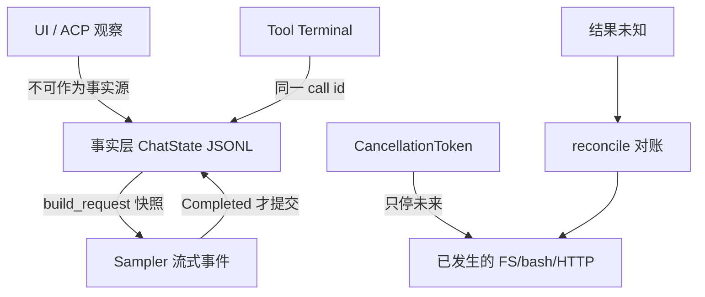

---

## 承诺点 commit point

承诺点 = 一旦越过，调用方必须当作“这件事已经发生”，崩溃恢复也必须看见它（或看见明确的合成修复）。

### 点 1：用户 Prompt 已入日志

`SessionCommand::Prompt.persist_ack`：在用户消息 append 到 ChatState **并且** persistence flush barrier 完成之后、LLM 推理开始之前 fire。调用方用它保证 `chat_history.jsonl` 已包含该 prompt，然后才允许 `session/load` / trace 快照。

对应命令：`ChatStateCommand::PushUserMessageAndAck`。`ChatPersistence::flush` 是 barrier。

未越过：进程在 flush 前崩溃 → 恢复后该 Prompt 不存在，客户端应允许用户重发（新 `prompt_id`）。

### 点 2：Assistant 规范完成

`SamplingEvent::Completed { response, ... }` 才允许 `PushAssistantResponse`。`ChannelToken` / `ToolCallDelta` 只供 UI 与增量组装。半截流不是 commit。

`Failed` 与 `Retrying` 都不是 commit。`Retrying` 之后仍可能 `Completed`。

### 点 3：工具结果闭合

每个 `ToolCall.id` 必须有且仅有一个最终 `ConversationItem::ToolResult`（成功、失败、取消合成、权限拒绝合成）。`execute_tool_calls_batch` 在批次提前结束后，仍为剩余 call **写入合成结果**，避免 dangling。

`repair_dangling_tool_calls` 是恢复期的补 commit：给历史里未闭合的 id 补一行合成结果。turn 进行中禁止 `RepairHistory`（`RepairHistoryBlocked`）。

### 点 4：工作目录切换的严格 append

`append_working_directory_switch_and_ack` 按 `cwd_generation: NonZeroU64` 对账：

| 结果 | 含义 | 调用方 |
|---|---|---|
| `StrictAppendAck::Appended` | 新一代已提交 | 继续 |
| `StrictAppendAck::AlreadyPresent(item)` | 同一代已在日志 | 幂等成功 |
| `StrictAppendError::NotCommitted` | 磁盘未写上 | 可按同 generation 重试 |
| `StrictAppendError::Committed { acknowledgement, source }` | 已提交但 ack 路径出错 | 不要再 append |
| `StrictAppendError::Indeterminate` | 不知道写没写 | 必须先读盘对账 |

Actor 不可用时 handle 返回 `Indeterminate`（`BrokenPipe` / `"chat-state actor unavailable; retry by generation"`）。

### 点 5：权限决策

`PermissionHandle::request` 返回的 `Decision` 是产品 commit：Allow 之后才允许 spawn bash。Ask 在用户应答前不是 commit。`Cancelled` 与 `Reject` / `PolicyDeny` 分叉（后者要让模型看见原因）。

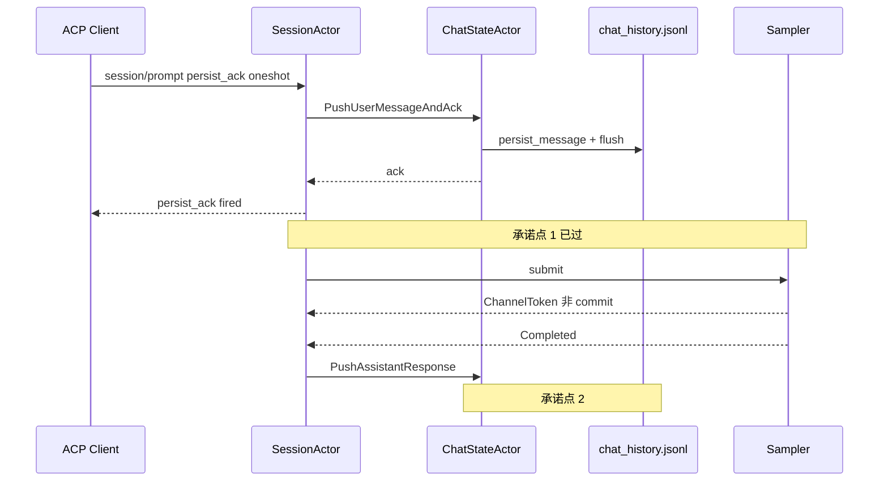

重实现检查：画出你的系统里每一类副作用的 commit 函数名。没有名字的“大概写完了”不算。

---

## 幂等：读可重试，写必须对账键

### 读

`read_file`（`is_read_only: true`，`ToolScope::Read`）在超时、取消后重试是安全的，只要路径不变。grep / list_dir 同类。权限 Ask 被重复弹出是体验问题，不是正确性问题；应用规则缓存消重，而不是“读也要 generation”。

HTTP GET 类（web_fetch）仍要注意副作用 URL；默认仍按读路径重试，但要对 SSRF 与域名白名单失败 **Fatal**，不要重试打穿内网。

### 写

bash、search_replace、工作目录切换、MCP 写工具：**禁止**“失败了用同一参数再 execute 一次”作为通用策略。

对账键最小集：

| 操作 | 对账键 | 已存在时 |
|---|---|---|
| cwd switch | `cwd_generation` | `AlreadyPresent` |
| 工具调用 | `ToolCall.id` | 已有 ToolResult 则跳过执行 |
| hunk / 文件编辑 | 文件路径 + 期望 hash / hunk id | 内容已匹配则报成功 |
| Prompt 入队 | `prompt_id` | 同一 id 不重复 `PushUserMessage` |
| 401 刷新后重放采样 | `request_id` + AuthRetry 槽 | 成功响应后 `reset_on_success` |

`ToolCall.id` 是闭合键也是幂等键：恢复时若 jsonl 已有该 id 的 ToolResult，不要再跑 bash。

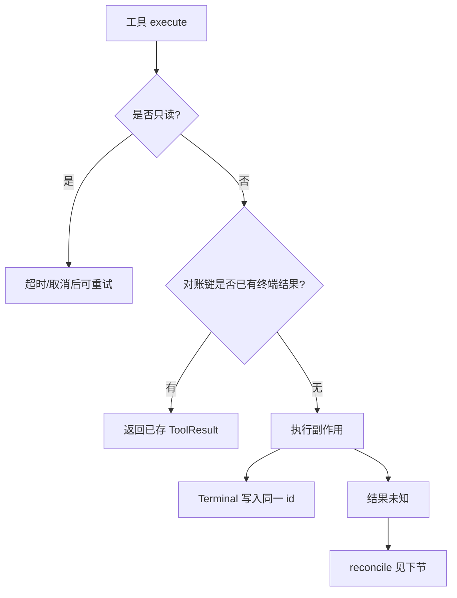

---

## 取消不回滚

### 机制

- ACP：`session/cancel` → `SessionCommand::Cancel(CancelOptions)`。
- `CancelOptions`：`cancel_subagents`、`kill_background_tasks`、`rewind_if_no_output`、`trigger`、`user_initiated`。
- `CancelTrigger::{Esc, CtrlC, SendNow, Shutdown, SessionClose, SessionDelete, Client(String)}`。`from_client` 只把 `"esc"` / `"ctrl_c"` 映射到内部枚举，其余进 `Client`，避免客户端字符串冒充内部触发器。
- Sampler：`SamplerHandle::cancel(request_id)`。
- 进程/任务：`CancellationToken::cancel()`，子任务 `cancelled()` / `select!`。

### 语义

取消 = 停止**尚未发生**的工作。已经发生的：

- jsonl 里已 flush 的 User / ToolResult 保留。
- 已完成的 bash 副作用保留（除非调用方另走 rewind / git checkpoint，那是另一条显式命令）。
- 已发出的 HTTP 请求无法从客户端撤回；最多 drop 响应。
- 同批次未执行的 tool call **仍要写合成 ToolResult**（文案含 `Tool execution cancelled due to earlier user cancellation`），否则下一次 `build_request` 会修 dangling，模型会以为工具还在跑。

`PromptCompletionKind::Cancelled` 告诉 ACP 停，不代表工作区回到 turn 开始。`rewind_if_no_output` 是可选优化，不是默认 undo。

`ShutdownKind::{Graceful, CancelRunningTurn}`：Graceful 让 running work 活过 idle unload；真正杀 turn 要显式 `CancelRunningTurn`。

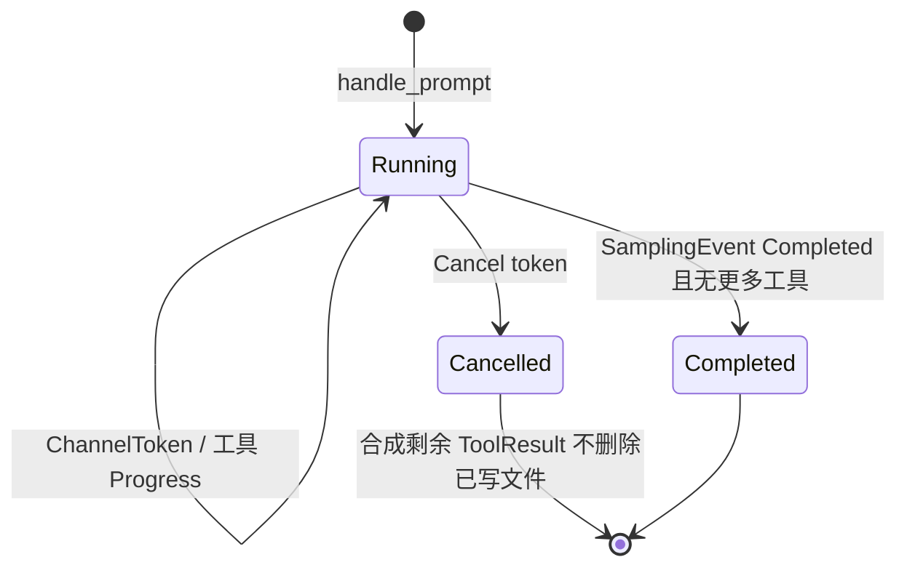

重实现禁止：在 Esc 处理函数里 `git checkout -- .`。

---

## 结果未知先 reconcile

“未知”包括：bash spawn 后父进程崩溃、HTTP 已写完请求但响应超时、JSONL append 后 `flush` 返回 `Indeterminate`、沙箱 SIGKILL 没有退出码。

### 算法

1. **停止重试写路径。**
2. **读权威状态**：文件内容、jsonl 最后一行、进程是否仍在、ToolResult 是否已有该 id。
3. **分类**：
   - 目标状态已达成 → 当作成功（幂等）。
   - 明确未发生 → 可以按原参数重试一次（仍用同一对账键）。
   - 部分发生（文件写了一半）→ 报错给模型，附当前内容，不要自动再 patch。
4. **把结论写成 ToolResult / StrictAppendAck**，不要留空洞。

对照：`StrictAppendError::Indeterminate` 的设计就是这条规则的类型化版本。`ChatStateHandle::append_working_directory_switch_and_ack` 在 actor 死掉时也返回 Indeterminate，注释要求 `retry by generation`——generation 是对账键，不是“再写一条新 generation”。

工具层：`WorkspaceOps` 把 FS 收口，才能在 Local 与 Proxy 两种部署里用同一套 reconcile。禁止 SessionActor 直接 `std::fs::write` 后再猜。

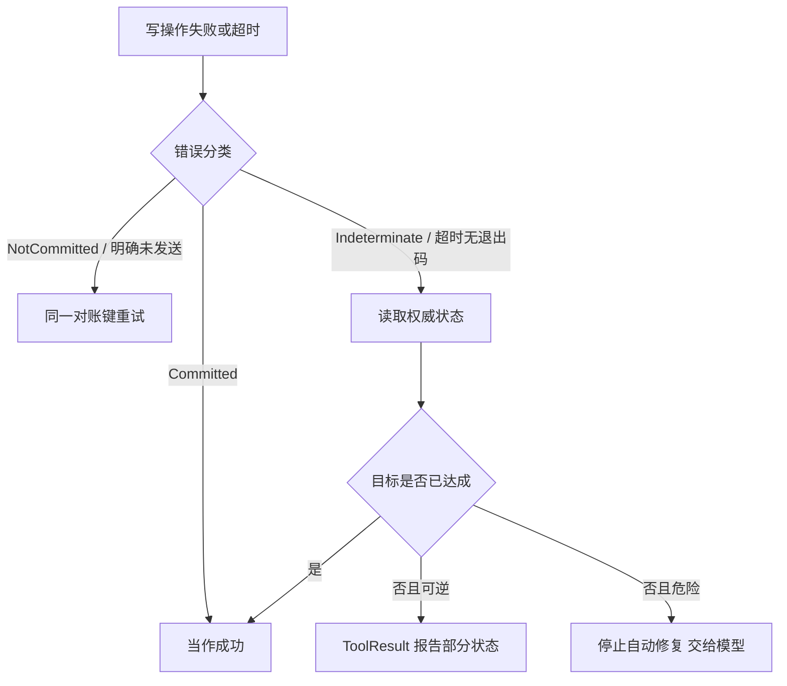

---

## unbounded mpsc 与背压

### 事实

下列 Handle 的命令通道都是 `mpsc::unbounded_channel`：

- `SessionHandle.cmd_tx`
- `ChatStateHandle.cmd_tx`（`Handle::noop` 立刻 drop rx）
- `SamplerHandle.cmd_tx`
- `HunkTrackerHandle.cmd_tx`
- `PermissionHandle::Actor.cmd_tx`

发送点普遍 `let _ = tx.send(...)`：actor 死后不 panic，命令蒸发。

`SamplingEvent`、`ChatStateEvent`、权限事件同样常见 unbounded。

### 风险

1. **SSE token 快于 UI**：事件队列无限涨。
2. **工具 Progress 洪水**：bash `MAX_PROGRESS_DELTA_BYTES = 16KiB` 是单帧上限，不是队列上限。
3. **死 actor + 无感知**：UI 仍显示 Working。
4. **测试 Handle::noop**：命令静默丢失，测试“绿”但没执行。

### 缓解（原仓库已做的 + 重实现必须做的）

| 手段 | 证据 |
|---|---|
| 单写者 Actor，命令串行 | 各 `*Actor` 循环 `recv` |
| 流式进度丢弃、只要 Terminal | `ToolDispatch::call_terminal` |
| 工具输出字节/字符 cap | `DEFAULT_TOOL_OUTPUT_BYTES` / `CHARS` |
| Sampler 事件按 request_id 过滤 | 取消后丢弃旧 id |
| `is_closed()` | `HunkTrackerHandle::is_closed` |
| persist 用 oneshot 做 barrier | 避免“已 send 即已落盘”幻觉 |

重实现最低要求：

- 对 **观察通道**（token、progress）允许丢弃或合并；对 **命令通道** 不允许静默丢（至少度量 `send` 失败）。
- 单测里禁止对真实逻辑路径使用 `Handle::noop`，除非测试目标就是 noop。
- 文档化：unbounded ≠ 无限内存预算。

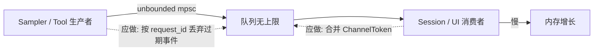

有界 `mpsc::channel(N)` 在本仓库主路径上不是现状。若你改成有界，`dispatch` 线程绝不能同步 `blocking_send`，否则 UI 卡死——这是换实现时的新契约，不是原仓库行为。

---

## 超时

分层，禁止用一个 30s 包打天下。

| 层 | 机制 | 超时后 |
|---|---|---|
| SSE 空闲 | `inference_idle_timeout_secs`，默认注释为 300s；**每个 chunk 重置**，不是整 turn 墙钟 | `SamplingError::IdleTimeout` → `classify_error` **Fatal** |
| keepalive 空转 | `stream_chat_completions`：transport 仍有空 chunk 但无实质内容，`last_content_chunk_at` | 同样 IdleTimeout |
| bash | 工具参数 timeout；超时发 `BashExecutionTimeout` | Terminal 失败，不重试写 |
| PPTX 读 | `PPTX_PROCESS_TIMEOUT = 60s` | 读失败 |
| 401 无凭据等待 | `UNCHARGED_REFRESH_WAIT = 15s` | 再走 floor 1s |
| 存储上传 | `RetryConfig` 默认 max_delay 30s、max_retries 5 | 熔断可暂停派发 |
| Sampler 通用退避 | `MAX_RETRY_BACKOFF = 30s`，jitter ±20% | 429 不走这个 cap，走完整 Retry-After，但次数被 `RATE_LIMIT_RETRY_THRESHOLD = 2` 卡住 |

IdleTimeout 明确不重试：模型卡住再发同一请求仍会卡住（`retry.rs` 注释）。

`DoomLoopDetected` 相反：近乎立即 `doom_loop_backoff`（0–250ms jitter），因为问题是采样随机性而非上游过载。

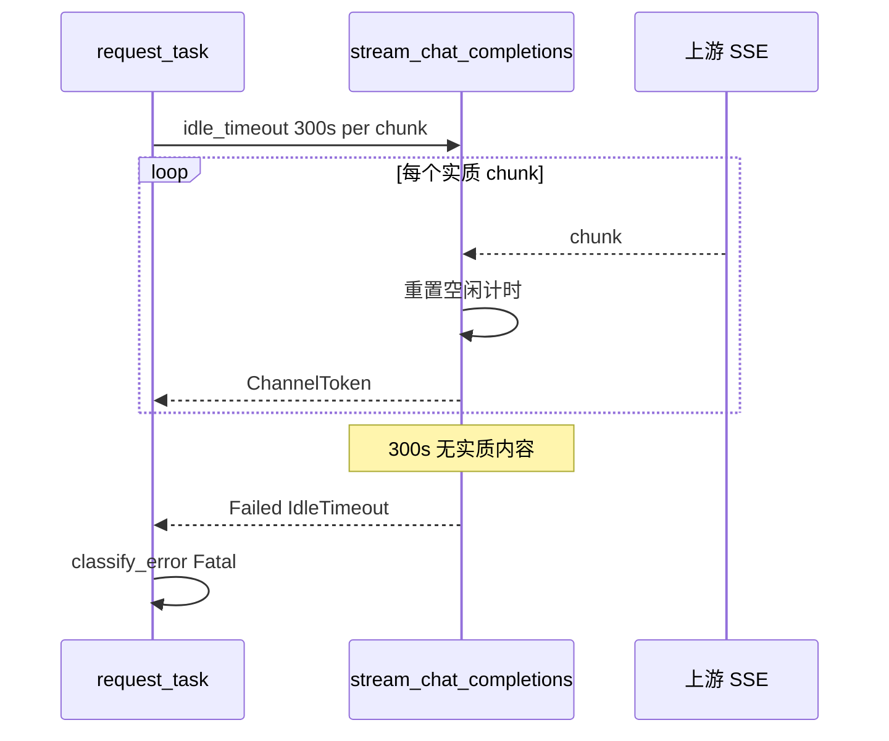

---

## xai-circuit-breaker

crate：`crates/common/xai-circuit-breaker`。

算法：滑动窗口内 `sample_count >= min_samples AND error_rate >= error_rate_threshold` 则 trip。状态 `BreakerState::{Closed, Open, HalfOpen}`。`check` 在 Open 时返回 `BreakerOpen`。

预设：

- `BreakerConfig::server()`：`min_samples=10`，`error_rate=0.5`，窗口 60s，open 10s，失败码 `[429,500,502,503,504]`。
- `BreakerConfig::client()`：更少样本、更长冷却，给客户端按 endpoint/tenant 键控。
- `from_env` 读 `CB_*`。

`RetryPolicy` 与 breaker 状态机是两件东西：

| 预设 | 用途 |
|---|---|
| `RetryPolicy::server` | 429 或任意 5xx 可重试 |
| `RetryPolicy::edge_client` | 同上，但 Cloudflare 525/526 终端（源站 TLS 坏了不会自己好） |
| `RetryPolicy::client_storage` | 400/403/404 丢弃；401 `AuthRefresh` 一次；其余可重试 |

采样：`is_retryable_api_status` 调用 `RetryPolicy::edge_client().should_retry`。这里**没有**给每个 LLM 请求 `CircuitBreaker::check`——连续 5xx 靠 `DEFAULT_MAX_RETRIES` 墙钟预算（约 5.5 分钟）停下来。

存储：`xai-file-utils` `StorageClient` 使用 `CircuitBreaker::new(BreakerConfig::client())`，观察者名字 `"storage_breaker"`，日志 `target: "circuit_breaker"`。`UploadQueue` 在 breaker open 时**暂停派发新任务**，不杀 in-flight。`STORAGE_RETRY_POLICY = RetryPolicy::client_storage()`。

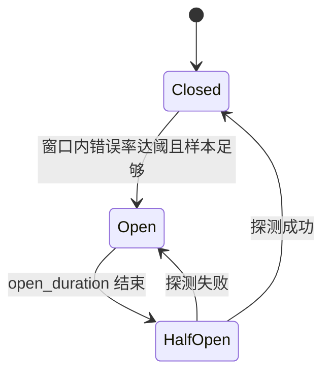

重实现：LLM 路径先抄 `RetryPolicy::edge_client` + `classify_error`；不要把 storage breaker 套到 chat completions 上（否则一次 GCS 故障会误伤对话）。给上传、遥测单独实例，经 `CircuitBreakerRegistry` 按 key 隔离。

---

## 401 retry

两层，禁止合成一层。

### Sampler 层：发现 401，不上重试预算

`classify_error`：`err.is_auth_error()` → `RetryDecision::EmitToSession`。加密内容错误同样上交。sampler 不 sleep、不 refresh。

`SamplingClient` 在每个 UNAUTHORIZED 分支调 `Auth401AttributionCallback`，只传 `bearer_suffix`，全量 token 不出 `SamplingClient`。

### Session 层：刷新后再决定是否重放

`AuthRetrySchedule`（`acp_session_impl/auth_retry.rs`）：

| 常量 | 值 | 含义 |
|---|---|---|
| `MAX_RETRIES` | 3 | 带凭据的 post-recovery 401 次数 |
| `MAX_UNCHARGED_RESUBMITS` | 50 | 请求没带凭据却 401 的 runaway 护栏 |
| `MAX_SUSPEND_RESETS` | 8 | 笔记本睡眠导致的预算重置上限 |
| 退避 | 1s / 2s / 4s | `ExponentialBackoff::from_millis(2).factor(500)`，注释警告不要 `from_millis(1000)`（会变成 1000ⁿ） |

`AuthRetryDecision`：

- `UnchargedResubmit`：线上没带凭据，不占 charged 槽；`pace_uncharged_resubmit`。
- `Backoff { attempt, delay }`：占槽，发 `XaiSessionUpdate::RetryState`，日志 `shell.turn.auth_retry_backoff`。
- `Exhausted`：turn 失败。
- `RunawayGuard { rejections }`：刷新一直“成功”但服务器持续拒无凭据请求。

成功响应或（受限的）suspend 边界会 reset。`reset_if_incident_spans_suspend` 用 wall/monotonic 漂移 > 30s 判断机器睡过。

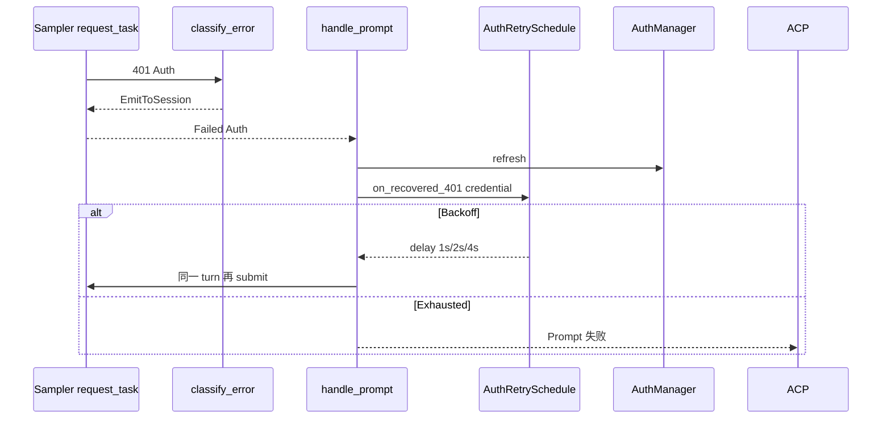

TUI 展示层会看到 `Unauthorized (401)` 字符串（`error_display.rs`）。那是渲染，不是控制流。控制流必须走类型：`SamplingError::is_auth_error()`。

---

## classify_error

纯函数：`classify_error(err, retry_count, max_retries, rate_limit_threshold) -> RetryDecision`。无 IO、无日志。Actor 的 `request_task.rs` 负责 sleep / strip image / rebuild HTTP/1.1 / emit。

输入：`retry_count` = 已经重试次数（首次失败为 0）。`max_retries` 默认 15，含义是“第 15 次 attempt 直接 Fatal”，即可重试 14 次。覆盖顺序：`GROK_MAX_RETRIES` > 模型 `max_retries` > `DEFAULT_MAX_RETRIES`。

决策表（与源码注释 + 测试对齐）：

| 条件 | 决策 |
|---|---|
| `is_auth_error` / `is_encrypted_content_error` | `EmitToSession` |
| `max_retries == 0` | `Fatal` |
| `is_payload_too_large` / `is_image_processing_error` | `RetryWithImageStrip`（在 veto 之前，因为 strip 改变了请求） |
| `is_retry_vetoed`（含 `x-should-retry: false`、上下文溢出） | `Fatal` |
| `DoomLoopDetected` | `Retry { doom_loop_backoff }` 永不经此函数变 Fatal |
| `is_rate_limited` 且下次 ≥ `min(max_retries, 2)` | `Fatal` |
| `is_rate_limited` 否则 | `RetryWithBackoff { is_rate_limited: true }`，Prefer `Retry-After` |
| `is_retryable` 且下次 ≥ max | `Fatal` |
| `is_retryable` 且下次 == 1 | `RetryWithClientRebuild`（逃离坏掉的 HTTP/2 pool） |
| `is_retryable` 否则 | `Retry`，`Retry-After` 钳到 30s 再 jitter |
| 其余（400/403/404/408/422、525/526、IdleTimeout、Serialization、MaxTokensTruncation） | `Fatal` |

`x-should-retry: true` **不会**强迫重试：头只用于抑制。Cloudflare 52x 页面通常没有该头，因此边缘策略在 `RetryPolicy::edge_client`。

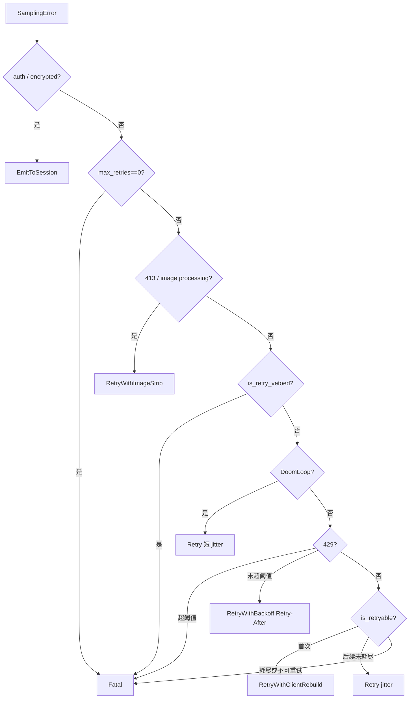

`format_sampling_error` 可加前缀 `"Request failed after N retries. "`，仅用于展示/遥测。

---

## 工具输出截断

模型上下文是稀缺资源。截断是**成功路径上的强制门**，不是可选优化。

| 常量 | 值 | 适用范围 |
|---|---|---|
| `DEFAULT_TOOL_OUTPUT_BYTES` | 40_000 | 通用工具结果进模型（约 10k tokens） |
| `DEFAULT_TOOL_OUTPUT_CHARS` | 20_000 | bash/terminal（约 5k tokens） |
| `MCP_MAX_OUTPUT_BYTES` | 经 `mcp_max_output_bytes` / env `GROK_MAX_MCP_OUTPUT_BYTES` | MCP 内联结果 |
| `MAX_LINES_READ` | 1_000 | read_file |
| `MAX_NUM_TOKENS` | 25_000 | read_file 另一上限 |
| `MAX_PROGRESS_DELTA_BYTES` | 16 KiB | bash 单次 Progress 帧 |
| `STREAM_DELTA_TARGET_BYTES` | 4 KiB | read_file 流式 delta |

截断必须：

1. 在 UTF-8 字符边界切开（bash 进度注释写明 char-aligned，append lossless）。
2. 在 **Terminal 的模型可见内容**里声明 truncated，避免模型以为文件就这么短。
3. 不截断到破坏 `ToolCall.id` 闭合。
4. Progress 可以丢中间帧，Terminal 不能丢。

`call_terminal` 丢弃 Progress；若无 Terminal → `stream_no_terminal`。这是协议失败，不是截断。

---

## 审计 redaction

`xai-grok-auth/src/bearer_fragment.rs`：

```text
BEARER_SUFFIX_LEN = 12
bearer_suffix(s) -> 最后 12 个字符（按 char 不是 byte）
```

Why 用尾不用头：JWT 共享 base64 header，xAI key 共享前缀，头 12 位无法归因是哪一张票。测试覆盖短于 12、空串、多字节 `é` / emoji，防止 `len-12` 切在码点中间 panic。

Sampler：`Auth401AttributionCallback::record_401(..., sent_bearer_suffix)`。Tools 再 export 同一常量。

`xai-file-utils` 的 `StorageClient` 回调方法名叫 `sent_bearer_prefix`——这是**命名**，重实现时仍应使用 `bearer_suffix` 语义，否则 401 归因无法和 sampler 对上。

禁止：

- 把 `Authorization` 头写入 `GROK_DEBUG_LOG`。
- 在 ACP 错误 `data` 里回传 token。
- 用 `format!("{:?}", err)` 把 reqwest 带 URL query 的密钥打出去。

允许：status、endpoint 主机、suffix、`SamplingConsumer` 枚举、是否 `None`（根本没带头）。

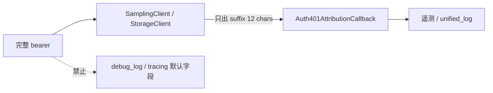

---

## 每层必须写的失败测试

没有失败测试的层，等于没有可靠性。下表是重实现 DoD，并指向原仓库已有对照。

| 层 | 必须覆盖的失败 | 对照 |
|---|---|---|
| CLI | 互斥 flag、未知子命令退出码 | `cli.rs` `try_parse_from` |
| ACP | `unknown session id`；prompt 中途 cancel | `MvpAgent::prompt`；`cancel_running_task_tests` |
| ChatState | dangling 修复；turn 中 `RepairHistoryBlocked`；半截 JSONL 跳过；`AlreadyPresent`；`Indeterminate` | `actor/tests.rs` |
| Sampler 分类 | 429 超阈 Fatal；IdleTimeout Fatal；401 EmitToSession；`x-should-retry:false` Fatal；首次传输错误 Rebuild | `retry.rs` 模块测试 |
| Sampler Actor | mock 服务器断流 / 401 | `tests/test_actor.rs` |
| 401 会话 | 刷新后 1s/2s/4s；Exhausted；RunawayGuard；suspend reset | `auth_retry.rs`；`auth_error_no_retry_tests.rs` |
| Tool 流 | 无 Terminal；`not_implemented`；args JSON 非法 | `xai-tool-runtime` `tool_blocking` / `error_conversion` |
| 工具批次 | 取消后剩余 id 仍闭合 | `execute_tool_calls_batch` 合成文案 |
| 截断 | 超 `DEFAULT_TOOL_OUTPUT_BYTES` 的结果带 truncated | `task_output/tool.rs` snapshot 测试 |
| Permission | Deny 不写文件；yolo 不关沙箱；Ask 时取消 → `Decision::Cancelled` | workspace permission 测试 |
| Sandbox | Allow 但路径在 profile 外失败 | `sandbox_requirements_pin.rs` |
| 熔断 | Open 后拒绝新上传；HalfOpen 探测 | `xai-circuit-breaker` `state_machine.rs`；`storage_client_breaker_tests.rs` |
| Redaction | suffix 12、短串整段、多字节不 panic | `bearer_fragment.rs` `bearer_suffix_semantics` |
| 背压/noop | `Handle::noop` 的 send 不 panic；actor 死后 `is_closed` | 各 handle 单测 |
| 取消 | Esc 不删除已写文件；合成 ToolResult | shell cancel 测试 |

每层至少再加一条 **故障注入**：kill actor、断开 mock SSE、`oneshot` drop、磁盘满（`NotCommitted`）。

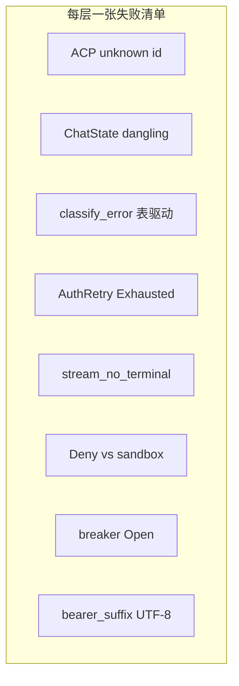

建议命令（对照仓库，不是本次已跑）：

```bash
cargo test -p xai-grok-sampler --lib classify_
cargo test -p xai-circuit-breaker --lib
cargo test -p xai-grok-auth --lib bearer
cargo test -p xai-chat-state --lib
cargo test -p xai-tool-runtime
```

---

## 文件表

| 路径 | 可靠性职责 |
|---|---|
| `crates/codegen/xai-grok-shell/src/session/commands.rs` | `persist_ack`、`PromptCompletionKind`、`CancelOptions` |
| `crates/codegen/xai-grok-shell/src/session/acp_session_impl/turn.rs` | `handle_prompt`、401 循环 |
| `crates/codegen/xai-grok-shell/src/session/acp_session_impl/auth_retry.rs` | `AuthRetrySchedule` |
| `crates/codegen/xai-grok-shell/src/session/acp_session_impl/tool_calls.rs` | 批次取消仍闭合 id |
| `crates/codegen/xai-chat-state/src/persistence.rs` | `ChatPersistence` flush barrier |
| `crates/codegen/xai-chat-state/src/commands.rs` | `StrictAppendAck` / `StrictAppendError` |
| `crates/codegen/xai-chat-state/src/handle.rs` | actor 死亡 → Indeterminate |
| `crates/codegen/xai-grok-sampler/src/retry.rs` | `classify_error`、退避常量 |
| `crates/codegen/xai-grok-sampler/src/actor/request_task.rs` | 执行 RetryDecision |
| `crates/codegen/xai-grok-sampler/src/stream/chat_completions.rs` | 空闲超时 |
| `crates/codegen/xai-grok-sampling-types/src/error.rs` | `is_retryable`、`RetryPolicy::edge_client` |
| `crates/common/xai-circuit-breaker/src/lib.rs` | 熔断状态机 |
| `crates/codegen/xai-file-utils/src/storage_client.rs` | `storage_breaker` |
| `crates/codegen/xai-file-utils/src/queue.rs` | 上传队列 + `client_storage` |
| `crates/codegen/xai-grok-auth/src/bearer_fragment.rs` | `BEARER_SUFFIX_LEN` |
| `crates/codegen/xai-grok-tools/src/lib.rs` | 输出 cap |
| `crates/common/xai-tool-runtime/src/dispatch.rs` | `stream_no_terminal` |

## 自检

- [x] 承诺点用真实 oneshot / 事件变体命名，而不是“写完磁盘”
- [x] 幂等区分读/写，并对账键来自 `cwd_generation` / `ToolCall.id`
- [x] 取消不回滚，并要求合成剩余 ToolResult
- [x] 结果未知走 `Indeterminate` → reconcile，而不是盲目重试
- [x] unbounded mpsc 风险与现有缓解都有代码证据
- [x] IdleTimeout 与 Retry-After / 30s cap 分层
- [x] `xai-circuit-breaker` 的真实调用点在 storage，采样用 `RetryPolicy`
- [x] 401 分 sampler EmitToSession 与 session AuthRetrySchedule
- [x] `classify_error` 决策表与源码顺序一致（image strip 在 veto 前）
- [x] 截断常量来自 `xai-grok-tools/src/lib.rs`
- [x] redaction 指向 `bearer_suffix`，并注明 storage 回调的 prefix 命名
- [x] 每层失败测试可对照现有 `cargo test -p`
- [x] mermaid 节点为真实类型/函数
- [x] 未写入本机绝对路径；未声称测试已跑过

与 [15-从零重实现路线图](15-从零重实现路线图.md) 的关系：阶段 2 落地承诺点 1/4，阶段 3 落地 classify_error 与 IdleTimeout，阶段 4 落地 id 闭合与截断，阶段 5 落地权限 commit 与沙箱失败，阶段 6 落地取消手势。与 [16-术语表与源码查找手册](16-术语表与源码查找手册.md) 的关系：Attempt 是 `classify_error` 的 `retry_count`，不是新的 Prompt。
