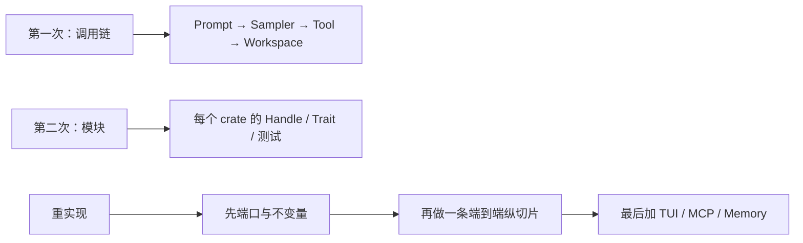
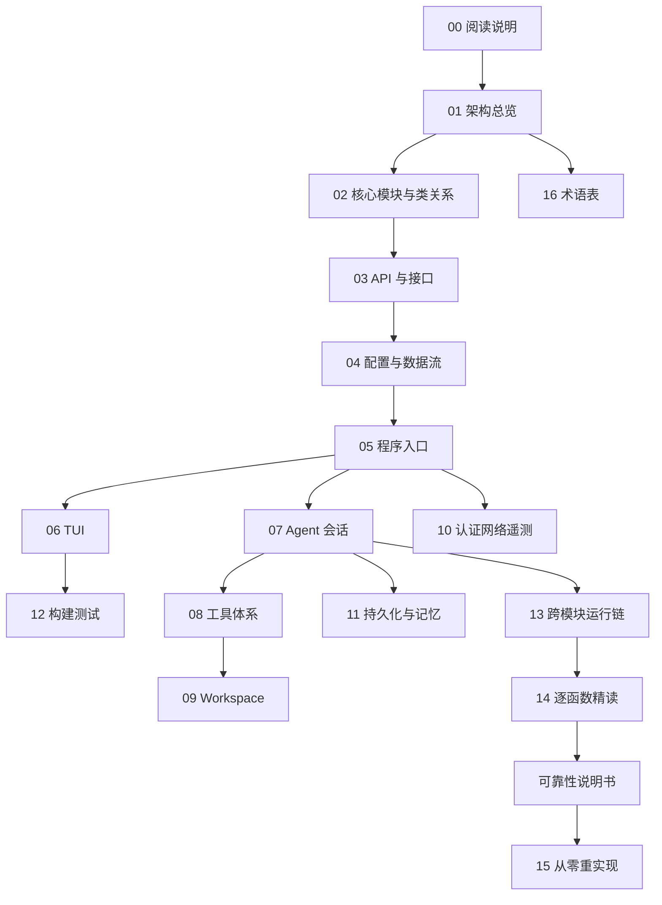

# 00 · 阅读说明与学习路线

> 目标读者：刚开始学习 Rust，或第一次接触“终端 + 异步 Actor + 工具调用”这类大型工程的开发者。
>
> 最终目标：读者不仅能说出每个 crate 做什么，还能按本目录给出的边界、契约和阶段顺序，从空仓库重建一个功能等价的 Grok Build。

## 1. Why：为什么需要一套“重构级”文档

Grok Build 不是 `main.rs` 加两三个模块的小程序。根 `Cargo.toml` 声明了 80 余个 workspace member；生产代码主要在 `crates/codegen/` 与 `crates/common/`。若按目录树从第一个文件读到最后一个文件，会出现三种典型失败：

1. **过早陷入渲染细节**。`xai-grok-pager` 有数百个 `.rs` 文件，scrollback、主题、快捷键都很有趣，但它们不是系统的因果核心。因果核心是：用户意图如何变成 `SessionCommand::Prompt`，模型如何变成 `SamplingEvent`，工具如何变成对 Workspace 的副作用。
2. **把演进结果当成设计必需**。今天的 crate 切分（例如 `xai-grok-agent` 从 shell 抽出来、`xai-chat-state` 抽成独立 Actor）是为了编译隔离和测试，不是第一天就必须复制的目录结构。
3. **只记住成功路径**。真实设计藏在取消、401 刷新、写文件结果未知、dangling tool call 修复、崩溃恢复里。只读 `Ok` 分支，重实现时一定会在这些地方抄错。

所以这套文档采用两条互补路线：

- **调用链路线**：跟随一次 Prompt，从 CLI/TUI 走到 Workspace，再沿事件回到屏幕。
- **模块路线**：按 crate 理解稳定类型、协议、适配器、状态所有者和测试边界。

第一次阅读先走调用链，第二次按模块补齐。重实现时反过来：先实现底层类型和端口，再组合到入口。



## 2. 这套笔记怎样使用

1. 从 [README.md](README.md) 选一条路径（理解 / 维护 / 重实现）。
2. 每读完一篇，用文末“自检问题”对照源码，不要只在文档里打勾。
3. 遇到陌生术语先查 [16-术语表与源码查找手册.md](16-术语表与源码查找手册.md)。
4. 需要单步函数名时用 [14-关键调用链逐函数精读.md](14-关键调用链逐函数精读.md)，不要在几千行文件里线性扫描。
5. 文档与当前源码冲突时，以源码和可复现测试为准。仓库会持续演进；根目录 `SOURCE_REV` 记录这次同步对应的 monorepo commit。

## 3. 覆盖口径

### 3.1 纳入范围

| 路径 | 内容 | 阅读目的 |
|---|---|---|
| `crates/codegen/` | 几乎全部产品 crate：pager、shell、tools、workspace、sampler、config… | 产品行为与架构决策 |
| `crates/common/` | 稳定端口与共享运行时：tool-protocol、tool-runtime、computer-hub、compaction、tracing | 重实现时最先复制的边界 |
| `crates/build/xai-proto-build` | protobuf 代码生成辅助 | 理解 `xai-grok-tools-api` 的生成物从哪来 |
| `prod/mc/cli-chat-proxy-types` | 被同步进来的协议类型 | 与远端 chat proxy 的 DTO 对齐 |
| `third_party/` | vendored Mermaid 栈等 | 许可证边界与算法内嵌维护 |
| 各 crate `tests/`、`benches/`、`fuzz/` | 行为契约 | 用外部行为反证对生产代码的理解 |
| `rust-toolchain.toml`、根 `Cargo.toml`、`clippy.toml`、`rustfmt.toml` | 构建约束 | 重实现时的工具链与 lint |

### 3.2 “阅读全部源码”在本文档中的含义

本文档集不会逐行翻译两千多个 Rust 文件。逐行翻译既不可维护，也会遮蔽设计。这里采用可复现的工程阅读口径：

- 每个 workspace member 都进入 crate 导航（见 `01`、`02`、`12`）。
- 每个生产源码目录都归入一个专题。
- 关键入口、公共类型、trait、Actor、命令、事件、状态和适配器给出**符号级**说明。
- 重复实现、平台分支、生成代码和大规模测试按模式归纳，并保留查找入口。
- 正常路径、失败路径、取消路径和恢复路径一起说明。
- 不确定或仅由测试名称推断的内容会明确标记，不把推断写成源码事实。

### 3.3 不要混淆三种代码

| 类别 | 典型位置 | 阅读目的 |
|---|---|---|
| 第一方生产代码 | `crates/codegen/`、`crates/common/` | 理解产品行为和架构决策 |
| 测试与工具代码 | `tests/`、`benches/`、`fuzz/`、`ptyctl`、`xai-grok-pager-pty-harness` | 用外部行为反证理解 |
| vendored 源码 | `third_party/`、`xai-grok-tools` 中的 codex/opencode 移植 | 理解内嵌算法和许可证，不把它当成“Grok 原创架构” |

## 4. 推荐阅读顺序



如果只想尽快看懂主流程，先读 `01`、`02`、`05`、`07`、`08`、`09`、`13`。如果要重新实现，不要跳过 TUI、配置、安全和可靠性专题。

第一次跟源码时，不建议从 `05` 直接跳进 `xai-grok-pager-bin/src/main.rs` 的三千行然后卡住。先读 `01`/`02` 识别关系类型，再用 `13`/`14` 走一遍完整链，最后进入专题。

## 5. 每读一个 Rust 文件先回答什么

把下面 9 问当成固定记录法。不写答案就等于没读。

### 5.1 定位

- 它属于哪一层：组合根 / 展示 / 应用 / 领域 / 端口 / 适配器？
- 完整路径是什么？例如 `crates/codegen/xai-grok-shell/src/session/handle.rs`。
- 对外公开的符号是哪些（`pub use`、`pub struct`、`pub trait`）？

### 5.2 契约

- 输入类型、输出类型、错误类型分别是什么？
- 有没有副作用（写盘、发 HTTP、spawn 进程、改终端）？
- 幂等吗？失败后能否安全重试？

### 5.3 主路径

用 mermaid 或伪代码画出正常控制流。至少包含：谁调用它、它调用谁、在哪个 `await` 点让出。

### 5.4 状态

- 哪些数据在这里拥有（所有权）？
- 哪些只是借用或通过 Handle 发命令？
- 可变状态是用 Actor 串行化，还是 `Mutex`/`ArcSwap`/`Atomic*`？

### 5.5 异步

- 每个 `tokio::spawn` 的生命周期谁负责 join/cancel？
- channel 是 `mpsc`、`oneshot` 还是 broadcast？关闭意味着什么？
- 有没有 `CancellationToken`？取消后哪些工作必须停止、哪些绝不能回滚？

### 5.6 失败

至少找出一条：超时、取消、部分成功、结果未知、权限拒绝、认证失败。看它如何变成用户可见错误或静默修复。

### 5.7 Rust 机制

这段代码体现了什么语言机制？例如：关联类型 `Tool::Args`、trait object `ToolDyn`、newtype `ToolCallId`、生成的 workspace 根清单。

### 5.8 验证

- 最近的测试文件叫什么？
- 用哪条命令能跑它？优先 `cargo test -p <crate> <filter>`，不要全 workspace。

### 5.9 下一跳

列出 1–3 个应该继续打开的符号。例如读完 `SessionHandle` 下一步是 `SessionCommand` 和 `spawn_session_actor`。

## 6. Rust 新手预备知识（只讲本仓库会反复碰到的）

### 6.1 Cargo workspace

根 `Cargo.toml` 第一行注释写着：

```text
# Auto-generated workspace root. Prefer editing per-crate Cargo.toml files.
```

含义：成员列表和 `[workspace.dependencies]` 版本是生成的。重实现时可以手写一个更小的 workspace，但不要习惯去改这个根文件来“加依赖”。官方开发方式是改各 crate 自己的 `Cargo.toml`。

工具链钉在 `rust-toolchain.toml`：

```toml
channel = "1.94.0"
```

`edition.workspace = true` 且 `[workspace.package] edition = "2024"`。看到 `let-else`、edition 2024 的安全 `unsafe` 标注时，不要用更老的编译器硬编。

### 6.2 组合根 vs 库 crate

`xai-grok-pager-bin` 的 `Cargo.toml` 写明：它存在是为了链接 `xai-grok-pager` 和 `xai-grok-pager-minimal`，避免库之间循环依赖。`main.rs` 只做：

- 解析 CLI（类型定义在 pager 的 `app/cli.rs`）
- 安装分配器、崩溃处理、遥测
- 启动 Tokio
- 按 `Command` 分发到 shell / pager 的运行函数

领域规则不写在 `main.rs`。重实现时保持这个纪律：`main` 可以丑，但不能拥有会话状态。

### 6.3 Actor 在本仓库的标准形状

本仓库反复出现同一模式（`xai-chat-state` 的 crate 文档画了这张图）：

```text
调用者持有 Handle（Clone + Send）
        │  mpsc::UnboundedSender<Command>
        ▼
   独立 tokio task 里的 Actor
        │  状态只在这一个 task 里可变，因此不需要把整份状态锁起来
        ▼
   可选：event_tx 向外广播 Event
        │
调用者若需要“这次命令的结果”，在 Command 里塞一个 oneshot::Sender
```

对照源码：

| 角色 | 会话 | 对话事实 | 采样 |
|---|---|---|---|
| Handle | `SessionHandle`（`session/handle.rs`） | `ChatStateHandle` | `SamplerHandle` |
| Command | `SessionCommand` | `ChatStateCommand` | sampler `commands.rs` |
| Event / 结果 | ACP notification + `PromptTurnResult`（oneshot） | `ChatStateEvent` | `SamplingEvent` |

`mpsc` 用来持续喂命令；`oneshot` 用来等待**这一次**的应答。不要把两种通道用反：把“会话还活着”做成 oneshot，或把“这一轮 Prompt 结束”做成永远没人 close 的 mpsc。

### 6.4 Trait 对象与关联类型

`crates/common/xai-tool-runtime/src/tool.rs` 里的 `Tool` 是泛型 trait：

- `type Args`：必须 `Deserialize + JsonSchema`
- `type Output`：必须 `Serialize + ToolOutput`

运行时调度器不能对每一个具体工具都单态化，因此还有 `ToolDyn`（类型擦除后的对象）。阅读顺序必须是：先懂 `Tool` 的关联类型契约，再懂 `ToolDyn` 如何把 JSON `Value` 转成 `Args`。

### 6.5 Stream 不变量

同一文件写明：`Tool::execute` 是运行时唯一入口；默认实现把 `run` 包成“只有一个 Terminal 项”的流。流的不变量是：

- 任意数量的 `Progress`
- **恰好一个** `Terminal`

重实现工具时如果返回两个 Terminal，或 Progress 出现在 Terminal 之后，上层批次执行器和 UI 都会乱。

### 6.6 取消

本仓库的取消几乎都通过 `tokio_util::sync::CancellationToken` 和 ACP 的 `session/cancel` 协作。语义固定为：

> 取消只停止**尚未发生**的工作；已经写入的文件、已经启动的子进程、已经发出的 HTTP 请求，不会因为取消而自动撤销。

这是 [可靠性与通用技术实现说明书.md](可靠性与通用技术实现说明书.md) 的核心条款之一。读任何 `select!` 都要问：另一个分支赢了之后，已经启动的副作用怎么办？

## 7. 证据优先级

```text
具体生产调用点
> 类型 / trait / 协议定义
> 对应测试表达的行为
> Cargo 依赖和 feature
> README / 设计文档
> 仅由文件名得出的推断
```

例子：`xai-grok-agent` 的 crate 文档说它从 shell 抽出了 `Agent` 类型。这是设计意图，可信；但“现在 shell 是否仍有一份旧的重复实现”必须以实际调用点为准，不要只信注释。

## 8. 与仓库里其他文档的关系

| 目录 | 定位 | 本目录如何用 |
|---|---|---|
| `crates/codegen/xai-grok-pager/docs/user-guide/` | 给使用者的产品手册 | 用来对照“用户可见行为”，不是架构事实源 |
| `docs/design/` | 产品/架构设计叙述 | 可作地图，细节以源码为准 |
| `docs/source-reading/` | 较早的调用链笔记 | 与 `14` 互补，若冲突信源码 |
| `docs/adrian/sourceReader/` | 另一套精读 | 本目录 `sourceReader1` 按“可重构”重写，结构不同，不要混着引用编号 |
| `docs/sourcecode1/` | 面向 Rust 新手的精读 | 可作补充，本目录更强调重实现契约 |

本目录编号从 `00` 到 `16`，加上一篇横切的可靠性说明书。引用时写文件名，不要只写数字。

## 9. 建议的本地工作方式

在仓库根目录：

```sh
# 只检查组合根能否编译（全 workspace 很慢）
cargo check -p xai-grok-pager-bin

# 跟一个专题时只测一个 crate
cargo test -p xai-chat-state
cargo test -p xai-grok-sampler --lib

# 定位符号
rg -n "enum SessionCommand" crates/codegen/xai-grok-shell
rg -n "pub trait Tool" crates/common/xai-tool-runtime
rg -n "enum SamplingEvent" crates/codegen/xai-grok-sampler
```

构建还需要 [DotSlash](https://dotslash-cli.com) 以便 `bin/protoc` 能跑。这不是文档细节，而是你想验证重实现时的真实前置条件。见根 `README.md`。

## 10. 重实现前的最低检查

在开始写自己的代码之前，应能做到：

- 能画出一次 Prompt 的完整时序（`13`）。
- 能指出 UI、Session、ChatState、Workspace 的事实源（`02`、`04`）。
- 能解释 Prompt、Turn、Attempt 的区别（`16`）。
- 能解释 `mpsc` 与 `oneshot` 在会话中的不同角色（`02`、`07`）。
- 能解释为什么 `SamplingEvent` 的增量 token 不能当成最终助手消息（`07`、`14`）。
- 能解释 `ToolSpec`（给模型看的清单）与 runtime dispatcher 必须同版本（`08`）。
- 能解释文件写入结果未知时为什么不能直接重试（`09`、可靠性说明书）。
- 能解释 Permission 与 Sandbox 的区别（`09`）。
- 能列出退出时要恢复的终端和进程资源（`05`、`06`）。
- 能按 `15` 切出第一个端到端纵切片（假模型 + 读文件工具 + 最小 CLI）。

## 11. 本篇涉及的真实文件

| 路径 | 在本篇中的角色 |
|---|---|
| `Cargo.toml` | workspace 成员与依赖版本的生成根 |
| `rust-toolchain.toml` | 编译器版本契约 |
| `SOURCE_REV` | 与上游 monorepo 的对齐标记 |
| `README.md`（仓库根） | 官方构建与安装入口 |
| `crates/codegen/xai-grok-pager-bin/src/main.rs` | 唯一进程入口 |
| `crates/codegen/xai-grok-pager-bin/Cargo.toml` | 说明组合根为什么独立成 package |
| `crates/codegen/xai-chat-state/src/lib.rs` | Actor 模式的权威注释图 |
| `crates/common/xai-tool-runtime/src/tool.rs` | Tool trait 与 Stream 不变量 |
| `crates/codegen/xai-grok-config/src/lib.rs` | 配置合并顺序的权威注释 |

## 12. 自检问题

1. 为什么根 `Cargo.toml` 不应该手改来加依赖？
2. `xai-grok-pager-bin` 如果把 Session 状态放进 `main.rs` 会破坏什么？
3. 读一个文件时，为什么“失败路径”和“主路径”必须一起记？
4. `Tool::run` 和 `Tool::execute` 谁才是 runtime 真正调用的入口？
5. 取消一个正在 `search_replace` 的 turn，磁盘上的半成品文件会自动恢复吗？

下一篇：[01-架构总览.md](01-架构总览.md)
