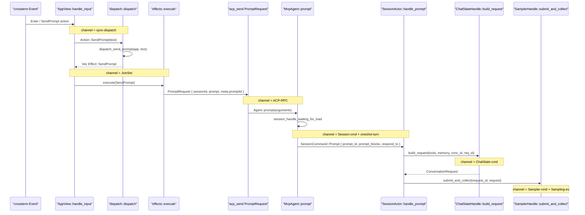
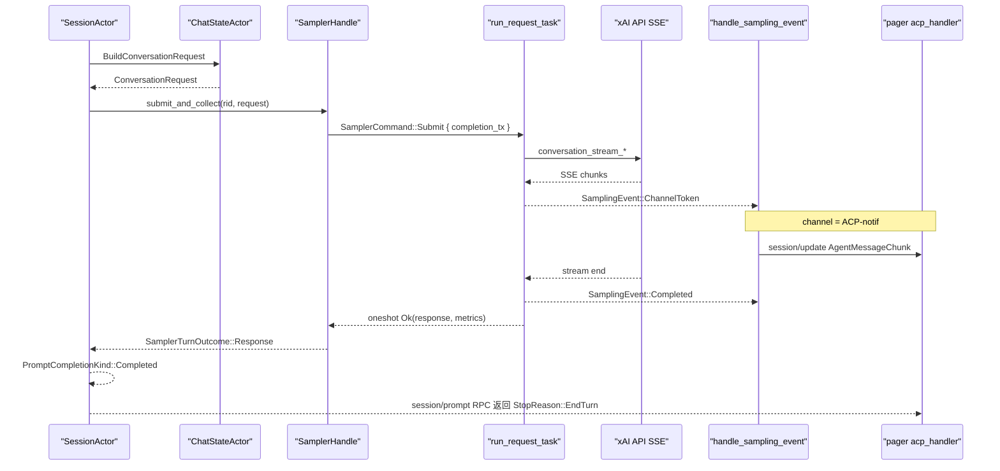
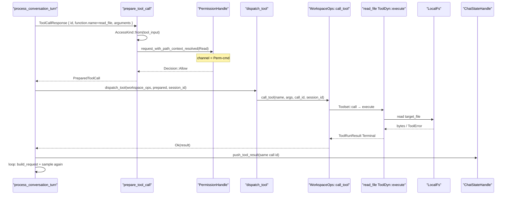
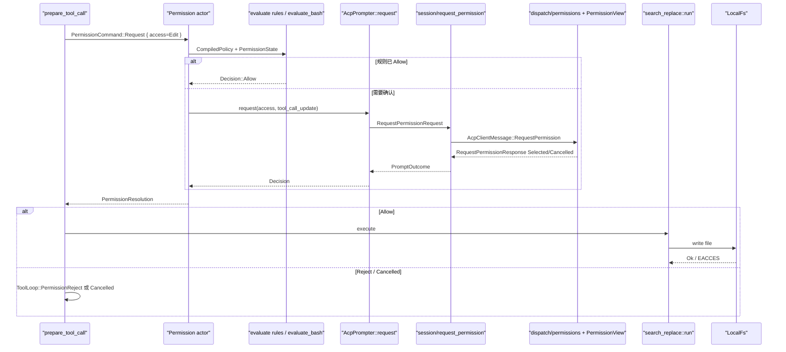
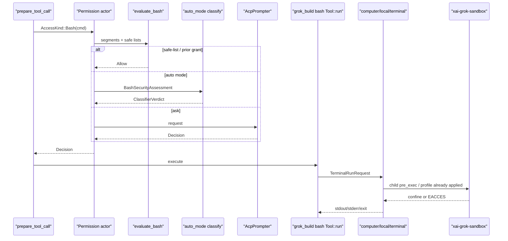
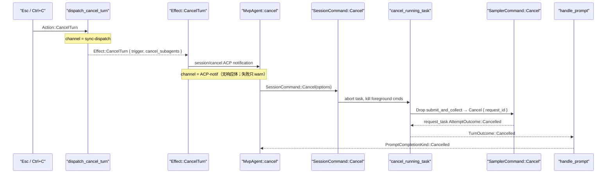
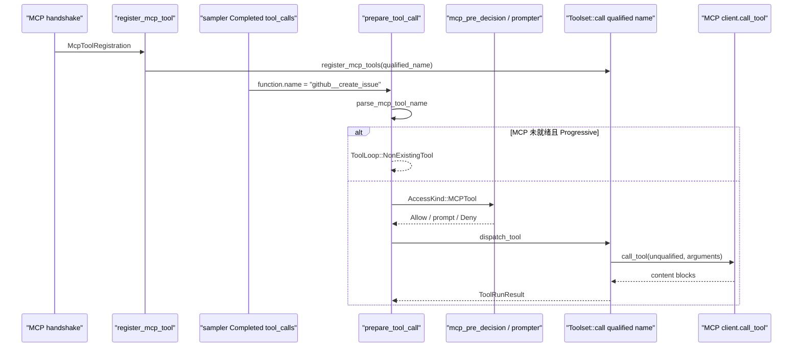
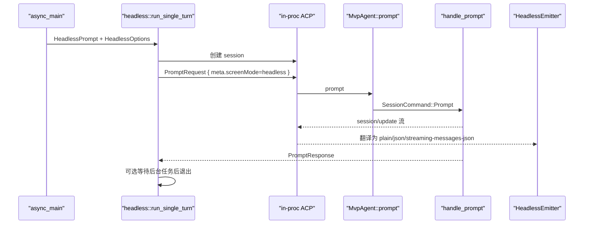

# 13 · 跨模块完整运行链

> 读完本篇应能：对着八张时序图，指出一次 Prompt 在每一层穿越了哪个函数、走哪种 channel、错误从哪一层冒泡。逐函数签名见 [14-关键调用链逐函数精读.md](14-关键调用链逐函数精读.md)。

## 快速摘要

### 架构总览（模块与依赖）

一次用户输入从终端进入后，只允许沿这条依赖方向走：

`xai-grok-pager`（Action / Effect）→ ACP JSON-RPC（`xai-acp-lib`）→ `MvpAgent` → `SessionActor`（`SessionCommand`）→ `ChatStateHandle` → `SamplerHandle` → HTTP SSE → 工具批次 → `WorkspaceOps` / Permission / Sandbox。

展示层不持有对话事实；会话 Actor 不直接画屏；工具不直接 `std::fs`。跨层通信几乎全是 **channel + oneshot**，不是共享 `Mutex<AppState>`。

### 核心调用序列（逐步逻辑）

1. 键盘 Enter → `Action::SendPrompt` → `dispatch::dispatch` → `dispatch_send_prompt`（`prompt.rs`，不是 `interject.rs`）。
2. 同步返回 `Effect::SendPrompt`；`effects::execute` spawn 任务，`acp_send(PromptRequest)`。
3. `MvpAgent::prompt` 填 `SessionCommand::Prompt` 到 `cmd_tx`（unbounded mpsc），用 oneshot 等 `PromptTurnResult`。
4. `SessionActor::handle_prompt` → `process_conversation_turn` 循环：`build_request` → `run_turn_via_sampler` → 若有 tool calls 则 `execute_tool_calls_batch`。
5. 采样事件走独立 unbounded `SamplingEvent` channel，由 `handle_sampling_event` 译成 ACP `session/update`。
6. 工具走 `dispatch_tool` → `WorkspaceOps::call_tool` → `Toolset::call` → `ToolDyn::execute`。
7. 权限走 `PermissionHandle::request_with_path_context_resolved`（unbounded + oneshot）；需要人确认时再经 ACP `session/request_permission` 回到 TUI。
8. 完成屏障是 `SamplingEvent::Completed` / `PromptCompletionKind`，不是中间 token。

### 易错点与边界条件

- `dispatch_send_prompt` 在 `app/dispatch/prompt.rs`；`interject.rs` 只有插话 / `SendPromptNow`。
- 取消不撤销已发生的文件写入或 bash 副作用。
- 权限 Allow 之后 OS 沙箱仍可能 `EACCES`；两层不能互相替代。
- `submit_and_collect` 的 Drop 会发 `SamplerCommand::Cancel`；token 增量不是规范消息。
- 同批次写同一路径会串行（`lock_path_for_args`）；读路径并发。
- `grok -p` 不进 TUI event loop，但 Agent 循环与 TUI 共用。

---

## 1. Why：为什么必须画“跨模块链”而不是模块清单

模块图回答“谁依赖谁”。运行链回答“这一次回车，控制流和数据流实际穿过哪些边界”。

本仓库有四类边界，混在一起就会把 UI 测试绑到真模型、把权限绑到像素布局：

| 边界 | 载体 | 典型符号 |
|---|---|---|
| 同步 UI 决策 | 直接调用 | `dispatch(Action) -> Vec<Effect>` |
| 异步副作用 | `JoinSet<TaskResult>` | `effects::execute` |
| 进程内协议 | ACP JSON-RPC（in-proc mpsc 或 stdio） | `acp_send` / `MvpAgent::prompt` |
| Actor 命令 | unbounded mpsc + oneshot | `SessionCommand` / `ChatStateCommand` / `SamplerCommand` / `PermissionCommand` |

重实现时必须先复刻这四类边界，再填业务。下面八个场景都建立在同一条骨干上；差异只在工具、权限、压缩和入口。

---

## 2. What：通道词汇表（全场景共用）

读时序图时，箭头上的“channel”只使用下表的名字：

| 名称 | Rust 类型 | 谁写 / 谁读 | 背压 |
|---|---|---|---|
| sync-dispatch | 函数返回 `Vec<Effect>` | event loop → dispatch | 无；必须同步结束 |
| JoinSet | `tokio::task::JoinSet<TaskResult>` | effects spawn → event loop | 任务完成才回 `Action::TaskComplete` |
| ACP-RPC | `AcpAgentTx` + oneshot 式 RPC | pager ↔ `MvpAgent` | 请求/响应一对一 |
| ACP-notif | `session/update` 通知 | SessionActor → pager | unbounded；TUI 必须能丢帧但不能丢权限请求 |
| Session-cmd | `mpsc::UnboundedSender<SessionCommand>` | `MvpAgent` → `SessionActor` | unbounded |
| oneshot-turn | `oneshot::Sender<PromptTurnResult>` | SessionActor → `MvpAgent::prompt` | 单次 |
| ChatState-cmd | `ChatStateHandle::query` | Session → ChatStateActor | unbounded + oneshot |
| Sampler-cmd | `SamplerCommand::Submit/Cancel` | Session → SamplerActor | unbounded |
| Sampling-ev | `UnboundedSender<SamplingEvent>` | request_task → Session drainer | unbounded；UI 流式用这条，完成用 oneshot |
| Perm-cmd | `PermissionCommand::Request` | Session → Permission actor | unbounded + oneshot |
| Tool-stream | `ToolStream`（Progress* + 恰好一个 Terminal） | `ToolDyn::execute` → Toolset | 流结束才闭合 call id |

错误冒泡默认规则：

- UI / ACP 层：包装成用户可见字符串（`format_acp_error`），不 panic。
- Session 层：`acp::Error` 经 oneshot 回到 `MvpAgent::prompt`。
- 工具层：`ToolError` 写成同 call id 的 `ConversationItem::tool_result`，回合通常继续，让模型看到失败。
- 权限拒绝：`ToolLoop::PermissionReject`，批次后续工具被跳过。
- 取消：`PromptCompletionKind::Cancelled`，`StopReason::Cancelled`。

---

## 3. What：共享骨干（所有场景的前半段相同）



骨干之后分叉：无工具则 `Completed` 结束；有工具则进入 `execute_tool_calls_batch`。

符号定位（避免按文件名猜）：

| 步骤 | 文件 | 符号 |
|---|---|---|
| 路由 | `crates/codegen/xai-grok-pager/src/app/dispatch/router.rs` | `dispatch` 的 `Action::SendPrompt` 臂 → `dispatch_send_prompt` |
| 组 Effect | `.../dispatch/prompt.rs` | `dispatch_send_prompt` / `dispatch_send_prompt_inner` |
| 插话（不是普通发送） | `.../dispatch/interject.rs` | `dispatch_interject` / `dispatch_send_prompt_now` |
| 执行 Effect | `.../app/effects/mod.rs` | `execute` 的 `Effect::SendPrompt` 臂 |
| ACP Agent | `crates/codegen/xai-grok-shell/src/agent/mvp_agent/acp_agent.rs` | `MvpAgent::prompt` |
| 会话循环 | `.../session/acp_session_impl/run_loop.rs` | `SessionCommand::Prompt` |
| 回合 | `.../session/acp_session_impl/turn.rs` | `handle_prompt` / `process_conversation_turn` |

测试证据：`xai-grok-pager/src/app/dispatch/tests/prompt.rs` 断言 `Action::SendPrompt("hello")` 产出 `Effect::SendPrompt { text: "hello" }`。

---

## 4. 场景 1：普通问答（无工具）

**业务目标**：用户问一句，模型直接回答，不碰工作区。

**How**：骨干走到 `run_turn_via_sampler`。`request_task` 按 `ApiBackend` 选 `stream_chat_completions` / `stream_responses_tracked` / `stream_messages`。流式 token 经 `SamplingEvent::ChannelToken` 被 `handle_sampling_event` 译成 `SessionUpdate::AgentMessageChunk`。规范完成是 `SamplingEvent::Completed`，`submit_and_collect` 的 oneshot 才返回。`process_conversation_turn` 看到 response 无 tool calls，产出 `TurnOutcome::Completed`，`handle_prompt` 映射为 `PromptCompletionKind::Completed`。



| 调用方 | 关系 | 被调 | 触发与输入 | 返回与后续 | 错误 / 状态 / 副作用 |
|---|---|---|---|---|---|
| `effects::execute` | ACP-RPC | `MvpAgent::prompt` | `PromptRequest` + `meta.promptId` | `PromptResponse` | 失败 → `TaskResult::PromptResponse { result: Err }` |
| `MvpAgent::prompt` | Session-cmd | `SessionCommand::Prompt` | `prompt_blocks`, `respond_to` oneshot | `PromptTurnOk` | `cmd_tx` 关闭 → `acp::Error::internal_error` |
| `handle_prompt` | 调用 | `process_conversation_turn` | `req_id = prompt_id` | `TurnOutcome::Completed` | `Err(acp::Error)` 经 oneshot 上浮 |
| `run_turn_via_sampler` | Sampler-cmd | `submit_and_collect` | `RequestId::random()` + `ConversationRequest` | `(ConversationResponse, InferenceLatencyStats)` | `SamplingError` → `handle_sampling_failure` |
| `request_task` | HTTP | `stream_*` | `SamplerConfig.api_backend` | 恰好一个 Completed 或 Failed | 取消 token → `AttemptOutcome::Cancelled` |

失败路径：HTTP 4xx/5xx 由 sampler 分类；可重试则 backoff 后再 stream；不可重试则 `SamplingEvent::Failed`，Session 发 `RetryState::Failed`，TUI 画错误块。空响应走 `AttemptOutcome::Empty`，当作瞬时失败重试。

---

## 5. 场景 2：读文件再回答

**业务目标**：模型先 `read_file`，把文件内容作为 tool result 再采样一次，最后用自然语言回答。

**How**：第一次 `Completed` 的 response 带 `ToolCallResponse`。`process_conversation_turn` 进入 `execute_tool_calls_batch`。`prepare_tool_call` 把 JSON args 解析成 `AccessKind::Read`。读路径通常被规则自动 Allow，不弹窗。`dispatch_tool` → `WorkspaceOps::Local::call_tool` → `Toolset::call` → grok_build `read_file` 的 `Tool::run`（经 `ToolDyn::execute` 包装）。`LocalFs` 读盘；若 OS 沙箱拒绝则 `PermissionDenied` 记 violation 并返回 `ToolError`。成功结果以**同一个 `call.id`** `push_tool_result`。循环 `continue`，第二次 `build_request` 已含 tool result，模型再答。



| 调用方 | 关系 | 被调 | 输入 | 返回 | 错误 / 副作用 |
|---|---|---|---|---|---|
| `execute_tool_calls_batch` | 调用 | `prepare_tool_call` | 模型 tool call | `PreparedToolCall` 或 `ToolLoop` | 解析失败 → `ToolLoop::ToolParsingError`，回合继续 |
| `prepare_tool_call` | Perm-cmd | `permissions.request_with_path_context_resolved` | `AccessKind::Read` + ACP `ToolCallUpdate` | `PermissionResolution` | Reject → 不执行，写拒绝结果 |
| `dispatch_tool` | 调用 | `WorkspaceOps::call_tool` | `tool_name`, `parsed_args`, `call_id` | `ToolRunResult` | Local 缺 `session_id` → `missing_session` |
| `Toolset::call` | 动态分派 | `read_file` `ToolDyn` | JSON args（`target_file`） | Terminal output | 文件不存在 → 错误字符串进 tool result |
| `LocalFs` | OS | `tokio::fs` | 解析后的绝对路径 | 内容 | `EACCES` → `log_violation`，不当成权限弹窗 |

测试证据：`xai-chat-state` `build_request_with_multiple_tool_calls_and_results` 保证 request 组装保留 tool call/result 对；shell 侧 `prepare_tool_call` 单测覆盖 early `ToolCall` Pending 通知。

同文件并发：`lock_path_for_args` 对 `target_file` / `file_path` / `path` 加 mutex，两个 `read_file` 打同一路径会串行。目录 listing 的 `target_directory` 故意不加锁。

---

## 6. 场景 3：编辑文件 + 权限确认

**业务目标**：`search_replace` 改工作区文件；默认 Ask 模式下必须等人点允许。

**How**：`AccessKind::Edit(path)`。Permission actor 先跑规则（allow/deny glob、session 已授权编辑、`policy_forced_prompt`），未命中则 `AcpPrompter::request`。Prompter 经 ACP `session/request_permission` 打到 pager。TUI `acp_handler/permissions.rs` 打开 `PermissionViewState`；用户选择经 oneshot 回到 prompter。`Decision::Allow` 之后才 `dispatch_tool`。`search_replace` 通过 `FileSystem` 资源写盘，并发出 `FileWritten` 通知。**权限 Allow ≠ 沙箱允许**：沙箱仍可挡住路径。



| 调用方 | 关系 | 被调 | 输入 | 返回 | 错误 / 状态 |
|---|---|---|---|---|---|
| `PermissionHandle::request_with_path_context_resolved` | Perm-cmd | actor `PermissionCommand::Request` | `AccessKind`, `path_context.real_cwd` | `PermissionResolution` | channel 失败 → `Reject("permission manager unavailable")` |
| Permission actor | 规则 | `CompiledPolicy` + session grants | path / tool name | 快路径 Allow/Deny | `policy_forced_prompt` 可强制再问 |
| actor | ACP-RPC | `AcpPrompter::request` | `AccessKind` + `ToolCallUpdate` | `PromptOutcome` | 用户取消 → `Decision::Cancelled` |
| pager | sync-dispatch | `dispatch` 权限选择臂 | option id | `Effect` 回复 ACP | 关 modal 不执行写 |
| `search_replace` | FS | `LocalFs` write | `file_path`, `old_string`, `new_string` | `SearchReplaceOutput` | 共享锁 / ACL / 沙箱 `EACCES` |

`AllowAll` 变体（yolo / `--yolo` 且未被托管策略钉死）直接 `Decision::Allow`，不发 Permission 事件。托管 `yolo_pin` 会在 handle 层把客户端 yolo 夹回非 yolo。

失败：用户 Reject → 模型收到拒绝文案，**同批次后续工具不再执行**（`final_result = PermissionReject`）。这是有意的：一次拒绝视为用户叫停整批副作用。

测试证据：`xai-grok-pager/src/app/dispatch/tests/permissions.rs`；`xai-grok-workspace` permission manager 内大量 `request_permission` 假客户端测试。

---

## 7. 场景 4：bash + 沙箱

**业务目标**：模型跑 shell；权限层决定“能不能跑这条命令”，OS 沙箱决定“进程能碰哪些路径/网络”。

**How**：`AccessKind::Bash(cmd)`。actor 调 `evaluate_bash`（切 segment、safe-list、`rg --pre` / 危险 `kubectl` / `ps e` 等例外）。未自动允许则走 classifier（auto 模式）或 prompter。Allow 后 `bash` 工具经 `Terminal` 资源 spawn。进程级沙箱在 `async_main` 里 `xai_grok_shell::config::apply_sandbox` 已套上；子进程还可 `xai_grok_sandbox::child_net::install_child_network_filter`。`LocalFs` 把 `PermissionDenied` 记为 sandbox violation。



两层模型（必须保持）：

1. **Permission**：用户意图与策略（规则、session grant、HITL）。
2. **Sandbox**：内核/策略引擎限制（seatbelt、landlock、job object 等，见 `xai-grok-sandbox::Sandbox::apply`）。

只做一层的失败模式：yolo 允许 `rm -rf /` 但沙箱挡住；或沙箱全开但权限弹窗拦住。重实现时两层都要有测试。

bash 还有 TUI「直接 bash 模式」旁路：`SessionActor::extract_bash_command` 从 content block meta 读 `bash_command`，走 `handle_direct_bash_command`，超时 `BASH_MODE_TIMEOUT`（1 小时），不经模型。那不是本场景的模型工具链。

---

## 8. 场景 5：取消正在跑的 turn

**业务目标**：Esc / Ctrl+C 立刻停止**未来**工作；已写入的文件和已跑完的 bash 不自动回滚。

**How**：`esc_cancels_turn` 为真时，`AppView` 产出 `Action::CancelTurn`（`cancel_trigger_hint = Esc`）。`dispatch_cancel_turn`（`dispatch/turn.rs`）在 turn 正在跑时返回 `Effect::CancelTurn`。`effects::execute` `acp_send(CancelNotification)`，meta 带 `cancelSubagents` / `cancelTrigger` / 可选 `rewindIfNoOutput`。`MvpAgent::cancel` 解析 meta，发 `SessionCommand::Cancel(CancelOptions)`。`run_loop` 先 flush replay buffer，再 `cancel_running_task`：取消 compact token、abort running task、`sampler` 因 `submit_and_collect` Drop 发 `SamplerCommand::Cancel`、kill foreground terminal。`handle_prompt` 得到 `TurnOutcome::Cancelled` → `PromptCompletionKind::Cancelled`。



| 调用方 | 关系 | 被调 | 输入 | 返回 | 错误 / 副作用 |
|---|---|---|---|---|---|
| `dispatch_cancel_turn` | sync | `emit_cancel_turn` / `do_cancel_turn` | session_id, 是否杀 subagent | `Vec<Effect>` | 已有 running subagent 且无偏好 → 先开选择 modal，**不发** cancel |
| `effects::execute` | ACP-notif | `CancelNotification` | `_meta.cancelTrigger` 等 | `TaskResult::CancelComplete` | 发送失败只 `tracing::warn`，UI 可 retry（`TurnCancelling` 再按 Esc） |
| `MvpAgent::cancel` | Session-cmd | `SessionCommand::Cancel` | `CancelOptions { user_initiated: true }` | `Ok(())` 即使 session 未知 | 未知 session：记录 log，不报错 |
| `cancel_running_task` | 调用 | tool_bridge `kill_foreground_commands` | owner session id（subagent 收窄） | `WakeBarrier` | **不**默认 kill 交互式后台任务 |
| `submit_and_collect` Drop | Sampler-cmd | `SamplerCommand::Cancel` | `request_id` | 无 | 已完成的 request 是 no-op |

测试证据：`dispatch/tests/turn.rs` 覆盖 CancelTurn / 选择 modal；`acp_session_tests/cancel_running_task_tests.rs` 覆盖 `cancel_propagates_to_sampler_handle_so_no_further_emission`、交互式保留排队 prompt、dangling tool call 不装 interrupt reminder。

边界：`rewindIfNoOutput` 用于「发送后立刻 Ctrl+C 且尚无输出」时把 prompt 收回 composer，避免历史里留双份。这不是撤销工具副作用。

---

## 9. 场景 6：上下文超限压缩

**业务目标**：上下文快满或 API 报 context_length 时，先压缩再重采样，而不是把整段历史丢掉。

两条触发：

1. **采样前**：`process_conversation_turn` 在 `build_request` 前调 `check_auto_compact_needed`。估计 token ≥ 阈值则 `run_compact_only`。`auto_compact_suppressed != SUPPRESS_NONE` 或 memory 正在 flush 则跳过。
2. **采样失败后**：`handle_sampling_failure` 若 `is_context_length_error`，跑 compact，返回 `SamplerFailureRecovery::CompactAndResubmit`。`run_turn_via_sampler` 把它变成 `SamplerTurnOutcome::CompactAndResubmit`，外层 `continue` 同一 loop_index 逻辑下重新 `build_request`。

另有 `check_preflight_overflow`：工具输出把估计 token 顶破 context window 时，在下一轮采样前再压一次。

```mermaid
sequenceDiagram
    participant Loop as "process_conversation_turn loop"
    participant Chk as "check_auto_compact_needed"
    participant Comp as "run_compact_only"
    participant Sam as "run_turn_via_sampler"
    participant Fail as "handle_sampling_failure"

    Loop->>Chk: estimated_total vs context_window
    alt 超过阈值
        Chk-->>Loop: Some(AutoCompactTriggerInfo)
        Loop->>Comp: run_compact_only(trigger)
        Comp-->>Loop: Ok / auth compact Err
    end
    Loop->>Sam: build_request + submit_and_collect
    alt context_length 错误
        Sam->>Fail: SamplingError
        Fail->>Comp: run_compact_only
        Fail-->>Sam: CompactAndResubmit
        Sam-->>Loop: continue 再采样
    else 成功
        Sam-->>Loop: Response
    end
```

`ChatStateActor::build_conversation_request` 里还有**请求级**修剪：inline 图近 50MB 驱逐、tool result 在 >50% 窗口时 prune。那不是 `xai-grok-compaction` 的摘要压缩，但会改 `ConversationRequest` 体积。

错误：compact 本身 401 → `surface_compact_auth_failure`，回合以认证错误结束，而不是死循环 compact。`force_compact` 原子位供调试强行触发。

测试证据：`acp_session_tests/inline_auto_compact_flow_tests.rs`；chat-state `build_request_preserves_small_old_images`。

---

## 10. 场景 7：MCP 工具

**业务目标**：外部 MCP server 的工具和内置 `read_file` 走同一 `Tool` 端口，权限单独记「工具 / 整台 server」。

**How**：MCP 握手后 `register_mcp_tool` 用 `server__tool` 限定名登记进 toolset。模型发出该名字。`prepare_tool_call` 用 `parse_mcp_tool_name` 识别；若 MCP 尚未 init，Blocking 策略 `wait_for_mcp_initialized`，Progressive 策略直接 `ToolLoop::NonExistingTool` 并提示用 `search_tool`。权限 `AccessKind::MCPTool { name, input }`；`mcp_pre_decision` 查 `allowed_mcp_tools` / `allowed_mcp_servers`。执行仍走 `WorkspaceOps::call_tool` → `ToolDyn::execute`，适配器内部 `client.call_tool`（见 `extensions/mcp.rs::call_mcp_tool`，带 per-tool timeout）。



错误：server 找不到 → `server 'x' not found`；超时 → `tool 'x' timed out after Ns`；auth 拒绝可触发 managed MCP 刷新（`refresh_managed_mcp_if_stale`）。MCP 返回值与模型输出一样不可信。

测试证据：`session/mcp_dispatcher_e2e_tests.rs`；`tests/test_mcp_permission_persistence.rs`（AllowAlwaysMcpTool 持久化）。

---

## 11. 场景 8：headless `-p`

**业务目标**：`grok -p "question"` 一次问答打到 stdout，不进全屏 TUI。Agent 循环必须与 TUI 同源。

**How**：`async_main` 在处理完 `Command::*` 之后调 `HeadlessPrompt::from_args(args.single, args.prompt_json, args.prompt_file)`。有 prompt 则 `init_tracing_simple("headless")`，然后 `xai_grok_pager::headless::run_single_turn`。该函数把 `AgentMode::Headless`、yolo/auto、model/schema 写入 config，自建 ACP 连接（不 `event_loop::run`），`PromptRequest::new` 的 meta 带 `screenMode=headless`，`acp_send` 后在本地 select 通知与 prompt future。流式/最终输出由 `HeadlessEmitter` 按 `--output-format` 写 stdout。

这与 `grok agent headless`（`run_headless`，走 grok.com relay）不是同一入口。`-p` 是本地单回合；relay headless 是长期 agent 服务。



失败：无 session / 认证失败 → emitter `on_error` 后 `bail`。连接中途关闭不立即 bail，以便收割后台 bash。`--json-schema` 且 `--output-format plain` 会被改成 Json。

测试证据：PTY/集成侧更多覆盖 TUI；headless 行为由 `xai-grok-pager/src/headless.rs` 与 shell ACP harness 交叉覆盖。静态分析未跑这些测试。

---

## 12. 跨场景不变量（重实现必须原样）

1. UI 状态、会话状态、对话事实、文件事实分属 AppView / SessionActor / ChatStateActor / Workspace。
2. 增量 token 不是提交；`Completed` / `PromptCompletionKind` 才是。
3. 每个工具调用必须用相同 call id 的 result 闭合（包括取消、拒绝、解析失败）。
4. 权限与 OS 沙箱是两层。
5. 取消只停未来工作。
6. 结果未知时先对账，不盲目重试写。

---

## 13. 如何重新实现

1. 先做空 `dispatch(Action)->Vec<Effect>` + 假 `MvpAgent::prompt` 返回固定文本。
2. 再加 SessionActor 单写者 + ChatState JSONL。
3. 再接 Sampler HTTP SSE 与 `SamplingEvent` 翻译。
4. 再接 `Tool` trait + `read_file`/`bash`。
5. 最后加 Permission actor 与 sandbox profile。
6. 每个场景写一条：成功、权限拒绝、取消、采样失败。

不要在 TUI 线程里直接 `build_request` 或 `tokio::fs::write`。

---

## 14. 阅读源码建议顺序

1. `dispatch/router.rs` `Action::SendPrompt` / `Action::CancelTurn`
2. `dispatch/prompt.rs` `dispatch_send_prompt_inner` 产出 Effect 的 return
3. `effects/mod.rs` `SendPrompt` / `CancelTurn` 臂
4. `mvp_agent/acp_agent.rs` `prompt` / `cancel`
5. `acp_session_impl/run_loop.rs` `SessionCommand::Prompt` / `Cancel`
6. `turn.rs` `handle_prompt` → `process_conversation_turn`
7. `tool_calls.rs` `execute_tool_calls_batch` / `prepare_tool_call`
8. `permission/manager/mod.rs` `PermissionCommand::Request` 臂

---

## 本篇文件表

| 路径 | 关键符号 |
|---|---|
| `crates/codegen/xai-grok-pager-bin/src/main.rs` | `async_main`、`-p` → `run_single_turn` |
| `crates/codegen/xai-grok-pager/src/app/dispatch/prompt.rs` | `dispatch_send_prompt` |
| `crates/codegen/xai-grok-pager/src/app/dispatch/interject.rs` | `dispatch_send_prompt_now`（插话，非普通发送） |
| `crates/codegen/xai-grok-pager/src/app/dispatch/turn.rs` | `dispatch_cancel_turn` |
| `crates/codegen/xai-grok-pager/src/app/effects/mod.rs` | `execute` SendPrompt / CancelTurn |
| `crates/codegen/xai-grok-pager/src/headless.rs` | `run_single_turn` |
| `crates/codegen/xai-grok-shell/src/agent/mvp_agent/acp_agent.rs` | `prompt` / `cancel` |
| `crates/codegen/xai-grok-shell/src/session/acp_session_impl/turn.rs` | `handle_prompt` |
| `crates/codegen/xai-grok-shell/src/session/acp_session_impl/tool_calls.rs` | `execute_tool_calls_batch` |
| `crates/codegen/xai-grok-shell/src/session/acp_session_impl/tool_dispatch.rs` | `dispatch_tool` |
| `crates/codegen/xai-chat-state/src/handle.rs` | `build_request` |
| `crates/codegen/xai-grok-sampler/src/actor/` | `SamplerActor` / `run_request_task` |
| `crates/codegen/xai-grok-workspace/src/permission/manager/mod.rs` | `request_with_path_context_resolved` |
| `crates/codegen/xai-grok-tools/src/implementations/grok_build/{read_file,search_replace,bash}/` | 具体工具 |

## 自检

- [x] 从真实入口（Enter / `-p` / Esc）正向追踪
- [x] 核对函数名与文件（`dispatch_send_prompt` 在 `prompt.rs`）
- [x] 八个场景均有 sequenceDiagram，并标注 channel 与错误冒泡
- [x] 未抄 `docs/adrian/sourceReader/09` 或 `13`
- [x] 未把本机绝对路径写入正文
- [ ] 未运行测试；测试结论来自测试名与断言阅读

## 下一篇

[14-关键调用链逐函数精读.md](14-关键调用链逐函数精读.md) 把本篇概念链展开成可单步的函数名序列。之后读 [可靠性与通用技术实现说明书.md](可靠性与通用技术实现说明书.md) 与 [15-从零重实现路线图.md](15-从零重实现路线图.md)。
