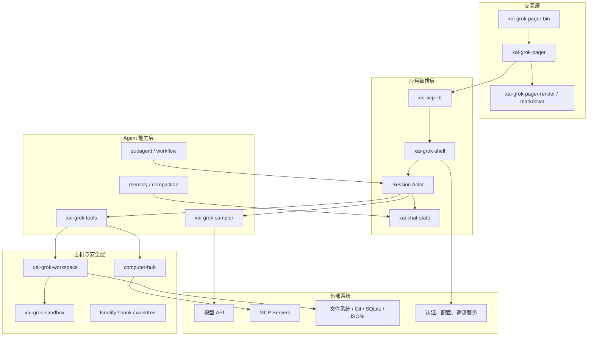
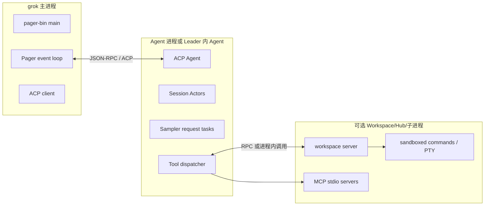
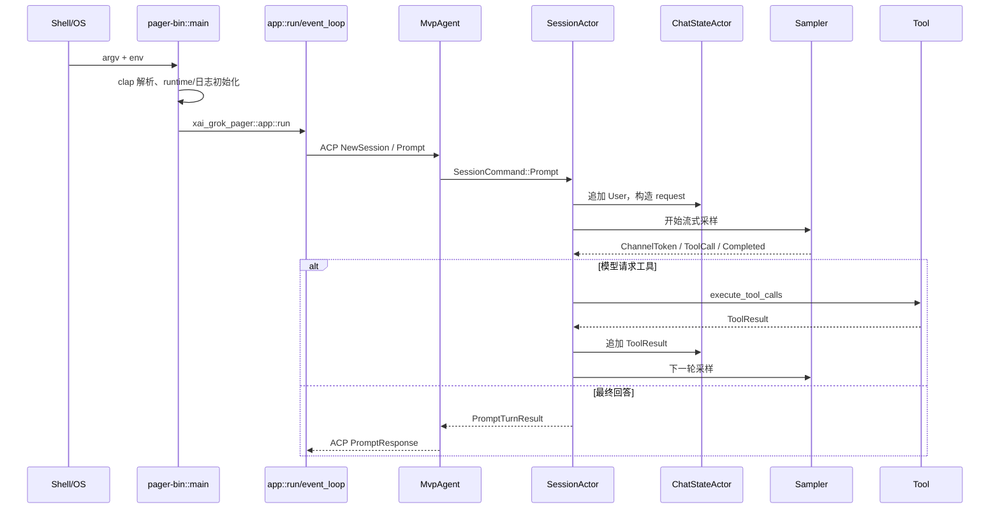

# 00：全项目源码地图

## 1. 项目是什么

Grok Build 是一个 Rust workspace。核心产品形态是终端中的 AI 编程 Agent，同时包含：

- TUI/最小界面和终端渲染；
- ACP 客户端—Agent 协议；
- 会话 Actor 与模型采样；
- 本地/远端工具运行时；
- Workspace 文件、Git、命令和沙箱；
- 会话持久化、压缩、记忆与恢复；
- MCP、插件、Hook、子 Agent 和工作流；
- 认证、配置、遥测、更新和测试基础设施。

根 `Cargo.toml` 的 `[workspace]` 是整个仓库的编译边界。`resolver = "2"` 表示 feature 按较新的依赖解析规则合并；`workspace.package.edition = "2024"` 表示成员默认采用 Rust 2024 edition。

## 2. 逻辑架构



## 3. 物理运行形态

逻辑 crate 不等于独立进程。常见运行形态如下：



某些模式会把更多组件放在同一进程；Leader、stdio、headless、workspace server 等模式会改变部署边界，但不改变核心契约。

## 4. 最重要的事实源

| 事实 | 主要所有者 | 不应由谁直接修改 |
|---|---|---|
| 当前 UI 状态 | `AppView`，由事件循环串行修改 | 后台 Effect task |
| 会话执行状态 | Shell Session Actor | TUI 渲染器 |
| 对话历史 | `ChatStateActor` | Sampler HTTP client |
| 模型完成响应 | Sampler `Completed` 事件 | 流式文本缓存 |
| 工具注册与 schema | finalized toolset / registry | 模型输出 |
| Workspace 文件 | 文件系统；会话保留快照/归因 | Chat history |
| 权限决定 | PermissionManager + managed policy | UI 的乐观显示 |
| 持久会话 | session storage/JSONL | 内存 clone |

“谁拥有事实”是阅读 Actor 项目的第一问题。若两个模块都把自己当权威，通常会出现竞态或恢复不一致。

## 5. 主调用链



## 6. 依赖方向

建议把 crate 按“越往下越稳定”理解：

```text
pager-bin
  ↓
pager / shell
  ↓
chat-state / sampler / tools / workspace
  ↓
sampling-types / config-types / tool-runtime / wire types
  ↓
通用库与第三方依赖
```

叶子类型 crate（如 `xai-grok-config-types`、`xai-grok-sampling-types`、`xai-tool-protocol`）尽量不依赖上层应用，目的是防止循环依赖并让协议可复用。

## 7. 推荐阅读阶段

| 阶段 | 目标 | 只读这些符号 |
|---|---|---|
| 1 | 找到入口 | `main`、`async_main`、`PagerArgs`、`Command` |
| 2 | 看一次 Prompt | `MvpAgent::prompt`、`SessionCommand::Prompt` |
| 3 | 看模型循环 | `run_turn_via_sampler`、`SamplingEvent` |
| 4 | 看工具回边 | `execute_tool_calls`、`ToolDispatch` |
| 5 | 看状态事实 | `ChatStateActor`、`build_request`、persistence |
| 6 | 看 UI | `Action`、`Effect`、`TaskResult`、`event_loop::run` |
| 7 | 看安全恢复 | PermissionManager、sandbox、retry、cancel |
| 8 | 按兴趣下钻 | MCP、memory、worktree、voice、workflow 等 |

## 8. 不要一开始深挖的内容

jemalloc、平台终端探测、Mermaid 排版算法、所有遥测字段、所有兼容版本和数千行测试都很重要，但不是理解主链的第一步。先在地图中标记它们，等主链形成后再回读。

