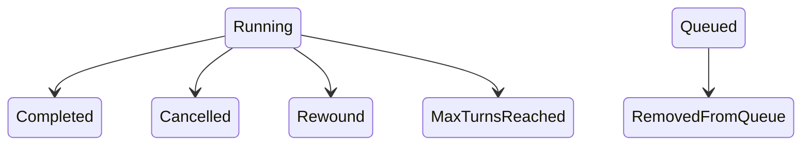
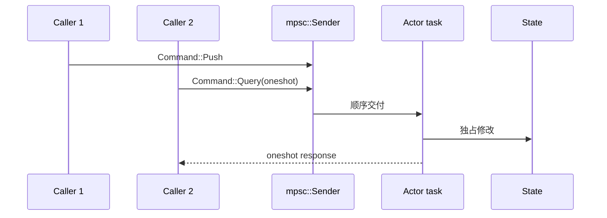

# 01：Rust 新手阅读大型项目的方法

## 1. 从 Cargo 开始，而不是从 `src` 猜

每个 crate 先看 `Cargo.toml`：

```toml
[package]
name = "xai-grok-sampler"

[dependencies]
tokio.workspace = true
reqwest.workspace = true

[features]
# feature 会决定哪些代码真正参与编译
```

需要回答：

1. 它是 library、binary，还是两者都有？
2. 直接依赖谁？这些依赖说明它处在哪一层？
3. 有哪些 feature 与 `#[cfg]`？
4. `lib.rs` 对外 re-export 了什么？

## 2. `mod`、可见性与 re-export

```rust
mod actor;              // 当前 crate 内私有模块
pub mod events;         // 外部可通过 crate::events 访问
pub(crate) mod retry;   // 仅当前 crate 可访问
pub use events::Event;  // 把深层类型提升到 crate 根
```

阅读时不要只按文件路径判断公共 API。真正公共面由 `pub` 和 `pub use` 决定。

## 3. 用类型先还原状态机

看到 enum 时先画状态/分支：

```rust
enum PromptCompletionKind {
    Completed,
    Cancelled { category: Option<...> },
    RemovedFromQueue,
    Rewound,
    MaxTurnsReached { limit: usize },
}
```

它说明“Prompt 完成”不是一个 bool。字段只存在于相应 variant，编译器阻止构造无意义组合。



## 4. 所有权：先问“谁活得更久”

常见类型的直觉：

| 类型 | 含义 |
|---|---|
| `T` | 当前变量拥有值 |
| `&T` | 临时只读借用 |
| `&mut T` | 临时独占可变借用 |
| `Box<T>` | 堆上单一所有者 |
| `Rc<T>` | 单线程共享所有权 |
| `Arc<T>` | 跨线程共享所有权 |
| `Mutex<T>` | 运行时互斥修改 |
| `RefCell<T>` | 单线程运行时借用检查 |

`Arc<T>` 不表示 `T` 自动线程安全；要跨线程还需 `T: Send + Sync`。`Arc<Mutex<T>>` 表示多个 task 共享且需要串行修改。

## 5. 借用与 `.await`

`.await` 是挂起点。代码可能在这里让出执行权：

```rust
let value = state.lock().await;
network_call().await;
```

若锁 guard 跨过网络 `.await`，其他任务长时间无法取得锁。阅读时检查：

- guard 的作用域是否尽量短；
- future 恢复时外部状态是否可能变化；
- 被取消时是否留下部分副作用。

## 6. `Result`、`Option` 和 `?`

```rust
let session = sessions.get(&id).ok_or_else(|| Error::NotFound(id))?;
```

拆开理解：

1. `get` 返回 `Option<&Session>`；
2. `ok_or_else` 变成 `Result<&Session, Error>`；
3. `?` 在 Err 时提前返回，在 Ok 时取出内部值。

`?` 不是忽略错误，而是把错误沿调用栈传播，并可能通过 `From` 转换错误类型。

## 7. trait、泛型与 trait object

```rust
trait Tool {
    type Args;
    type Output;
    async fn run(&self, ctx: Context, args: Self::Args) -> Result<Self::Output>;
}
```

强类型 trait 适合单个实现。异构注册表常使用：

```rust
Arc<dyn ToolDispatch + Send + Sync>
```

`dyn` 表示运行时动态分发。项目常在“实现内部”使用泛型保证类型安全，在“注册表边界”做类型擦除。

## 8. Actor 模式



Actor 用“一个 task 拥有可变状态”替代“每个字段一个锁”。识别 Actor 的方法：

- 有 `Command` enum；
- 有 `mpsc` 接收循环；
- query 带 `oneshot::Sender`；
- handle 只持 sender，不持真实 state。

## 9. async Stream

`Stream<Item = T>` 是异步 Iterator：

```rust
while let Some(event) = stream.next().await {
    handle(event).await?;
}
```

`None` 仅表示生产者结束，不自动等于业务成功。Sampler 因此要求显式 `Completed` 或 `Failed` 终端事件。

## 10. 通道关闭也是业务事件

| 通道 | 关闭含义 |
|---|---|
| stdin | 客户端退出或管道断开 |
| ACP connection | Agent/Leader 不可用 |
| command mpsc | 所有 handle 已 drop，Actor 可退出 |
| oneshot | 请求方或响应方取消，结果可能未知 |
| event stream | 生产任务结束；需判断是否有终端事件 |

不要只看发送成功路径；`send`、`recv`、`closed` 分支说明组件生命周期。

## 11. 宏和 derive

```rust
#[derive(Debug, Clone, Serialize, Deserialize, JsonSchema)]
#[serde(rename_all = "camelCase")]
struct EditInput { ... }
```

这些 derive 自动生成 trait impl。`serde(rename_all)` 决定 wire 字段名；Rust 字段 `old_string` 可能对应 JSON `oldString`，这是工具参数失败的常见原因。

## 12. 条件编译

```rust
#[cfg(target_os = "linux")]
fn sandbox() { ... }
```

macOS 本地编译不会检查所有 Linux 分支。阅读安全、终端和进程代码时必须搜索 `#[cfg]`，区分“当前平台行为”与“跨平台设计”。

## 13. 最有效的源码导航命令

```bash
# 找文件
rg --files crates/codegen/xai-grok-sampler

# 找定义与调用
rg -n "run_turn_via_sampler|SamplingEvent" crates

# 看 crate 对外面
sed -n '1,240p' crates/codegen/xai-grok-sampler/src/lib.rs

# 看反向依赖线索
rg -n "xai_grok_sampler::" crates --glob '*.rs'

# 只做某个包的快速类型检查
cargo check -p xai-grok-sampler
```

## 14. 一段源码的笔记模板

```markdown
### `run_turn_via_sampler`

- 所在文件：
- 调用者：
- 输入：
- 返回：
- 修改的状态：
- 外部副作用：
- await 点：
- 取消行为：
- 错误分类：
- Rust 知识：
- 对应测试：
- 下一跳：
```

