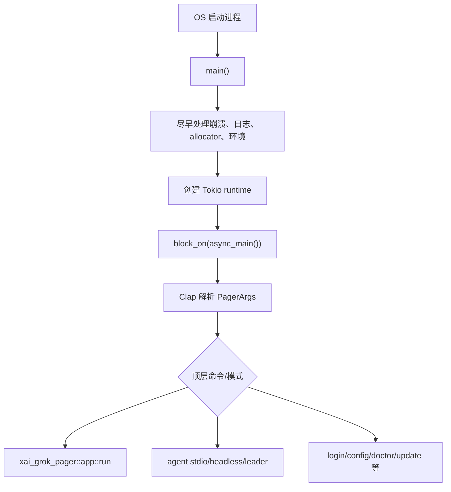
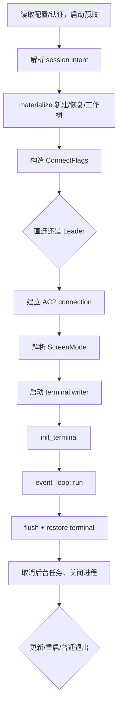
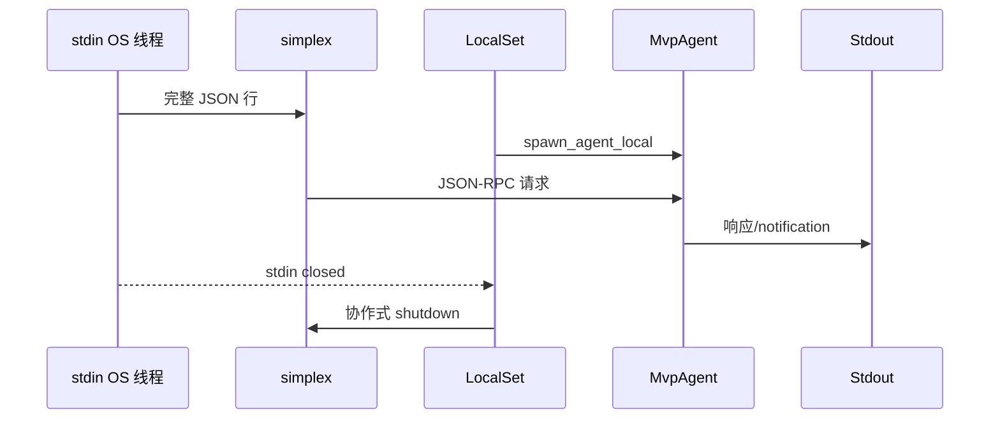
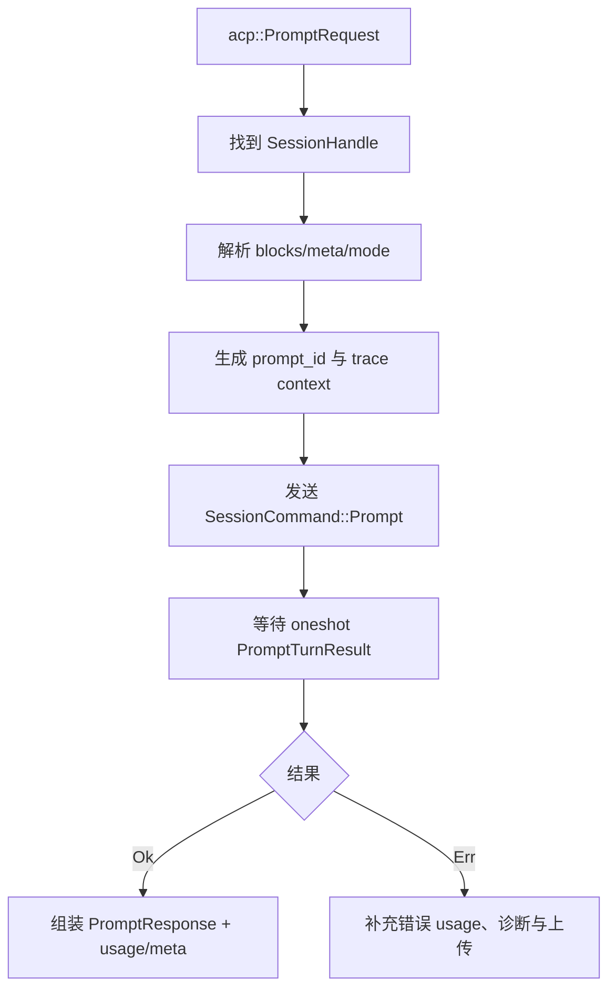
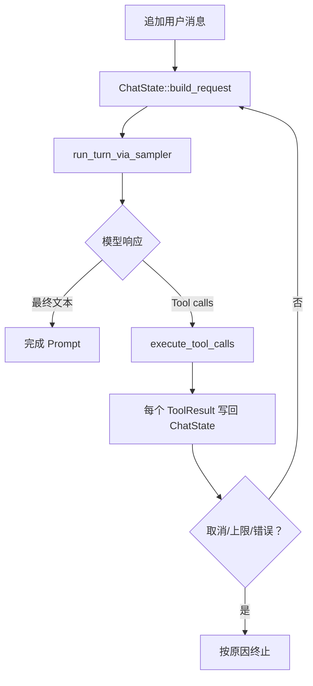
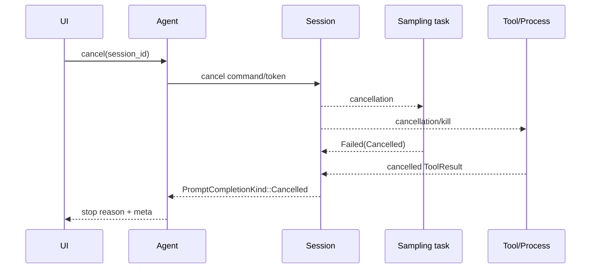

# 02：入口与主运行链精读

## 1. 二进制入口

主入口位于：

```text
crates/codegen/xai-grok-pager-bin/src/main.rs
```

`main()` 是同步壳，主要工作不是业务处理，而是建立进程级运行环境：



为什么不直接写 `#[tokio::main]`？大型程序往往需要在 runtime 建立前配置 allocator、崩溃处理、线程数、日志和平台行为。显式 runtime 让初始化顺序可控。

## 2. CLI 类型就是顶层状态机

`xai-grok-pager/src/app/cli.rs` 用 Clap derive 定义：

```rust
#[derive(Parser)]
pub struct PagerArgs {
    #[command(subcommand)]
    pub command: Option<Command>,
    // TUI、会话、模型、权限等 flags
}
```

阅读重点不是记住全部 flag，而是理解：

- `Option<Command>` 为 `None` 时通常进入默认 TUI；
- subcommand 由 enum variant 穷尽分发；
- `flatten` 把公共参数组装进多个命令；
- `conflicts_with`、`requires` 把一部分非法组合提前到 CLI 层拒绝；
- 环境变量与配置文件可能在后续覆盖/补全 CLI。

## 3. `app::run` 的启动阶段

`xai-grok-pager::app::run` 是 TUI 应用入口，核心阶段如下：



启动使用并发预取降低首屏延迟，但涉及认证/managed policy 的最终决定必须在关键边界重新确认，不能只信启动早期缓存。

## 4. stdio Agent 入口

`xai-grok-shell/src/agent/app.rs::run_stdio_agent` 把 stdin/stdout 变成 ACP transport：



专用 stdin 线程解决 Windows 管道行为；`LocalSet` 允许 `!Send` future 使用 `Rc/RefCell`。这也意味着 Agent 的本地任务不能任意迁移到 Tokio worker 线程。

## 5. ACP `prompt` 边界

`MvpAgent::prompt` 做协议适配：



简化后的命令结构：

```rust
SessionCommand::Prompt {
    prompt_id,
    prompt_blocks,
    prompt_mode,
    tool_overrides_update,
    respond_to, // oneshot::Sender<PromptTurnResult>
}
```

`mpsc` 负责多生产者向 Session Actor 发送命令；`oneshot` 负责这一次 Prompt 的唯一返回。

## 6. Session Actor 命令循环

`session/acp_session_impl/run_loop.rs` 持续接收 `SessionCommand`：

```rust
while let Some(command) = cmd_rx.recv().await {
    match command {
        SessionCommand::Prompt { .. } => { /* 排队/执行 */ }
        SessionCommand::Cancel { .. } => { /* 传播取消 */ }
        SessionCommand::UpdateConfig { .. } => { /* 更新状态 */ }
        // 其它会话命令
    }
}
```

这段结构的设计意义：

- Session 状态只有 Actor task 修改；
- 多个调用者的并发命令在一个地方排序；
- enum `match` 强制处理新增命令；
- channel 关闭可作为 Session 退出信号。

## 7. 一次 Prompt 内的 Turn 循环

`turn.rs` 的核心回边是：



简化伪代码：

```rust
loop {
    let request = chat_state.build_request(tool_specs, ...).await?;
    let response = self.run_turn_via_sampler(request).await?;

    if response.tool_calls.is_empty() {
        return Ok(final_response(response));
    }

    self.execute_tool_calls(response.tool_calls).await?;
}
```

真实实现还包含压缩、prompt queue、权限、重试、结构化输出、interjection、最大 turn 和上传，不应把它等同为一次 HTTP 请求。

## 8. 取消传播



取消是协作式的。代码只有在 `.await`、`select!` 或显式 token 检查点才能观察取消。对已经发生的文件写入，取消不能“自动回滚”；恢复依赖快照/rewind 等更高层机制。

## 9. 新手需要特别观察的 Rust 机制

| 机制 | 本链路中的作用 |
|---|---|
| `Result` + `?` | 初始化和请求错误逐层传播 |
| enum + `match` | CLI、命令、事件和结束原因的状态分发 |
| `Arc` | 共享认证 manager、connection sender 等长期对象 |
| `mpsc` | 多调用者向 Actor 发命令 |
| `oneshot` | 单次请求回执 |
| `LocalSet` | 容纳 `!Send` Agent future |
| `CancellationToken` | 跨任务广播取消 |
| RAII/Drop | 终端、追踪 guard、资源清理 |

## 10. 跟读断点

```bash
rg -n "fn main|async fn async_main" \
  crates/codegen/xai-grok-pager-bin/src/main.rs

rg -n "pub async fn run_stdio_agent|pub async fn run_headless|pub async fn run_leader" \
  crates/codegen/xai-grok-shell/src/agent/app.rs

rg -n "async fn prompt|SessionCommand::Prompt" \
  crates/codegen/xai-grok-shell/src

rg -n "run_turn_via_sampler|execute_tool_calls" \
  crates/codegen/xai-grok-shell/src/session
```

