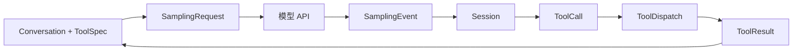
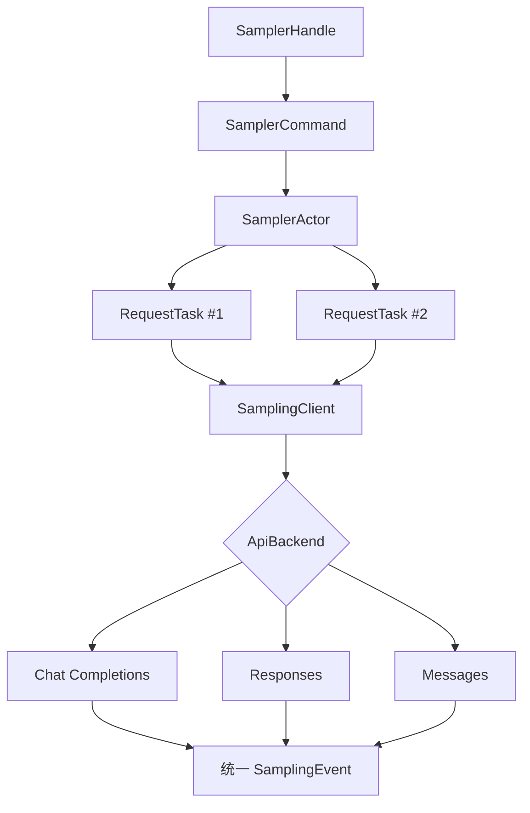
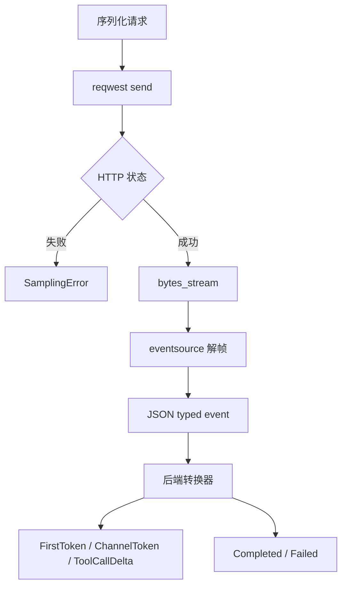
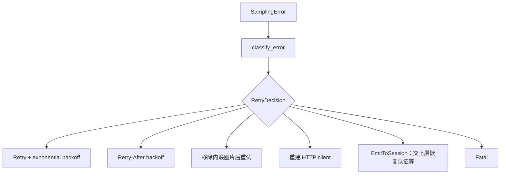
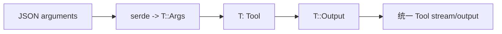
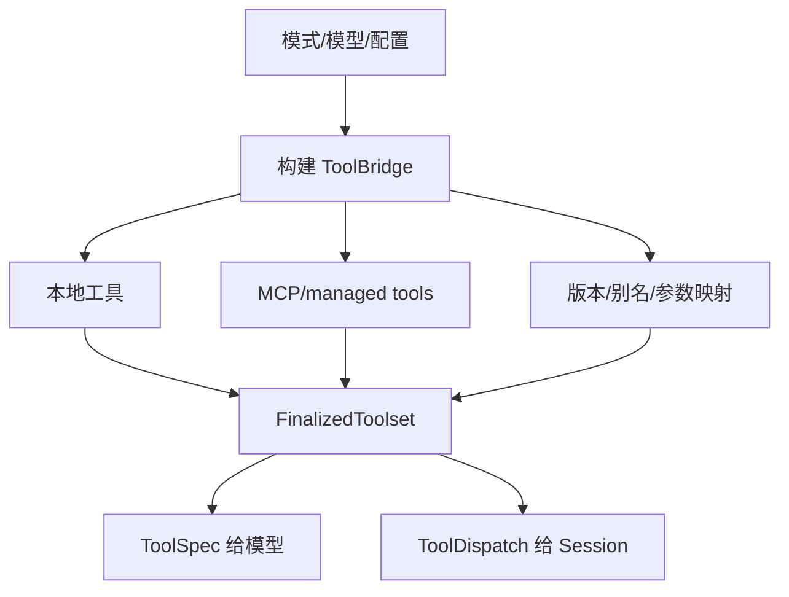
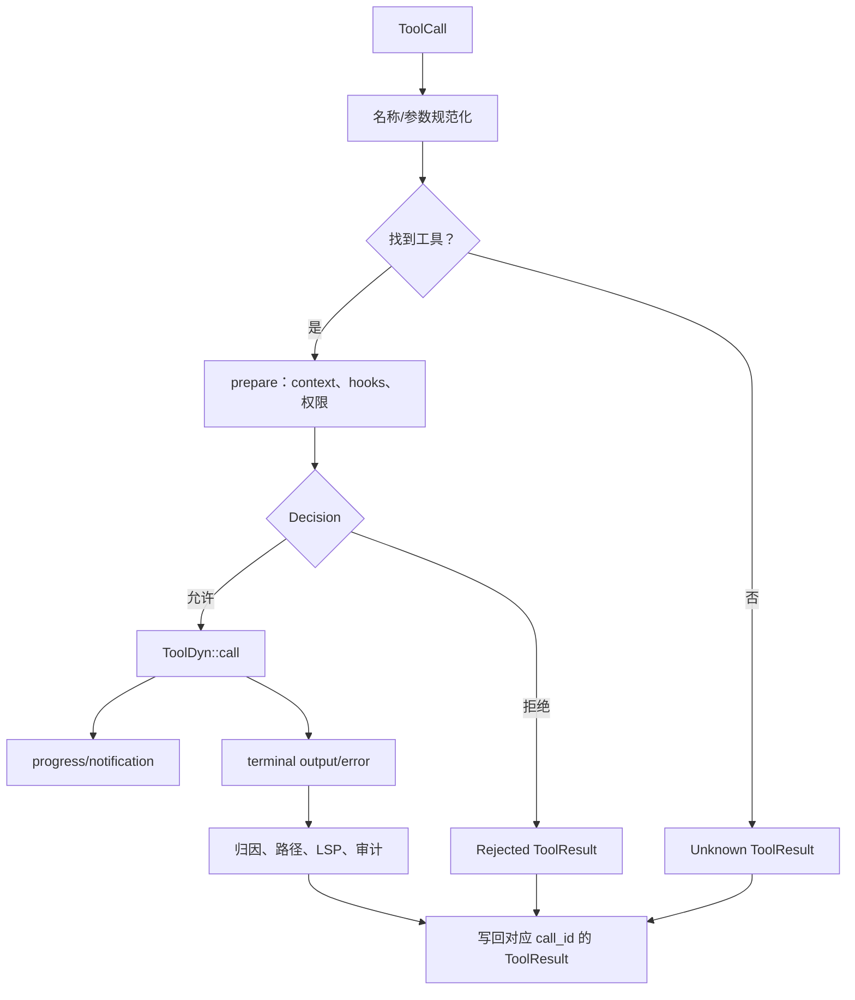
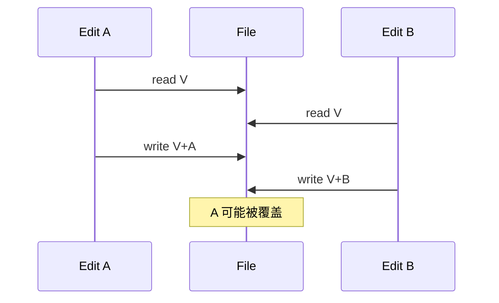
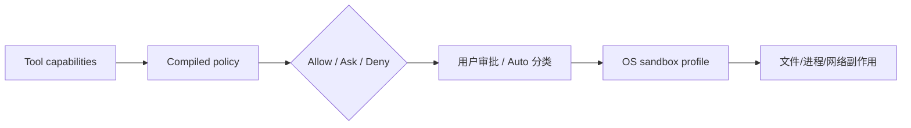

# 03：模型采样与工具执行

## 1. 两个相反方向的数据流



模型采样把内部对话变成外部 HTTP，再把协议流统一为内部事件；工具执行把模型 JSON 变成受控的本地/远端副作用。

## 2. Sampler 的 Actor 架构

`xai-grok-sampler` 的分层：



Actor 不自己等待完整网络流；每个请求是独立 task，因此慢流不会阻止 Actor 接收取消或新命令。

## 3. HTTP/SSE 分层



TCP chunk 不等于一条 SSE。必须先解 SSE framing，再反序列化 JSON。代码还处理 BOM、`[DONE]`、流内错误和“连接结束但没有终端事件”。

## 4. 统一事件的意义

三种模型 API 的 wire event 不同，但 Session 只处理：

```rust
enum SamplingEvent {
    StreamStarted { /* ... */ },
    FirstToken { /* ... */ },
    ChannelToken { /* text/reasoning */ },
    ToolCallDelta { /* ... */ },
    Retrying { /* ... */ },
    Completed { response, metrics, /* ... */ },
    Failed { error, /* ... */ },
}
```

上面是字段省略示意。关键不变量：流必须以 `Completed` 或 `Failed` 结束。只有 `Completed.response` 是规范化的 Assistant 事实；增量 token 主要用于 UI。

## 5. 重试分类



重试必须同时受以下限制：

- 最大次数；
- 总 deadline；
- cancellation token；
- `Retry-After` 上限；
- 错误是否会因重试改变；
- 是否已经产生不可重复副作用。

配置错误、序列化错误通常不可重试；401 可能需要上层刷新凭证；连接中断、部分 5xx/429 才适合有限重试。

## 6. 工具公共契约

`xai-tool-runtime` 提供强类型 `Tool`：

```rust
pub trait Tool: Send + Sync {
    type Args: DeserializeOwned;
    type Output;

    async fn run(
        &self,
        ctx: ToolCallContext,
        input: Self::Args,
    ) -> Result<Self::Output, ToolError>;
}
```

注册表需要保存不同 Args/Output 的工具，因此通过 `ToolDyn`/`ToolDispatch` 做类型擦除：



## 7. ToolSpec 与实现必须同步

模型看到：

```text
name + description + JSON Schema
```

运行时收到：

```text
call_id + name + arguments + ToolCallContext
```

若 schema 是 `oldString`，Rust serde 却期待 `old_string` 且没有 rename，调用必然失败。项目通过 derive、版本表、名称和参数映射兼容多个工具族。

## 8. 发现、注册和 dispatch



`ToolIndex` 支持工具搜索，减少每轮把所有 schema 放进上下文的成本。`Resources` 是 typed dependency container，向工具注入 cwd、FS、进程 manager、权限和通知句柄。

## 9. 执行管线



每个 tool call 必须有一个 ToolResult。即使第二个调用被拒绝、第三个因此取消，也要给第三个生成取消结果，避免模型协议出现悬空调用。

## 10. 文件编辑的三种策略

| 策略 | 定位 | 主要风险 |
|---|---|---|
| apply_patch | 上下文 hunk | 上下文陈旧、重复片段 |
| exact edit | `old_string` 唯一匹配 | 缩进差异、匹配 0 或多次 |
| hashline | 读取时的行锚点/hash | 锚点过期 |

典型读改写竞态：



判断是否安全必须确认具体调用路径是否使用按路径锁、写前 hash 校验或原子替换；仓库中存在锁模块不等于每个编辑实现都自动使用。

## 11. 权限与沙箱



权限是业务决策；沙箱是 OS 强制。用户点击允许不代表可以绕过 managed deny，也不代表 sandbox 准备失败时可以无保护执行。

## 12. 建议跟读命令

```bash
rg -n "pub enum SamplingEvent|RetryDecision" \
  crates/codegen/xai-grok-sampler/src

rg -n "pub trait Tool|pub trait ToolDyn|pub trait ToolDispatch" \
  crates/common/xai-tool-runtime/src

rg -n "FinalizedToolset|ToolBridge|prepare_dispatch" \
  crates/codegen/xai-grok-tools/src

rg -n "execute_tool_calls|handle_sampling_event" \
  crates/codegen/xai-grok-shell/src/session
```

