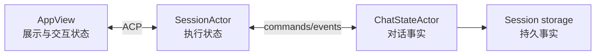
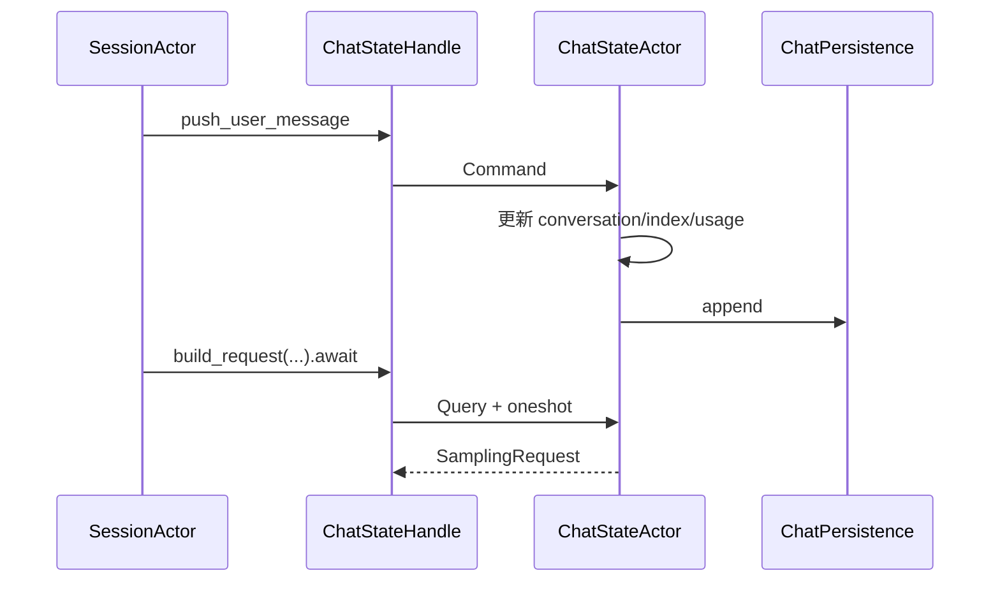
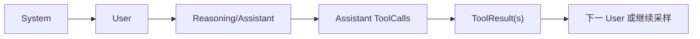
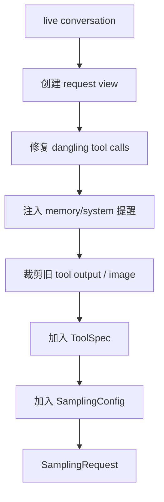
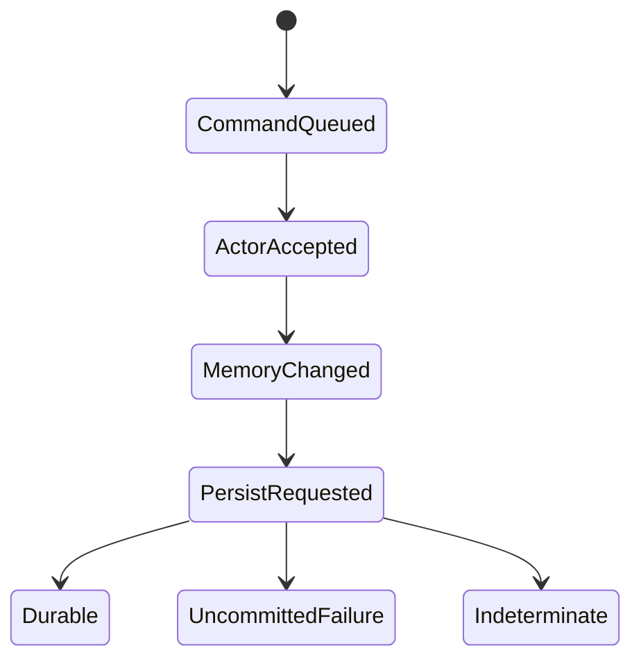
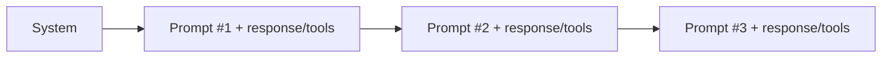
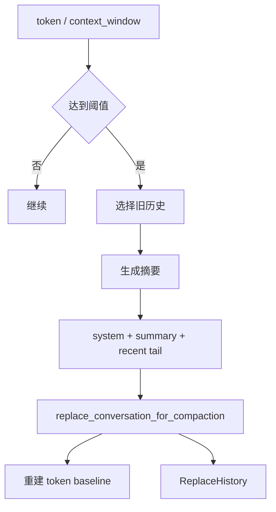

# 04：状态、协议与持久化

## 1. 三类状态



- UI 状态可从 Agent notification 重建一部分，但不是会话权威；
- Session 状态负责当前 Prompt、队列、取消、工具和运行任务；
- ChatState 保存 conversation、usage、prompt index 等模型上下文事实；
- storage 使事实跨进程恢复。

## 2. ACP 是边界协议

ACP 使用请求、响应和 notification 连接 Pager 与 Agent。协议边界必须处理：

| 关注点 | 说明 |
|---|---|
| request id | 将响应与请求匹配 |
| session id | 将事件路由到正确会话 |
| prompt id | 将流、取消、usage 与某轮关联 |
| method/version | 兼容不同客户端能力 |
| meta | 承载扩展信息，解析需保守 |
| cancellation | 迟到响应不能污染新请求 |
| reconnect/replay | 重连后避免丢失或重复 UI 事件 |

## 3. ChatState Actor



Actor task 独占 State，所以字段间更新可保持一致，不需把 conversation、prompt index、usage 分别锁住。

## 4. ConversationItem

对话不是纯文本数组，而是有类型的顺序日志：



工具调用与结果的 call id 必须闭合。工作目录切换、合成消息和 memory reminder 也可能作为专用 item，不能简单按 `role/content` 二元模型理解。

## 5. `build_request` 的转换



要区分：

- 只修改 request clone 的临时变换；
- 同时修改 live state 并持久化的修复；
- 纯 query 不应产生意外写入。

## 6. 持久化承诺点



`mpsc::send` 成功只表示命令已排队，不表示 durable。需要强语义的 strict append/flush 会带 ack。若写入可能完成但 ack 丢失，结果是 `Indeterminate`，不能盲目重复。

## 7. JSONL/Session storage

JSONL 适合追加事件和容错恢复：

```text
一行 = 一个可独立解析的记录
```

读取时常需处理：

- 最后一行因崩溃被截断；
- 旧 schema 字段缺失；
- 单行损坏但后续仍可读；
- reasoning/tool 类型升级；
- 历史过大；
- flush 与 OS page cache 的差异。

持久化接口隔离 ChatState 与具体 JSONL/磁盘实现，测试可注入 Mock 或 Null persistence。

## 8. Rewind



rewind 到 prompt 1 必须同步：

1. 截断 conversation；
2. 截断 prompt text；
3. 更新 prompt index；
4. 重算 token；
5. 清理当前 turn capture；
6. replace history 持久化；
7. 通知 UI reset；
8. 按策略恢复文件快照。

只改一个计数器会造成内存、模型和磁盘看到不同历史。

## 9. Compaction



压缩不应重置当前模型、API backend 或工具配置。token 不能只按字符估算；实现会参考 provider usage 与本地估算比例保留协议 overhead。

## 10. Session 与文件状态

Workspace session 还跟踪：

- Agent 修改过的路径；
- hunk 归因；
- prompt 边界快照；
- Git HEAD/branch；
- worktree；
- restore/rewind 点。

磁盘文件是真实当前状态；会话快照用于解释与恢复，不应被误当成一个并发数据库事务。

## 11. 协议兼容

Rust 中常见兼容手段：

```rust
#[serde(default)]
field_added_later: Option<T>,

#[serde(rename_all = "camelCase")]
struct WireDto { ... }
```

新增可选字段相对安全；删除/改名/改变 enum tag 可能破坏旧记录。wire DTO 与领域类型分离，可以把升级逻辑集中在边界。

## 12. 验证

```bash
rg -n "pub struct ChatState|enum ChatStateCommand|build_request" \
  crates/codegen/xai-chat-state/src

rg -n "truncate_to_prompt_index|replace_conversation_for_compaction" \
  crates/codegen/xai-chat-state/src

rg -n "trait ChatPersistence|ReplaceHistory|Flush" \
  crates/codegen/xai-chat-state/src

rg -n "JSONL|repair|upgrade_legacy" \
  crates/codegen/xai-grok-shell/src/session/storage
```

