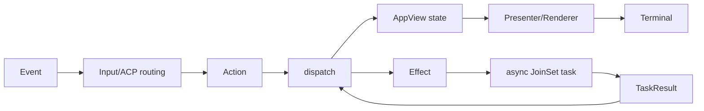
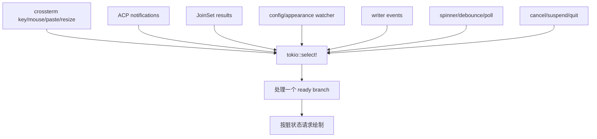
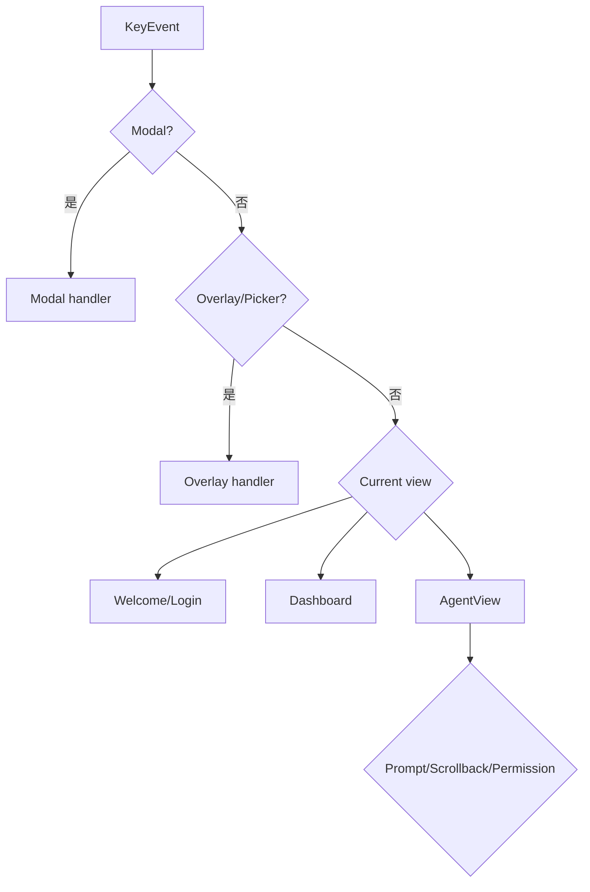
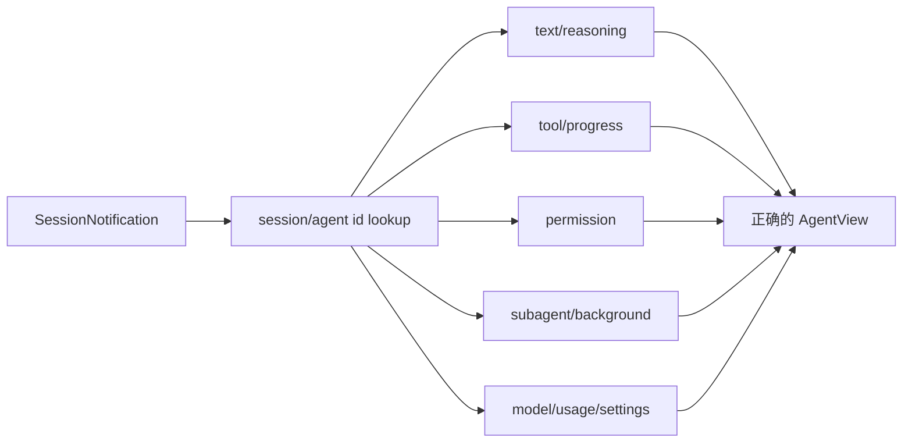
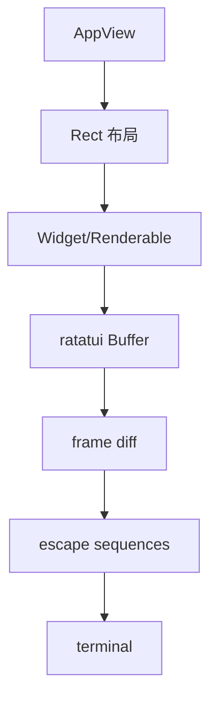
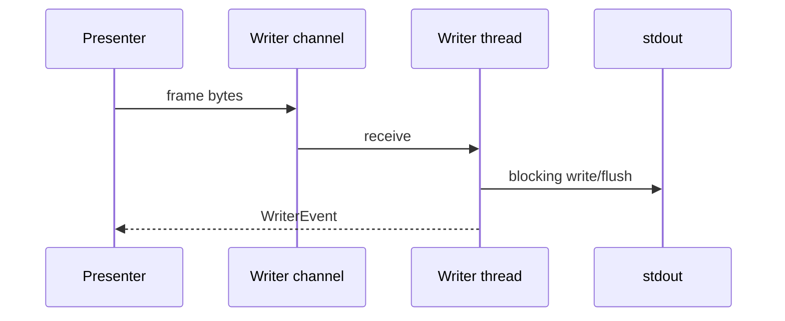

# 05：TUI 事件循环与渲染

## 1. 单向数据流



后台任务不直接修改 AppView；它返回 TaskResult，让主事件循环串行修改状态。

## 2. 三个核心 enum

`app/actions.rs` 定义：

- `Action`：同步意图，如 SendPrompt、Quit、OpenDashboard；
- `Effect`：异步副作用，如 ACP 请求、浏览器、剪贴板、定时器；
- `TaskResult`：Effect 完成后回到 dispatch 的结果。

简化签名：

```rust
fn dispatch(action: Action, app: &mut AppView) -> Vec<Effect>;
```

这种结构让 reducer 测试无需真实网络。

## 3. `tokio::select!` 事件源



`select!` 分支必须短小。长网络/文件操作转为 Effect，否则键盘和 Agent token 会被阻塞。

## 4. 输入焦点路由



同一个 Esc/Enter 会因焦点不同产生不同 Action。不要在单个按键 handler 中寻找全部业务；继续跟进 dispatch。

## 5. ACP 更新路由



迟到事件必须继续路由到原会话或被丢弃，不能因为用户切换 tab 就写入当前页。

## 6. Render



渲染器处理 Unicode 宽度、换行、Markdown、语法高亮、OSC8 链接、图片 overlay、scrollbar 和主题。

鼠标 hit-test 会使用上一帧缓存的 Rect，因此组件离开视口时必须清除陈旧区域。

## 7. ScreenMode

| 模式 | 特点 |
|---|---|
| Fullscreen | alternate screen、全帧 UI |
| Inline | 与 shell scrollback 协作 |
| Minimal | 更保守的终端能力和布局 |

模式影响 action registry、鼠标、绘制和退出恢复。某些切换通过 re-exec 完成，避免在复杂运行状态中热切换底层终端模式。

## 8. Writer thread



独立 writer 隔离阻塞 stdout。高速 token 到达时还需合并 redraw，避免每个 token 都完整绘制。

## 9. Terminal 初始化与恢复

初始化可能启用：

- raw mode；
- alternate screen；
- mouse/focus/bracketed paste；
- 光标控制；
- Kitty keyboard/image protocol。

所有正常错误路径都应恢复；panic/signal hook 做 best effort。SIGKILL 无法清理，这是终端程序的外部限制。

## 10. Markdown 流式渲染

模型文本按 token 到达，Markdown block 可能尚未闭合：

````text
```rust
fn main() {
```
````

流式 renderer 必须在不完整输入上给出稳定显示，完成后又与全量 render 尽量一致。代码块、表格、列表和 Mermaid 都需要增量状态。

## 11. 性能风险

| 风险 | 观察指标/代码 |
|---|---|
| 每 token 全量重排 | draw 时间、frame 合并 |
| scrollback 无限增长 | block 截断/虚拟化 |
| Unicode 切断 | char boundary helper |
| writer 背压 | in-flight frame、channel |
| overlay 重计算 | geometry/cache |
| tracing channel 无消费 | tick 中 drain |

## 12. 验证

```bash
rg -n "pub enum Action|pub enum Effect|pub enum TaskResult" \
  crates/codegen/xai-grok-pager/src/app/actions.rs

rg -n "tokio::select!|effects::execute|dispatch::dispatch" \
  crates/codegen/xai-grok-pager/src/app/event_loop.rs

rg -n "fn draw|fn render" \
  crates/codegen/xai-grok-pager-render/src \
  crates/codegen/xai-grok-pager/src/app/agent_view
```
