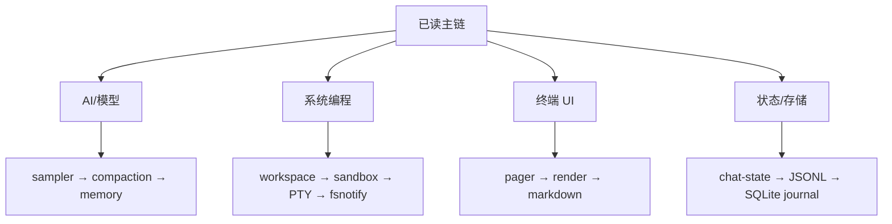

# 06：Workspace 全部 Crate 导航

> 本章覆盖根 `Cargo.toml` 中的 workspace 成员。核心 crate 已在前述章节精读；其余 crate 给出职责、入口和跟读重点。源码持续演进时，以各 crate 当前 `Cargo.toml`、`lib.rs` 和公开类型为准。

## 1. 命名与目录

```text
crates/build/     构建期工具
crates/codegen/   产品主体与生成/内部 crate
crates/common/    稳定、可复用的公共边界
prod/             生产接口类型
third_party/      仓库内 vendored 实现
```

`codegen` 不表示里面全是自动生成代码；从当前仓库结构看，它承载大部分产品 crate。判断能否修改要看文件头、build.rs 和生成流程，不要仅凭目录名猜。

## 2. 入口、TUI 与终端

| Crate | 职责 | 建议入口 / 学习重点 |
|---|---|---|
| `xai-grok-pager-bin` | 主 `grok` 二进制入口 | `src/main.rs`：同步壳、`async_main`、命令分发 |
| `xai-grok-pager` | 完整 TUI、ACP 客户端、AppView | `app/event_loop.rs`、`actions.rs`、`dispatch/` |
| `xai-grok-pager-minimal` | 最小/兼容界面实现 | `src/lib.rs`，与 full pager 的能力差异 |
| `xai-grok-pager-render` | ratatui 绘制、主题、终端能力、overlay | `render/draw.rs`、`terminal/`、`appearance/` |
| `xai-grok-markdown` | 流式 Markdown 终端渲染 | `streaming.rs`、`render.rs`，增量与全量一致性 |
| `xai-grok-markdown-core` | 无 UI 的 Markdown 分析公共核 | `lib.rs`，解析配置与轻量复用 |
| `xai-grok-mermaid` | Mermaid → PNG，可替换引擎 | engine trait、缓存、失败降级 |
| `xai-ratatui-inline` | inline ratatui 支撑 | example 与终端 scrollback 协作 |
| `xai-ratatui-textarea` | 文本输入组件 | 输入状态、selection、Unicode |
| `xai-grok-pager-pty-harness` | TUI PTY E2E harness/scenario | `src/bin/pty_scenario.rs`、场景 DSL |
| `xai-tty-utils` | TTY 安全进程启动与进程组管理 | pager 抑制、controlling terminal、kill |
| `ptyctl` | 基于 alacritty_terminal 的无头 PTY 控制器 | terminal state/parser |
| `ptyctl-cli` | ptyctl 命令行入口 | `src/main.rs` |

## 3. Agent、Session 与协议

| Crate | 职责 | 建议入口 / 学习重点 |
|---|---|---|
| `xai-grok-shell` | Agent 核心编排、Session、认证、扩展 | `agent/`、`session/`；最大核心 crate |
| `xai-acp-lib` | ACP transport/stdio 辅助 | framing、request/response 生命周期 |
| `xai-agent-lifecycle` | Agent 生命周期公共逻辑 | 启动、停止、所有权和清理 |
| `xai-chat-state` | Actor 化对话状态 | `actor/`、`commands.rs`、`persistence.rs` |
| `xai-prompt-queue` | Shell 与 Pager 共享的 Prompt 队列 wire 类型 | DTO、队列状态兼容 |
| `xai-interjection-core` | mid-turn 插话缓冲与格式 | 并发插入、边界格式 |
| `xai-grok-agent` | Agent 定义、builder、system prompt | definition parse、prompt assembly |
| `xai-grok-subagent-resolution` | 子 Agent 定义、运行时、resume 解析 | context 继承、配置覆盖 |
| `xai-workflow` | Rhai 动态工作流引擎 | script host channel、安全边界 |
| `xai-hooks-plugins-types` | Hook/Plugin ACP DTO | 纯 wire 类型，不承载执行逻辑 |
| `xai-grok-shell-base` | Shell 家族基础模块 | 环境、profiling、进程/FS util |
| `xai-grok-shell-session-support` | Session 支撑 | MCP catalog cache、文件访问跟踪 |
| `xai-grok-shared` | 跨产品共享杂项 | 从 `lib.rs` 判断真实公共面 |

## 4. 模型、对话与记忆

| Crate | 职责 | 建议入口 / 学习重点 |
|---|---|---|
| `xai-grok-sampler` | Actor 化推理、HTTP stream、retry | `actor/request_task.rs`、`client.rs`、`stream/` |
| `xai-grok-sampling-types` | 纯采样/对话数据类型 | `conversation.rs`、`types.rs`、serde 兼容 |
| `xai-grok-models` | 内嵌默认模型 ID/元数据 | embedded JSON、加载与 fallback |
| `xai-grok-memory` | 长期记忆/检索/切块 | chunker、存储与 prompt 注入边界 |
| `xai-grok-compaction` | 传输无关的对话压缩引擎 | 选择范围、摘要、保留不变量 |
| `xai-token-estimation` | 纯 token 估算 | 估算误差与 provider usage 校准 |
| `prod-mc-cli-chat-proxy-types` | cli-chat-proxy 请求/响应 DTO | 生产 API wire 兼容 |

## 5. 工具、Hub 与 MCP

| Crate | 职责 | 建议入口 / 学习重点 |
|---|---|---|
| `xai-grok-tools` | 工具注册表和具体实现 | `registry/`、`bridge.rs`、`implementations/` |
| `xai-grok-tools-api` | 工具 protobuf API | `.proto`、`build.rs`、生成代码边界 |
| `xai-tool-runtime` | `Tool`、dispatch、error、notification、search | `tool.rs`、`dispatch.rs`、类型擦除 |
| `xai-tool-protocol` | Computer Hub wire protocol | ID、capability、请求/响应 |
| `xai-tool-types` | canonical tool descriptions | schema/description 稳定类型 |
| `xai-computer-hub-core` | transport、ToolRegistry、resolver | registry 与 transport 抽象 |
| `xai-computer-hub-sdk` | pool、重连、tool harness/server runtime | connection lifecycle 与 reconnect |
| `xai-computer-hub-mcp-adapter` | MCP tool → Hub native tool 桥 | schema 转换、错误映射 |
| `xai-grok-mcp` | MCP 集成、OAuth、凭证；隔离 reqwest 版本 | dependency quarantine、credential store |
| `xai-grok-plugin-marketplace` | Plugin marketplace | source policy、下载/安装边界 |
| `xai-grok-hooks` | 文件发现、Hook 命令执行和策略 | pre/post hook、拒绝、sandbox |

## 6. Workspace、文件与 Git

| Crate | 职责 | 建议入口 / 学习重点 |
|---|---|---|
| `xai-grok-workspace` | 主机本地 FS、VCS、执行、发现 | `handle.rs`、`session/`、`permission/`、`file_system/` |
| `xai-grok-workspace-client` | workspace RPC 轻量 typed client | 请求映射、proxy/reconnect |
| `xai-grok-workspace-types` | workspace client/server wire enum | chunk/event/schema 版本 |
| `xai-fsnotify` | 单因果流的语义 FS 事件 | watcher、去抖、rename/overflow |
| `xai-hunk-tracker` | 文件 diff 与 Agent/外部归因 | Actor、baseline/current、归因规则 |
| `xai-fast-worktree` | CoW 高性能 Git worktree | clone strategy、fallback、pool |
| `xai-gix-status` | 受进程限制保护的 gix status helper | thread budget、panic=abort 风险 |
| `xai-codebase-graph` | tree-sitter 代码图/索引 | index manager、query、增量更新 |
| `xai-file-utils` | 本地数据/上传队列等文件辅助 | queue 原子性、过期清理 |
| `xai-grok-paths` | 类型安全 UTF-8 绝对/相对路径 | newtype 不变量、转换失败 |
| `xai-sqlite-journal` | 按文件系统选择 SQLite journal mode | 本地 WAL、网络盘 rollback |

## 7. 安全、认证、配置与环境

| Crate | 职责 | 建议入口 / 学习重点 |
|---|---|---|
| `xai-grok-sandbox` | Landlock/Seatbelt 等 OS 沙箱 | `profiles.rs`、`paths.rs`、平台 `cfg` |
| `xai-grok-auth` | Auth 依赖倒置 seam | `HttpAuth`、credential provider traits |
| `xai-grok-config` | requirements > user > managed 配置合并 | effective config、来源、热更新 |
| `xai-grok-config-types` | 叶子配置值类型 | serde schema、安全默认 |
| `xai-grok-env` | 后端 endpoint 默认值与 env 测试 | 环境 preset、测试隔离 |
| `xai-grok-http` | 共享 reqwest client/User-Agent | TLS、middleware、敏感 header |
| `xai-grok-secrets` | 出站日志/遥测 secret sanitizer | regex 误报/漏报、测试语料 |
| `xai-system-power` | 跨平台 sleep/wake notification | suspend 边界、任务延迟 |
| `xai-circuit-breaker` | 通用熔断器 | Closed/Open/HalfOpen、并发 |

## 8. 遥测、崩溃、更新与产品支撑

| Crate | 职责 | 建议入口 / 学习重点 |
|---|---|---|
| `xai-grok-telemetry` | 产品事件、Mixpanel、Sentry | scrub、queue、失败不阻塞主链 |
| `xai-mixpanel` | 轻量 Mixpanel HTTP client | 批量/超时/失败 |
| `xai-tracing` | 公共 tracing 支撑 | span/context/export |
| `xai-tracing-macros` | 日志与计时宏 | macro 展开、字段生命周期 |
| `xai-crash-handler` | Unix signal/Windows SEH 崩溃处理 | async-signal-safety、startup crash |
| `xai-grok-update` | 自动更新 | 下载、校验、替换、relaunch |
| `xai-grok-version` | lockstep CLI 版本 | build.rs、版本注入 |
| `xai-grok-announcements` | 公告类型、持久化、格式 | 去重、隐藏状态 |
| `xai-grok-voice` | streaming STT 语音输入 | 音频 task、取消、凭证 |

## 9. 构建与测试支撑

| Crate | 职责 | 建议入口 / 学习重点 |
|---|---|---|
| `xai-proto-build` | protobuf build helper | build script 的输入/输出与 rerun |
| `xai-grok-test-support` | mock inference/SSE/ACP/headless/env sandbox | hermetic fixture |
| `xai-test-utils` | hermetic Git、runfiles | 临时目录与跨平台 |

## 10. Vendored 第三方

| Crate | 职责 | 阅读建议 |
|---|---|---|
| `dagre_rust` | Dagre 布局 Rust 移植 | 算法专题再读 |
| `graphlib_rust` | Dagre graphlib | 图结构与拓扑算法 |
| `mermaid-to-svg` | Mermaid → SVG | parser/layout/render 边界 |
| `ordered_hashmap` | 保持插入顺序的 HashMap | 数据结构实现与 unsafe 检查 |

这些代码属于仓库内依赖，但不是理解 Agent 主链的优先内容。修改前应确认上游来源和本地差异。

## 11. 按兴趣选择下一条支线



