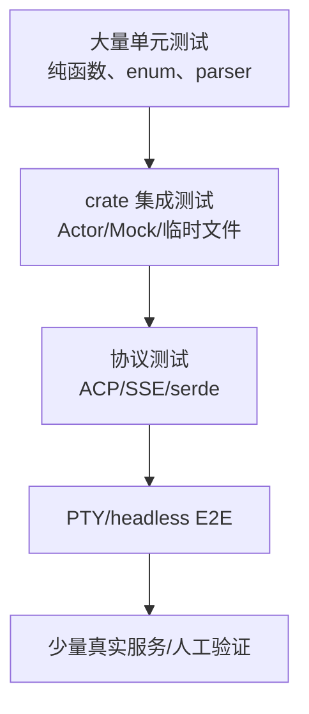
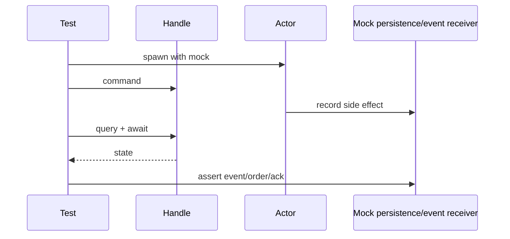
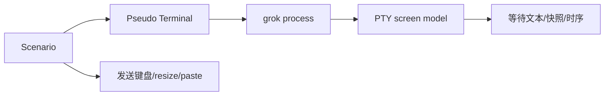

# 07：测试、调试与阅读验证

## 1. 不要用“我看懂了”作为验证

每条阅读结论至少对应一种证据：

| 结论 | 最适合的证据 |
|---|---|
| 调用关系 | `rg` 调用点 + 类型检查 |
| 状态迁移 | 单元测试 |
| wire JSON | serde round-trip/golden test |
| UI 输出 | insta snapshot / PTY E2E |
| 并发取消 | paused time + channel harness |
| 文件副作用 | tempdir 集成测试 |
| 平台安全 | 对应 OS smoke/integration test |
| 性能 | criterion/专用 bench，不凭感觉 |

## 2. 测试金字塔



越靠上越慢、越易受环境影响；定位 bug 时先找最小可复现层。

## 3. 常用 Cargo 命令

```bash
# 只检查一个包，避免第一次就编译整个 workspace
cargo check -p xai-chat-state

# 某个包全部测试
cargo test -p xai-grok-sampler

# 精确测试名并显示输出
cargo test -p xai-chat-state dangling_tool_calls -- --nocapture

# 只构建测试，不执行
cargo test -p xai-grok-pager --no-run

# 查看 feature 相关问题
cargo check -p xai-grok-sandbox --all-features
```

全 workspace 很大。先按改动/阅读范围选择包，再在需要时扩大。

## 4. 用测试反向读设计

优先搜索这些测试名：

```text
cancel / timeout / retry / closed
restore / rewind / compact / repair
concurrent / race / stale / duplicate
deny / permission / sandbox
partial / truncated / malformed
```

正常路径告诉你“能做什么”，失败测试告诉你“必须保证什么”。

## 5. Actor 测试

典型 harness：



Actor 测试重点：

- 命令顺序；
- handle 全 drop 后退出；
- oneshot sender 丢失；
- persistence ack 延迟；
- cancellation 中途发生；
- 状态与事件是否同时更新。

## 6. SSE 测试

不要只用“一条完整 JSON”：

```text
data: {"cho
ices":[...]}

```

应覆盖任意 byte chunk、BOM、`[DONE]`、中途断流、流内错误、空 Completed、重试后新 stream。Mock inference server 和 SSE generator 位于 `xai-grok-test-support`。

## 7. 文件与 Git 测试

使用 `tempfile::tempdir()` 和 hermetic Git helper，避免污染真实仓库。至少断言：

- 原内容；
- 修改后内容；
- 文件权限/路径；
- 通知；
- 失败后是否部分写入；
- 并发时是否覆盖；
- symlink/`..` 是否符合策略。

## 8. TUI/PTY 测试

快照测试验证布局文本，PTY 测试验证真实终端序列和交互：



PTY 失败排查：

1. 确认终端尺寸和模式；
2. 检查是否等待了稳定条件而非固定 sleep；
3. 输出 screen dump；
4. 区分渲染 bug 与输入未送达；
5. 检查退出后 raw mode 清理。

## 9. 日志与 tracing

`tracing` 的 span 比散落字符串更适合异步程序：

```rust
#[tracing::instrument(skip_all, fields(session_id, prompt_id))]
async fn run_turn(...) { ... }
```

关联字段建议：

- session_id；
- prompt_id/request_id；
- tool call_id；
- sampler attempt；
- task/subagent id；
- permission request id。

不要记录 token、API key、完整敏感 prompt 或受保护文件内容。

## 10. 常见编译错误怎样读

| 错误 | 阅读方向 |
|---|---|
| moved value | 哪个调用取得所有权；是否应借用/clone |
| borrow across await | guard/引用生命周期是否跨挂起点 |
| future is not Send | 持有 `Rc/RefCell/guard`；是否需要 LocalSet |
| trait bound not satisfied | 看泛型 where 与关联类型 |
| non-exhaustive match | enum 新增 variant 尚未处理 |
| type annotations needed | `collect`、`parse`、channel 类型缺上下文 |

不要先靠 clone 消除所有权错误；先判断真实生命周期和共享关系。

## 11. 文档机械检查

```bash
# Markdown 尾随空白等 Git 检查
git diff --check

# 相对链接可用脚本或逐个解析
rg -n '\\]\\([^)]*\\.md' docs/sourcecode

# Mermaid/代码围栏应成对
for f in docs/sourcecode/*.md; do
  rg -c '^```' "$f"
done
```

结构检查不能证明 Mermaid 一定能渲染；若无渲染器，应明确只验证了围栏与语法结构。

## 12. 新手的安全实验顺序

1. 先运行纯类型/纯函数 crate 的测试；
2. 再运行 ChatState/Sampler 的 Mock 测试；
3. 再用 tempdir 测工具；
4. 再跑 headless/PTY；
5. 最后才连接真实模型、MCP 或执行有副作用的工具。

