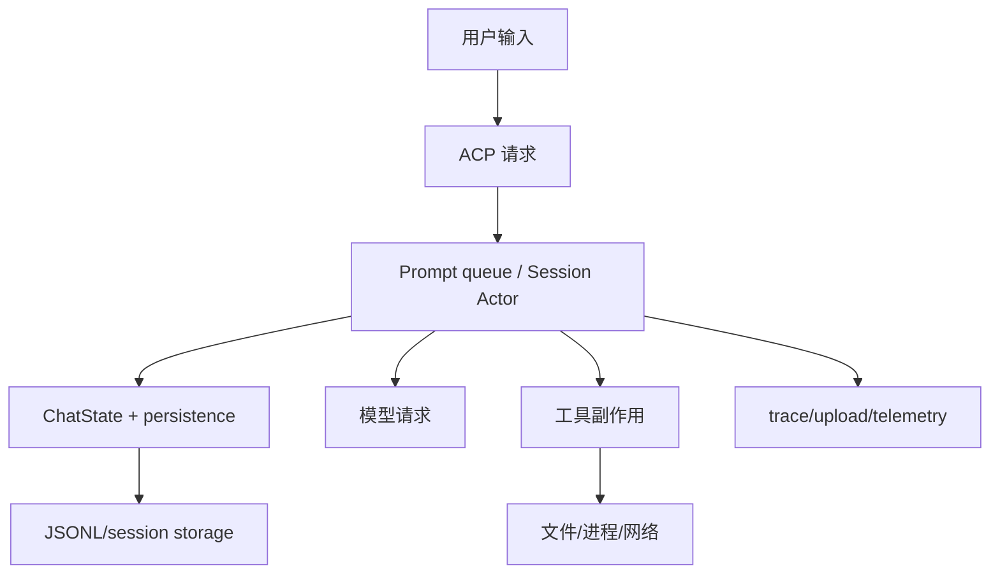
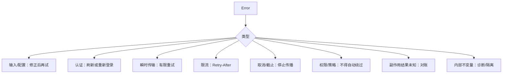
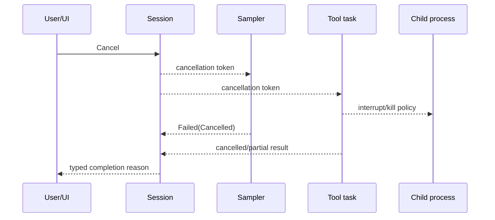
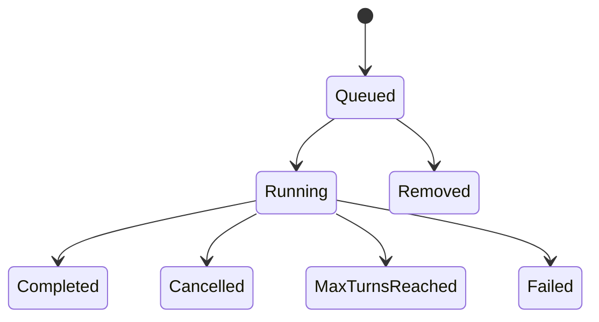
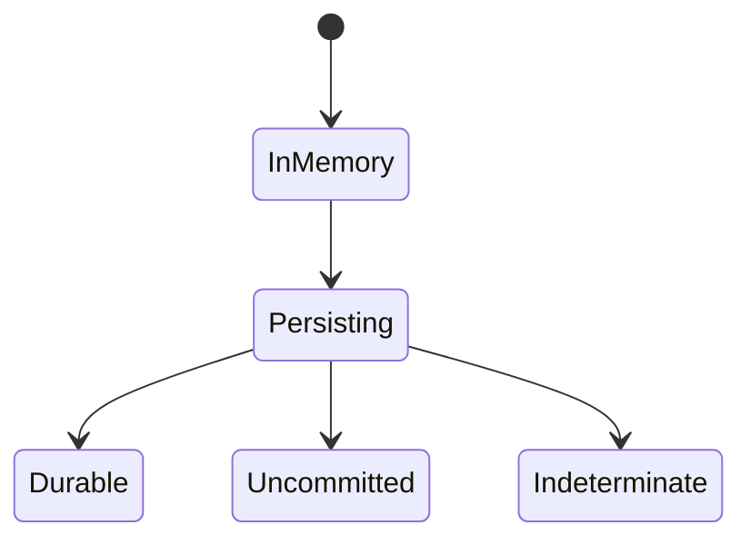
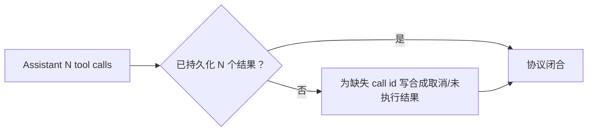
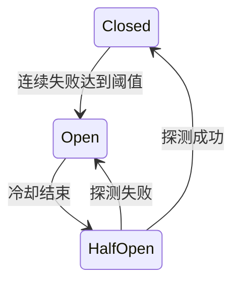

# 可靠性与通用技术实现说明书

> 本文是源码阅读视角下的可靠性权威入口：描述当前代码中应追踪的承诺点、失败分类和恢复机制，不声称系统提供分布式 exactly-once。

## 1. 可靠性对象



每条边的“成功”含义不同：

| 边界 | 最小成功承诺 |
|---|---|
| UI → ACP | 请求已写入 transport，不等于 Agent 接受 |
| ACP → Session | command 已进入 channel，不等于 Prompt 完成 |
| Session → ChatState | Actor 已处理，不一定 durable |
| strict persistence | storage ack 后才可称已确认持久化 |
| Session → Sampler | HTTP/stream 请求启动，不等于模型完成 |
| Tool → FS | 系统调用成功；通知/会话记录可能随后失败 |
| upload/telemetry | 辅助链路，不应把已完成核心动作改判失败 |

## 2. 禁止笼统宣称 exactly-once

以下场景都可能导致“结果未知”：

- 存储已写但 ack 丢失；
- HTTP 服务已处理但连接断开；
- 工具写文件后进程崩溃；
- 子进程完成但退出状态未收集；
- telemetry/upload 成功但本地回执丢失。

正确目标是：

- 会话命令尽量幂等或可检测重复；
- 对话 tool call/result 以 call id 去重/闭合；
- 高风险外部副作用结果未知时不盲目重试；
- 恢复时通过事实源检查、修复或人工确认。

## 3. 错误分类



错误字符串只用于展示；控制流应匹配 typed error/enum。

## 4. 重试边界

### 4.1 允许重试

- 建连失败；
- 未产生规范结果的可恢复流中断；
- 429，遵守受上限约束的 `Retry-After`；
- 部分 5xx；
- Windows 特定短暂文件共享锁；
- 可安全重放的只读请求。

### 4.2 不应盲目重试

- 权限拒绝；
- schema/序列化/配置错误；
- 明确不可恢复的 4xx；
- 文件可能已写；
- 命令/部署/外部交易结果未知；
- 用户取消或 deadline 用尽。

### 4.3 退避

概念公式：

```text
delay = min(cap, base * 2^attempt)
actual = jitter(delay)
```

最终等待还受：

```text
max_attempts
total_deadline
cancellation
Retry-After
会话预算
```

多层同时重试会放大请求；Sampler、Session、HTTP middleware 之间应只有明确责任层执行重试。

## 5. 超时

| 超时 | 保护对象 |
|---|---|
| connect timeout | 无法建立连接 |
| request/header timeout | 服务无响应 |
| stream idle timeout | 连接存在但长期无 token/event |
| tool step timeout | 单工具占用无限时间 |
| prompt/turn deadline | 整体用户请求预算 |
| shutdown grace | 等待 flush/child 清理的上限 |

超时后必须传播 cancellation，并区分“尚未执行”和“可能已执行”。

## 6. 取消



取消不是事务回滚。已经落盘的文件、已发出的网络调用、已输出的模型 token 需要分别处理。

## 7. Prompt queue 与背压

Prompt 可能处于：



背压信号：

- queue 长度；
- 每会话 running prompt；
- sampler 并发；
- tool/child process 数；
- writer channel/in-flight frame；
- upload queue 大小。

无界 channel 只适合事件体积与生产速度受控的路径；否则需合并、限流或有界队列。

## 8. 流式事件顺序

关键不变量：

1. 每次 attempt 有 `StreamStarted`；
2. 增量事件属于明确 request id；
3. 最终只有一个有效 `Completed` 或 `Failed`；
4. `Completed` 处理屏障完成后再发布依赖它的工具调用；
5. 重试后旧 attempt 的增量不能与新 attempt 拼成规范响应。

重连/replay 还需要 event id 或等价顺序信息，客户端必须能去重。

## 9. ChatState 持久化



严格追加需：

- 唯一语义标识或可比较内容；
- storage ack；
- duplicate/already-present 返回；
- actor memory 与 storage 结果收敛；
- ack 丢失时报告 indeterminate。

JSONL 恢复应容忍尾部截断，但不能静默接受关键中部损坏。

## 10. Tool call 完整性



修复必须幂等，且保留真实已完成结果。用户拒绝第二个并取消后续时，后续也要有明确 ToolResult。

## 11. 外部副作用

| 副作用 | 结果未知时策略 |
|---|---|
| 文件写入 | 重新读取/hash/diff，不能直接重复 patch |
| 删除/移动 | 检查源/目标存在与身份 |
| shell 命令 | 根据命令幂等性；高风险需人工判断 |
| HTTP/MCP 写操作 | 使用 provider operation/idempotency id，若支持则查询 |
| Git 操作 | 检查 HEAD/index/worktree 状态 |
| 更新/安装 | 校验版本、文件 hash、临时文件与切换点 |

在可能的情况下，采用“先计算、后写入”，但多文件逐项写仍不是事务。

## 12. 并发控制

常见手段：

- Actor 串行化会话/ChatState；
- `Mutex/RwLock` 保护共享资源；
- 按规范化文件路径加锁；
- generation/epoch 防止迟到任务覆盖新状态；
- request/session/call id 做关联；
- cancellation token 管理任务树。

锁需明确覆盖的不变量。锁太小会 TOCTOU，锁跨慢 `.await` 又会造成阻塞，应通过 Actor 或分阶段计算降低冲突。

## 13. 权限可靠性

安全路径必须 fail closed：

- managed policy 解析/加载失败时不得扩大权限；
- Ask 无可用 UI 时不得默认允许；
- sandbox profile 无法建立时不得静默裸执行；
- untrusted project 不能贡献 broad allow；
- symlink/rename 身份变化需重新验证；
- 审批响应必须绑定原 request/call id。

## 14. 熔断和隔离

`xai-circuit-breaker` 适用于持续失败的远端依赖：



模型 API、遥测、更新、MCP 等依赖的故障影响不同。遥测故障应隔离，不能阻断核心会话；模型/API 故障则需要明确反馈给用户。

## 15. 可观测性

### 关联标识

```text
session_id
prompt_id / request_id
sampler attempt
tool call_id
subagent/task id
permission request id
```

### 指标类别

- Prompt 成功/失败/取消与耗时；
- 首 token/总采样延迟；
- retry 次数与原因；
- tool 成功/拒绝/超时/结果未知；
- queue 长度与等待时间；
- persistence ack 延迟/失败；
- reconnect/replay；
- render/write 延迟；
- child process 数与清理失败。

日志和 trace 必须经过 secret scrub，不记录凭证和完整敏感载荷。

## 16. 故障注入与验收

| 场景 | 期望 |
|---|---|
| SSE 中途断开 | 只在可恢复条件下重试，旧增量不成为规范结果 |
| Completed 处理延迟 | 工具事件不越过屏障 |
| 持久化 ack 丢失 | 返回 indeterminate，不声称未写 |
| tool #2 被拒绝 | #2 拒绝结果、后续取消结果均闭合 |
| 用户在工具中取消 | 子任务停止；已发生副作用明确报告 |
| 两个编辑同时写同一文件 | 检测/串行，避免静默覆盖 |
| stdin/ACP 关闭 | Actor 与子进程有界清理 |
| sandbox 建立失败 | 敏感操作不执行 |
| terminal writer 阻塞 | UI 有背压/合并，不无限堆帧 |
| JSONL 尾部截断 | 恢复有效前缀并报告修复 |

## 17. 当前源码阅读中的待持续核对项

- 各编辑工具是否全部接入统一文件操作锁；
- 每个外部写工具是否有可查询的 operation/idempotency id；
- 所有无界 channel 的生产速率和内存上限；
- 各平台 sandbox feature 缺失时的明确失败行为；
- Leader 重连的 replay 窗口、去重和上限；
- upload queue 的 durable/重试/清理语义。

这些项目不能从模块名推断，需在继续精读具体实现与测试时逐项更新。

