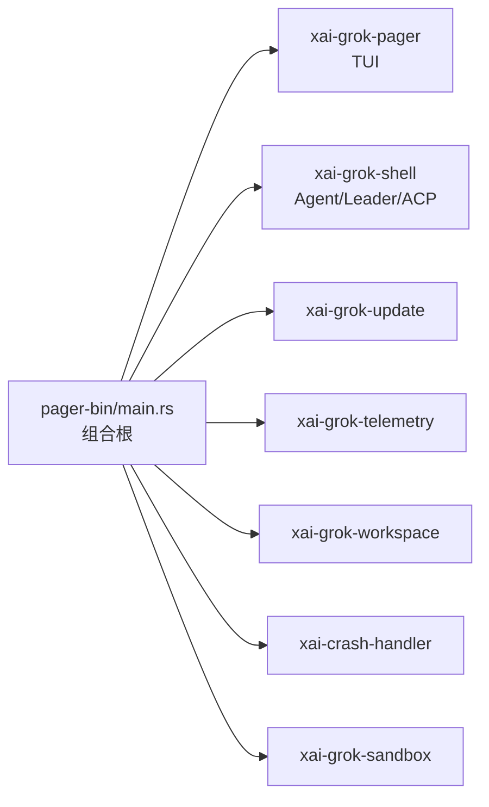
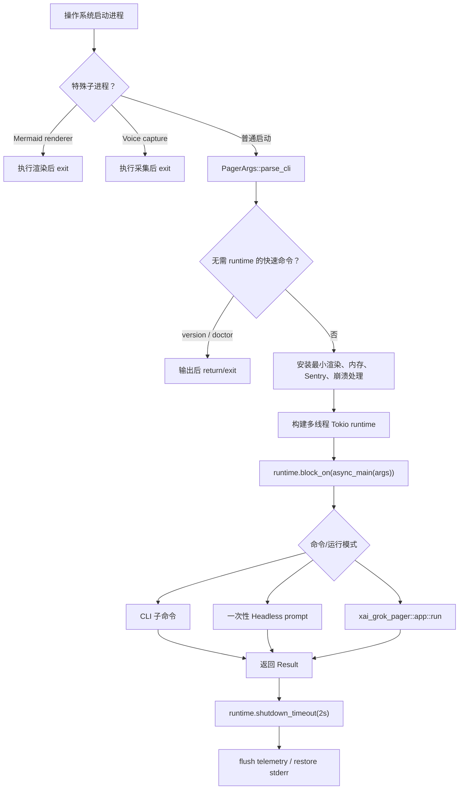
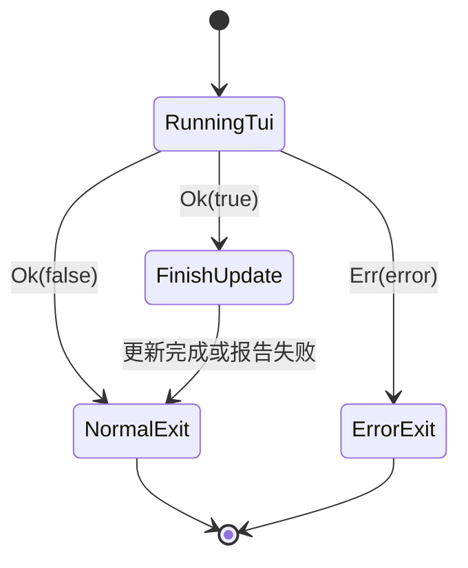
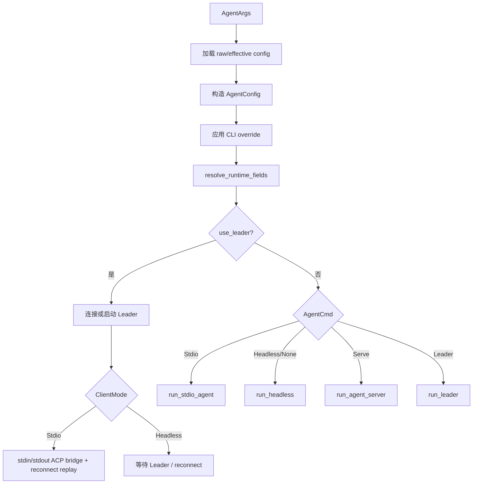

# 01：程序入口与启动分发

## 1. 本章目标

读完本章应能够回答：

- Cargo 如何找到这个程序的 `main.rs`？
- 为什么 `main()` 不是 `async fn main()`？
- 程序启动时，为什么先检查 Mermaid/语音子进程？
- `grok --version`、`grok agent ...`、一次性 prompt 和默认 TUI 分别走哪条路径？
- Tokio runtime、Sentry guard、崩溃处理和自动更新何时初始化？
- `Result`、`?`、`match`、`Option`、条件编译和所有权移动在入口中怎样使用？

## 2. 文件定位与职责

| 项目 | 位置/值 |
|---|---|
| Cargo 包 | `crates/codegen/xai-grok-pager-bin` |
| Manifest | `crates/codegen/xai-grok-pager-bin/Cargo.toml` |
| Rust 入口 | `crates/codegen/xai-grok-pager-bin/src/main.rs` |
| Cargo package name | `xai-grok-pager-bin` |
| 二进制 artifact name | `xai-grok-pager` |
| 官方安装名 | `grok` |
| 当前文件规模 | 3166 行 |

`Cargo.toml` 中的关键配置：

```toml
[package]
name = "xai-grok-pager-bin"
default-run = "xai-grok-pager"

[[bin]]
name = "xai-grok-pager"
path = "src/main.rs"
```

`package name` 是 Cargo 选择包时使用的名字，所以运行命令是 `cargo run -p xai-grok-pager-bin`；`[[bin]].name` 是生成的可执行文件名。两者不同是合法且常见的。

这个 crate 是 composition root（组合根）：它把 Pager、Shell、Workspace、Telemetry、Update、Crash Handler 等库装配为一个进程。它应该决定“使用哪个实现、以什么模式启动”，但不应该实现 Agent 的业务循环。



## 3. 整体启动流程



## 4. `main()`：同步启动壳

### 4.1 为什么不是 `#[tokio::main] async fn main()`

项目手动构建 runtime：

```rust
let runtime = tokio::runtime::Builder::new_multi_thread()
    .enable_all()
    .build()
    .unwrap_or_else(|e| panic!("failed to start tokio runtime: {e}"));
let result = run_and_shutdown(runtime, async_main(args), RUNTIME_SHUTDOWN_GRACE);
```

这样做的主要工程目的，是在任务退出后调用 `runtime.shutdown_timeout(2s)`。普通 Drop 可能无限等待不可取消的 blocking task，而该程序宁愿在两秒宽限后放弃它，避免 CLI 永远无法退出。`#[tokio::main]` 会隐藏 runtime 的创建和销毁，不方便精确控制这个阶段。

### 4.2 特殊子进程优先早退

`main()` 最先调用：

```rust
maybe_run_render_subprocess()
maybe_run_capture_subprocess()
```

这两个函数检查当前进程是否实际上是由主程序重新拉起的 Mermaid 渲染 worker 或语音采集 worker。如果命中，就完成专用工作并直接 `process::exit(code)`，不再初始化完整 CLI、TUI、更新器和 Agent。

这是同一二进制多角色复用模式：减少单独发布辅助可执行文件的成本，但要求分支必须发生得足够早，否则子进程会递归进入完整应用。

### 4.3 CLI 解析与快速命令

```rust
let args = PagerArgs::parse_cli();
if dispatch_version_if_requested(&args) || dispatch_doctor_if_requested(&args) {
    return;
}
```

这里把 `args` 以 `&PagerArgs` 不可变借用传入，因此两个函数只能读取，不能夺走所有权。`||` 具有短路行为：version 返回 true 后不会再检查 doctor。

version/doctor 在 runtime 创建前处理，可以减少启动成本，也避免诊断命令受异步系统初始化失败影响。后面的 `async_main()` 仍保留部分对应 match 分支，主要用于统一类型穷尽或兼容其他解析路径；doctor 分支标记为 `unreachable!`，表示命中即是程序逻辑错误。

### 4.4 条件编译与 jemalloc

文件顶部和 `main()` 中大量使用：

```rust
#[cfg(all(feature = "jemalloc", unix))]
```

这不是运行时 `if`，而是编译阶段决定代码是否存在。Unix 且启用 `jemalloc` feature 时：

- 使用 `tikv_jemallocator::Jemalloc` 作为全局分配器；
- 安装释放 retained page 的 hook；
- 暴露 allocator stats/dump；
- 安装 heap profile hooks。

未满足条件时，相关符号不会进入产物。新手阅读时必须同时查看 `Cargo.toml [features]`，否则会误以为某段代码始终执行。

### 4.5 启动保护与资源 guard

`main()` 随后依次完成：

1. 启动 memory trace。
2. macOS 尝试提高文件描述符软限制；失败不阻止启动。
3. `validate_requirements()` 校验托管版本/策略；失败以退出码 2 结束。
4. 初始化 Sentry，并把 guard 绑定到 `_sentry_guard`。
5. 提取内嵌用户文档。
6. 先安装只恢复终端的 crash handler，再按配置安装完整 crash handler。
7. 收集上次异常结束的 session。

`_sentry_guard` 虽然以下划线开头，却不是无意义变量。它的 Drop 负责结束/刷新资源，因此必须活到 `main()` 后部；错误退出前代码还显式 `drop(_sentry_guard)`。

### 4.6 顶层错误处理

```rust
if let Err(e) = result {
    xai_tty_utils::restore_native_stderr();
    eprintln!("Error: {e:#}");
    drop(_sentry_guard);
    std::process::exit(1);
}
```

`if let` 适合只关心 enum/Result 的一个分支。`{e:#}` 是 anyhow 的 alternate pretty display，会打印错误上下文链。先恢复 stderr 是因为 TUI 可能替换或重定向了终端输出；不恢复就可能看不到错误。

## 5. `async_main()`：异步顶层路由器

函数签名：

```rust
async fn async_main(args: PagerArgs) -> anyhow::Result<()>
```

参数按值传入，表示函数取得 `PagerArgs` 所有权，可以修改并把内部字段移动给下游。返回 `Result<()>`：成功没有额外值，失败携带 anyhow error。

### 5.1 启动环境规范化

最前面完成：

- 安装 rustls ring crypto provider；返回值被 `_` 丢弃，重复安装不作为致命错误。
- `args.apply_cwd()?` 应用 `--cwd` 并返回更新后的参数。
- 将 compaction/chat/leader/debug CLI 选项写入环境变量，供较深层的旧接口读取。
- debug 模式只在变量尚未设置时填默认值，保留用户显式配置。

Rust 2024 中进程环境变量修改被标记为 `unsafe`，因为其他线程同时读取/写入环境可能产生平台相关风险。这里发生在 runtime 主流程早期，但 runtime 已经建立，所以代码用局部 `unsafe` 明确承担安全前提。

### 5.2 runtime 内的轻量早退

`completions` 和 `wrap` 在完整配置/沙箱/TUI 之前返回。`?` 的含义是：

```text
成功：取出 Ok 内的值继续
失败：把错误转换为当前函数错误类型并立即 return Err(...)
```

### 5.3 恢复会话与沙箱一致性

程序先固定本地 resume target，然后读取已保存 session 的 sandbox profile。若用户尝试用不同 sandbox profile 恢复旧 session，代码打印错误并退出，而不是静默切换。

这是可复现性和安全设计：同一个会话不能在不提示的情况下获得比创建时更宽或不同的文件/网络能力。

### 5.4 判断交互客户端类型

```rust
let is_interactive = args.command.is_none()
    && args.single.is_none()
    && args.prompt_json.is_none()
    && args.prompt_file.is_none();
```

只有没有子命令、没有任何一次性 prompt 输入时才是 TUI。随后全局 HTTP client name 被设置为 `GrokPager` 或 `Generic`，用于权限、User-Agent 或遥测区分。

## 6. 顶层命令分发

### 6.1 为什么使用 `args.command.take()`

```rust
if let Some(command) = args.command.take() {
    match command { ... }
}
```

`take()` 把 `Option<Command>` 中的值移出来，并在原位置留下 `None`。这样 match 可以拥有 `command`，自由移动各 variant 中的参数，同时 `args` 仍可继续使用。若直接 `match args.command`，会发生 partial move，后续访问 `args` 容易被借用检查器拒绝。

### 6.2 命令分类

| 命令 | 主要调用 | 特点 |
|---|---|---|
| `Version` | `write_version` | 同步输出或 JSON |
| `Agent` | `run_agent_command` | 进入 stdio/headless/serve/leader 多模式 |
| `Doctor` | `unreachable!` | runtime 前已消费 |
| `Inspect` | `xai_grok_shell::inspect` | 检查当前工作区 |
| `Setup` | managed config | 认证后获取并安装托管配置 |
| `Mcp` | `xai_grok_pager::mcp_cmd::run` | MCP 管理 |
| `Plugin` | plugin command | 插件扫描/安装/管理 |
| `Models` | `list_available_models` | 先加载磁盘配置 |
| `Leader` | `run_leader_mgmt` | list/info/kill leader |
| `Worktree` | worktree command | Git worktree 管理 |
| `Workspace` | `run_workspace_mgmt` | 暴露/暂停/恢复 Workspace |
| `Sessions` | sessions command | 会话列表和管理 |
| `Share` / `Export` | pager command modules | 分享或导出会话 |
| `Trace` | trace command | 诊断追踪 |
| `Memory` | memory command | 记忆维护 |
| `Update` | `run_update_command` | channel/version/update |
| `Login` / `Logout` | shell auth | 完成后 finalize and exit |
| `Wrap` / `Completions` | 轻量工具 | 通常更早已返回 |
| `Dashboard` | 设置环境标记后继续 | 不是立即退出，而是进入 TUI dashboard |

多数 CLI 子命令先调用 `init_tracing_simple("cli")`。TUI 有自己的日志/渲染需求，不能直接复用简单 stderr tracing。

### 6.3 `match` 的价值

`Command` 是 enum。match 必须覆盖全部 variant，因此新增子命令后编译器会提醒这里更新。相比字符串 if/else，这种分发能在编译期保证穷尽性，并把每个 variant 自带的强类型参数解构出来。

## 7. 一次性 Headless 路径

当没有 CLI command，但存在 `--prompt`、JSON prompt 或 prompt file 时：


如果提供 JSON Schema 且输出格式仍是 Plain，代码自动改为 Json，避免结构化结果被普通文本格式破坏。`HeadlessOptions` 聚合 session、resume、cwd、权限、模型、规则、工具、最大回合数和后台等待等参数。

这里大量字段从 `args` 移入 options。移动后不能再访问相应字段，但函数立即 `return ...await`，所以这种所有权消费很自然，也避免不必要 clone。

## 8. 默认 TUI 路径

既没有子命令，也没有一次性 prompt 时进入默认主路径：

1. 再次执行版本策略检查。
2. 创建 OTEL guard。
3. 若允许自动更新，spawn 后台检查任务；通过 oneshot 把更新信息传给 TUI。
4. 调用 `xai_grok_pager::app::run(args, bg_update_rx).await`。
5. TUI 返回后 flush sandbox。
6. `Ok(true)` 表示用户选择“退出并完成更新”，入口等待或重新执行更新。
7. `Ok(false)` 表示普通退出。
8. `Err(e)` 向 `main()` 传播，由顶层恢复 stderr 并打印。



`JoinHandle` 被放入 `Arc<tokio::sync::Mutex<Option<_>>>`，使启动更新任务和退出处理代码能够共享“下载子进程等待句柄”。`Option` 表达可能没有下载任务，`take()` 确保退出阶段只接管一次。

## 9. `run_agent_command()`：第二条主干

`grok agent ...` 不进入 Pager TUI。它先加载有效配置、合并 CLI endpoint/model/reasoning/permission/profile/plugin 设置，再决定是否使用 Leader。



### Leader 的意义

Leader 是独立长生命周期 Agent 进程。客户端可以连接它而不是在每次调用中重新初始化全部状态。stdio 模式还维护 `StdioReplayState`：连接断开重建后，先重放 initialize，再恢复每个已打开 session。

这里是学习 Tokio 的好例子：

- `Arc` 让 stdin task 和 stdout task 共享发送端与 replay state；
- `std::sync::Mutex` 用于不跨 `.await` 的短临界区；
- `tokio::sync::Mutex` 用于需要跨异步任务保护的 leader sender；
- `CancellationToken` 通知两个泵共同停止；
- `tokio::select!` 等待 stdin 或 stdout 任一任务结束；
- bounded reconnect 防止无限重试。

## 10. 辅助函数按职责分类

`main.rs` 很长，不代表所有函数都属于同一抽象层。可以按下面顺序二次阅读：

| 组 | 代表函数/类型 | 学习重点 |
|---|---|---|
| 配置覆盖 | `apply_headless_args_to_config`、`apply_agent_endpoint_args` | `if let Some`、只覆盖显式参数 |
| 路径校验 | `resolve_agent_profile_path` | canonicalize、守卫条件、进程退出 |
| tracing | `init_tracing_simple` | subscriber layer、EnvFilter |
| setup | `run_setup_command` | enum outcome、fail closed |
| leader 管理 | `run_leader_mgmt`、`connect_to_leader` | async RPC、capability negotiation |
| workspace gate | `WorkspaceGate`、`workspace_command_gate` | 区分 Disabled 与 Unknown |
| ACP replay | `StdioReplayState`、replay functions | JSON-RPC、状态恢复、timeout |
| 资源限制 | `raise_fd_limit` | `unsafe` FFI、平台条件编译 |
| runtime | `run_and_shutdown` | 泛型 Future、显式 shutdown |
| 内存 | jemalloc hooks | allocator、mallctl、feature gate |
| 更新 | `finish_update_on_exit` 等 | 后台任务、子进程、版本策略 |

## 11. 新手容易误读的地方

1. `main.rs` 是组合根，不是 Agent 核心算法；真正的对话循环在 `xai-grok-shell`。
2. `return Ok(())` 与 `process::exit` 不同：前者会正常展开栈并执行 Drop，后者立即终止进程。
3. `_sentry_guard` 不是无用变量，它依赖生命周期触发资源清理。
4. `args.command.take()` 不是复制，而是移动并留下 `None`。
5. `.await` 不是创建线程；它允许当前 task 挂起，让 runtime 调度其他 task。
6. `tokio::spawn` 后如果不 await JoinHandle，后台任务可能随 runtime 关闭被取消。
7. `unsafe set_var` 不表示环境变量值本身危险，而是并发修改进程全局环境的安全契约需要调用方保证。
8. `WorkspaceGate::Unknown` 不能等同于 Disabled；代码特意保留不同错误信息。
9. `Ok(true)`/`Ok(false)` 来自 Pager 的特殊协议，bool 表达是否因更新而退出，不是一般意义上的成功/失败。
10. `#[cfg]` 代码可能在当前机器完全未编译，阅读时必须结合 target 和 features。

## 12. 建议动手验证

```bash
# 只做编译期检查
cargo check -p xai-grok-pager-bin

# 走 main 中 runtime 前的快速路径
cargo run -p xai-grok-pager-bin -- --version

# 查看 Clap 生成的命令树
cargo run -p xai-grok-pager-bin -- --help
cargo run -p xai-grok-pager-bin -- agent --help

# 查看入口 crate 直接和间接依赖
cargo tree -p xai-grok-pager-bin --depth 2
```

观察问题：为什么 `--version` 不需要启动 Tokio？为什么 dashboard 分支没有立即 return？为什么 headless 返回前不进入 `xai_grok_pager::app::run`？

## 13. 下一步阅读

下一章应进入 `PagerArgs` 和 `Command` 定义，回答 CLI 参数是怎样由 Clap 转成强类型 enum/struct 的。建议从以下符号开始搜索：

```bash
rg -n 'struct PagerArgs|enum Command|enum AgentCmd|fn parse_cli|fn apply_cwd' \
  crates/codegen/xai-grok-pager/src
```

理解参数模型后，再分别沿两条主线继续：交互模式读 `xai_grok_pager::app::run`，非交互模式读 `run_agent_command` 调用的 `xai_grok_shell::agent::app`。
