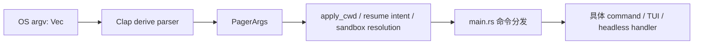
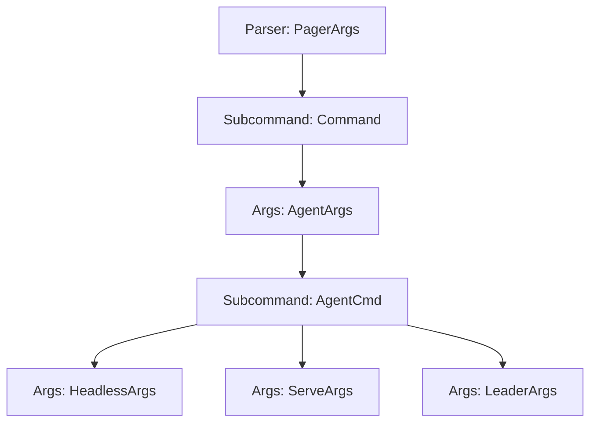
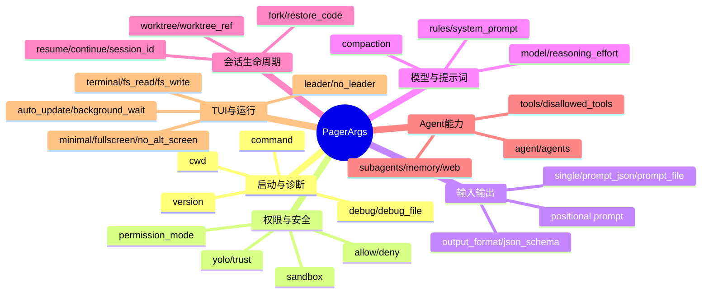
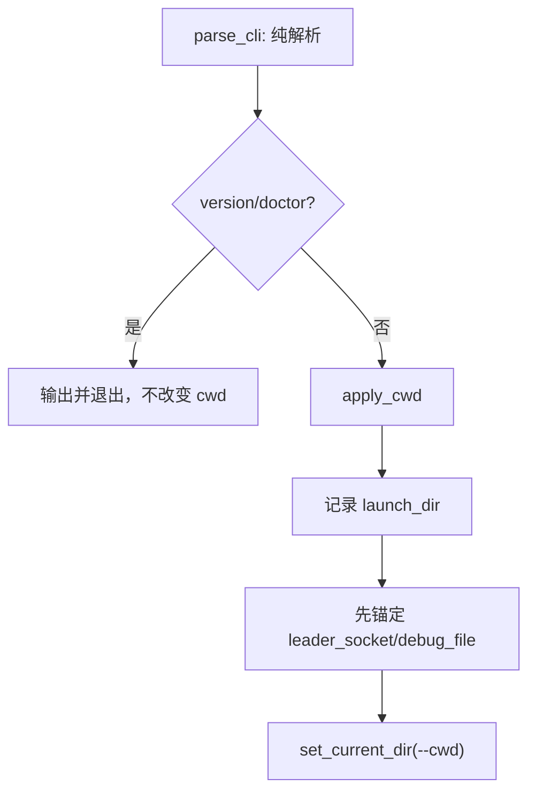
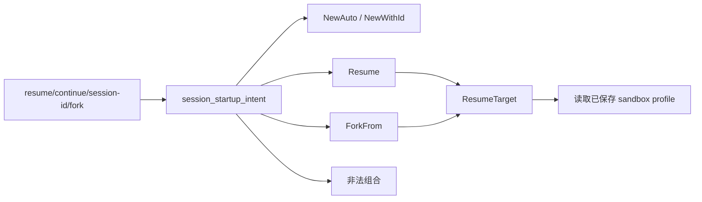

# 02：CLI 参数模型与 Clap

## 1. 本章目标

本章沿着入口中的 `PagerArgs::parse_cli()` 阅读 `crates/codegen/xai-grok-pager/src/app/cli.rs`。读完后应能回答：

- Clap 怎样把字符串参数变成 Rust struct 和 enum？
- `Parser`、`Args`、`Subcommand` 分别用于什么层级？
- `#[arg]` 和 `#[command]` 属性什么时候只影响帮助文本，什么时候会拒绝输入？
- 为什么顶层参数同时支持 TUI、一次性 Headless 和几十个子命令？
- `Option<String>`、`Vec<String>`、bool 和 enum 分别表达什么参数语义？
- `flatten`、`global`、`conflicts_with`、`requires`、`num_args` 如何工作？
- 为什么解析成功不等于参数已经可以安全执行？
- `apply_cwd()`、resume 和 sandbox 逻辑为什么放在 CLI 模块里？

## 2. 源码范围和职责边界

| 项目 | 内容 |
|---|---|
| 主要文件 | `crates/codegen/xai-grok-pager/src/app/cli.rs` |
| 文件规模 | 1410 行 |
| 输入 | `std::env::args()` 中的操作系统字符串参数 |
| 主要输出 | `PagerArgs` |
| 主要依赖 | `clap`、`clap_complete`、`PathBuf`、`SocketAddr` |
| 下游使用方 | `xai-grok-pager-bin/src/main.rs`、Pager 启动和 Session startup |

CLI 模块负责两类工作：

1. **语法层**：参数叫什么、是什么类型、能否重复、是否冲突、属于哪个子命令。
2. **启动语义辅助**：路径相对哪个目录、恢复哪个会话、沙箱配置是否冲突。

它不负责真正执行登录、启动 TUI、连接 Leader 或调用模型；这些行为仍在 `main.rs` 和相应 command module 中。



## 3. Clap 的三个 derive 层级

### 3.1 `Parser`：整个命令行的根

```rust
#[derive(Debug, Clone, Parser)]
pub struct PagerArgs { ... }
```

`Parser` 为根结构生成 `parse()`、`parse_from()`、`try_parse_from()` 等方法。`PagerArgs` 对应完整的：

```text
grok [OPTIONS] [PROMPT] [COMMAND]
```

### 3.2 `Subcommand`：互斥的命令分支

```rust
#[derive(Debug, Clone, Subcommand)]
pub enum Command { ... }
```

enum 的每个 variant 对应一个子命令。用户输入 `grok models` 后得到 `Some(Command::Models)`；输入 `grok update --check` 后得到带字段的 `Command::Update { check: true, ... }`。

使用 enum 的好处是：同一次解析只会选择一个 variant，并且下游 match 必须穷尽处理所有命令。

### 3.3 `Args`：可复用的一组参数

```rust
#[derive(Debug, clap::Args, Clone, Default)]
pub struct HeadlessArgs { ... }
```

`Args` 不能独立代表完整命令，它嵌入 Parser 或 Subcommand variant。例如 `HeadlessArgs` 被 `AgentArgs`、`ServeArgs` 和 `LeaderArgs` 复用。



## 4. 顶层 `Command` enum

`Command` 把命令名称和参数类型绑定在一起。三种常见 variant 形态如下。

### 4.1 无参数 unit variant

```rust
Models,
Logout,
Dashboard,
```

它们只表达“选择了这个命令”。

### 4.2 tuple variant

```rust
Agent(Box<AgentArgs>),
Mcp(crate::mcp_cmd::McpArgs),
Plugin(crate::plugin_cmd::PluginArgs),
```

variant 携带另一个结构体。`AgentArgs` 使用 `Box`，避免大型参数结构直接增大整个 `Command` enum。Rust enum 的大小至少等于最大 variant；装箱后 enum 中只保存一个固定大小指针。

### 4.3 struct variant

```rust
Version { json: bool },
Update { check: bool, version: Option<String>, ... },
```

适合参数较少、只在这个命令使用的情况。下游可以直接模式匹配并解构字段。

### 4.4 命令模块拆分原则

| 方式 | 示例 | 适用原因 |
|---|---|---|
| 字段直接放 variant | Version、Update、Login | 参数少或紧密属于该命令 |
| 引用同文件 Args | Agent、Leader、Workspace、Wrap | 有嵌套层级或被多处复用 |
| 引用其他模块 Args | MCP、Plugin、Sessions、Worktree | 子系统本身较大，应由自己的模块维护 |

## 5. `#[command]`：命令级元数据

`PagerArgs` 顶部的属性决定根命令行为：

```rust
#[command(
    name = "grok",
    version = env!("VERSION_WITH_COMMIT"),
    about = "Grok Build TUI",
    disable_version_flag = true,
    help_template = "..."
)]
```

### 5.1 `env!` 是编译期宏

`env!("VERSION_WITH_COMMIT")` 在编译时读取环境变量并把值写进二进制；缺失会导致编译失败。它不同于运行时 `std::env::var()`。

### 5.2 为什么关闭 Clap 默认 version flag

项目设置 `disable_version_flag = true`，并自行定义：

```rust
#[arg(short = 'v', short_alias = 'V', long = "version", action = ArgAction::SetTrue)]
pub version: bool,
```

原因是项目希望先把版本请求解析成普通字段，再由 `main()` 在 Tokio runtime 创建前快速处理，同时还支持 `grok version --json` 这个正式子命令。默认 Clap version action 通常会在解析时直接打印并退出，不利于自定义通道、JSON 和启动顺序。

## 6. `#[arg]` 常用规则详解

### 6.1 名称、别名和可见别名

```rust
#[arg(long = "reauth", visible_alias = "--reauthenticate")]
```

- `long`：正式长参数。
- `alias`：兼容别名，帮助文本通常不展示。
- `visible_alias`：帮助文本可见的别名。
- `short` / `short_alias`：单字符形式。

项目大量保留旧参数 alias，说明 CLI 是外部契约，不能随意删除历史拼写。

### 6.2 bool 不总是简单开关

普通 bool flag 出现时为 true，不出现时为 false。version 显式使用 `ArgAction::SetTrue`，强调它只是设置意图，不让 Clap 自动退出。

### 6.3 `Option<T>` 表达“用户是否提供”

```rust
pub model: Option<String>
```

`None` 表示 CLI 没覆盖配置，后续应保留配置文件或远端默认值；`Some(value)` 才覆盖。这比给 `String` 设置空字符串默认值更能表达优先级。

### 6.4 `Vec<T>` 表达可重复或多值

```rust
pub plugin_dirs: Vec<PathBuf>
pub allow_rules: Vec<String>
```

`--plugin-dir` 可重复出现。allow/deny 又配置 `value_delimiter = ','`，所以一次传逗号列表和多次传参都能进入 Vec。

### 6.5 `value_enum`

```rust
#[clap(long = "output-format", value_enum, default_value = "plain")]
pub output_format: OutputFormat,
```

`OutputFormat` 实现 Clap 的 ValueEnum 后，只有定义过的字符串能解析。相比接收任意 String，它把输入校验提前到 CLI 边界。

### 6.6 `value_parser` 与范围

```rust
value_parser = clap::value_parser!(u32).range(1..)
```

`--max-turns 0` 会在解析阶段失败；下游拿到 `Some(n)` 时可以依赖 `n >= 1`，减少重复校验。

### 6.7 `conflicts_with` / `conflicts_with_all`

```rust
#[arg(long, conflicts_with = "no_leader")]
pub leader: bool,
```

Clap 会拒绝同一次调用同时出现冲突参数。例如：

- `--leader` 与 `--no-leader`
- `--minimal` 与 `--fullscreen`
- `--single`、`--prompt-json`、`--prompt-file`
- `--experimental-memory` 与 `--no-memory`

这些约束解决纯语法歧义，但不能表达所有业务状态；复杂 session 组合仍由 `session_startup_intent()` 检查。

### 6.8 `requires`

```rust
#[arg(long = "worktree-ref", requires = "worktree")]
```

使用 `--worktree-ref` 必须同时提供 `--worktree`。注意 requires 检查“参数是否出现”，不负责验证 Git ref 是否存在。

### 6.9 可选值 flag：`num_args` + `default_missing_value`

```rust
#[arg(num_args = 0..=1, default_missing_value = "")]
pub resume_session: Option<String>,
```

产生三种状态：

| 输入 | Rust 值 | 含义 |
|---|---|---|
| 没有 `--resume` | `None` | 不按此参数恢复 |
| `--resume` | `Some("")` | 恢复当前目录最近会话 |
| `--resume abc` | `Some("abc")` | 按 ID 或标题恢复 |

空字符串在这里是 sentinel（哨兵值）。因此代码必须用 `resume_most_recent()` 和 `session_to_resume()` 区分，不能简单判断 `is_some()`。

`--worktree` 也使用同样模式：空字符串表示自动命名，有值表示指定名字。

### 6.10 `global = true`

`leader_socket`、`debug`、`debug_file` 是 global 参数，所以既可写在子命令前，也可写在深层子命令后：

```bash
grok --debug-file /tmp/grok.log agent stdio
grok agent stdio --debug-file /tmp/grok.log
```

其他非 global 顶层参数没有这个保证。

### 6.11 `flatten`

```rust
#[command(flatten)]
pub headless: HeadlessArgs,
```

flatten 把嵌套 struct 的字段平铺到当前命令层，不增加额外命令名。它实现参数定义复用，而不是运行时继承。

### 6.12 `skip`、`hide` 和 `value_hint`

- `#[clap(skip)]`：字段完全不从 CLI 解析，用默认值初始化，供解析后的内部状态使用。
- `hide = true`：仍可解析，但不展示在普通 help 中，常用于兼容、实验或内部参数。
- `ValueHint::DirPath/FilePath`：给 shell completion 提示，不等于检查路径真实存在。

## 7. `PagerArgs` 参数域地图

`PagerArgs` 字段很多，按功能域理解比按源码顺序背诵更有效。



### 7.1 三种 prompt 不是一回事

| 参数 | 模式 | 行为 |
|---|---|---|
| 位置参数 `PROMPT` | 交互 TUI | 启动 TUI 后作为初始 prompt |
| `-p/--single` | 一次性 Headless | 输出回答后退出 |
| `--prompt-json` | 一次性 Headless | 输入为结构化 content blocks |
| `--prompt-file` | 一次性 Headless | 从文件读取 prompt |

它们通过 conflicts 互斥。`initial_prompt()` 会 trim 位置参数，并把纯空白当成 None；Headless 输入由 `HeadlessPrompt::from_args` 另行解析。

### 7.2 正向/反向 flag 对

项目常同时提供 `leader/no_leader`、`minimal/fullscreen`、`experimental_memory/no_memory`。原因通常是配置文件可能已有一个 sticky 默认值，CLI 必须同时能够临时开启和临时关闭。

## 8. `parse_cli()` 为什么重写 argv[0]

```rust
pub fn parse_cli() -> Self {
    let bin_name = std::env::args()
        .next()
        ...
        .filter(|n| *n == "grok" || *n == "agent")
        .unwrap_or("grok")
        .to_owned();
    Self::parse_from(std::iter::once(bin_name).chain(std::env::args().skip(1)))
}
```

操作系统传入的 argv[0] 可能是完整路径、Cargo artifact 名或安装别名。代码只保留 `grok`/`agent`，其他情况统一显示为 `grok`，从而让 usage 和错误提示稳定，不暴露临时构建路径。

这里有一个迭代器链：

1. `once(bin_name)` 生成只含规范化程序名的迭代器。
2. `std::env::args().skip(1)` 再次读取 argv，跳过原 argv[0]。
3. `chain` 把两者连接。
4. `parse_from` 消费迭代器。

`parse_from` 遇到错误会打印并退出；测试使用 `try_parse_from`，这样能得到 `Result` 并断言错误类型，而不会终止测试进程。

## 9. `apply_cwd()`：解析与副作用分离

源码注释明确说 `parse_cli()` 不产生副作用。改变进程 cwd 延后到早期 version/doctor 分发之后。



### 为什么先锚定路径再切 cwd

假设从 `/project` 启动：

```bash
grok --cwd /other --debug-file logs/debug.log
```

`debug-file` 应相对启动目录 `/project`，而不是新 cwd `/other`。所以代码先取 launch dir，并用 `Option::take()` 移出 PathBuf，重写为锚定路径，最后才 `set_current_dir`。

`take()` 把字段换成 None，允许函数取得 PathBuf 所有权而不 clone，处理完再放回 Some。

`strip_cur_dir()` 只删除 `.` component，不会 canonicalize `..`，因此不会要求路径已经存在，也不会提前解析符号链接。

## 10. Agent 参数的嵌套结构

命令语法：

```text
grok agent [AGENT_OPTIONS] [stdio|headless|serve|leader]
```

`AgentArgs` 包含 model、reasoning effort、yolo、profile、plugin dirs、leader 开关、endpoint override 和可选 `AgentCmd`。

`mode: Option<AgentCmd>` 允许不写子命令；入口会把 None 当作默认 headless。这里 `Option` 是协议兼容的一部分，而不是遗漏校验。

### 10.1 `canonical_plugin_dirs()`

该方法展示了典型 iterator pipeline：

```rust
self.plugin_dirs
    .iter()
    .filter_map(|p| match dunce::canonicalize(p) { ... })
    .collect()
```

- `.iter()` 借用每个 PathBuf，不移动原 Vec。
- `filter_map` 同时过滤无效项并转换有效项。
- 只有存在且为目录的路径进入结果。
- 错误写 stderr，因为 stdio Agent 的 JSON-RPC 使用 stdout，不能被人类提示污染。

这属于解析后语义校验：Clap 的 `ValueHint::DirPath` 只帮助补全，不保证目录存在。

### 10.2 `ServeArgs::get_secret()`

```rust
self.secret.clone().unwrap_or_else(|| generate_random_key(12))
```

方法借用 `&self`，不能把 `self.secret` 移走，所以 clone Option 中的 String。只有 None 时才执行 closure 生成随机 key；`unwrap_or_else` 是惰性的，区别于总会先计算参数的 `unwrap_or`。

## 11. 会话恢复不是简单字段判断

恢复相关参数能组合成多种语义：新会话、指定新 ID、恢复、恢复最近、fork 恢复源、continue、worktree 等。复杂规则在 `session_startup.rs` 的 `session_startup_intent()` 中统一归类。



### 11.1 标题恢复为何在沙箱前 pin

用户可能传 `--resume "fix login"` 而不是 UUID。代码在 OS sandbox 应用前，把标题解析为稳定 session ID，并设置 `resume_target_pinned`。

原因有两点：

1. 应用 sandbox 后可能无法读取本地 session 列表。
2. 如果解析两次，期间其他进程重命名/创建 session，可能选到不同目标。

这是一种 TOCTOU 防护：选择一次并保存不可变结果，后续不重新决策。

### 11.2 沙箱 profile fail closed

`startup_sandbox_profile()` 比较用户显式 profile 与被恢复会话保存的 profile。不同则返回：

```rust
SandboxStartup::Conflict { requested, saved }
```

而不是偷偷使用其中一个。profile 名会先解析成 `ProfileName`，所以 `readonly` 与 `read-only`、`none` 与 `off` 等规范化别名可以视作同一值。

## 12. Clap 校验与业务校验的边界

| 校验 | Clap 能处理 | 必须后续处理 |
|---|---|---|
| 类型 | u32、u64、SocketAddr、PathBuf 语法 | endpoint 是否可连接、路径权限 |
| 枚举 | OutputFormat、permission possible values | 远端是否支持模型/能力 |
| 参数关系 | conflicts、requires、出现次数 | session 组合语义、配置优先级 |
| 数值范围 | max-turns/background timeout > 0 | 是否满足运行预算 |
| 路径提示 | ValueHint | 文件/目录存在性、canonicalize、sandbox |
| 默认值 | plain、600 秒等 | 配置或远程设置的最终合并 |

原则是：能由单次 argv 静态判断的错误尽量在 Clap 层拒绝；依赖磁盘、配置、会话状态或远端能力的判断放到解析后。

## 13. 错误行为和退出码

Clap 解析错误通常输出 usage，并以退出码 2 结束，例如未知参数、冲突或缺值。业务校验失败通常返回 `anyhow::Error`，最终由 `main()` 打印并退出 1；托管 requirements 失败在入口中特别使用退出码 2。

测试中可以检查：

```rust
let err = PagerArgs::try_parse_from([
    "grok", "--minimal", "--fullscreen"
]).unwrap_err();
assert_eq!(err.kind(), clap::error::ErrorKind::ArgumentConflict);
```

`try_parse_from` 让解析错误变成值，是可测试性设计。

## 14. 测试覆盖反映的设计意图

`cli.rs` 的单元测试不只检查“能解析”，还记录兼容契约：

- `--version`、`-v`、`-V` 都只设置早期 intent。
- doctor 支持/拒绝哪些形态。
- resume/continue/fork 怎样归类。
- minimal/fullscreen 必须冲突。
- plugin-dir 可重复且事后 canonicalize。
- sandbox alias 的等价性。
- launch directory anchoring 发生在 cwd 切换前。
- global 参数能出现在子命令之后。
- positional prompt 与 headless prompt 的区别。

对大型 CLI 而言，这些测试就是兼容性规格。修改 arg 名称、alias、默认值或冲突关系时必须同步检查已有脚本和用户文档。

## 15. 新手容易误读的地方

1. `PathBuf` 解析成功不代表路径存在，也不代表有权限。
2. `hide = true` 不是禁用参数，只是不显示。
3. `skip` 才表示不从 CLI 读取。
4. `Option<String>::Some("")` 在 resume/worktree 中有明确业务含义。
5. `flatten` 不创建新层级，而是把字段平铺。
6. `global` 允许参数放到子命令之后，不代表字段自动传给每个 handler。
7. `parse_from` 可能直接退出；测试应优先 `try_parse_from`。
8. Clap conflicts 只检查 argv，不理解 config.toml 或已保存 session。
9. `Command::Agent(Box<AgentArgs>)` 使用 Box 主要是控制 enum 大小，不是异步或共享所有权。
10. CLI 文件中的方法已经有少量文件系统副作用；纯解析和语义规范化要分阶段理解。

## 16. 动手验证

```bash
# 查看根命令、Agent 二级和 Leader 三级命令树
cargo run -p xai-grok-pager-bin -- --help
cargo run -p xai-grok-pager-bin -- agent --help
cargo run -p xai-grok-pager-bin -- agent serve --help
cargo run -p xai-grok-pager-bin -- leader --help

# 只运行 CLI crate 内相关单元测试（按测试名过滤）
cargo test -p xai-grok-pager cli::tests

# 搜索参数的定义和消费位置
rg -n 'permission_mode_flag|resume_target_pinned|background_wait_timeout_secs' \
  crates/codegen/xai-grok-pager crates/codegen/xai-grok-pager-bin
```

可自行预测再验证：

```bash
grok --minimal --fullscreen
grok -p hello --prompt-file prompt.txt
grok --worktree-ref main
grok --resume
grok agent --plugin-dir ./missing stdio
```

前三条应在 Clap 层因冲突或 requires 失败；`--resume` 应解析成空字符串哨兵；不存在的 plugin dir 能通过 Clap，但在 canonicalize 阶段被警告并跳过。

## 17. 下一步阅读

第 03 章进入默认交互路径 `xai_grok_pager::app::run(args, bg_update_rx)`，重点理解：

- TUI 如何选择 fullscreen、inline 或 minimal screen mode；
- 配置、认证、终端和会话如何初始化；
- 事件循环如何组织输入、Shell 事件和渲染；
- 为什么 Pager 是表现层，而 Agent 执行在 Shell。

建议先定位：

```bash
rg -n '^pub async fn run|^async fn run' crates/codegen/xai-grok-pager/src/app
rg -n 'struct App|enum AppEvent|EventLoop' crates/codegen/xai-grok-pager/src/app
```
