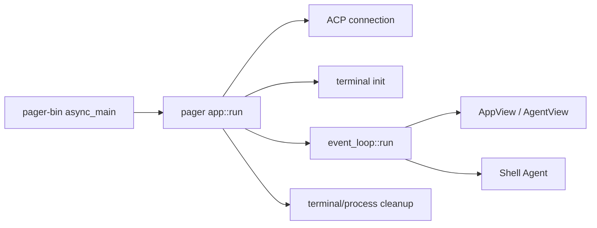
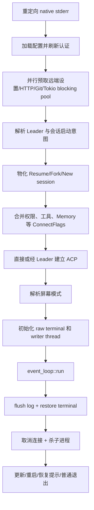
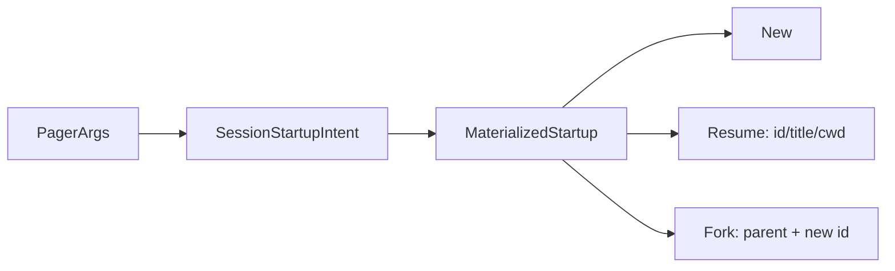
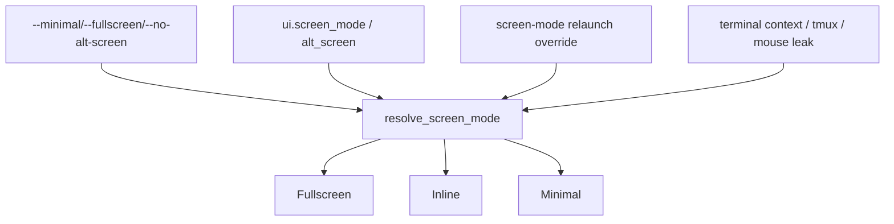
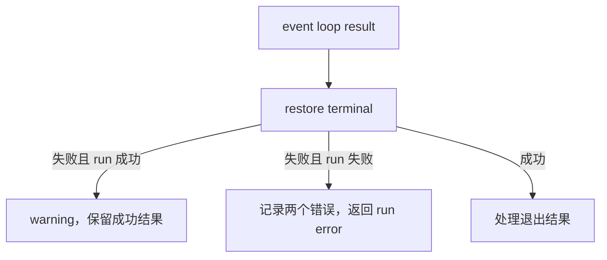

# 03：TUI 应用启动

## 1. 阅读目标与源码入口

本章从 `xai-grok-pager-bin::async_main()` 调用的 `xai_grok_pager::app::run(args, bg_update_rx)` 开始，主文件为 `crates/codegen/xai-grok-pager/src/app/mod.rs`。

`app::run` 的职责是组合 TUI 启动所需资源：配置、认证、远端设置、会话启动意图、ACP 连接、终端模式、事件循环和退出清理。它不执行具体 Agent 推理，也不负责每一帧如何绘制。



函数签名：

```rust
pub async fn run(
    args: PagerArgs,
    bg_update_rx: Option<oneshot::Receiver<Option<UpdateAvailable>>>,
) -> anyhow::Result<bool>
```

返回 bool 不是成功状态：`Ok(true)` 表示用户选择退出并完成更新，`Ok(false)` 是普通退出或已发起屏幕模式重启。

## 2. 启动阶段总览



启动次序具有安全含义：会话目标和 sandbox 信息在不可逆终端/沙箱状态前确定；终端恢复无论事件循环成功或失败都会执行。

## 3. 早期配置与并行预热

函数先调用 `redirect_native_stderr()`，因为 TUI 渲染和外部库日志都可能写 stderr，需要由 Pager 统一管理。随后创建 `CancellationToken`，它会传给 ACP 连接并在退出时广播取消。

配置第一次加载只为得到 `GrokComConfig` 并刷新认证。解析失败时记录 warning 并使用默认认证配置，而不是立即终止；第二次加载发生在远端设置预取后，得到最终 effective config。

启动期间主动并行预热：

| 操作 | 目的 |
|---|---|
| `try_ensure_fresh_auth` | 在远端请求前刷新凭据 |
| `start_early_prefetch_with_auth` | 提前请求模型/远端设置 |
| `warm_async_http_client` | 提前建立 HTTP client 的昂贵状态 |
| `spawn_blocking(|| {})` | 预热 Tokio blocking pool |
| `populate_from_cwd_async` | 后台读取 Git 信息 |

这些调用减少首屏后的等待。`join_early_prefetch` 是同步等待点：在这里汇合此前的并行任务，再把 remote settings 写入进程缓存。

## 4. Leader 和会话启动决策

`resolve_use_leader` 合并 CLI 的 `--leader/--no-leader`、配置和远端策略。若策略禁用 Leader，会后台清理仍可达的 stale leader。

随后分两步处理会话：

1. `session_startup_intent()`：纯逻辑分类 New/Resume/Fork，拒绝非法参数组合。
2. `materialize_startup(...).await`：访问本地/远端存储，把意图变成可执行的 `MaterializedStartup`。



`session_title` 和 `session_cwd` 从 materialized 结果中提取，用于终端标题和事件循环。代码使用对 `&materialized` 的 match，只借用 enum，避免在还需传给 event loop 前把其字段移动走。

## 5. 连接参数与 ACP 边界

`ConnectFlags` 汇总跨进程 Agent 所需的运行能力：subagent、Memory、Web、TodoGate、storage、terminal、客户端 FS、提示词覆盖、权限规则、reasoning effort、yolo/auto mode 等。

这些值来自多个来源：

```text
CLI 显式值 > requirements/权限约束 > 用户配置 > 远端设置 > 内置默认
```

入口只组装值，真正使用发生在 ACP initialize 和 Shell session 中。连接有两种适配器：

```rust
if use_leader {
    crate::acp::connect_via_leader(...).await?
} else {
    crate::acp::connect(...).await?
}
```

两者返回统一 connection，所以下游事件循环不需要知道 Agent 是当前进程子任务还是共享 Leader。

## 6. 屏幕模式解析

项目支持三类实际终端布局：Fullscreen、Inline、Minimal。最终模式由多个信号决定：CLI、重启环境覆盖、配置、终端能力、alternate-screen 策略和鼠标报告泄漏探测。



Minimal 请求仍可能在 `init_terminal` 探测失败后降级为 Inline，所以函数返回 `(terminal, effective_screen_mode)`，调用者不能假定请求值就是实际值。

## 7. `init_terminal()` 的关键技术

终端初始化按顺序执行：

1. 允许 crash handler 输出终端恢复 escape。
2. `enable_raw_mode()`：按键不再由 shell 行缓冲处理。
3. 清理启动前残留输入，避免字符进入 prompt。
4. Fullscreen 进入 alternate screen；Minimal 保留原生 scrollback。
5. 非 Minimal 开启鼠标捕获；全部模式启用 focus change 和 bracketed paste。
6. 隐藏光标，并按配置决定是否强制 blink/style。
7. 安装 panic hook 和信号处理。
8. 探测 Kitty keyboard enhancement。
9. 创建 CrosstermBackend 和 Ratatui terminal。

这里大量操作是 best-effort，因为不同终端支持差异很大。raw mode 和核心 backend 创建失败会返回 `io::Error`；颜色、增强键盘等能力可能降级继续。

Windows 通过 FFI 设置 UTF-8 code page/VTP，并专门管理 QuickEdit；macOS/Linux 则主要依赖 ANSI/DEC 模式。`#[cfg]` 使平台实现只在目标系统编译。

## 8. 为什么有独立 writer thread

`spawn_writer_thread()` 返回 frame sender、同步对象、writer event receiver 和 thread handle。事件循环产生 frame，但真实终端写入放在独立线程：

- 避免慢终端写阻塞 Tokio 事件处理；
- 把 stderr 写入串行化；
- 支持帧合并/同步；
- restore 时能够 join writer，保证没有线程继续向已恢复的 shell 终端写 escape。

## 9. 传给事件循环的有效参数

会话已经在启动阶段物化，因此代码构造：

```rust
let effective_args = PagerArgs {
    resume_session: None,
    load_session: None,
    continue_last_session: false,
    session_id: None,
    fork_session: false,
    ..args
};
```

struct update syntax `..args` 移动其余字段。清空会话选择字段防止事件循环再次解释启动参数，形成“双重恢复/创建”。这是“决策一次，传递结果”的设计。

`TerminalState` 则携带已经解析的终端事实，避免事件循环再次探测并得到不一致结果。

## 10. Event loop 调用与借用

```rust
let result = event_loop::run(
    &mut terminal,
    connection,
    &mut config_watcher,
    &effective_args,
    ...
).await;
```

- terminal 和 config watcher 以可变借用传入，事件循环可更新它们但不取得所有权；
- connection、remote settings、materialized startup 等按值移动，生命周期归事件循环；
- args 只读借用，防止运行期间意外篡改启动配置。

`.await` 返回后可再次使用 terminal 执行 restore，因为所有权仍在 `run()`。

## 11. 清理顺序与双错误处理

事件循环结束后无论结果如何都执行：

1. flush unified log；
2. `restore_terminal(terminal, writer_thread, screen_mode)`；
3. `cancel.cancel()` 终止 ACP/后台任务；
4. `global_process_scope().kill_all()` 回收工具子进程。

终端恢复错误不会覆盖原始 event-loop 错误。若主流程成功，只 warning cleanup error；若主流程失败，同时记录两个错误但最终返回 run error。这种策略保留最有诊断价值的根因。



## 12. 退出结果

`RunResult` 可能包含：

- `quit_for_update`：返回 `Ok(true)` 给二进制入口；
- `relaunch`：用 exec 重启为另一 screen mode；
- `exit_info`：终端恢复后打印 resume 命令和会话摘要；
- 普通退出：`Ok(false)`。

恢复提示必须在 terminal restore 后打印，否则内容会进入 alternate screen 并随退出消失。

## 13. Rust 学习要点

| 语法/机制 | 本章实例 |
|---|---|
| 所有权 | args、connection、materialized 移入下游 |
| 借用 | `&mut terminal` 运行后仍可 restore |
| struct update | 清空已消费字段并移动其余 args |
| `if let` chain | 同时判断模式和 enum variant |
| `Option` | update receiver、session title、remote settings |
| `CancellationToken` | 多任务广播式取消 |
| 原子变量 | 保存极少量跨层 screen/terminal gate |
| 条件编译/FFI | Windows console 与平台终端差异 |
| 错误上下文 | `map_err` 把底层配置错误变成启动语义错误 |

## 14. 新手易错点

1. `app::run` 是 TUI composition，不是永久循环本身；循环在 `event_loop::run`。
2. 配置加载两次是为了认证/远端预取后的有效值，不是无意义重复。
3. 请求 Minimal 不保证实际 Minimal，终端探测可以降级。
4. `cancel.cancel()` 不会等待所有任务完成，只广播取消；进程还需 `kill_all()`。
5. 恢复终端是正确性要求，不只是美化，否则 shell 会停留在 raw mode。
6. 进程级 AtomicBool 是跨深层 UI 的窄桥梁，不应扩展为主要状态存储。
7. `Ok(true)` 不是“运行更成功”，而是更新退出协议。

## 15. 验证与下一步

```bash
rg -n '^pub async fn run|event_loop::run|fn init_terminal|fn restore_terminal' \
  crates/codegen/xai-grok-pager/src/app/mod.rs
cargo test -p xai-grok-pager app:: --lib
```

第 04 章将越过表现层，阅读 `xai-grok-shell` 中 Agent/Session 应用循环，重点跟踪一次用户 prompt 如何进入模型采样、工具调用和回合终态。
