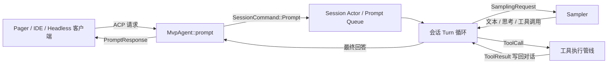
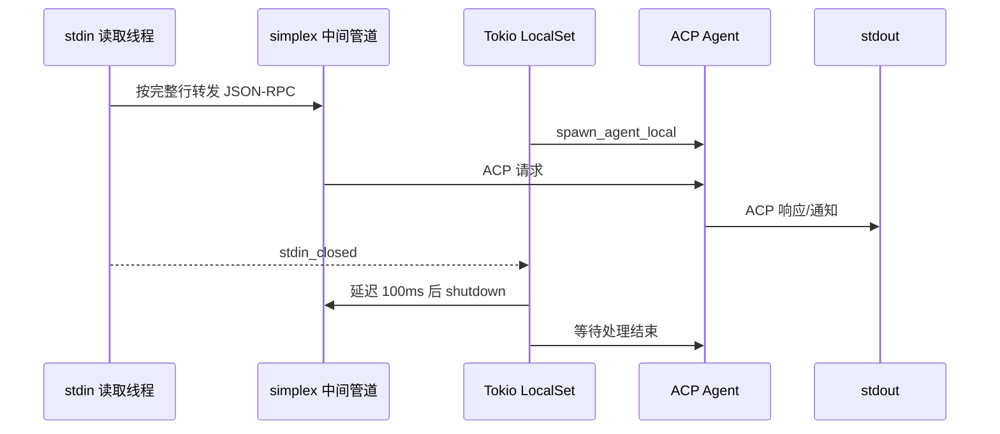
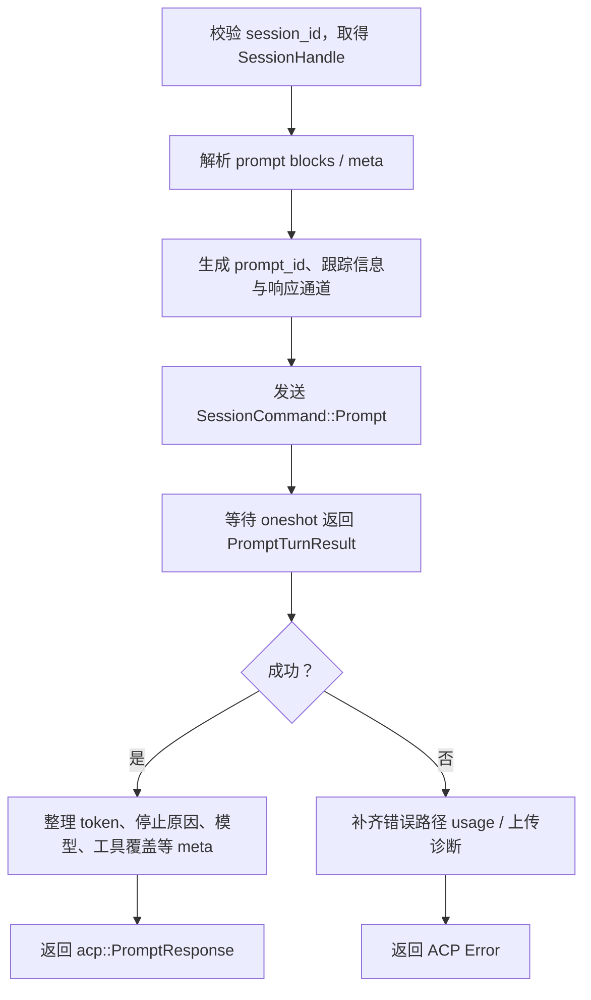
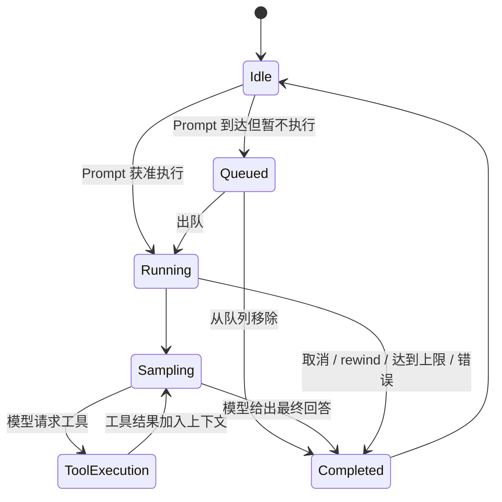
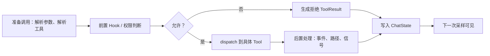
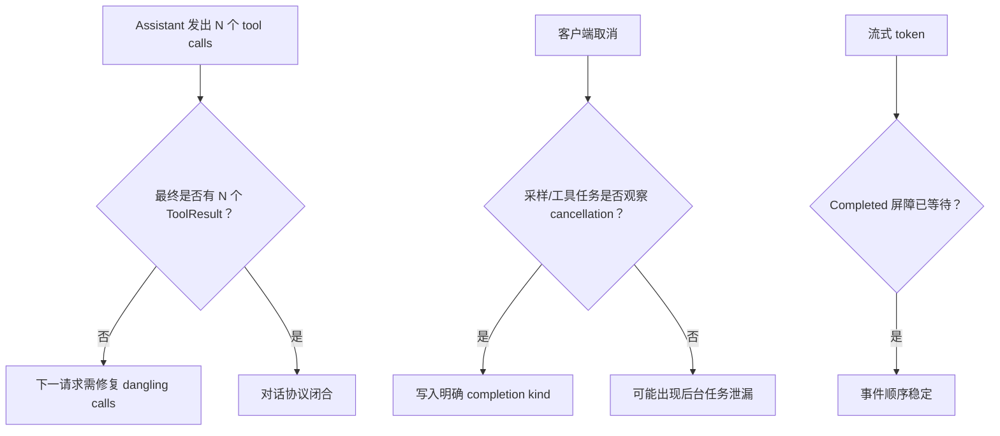

# 04：Agent 应用循环——一次 Prompt 如何变成多轮“模型—工具”协作

> 阅读目标：理解 TUI 把请求交给 Agent 后，系统怎样接收 Prompt、调用模型、执行工具，并在模型给出最终文本后结束这一轮。本文聚焦主链，采样器、工具注册和持久化分别在后续章节展开。

## 1. 先建立正确的分层



这里有两个容易混淆的“循环”：

1. **进程级服务循环**：不断接收 ACP 请求，直到 stdin/连接关闭。
2. **单 Prompt 的 Turn 循环**：一次用户请求可能反复采样和调用工具，直到模型不再请求工具。

## 2. 关键源码地图

| 文件 | 作用 | 建议先找的符号 |
|---|---|---|
| `agent/app.rs` | 启动 stdio、headless、leader 等 Agent 宿主 | `run_stdio_agent` |
| `agent/mvp_agent/acp_agent.rs` | 实现 ACP Agent 接口，把协议请求转为会话命令 | `prompt`、`cancel` |
| `session/commands.rs` | 客户端与 Session Actor 的命令/返回值契约 | `SessionCommand`、`PromptCompletionKind` |
| `session/acp_session_impl/run_loop.rs` | Session Actor 的命令接收循环 | `SessionCommand::Prompt` 分支 |
| `session/acp_session_impl/turn.rs` | 一次 Prompt 内的多轮模型循环 | `run_turn_via_sampler` 调用点 |
| `session/acp_session_impl/sampler_turn.rs` | 构造并执行一次模型采样 | `run_turn_via_sampler` |
| `session/acp_session_impl/tool_calls.rs` | 工具执行与采样事件翻译 | `execute_tool_calls`、`handle_sampling_event` |

## 3. stdio Agent 的生命周期

`run_stdio_agent` 并不直接处理每个 Prompt，它负责搭建运行环境：



几个设计细节：

- stdin 使用专用 OS 线程读取，规避 Windows 重定向管道直到 EOF 才交付数据的问题。
- 中间 `simplex` 允许“真实 stdin 消息”和技能热加载等内部消息进入同一输入流。
- `LocalSet` 允许运行 `!Send` future；这与 Agent 内部的 `Rc`、`RefCell` 风格状态相容。
- stdin 关闭后稍作延迟再关闭管道，让已进入 LocalSet 的请求有机会刷出响应。
- Agent 退出后关闭 PTY 子进程，并给上传队列一个短暂的排空时间。

## 4. ACP `prompt` 是协议边界

`MvpAgent::prompt` 接收 `acp::PromptRequest`。它承担的是“协议适配”，不是模型推理本身：



这里采用“命令通道 + `oneshot` 回执”：

```rust
SessionCommand::Prompt {
    prompt_id,
    prompt_blocks,
    respond_to,
    // 还有模式、追踪、schema、工具覆盖等上下文
}
```

`mpsc` 把请求送给长期存活的 Session Actor；每个请求附带独立 `oneshot::Sender`，Actor 完成后只回复该调用者。这比让多个请求直接可变借用 Session 状态更容易保证串行一致性。

## 5. Session Actor 为什么存在

Session Actor 是会话状态的唯一协调者。它顺序处理 `SessionCommand`，从而把并发客户端请求转换成可控的状态迁移。



命令枚举让状态变化显式化。新增命令 variant 后，`match` 的穷尽检查会提示尚未处理的位置，这是 Rust enum 对大型状态机的重要价值。

## 6. 单个 Prompt 的核心 Turn 循环

主干可概括为：

```text
用户消息入会话
  └─> 构造当前上下文和工具定义
       └─> run_turn_via_sampler
            ├─ 最终文本：结束 Prompt
            └─ 工具调用：
                 execute_tool_calls
                   └─ ToolResult 追加到会话
                        └─ 回到下一次 run_turn_via_sampler
```

伪代码如下，重点是循环退出条件：

```rust
loop {
    let request = build_request_from_chat_state().await?;
    let response = self.run_turn_via_sampler(request).await?;

    if response.tool_calls.is_empty() {
        break final_answer;
    }

    self.execute_tool_calls(response.tool_calls).await?;
    // 工具结果已进入 conversation，下一轮模型能看到它们
}
```

真实代码还处理自动压缩、重试、最大轮数、取消、权限拒绝、结构化输出和遥测，因此不能把它理解成一个简单 HTTP 请求。

## 7. 流式事件与最终事实分离

Sampler 通过通道发出 `SamplingEvent`。Session 一边消费事件，一边向客户端推送增量：

| 事件 | 面向用户的效果 | 状态意义 |
|---|---|---|
| `StreamStarted` | 一次流开始 | 建立请求/延迟记录 |
| `FirstToken` | 首 token 到达 | 首包延迟指标 |
| `ChannelToken` | 文本或 reasoning 增量 | 流式显示 |
| `ToolCallDelta` | 工具参数逐步生成 | 可提前显示工具意图 |
| `Retrying` | 显示重试状态 | 当前尝试失败但请求未终止 |
| `Completed` | 完成当前采样 | 提交规范化 assistant response |
| `Failed` | 展示/传播错误 | 终止或交由上层恢复 |

一个关键屏障是：`run_turn_via_sampler` 必须等 `Completed` 的处理完成，之后才发布工具调用。否则可能出现客户端先看到工具执行，再看到此前遗漏的文本 token，导致事件顺序错乱。

## 8. 工具调用不是“函数一调用就完了”

`execute_tool_calls` 是一条分阶段管线：



同一响应里的多个工具调用也不能遗漏结果。若第二个调用被拒绝，后续调用可能被取消，但系统仍需为每个 call id 写入对应 `ToolResult`。这样下一次模型请求不会包含“悬空工具调用”。

## 9. 取消与完成不是一个布尔值

`PromptCompletionKind` 区分多种结束语义，例如：

- 正常完成；
- 用户取消；
- 从等待队列移除；
- rewind；
- 达到最大 turn 数。

这种 enum 比 `cancelled: bool` 信息更完整：客户端可给出不同提示，遥测可按原因聚合，恢复逻辑也能判断是否保留部分结果。

`cancel` 通过 `session_id` 找到会话，再在调度锁保护下发送取消意图。取消是协作式的：future 需要在 `.await`、通道或 cancellation token 检查点观察到它。

## 10. 本章涉及的 Rust 知识

### `LocalSet` 与 `Send`

`tokio::spawn` 要求 future 可跨线程移动，即实现 `Send`。`spawn_local` 只在当前线程的 `LocalSet` 上调度，因此可持有 `Rc`、`RefCell` 等 `!Send` 值。代价是该 Actor 的任务不能任意迁移到其他 worker。

### `mpsc` 与 `oneshot`

- `mpsc::Sender<SessionCommand>`：多个生产者向一个 Actor 发命令。
- `oneshot::Sender<Result>`：一次命令只返回一次结果。
- Sender 被 drop 时，Receiver 会得到关闭错误；这也是生命周期信号。

### `RefCell` 的运行时借用检查

单线程不等于无需可变性控制。`RefCell<T>` 把借用检查移到运行时；若可变借用跨过复杂调用或 `.await`，再次借用会 panic。因此阅读代码时要观察 `borrow_mut()` guard 何时离开作用域。

### `match` 让状态机可审计

对 `SessionCommand`、`SamplingEvent`、`PromptCompletionKind` 的 `match` 同时承担业务分发与编译期完整性检查。`_ =>` 虽方便，却可能掩盖新 variant，阅读时应特别注意。

## 11. 可靠性检查清单



项目测试覆盖了并行工具部分拒绝、崩溃后悬空调用修复、取消发生在工具中途、事件重放顺序等场景。这些测试比只读正常路径更能说明真实设计约束。

## 12. 推荐的继续阅读断点

1. 从 `MvpAgent::prompt` 中发送 `SessionCommand::Prompt` 的位置进入。
2. 跳到 `run_loop.rs` 的对应 `match` 分支，看排队与 admission。
3. 在 `turn.rs` 找 `run_turn_via_sampler` 和 `execute_tool_calls` 两个调用点。
4. 先不展开每个工具实现，只记录循环回边。
5. 下一章再进入 `xai-grok-sampler`，解释网络流如何变成 `SamplingEvent`。

验证符号位置可运行：

```bash
rg -n "SessionCommand::Prompt|run_turn_via_sampler|execute_tool_calls|handle_sampling_event" \
  crates/codegen/xai-grok-shell/src
```
