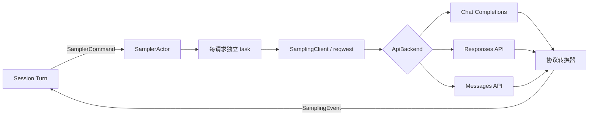
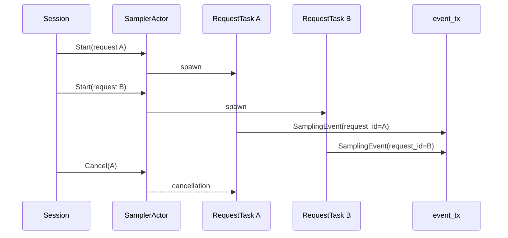
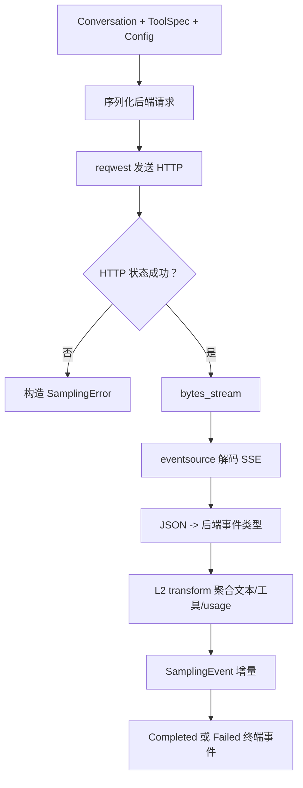
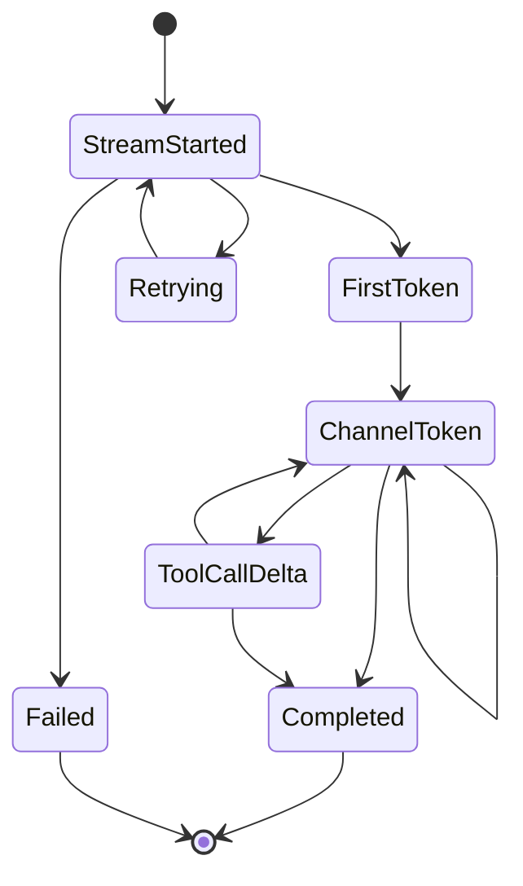
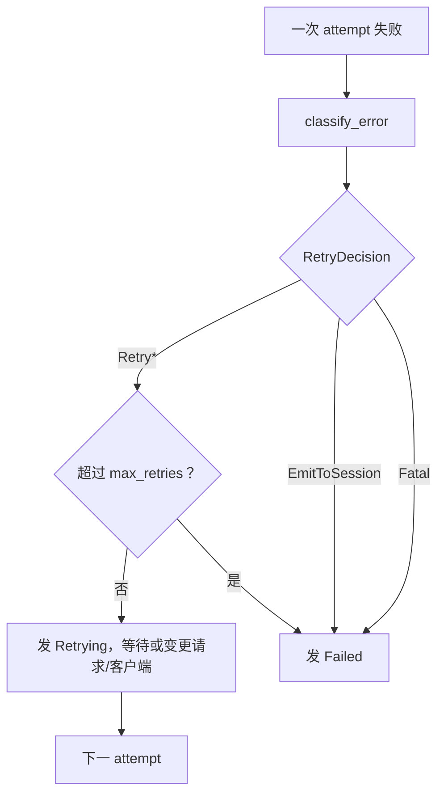

# 05：模型流式采样——从 HTTP SSE 到统一 `SamplingEvent`

## 1. 模块定位

`xai-grok-sampler` 位于会话逻辑与不同模型 API 之间。上层只处理统一请求与事件；下层负责认证、HTTP、SSE、三种协议适配、重试和指标。



`xai-grok-sampling-types` 则保存跨 crate 共享的数据契约，如 conversation、tool call、usage、reasoning、API backend 和错误类型。拆出共享 crate 可避免 Shell 与 Sampler 互相依赖。

## 2. 源码地图

| 文件 | 职责 |
|---|---|
| `lib.rs` | 对外导出稳定 API |
| `config.rs` | `SamplerConfig`、认证与重试配置 |
| `commands.rs` / `handle.rs` | 上层控制 Sampler Actor 的命令与句柄 |
| `actor/mod.rs` | 接收命令、管理请求任务 |
| `actor/request_task.rs` | 单请求尝试、消费流、分类重试 |
| `client.rs` | 构造 HTTP 请求、检查状态、解码 SSE |
| `stream/*.rs` | 将各后端 chunk 统一为 `SamplingEvent` |
| `events.rs` | 上层可观察的事件协议 |
| `retry.rs` | 错误分类和恢复决策 |

## 3. Actor 与请求任务的并发关系

`SamplerActor` 自己不持续读取网络流。它接收命令后，为每个采样请求创建独立任务：



事件包含 `request_id`，所以多个流可共享一个无界事件通道而不混淆归属。Actor 保留请求任务/取消状态，网络等待则由子任务承担，避免一个慢请求堵住其他控制命令。

## 4. 一次请求的分层转换



“L2”转换器的价值是把后端差异封装起来：

- Chat Completions 通常从 `choices[].delta` 读取内容和工具参数；
- Responses API 使用多种具名事件；
- Messages API 以 content block start/delta/stop 组织数据。

三条路径最后都产出同一套 `SamplingEvent`，Session 不需要用 `if backend == ...` 解释流。

## 5. SSE 并不是“一行一个 JSON”

Server-Sent Events 可能跨 TCP chunk。`response.bytes_stream()` 得到的是任意边界的字节片段，不能直接逐 chunk `serde_json::from_slice`。代码使用 `eventsource_stream` 先恢复完整 SSE event，再解析 `data`。

```text
HTTP bytes
  -> UTF-8/BOM 处理
  -> SSE framing（event/data/空行）
  -> [DONE] 或 JSON data
  -> 后端 typed event
```

代码还处理三个现实问题：

1. UTF-8 BOM，避免第三方 SSE 解码器错误切片。
2. `[DONE]`，它是协议终止标记而非 JSON。
3. 流内错误，有些服务在 HTTP 200 后才以 SSE data 报错。

## 6. `SamplingEvent` 是流的公共语言



不是每个流都有全部事件，但必须有一个终端结果。`drive_l2_stream` 会识别：

- `Completed` 且响应非空：成功；
- `Completed` 但结果为空：可能是截断/异常尝试；
- `Failed`：保留原始错误供分类；
- 流直接结束而无终端事件：合成“stream dropped”错误。

最后一条很关键：`Stream` 返回 `None` 只表示生产者结束，不等于业务成功。

## 7. 重试是显式决策枚举

`classify_error` 返回 `RetryDecision`，而不是简单 `bool`：

| 决策 | 行为 |
|---|---|
| `Retry { backoff }` | 指数退避后重试 |
| `RetryWithBackoff` | 尊重服务端 `Retry-After`，并受上限约束 |
| `RetryWithImageStrip` | 413/图片处理失败时移除内联图片再试 |
| `RetryWithClientRebuild` | 传输异常后以不同 HTTP 设置重建客户端 |
| `EmitToSession` | 交给会话层处理，例如认证恢复 |
| `Fatal` | 不可恢复，发送最终失败 |



认证错误通常不应在底层盲目重复，因为上层可能需要刷新 token；配置/序列化错误重试也不会改变结果。只有具备恢复条件的错误才进入循环。

## 8. 中途失败为何更难

若服务器在输出一半文本后断线，重试会产生一个全新的流。上层需要知道“旧尝试已失效”，否则 UI 会把两次尝试的文本拼接。

Request task 会：

1. 捕获 raw stream 的第一个真实错误；
2. 停止继续转发该尝试的终端事件；
3. 发出 `Retrying`；
4. 新尝试以新的 stream-start 语义开始；
5. 只将最终成功响应视为规范事实。

这也解释了上一章为何区分“流式展示”和“`Completed` 后提交的 assistant response”。

## 9. 配置与认证扩展点

`SamplerConfig` 除模型、URL、key、超时、上下文窗口外，还通过 trait 接入动态行为：

```rust
pub trait BearerResolver: Send + Sync + Debug {
    // 请求前动态解析 bearer
}

pub trait HeaderInjector: Send + Sync + Debug {
    // 为请求注入额外 header
}
```

`Send + Sync` 允许实现被共享到请求任务；`Debug` 便于配置诊断，但实现应避免把密钥打印出来。动态 resolver 使长期进程能使用刷新后的 token，而不必重建整个 Agent。

## 10. Rust 学习点

### `Stream<Item = T>`

异步 Stream 类似异步 Iterator。调用 `.next().await` 才取得下一项；它可能等待网络。`BoxStream` 用动态分发抹平三种后端返回的具体 stream 类型。

### `map`、`scan`、`filter_map`

这些组合子构成数据管线。`scan` 还能携带“是否已经遇错”等跨 item 状态，用于第一个传输错误后终止。

### `Arc<dyn Trait>`

认证 resolver 等实现的具体类型在编译期可能不同。trait object 提供运行时多态，`Arc` 提供共享所有权。

### 终端事件作为不变量

Rust 类型只约束“event 是哪种 variant”，不能自动保证流最后必有 `Completed/Failed`。所以 `drive_l2_stream` 在运行时验证协议不变量，并把裸 `None` 转为错误。

## 11. 安全与可观测性

- 不应在日志记录 bearer、API key 或完整敏感 prompt。
- 401 attribution 区分调用路径，帮助判断是客户端未带凭证还是某类 API 配置错误。
- 首 token 延迟、总推理延迟、重试次数和 HTTP 状态应分开记录。
- `Retry-After` 被限制最大值，避免异常服务端令交互无限沉睡。
- idle timeout 用于发现“连接存在但永远无新事件”的死流。

## 12. 建议阅读顺序与验证

```bash
# 先读对外事件和配置
sed -n '1,260p' crates/codegen/xai-grok-sampler/src/events.rs
sed -n '1,250p' crates/codegen/xai-grok-sampler/src/config.rs

# 再沿单请求主链
rg -n "run_single_attempt|drive_l2_stream|classify_error" \
  crates/codegen/xai-grok-sampler/src

# 最后比较三种协议转换器
rg -n "SamplingEvent::" crates/codegen/xai-grok-sampler/src/stream
```

下一章从模型返回的 `ToolCall` 出发，追踪工具如何被发现、解析并 dispatch 到具体实现。
