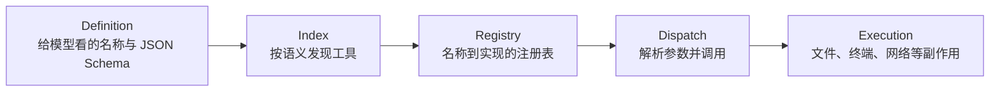
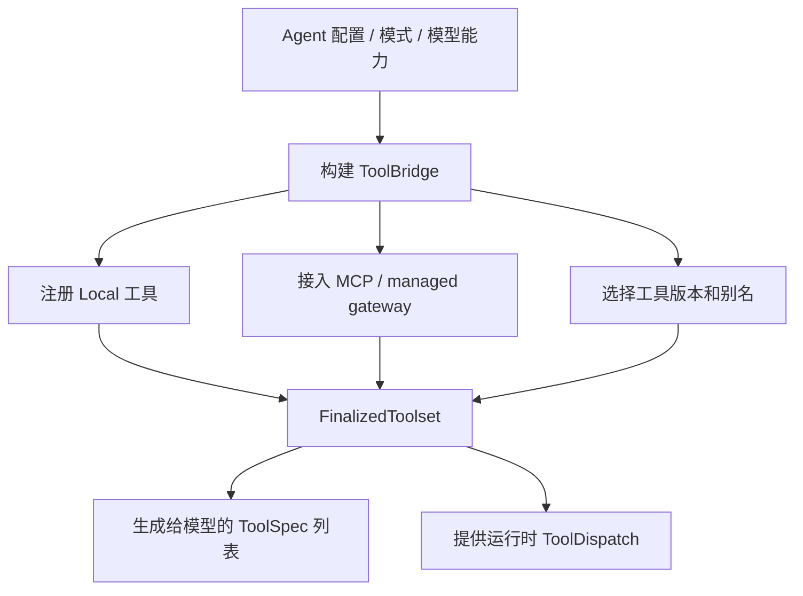
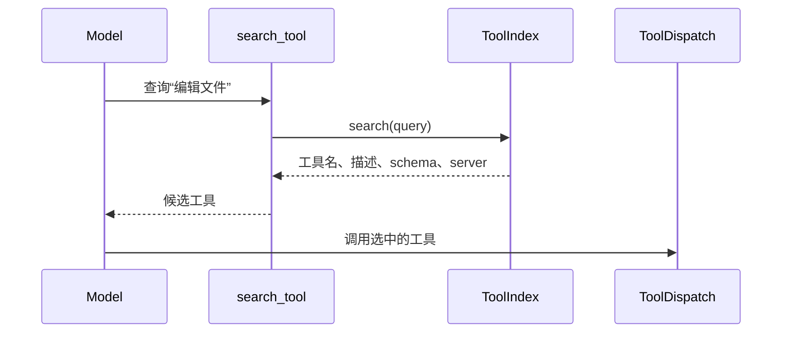
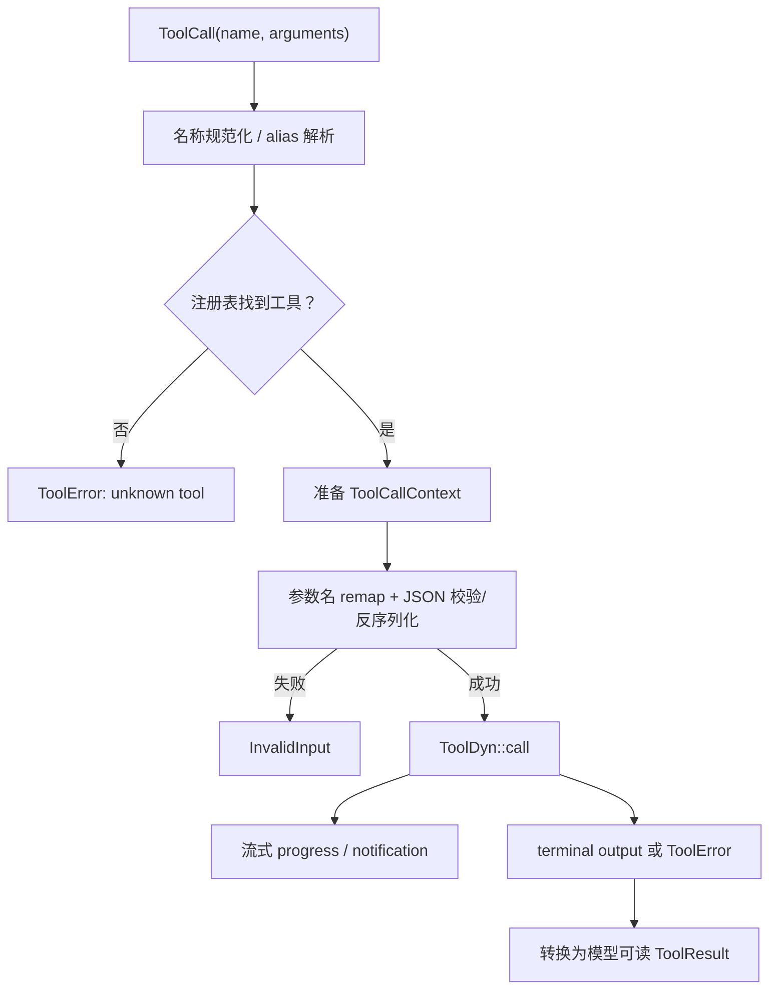
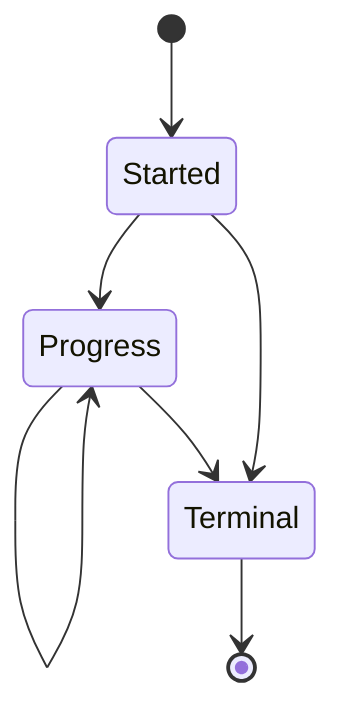

# 06：工具发现与调用——模型给出的 JSON 怎样找到 Rust 实现

## 1. 五层心智模型



同一个“工具”同时有描述、输入 schema、具体 Rust 类型、运行时擦除后的对象以及输出渲染形式。阅读时先判断代码处在哪一层。

## 2. crate 边界

| crate | 角色 |
|---|---|
| `xai-tool-runtime` | 最小公共运行时：`Tool`、`ToolDyn`、`ToolDispatch`、`ToolIndex`、context/error/output |
| `xai-grok-tools` | Grok 的工具类型、注册表、桥接层与大量具体实现 |
| computer/local 层 | 提供本地文件系统、shell、终端等环境能力 |
| Shell Session | 决定本轮可见工具、权限和调用时序 |

公共 runtime 不依赖某个具体工具集合，因此 MCP、本地工具或其他宿主都能共享调用契约。

## 3. `Tool` trait：强类型实现

`xai-tool-runtime/src/tool.rs` 中的 `Tool` 以关联类型表达输入输出：

```rust
pub trait Tool: Send + Sync {
    type Input: DeserializeOwned;
    type Output;

    // 名称/schema/调用接口
}
```

关联类型带来两点好处：

- 实现内部拿到的是结构体字段，而不是到处手写 `serde_json::Value`；
- 编译器能检查输出类型与渲染逻辑是否匹配。

但注册表要保存许多不同 `Input/Output` 的工具，无法直接创建 `Vec<dyn Tool>`。因此 runtime 另有 `ToolDyn`：它将输入输出擦除为统一的 JSON/流式封装，注册时通过适配器从强类型 `Tool` 转换。


这是一种常见 Rust 架构：内部用泛型获得类型安全，集合边界用 trait object 获得异构性。

## 4. Definition 与执行实现必须一致

模型只看得到 `ToolSpec`：

```text
name + description + JSON Schema
```

执行器拿到：

```text
call_id + name + arguments(JSON) + ToolCallContext
```

若 schema 声明字段 `path`，而 Rust 输入结构期待 `file_path`，模型即使完全遵守 schema 也会反序列化失败。项目通过版本表、名称映射和参数映射兼容不同客户端/工具风格，但这些映射必须在定义与 dispatch 两侧保持一致。

## 5. 注册表如何组装工具集

`xai-grok-tools/registry` 负责把工具实现、元数据、资源和版本整合为 finalized toolset。`ToolBridge` 是上层操作注册表的门面。



注册表还持有 `Resources`。资源是按类型存取的依赖容器，可包含 cwd、文件系统、进程管理器、通知句柄、权限信息、工具索引等。工具通过 context 获取能力，而非自行创建全局单例。

## 6. 工具发现：为什么还需要 `ToolIndex`

当工具很多时，把全部 schema 每轮都发给模型会占用上下文。`ToolSearchIndex` 提供语义/文本搜索：



`ToolIndex(pub Arc<dyn ToolSearchIndex>)` 是 newtype：

- `Arc` 让索引可被多个工具/会话共享；
- `dyn` 隐藏本地、远端等具体索引实现；
- newtype 可实现自己的 `Debug`，并避免把任意 `Arc<dyn ...>` 混用。

搜索结果携带 schema，模型发现工具后无需再发一次“取 schema”请求。

## 7. Dispatch 主链



`ToolCallContext` 承载的是单次调用信息，例如 call id、会话标识、取消信号、调用来源和 capability。共享 Resources 承载较长期依赖。区分二者可避免把某次调用的数据错误缓存到下一次。

## 8. 输出为什么有流式与终态

长命令或后台任务不能等全部完成才给反馈。`ToolStreamItem<T>` 区分进度与最终结果；`ToolProgress` 提供可展示的阶段信息。



上层可以把 progress 发给 UI，但只有 terminal output 才写成模型下一轮可依赖的 `ToolResult`。若流结束却没有 terminal item，dispatch 层应视为协议异常。

## 9. 名称、版本和兼容

仓库同时存在 Codex、OpenCode、Grok Build、concise、hashline 等工具族。它们可能实现相同能力，却使用不同：

- 工具名称；
- 参数名称；
- schema 版本；
- 输出格式；
- 编辑并发控制。

`ToolVariant`、版本注册、`ToolNameMapping`、`ParamKindNames` 等结构将兼容策略数据化。不要通过文件夹名称假定当前会话必然启用了该实现；最终以 finalized toolset 和本轮 ToolSpec 为准。

## 10. 错误边界

`ToolErrorKind` 应区分：

| 类型 | 含义 | 模型下一步 |
|---|---|---|
| 输入无效 | JSON/schema/参数错误 | 修正参数再调用 |
| 未找到 | 名称或资源不可用 | 搜索/选择其他工具 |
| 权限拒绝 | 用户或策略不允许 | 不应盲目重试 |
| 取消 | 会话停止或前序调用失败 | 结束当前执行链 |
| 执行失败 | OS、网络或具体工具错误 | 根据错误信息恢复 |
| 内部错误 | 实现违反不变量 | 记录诊断，谨慎重试 |

错误最终需要成为与原 call id 对应的 ToolResult；否则对话协议出现 dangling tool call。

## 11. Rust 学习点

### 关联类型与 object safety

有 `type Input` 的 trait 很适合泛型调用，但异构集合需要类型擦除。阅读 `ToolDyn` 时可观察项目如何把“编译期类型安全”桥接到“运行时动态注册”。

### `Arc<dyn Trait + Send + Sync>`

这是跨任务共享接口实现的典型写法。`Arc` 只解决共享所有权，不自动保证内部可变安全；可变状态仍需 Mutex/RwLock/Actor。

### typed resources

资源容器通常以 `TypeId` 为键保存 `Any`，读取时再 downcast。调用侧获得类型便利，但“资源缺失”变成运行时错误，因此构建 finalized toolset 时要验证必需资源。

### serde 边界

JSON 进入 Rust 的第一站应尽早反序列化为专用输入类型。这样未知字段、缺少字段和类型错误能在副作用发生前失败。

## 12. 阅读与验证路线

```bash
# 公共契约
sed -n '1,470p' crates/common/xai-tool-runtime/src/tool.rs
sed -n '1,180p' crates/common/xai-tool-runtime/src/dispatch.rs

# Grok 注册与桥接
rg -n "FinalizedToolset|call_raw|prepare_dispatch|ToolBridge" \
  crates/codegen/xai-grok-tools/src

# 查看具体工具族，而不是假定只有一种编辑器
find crates/codegen/xai-grok-tools/src/implementations -maxdepth 2 -type d | sort
```

下一章选择副作用最明显的文件编辑工具，继续追踪参数如何变成磁盘上的原子或非原子修改。
