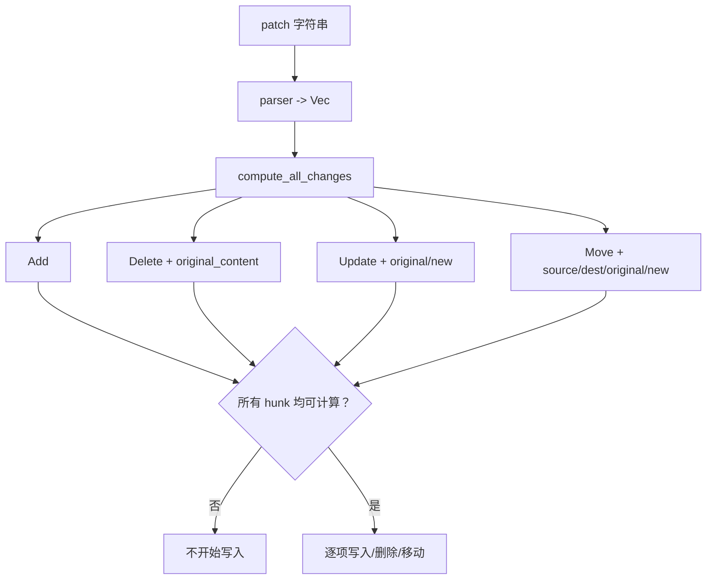
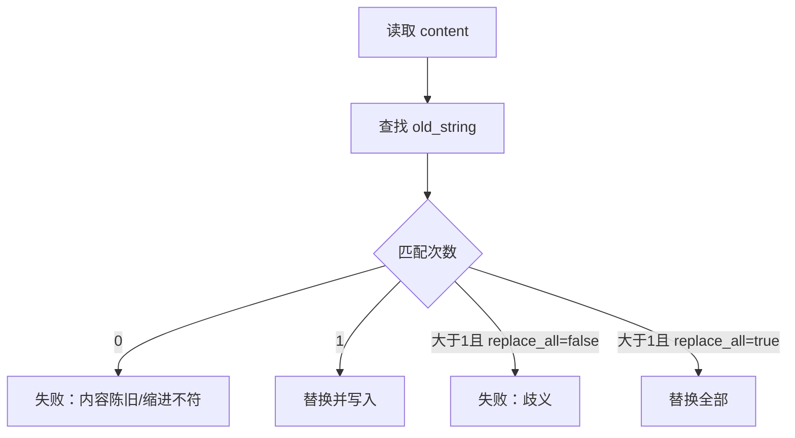
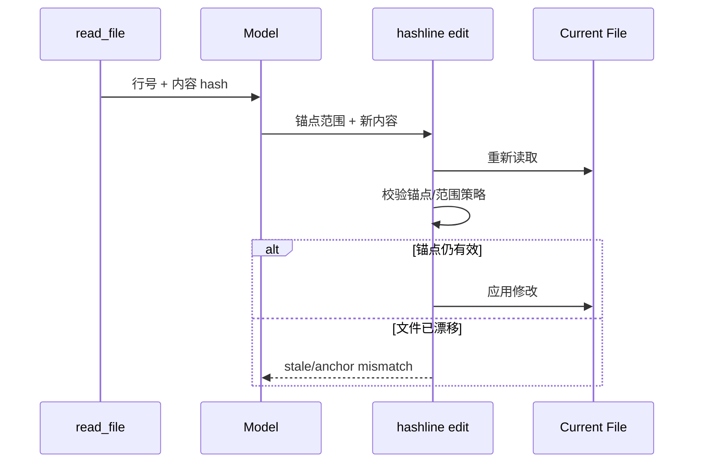
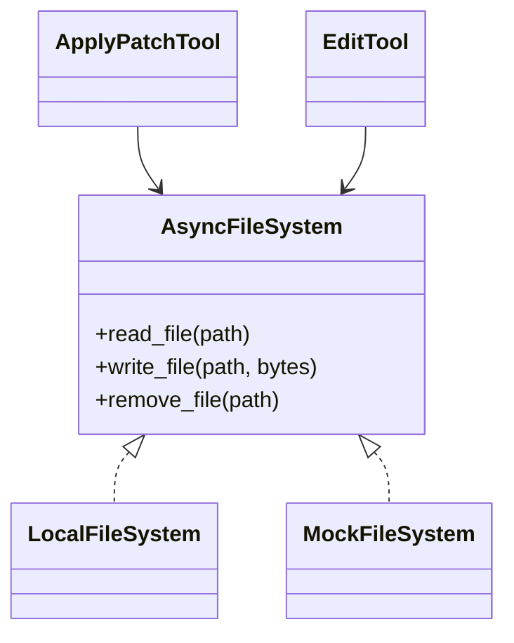
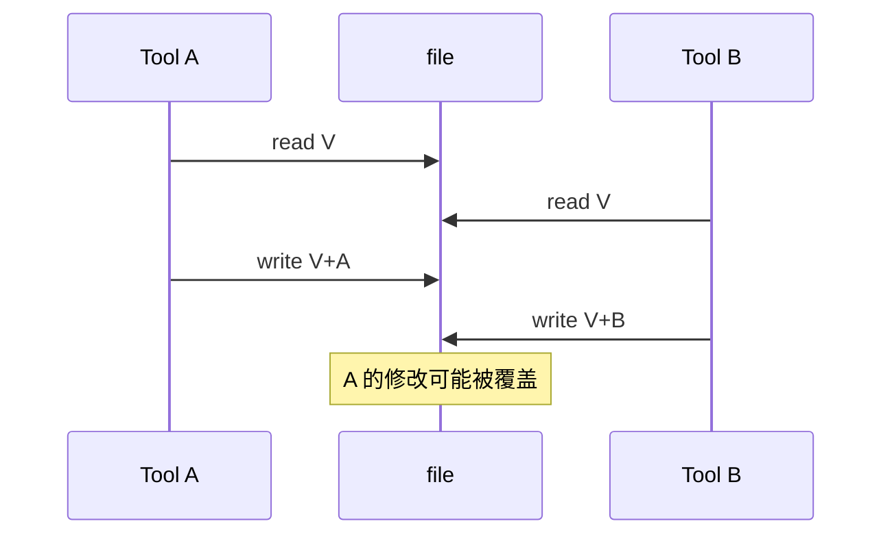
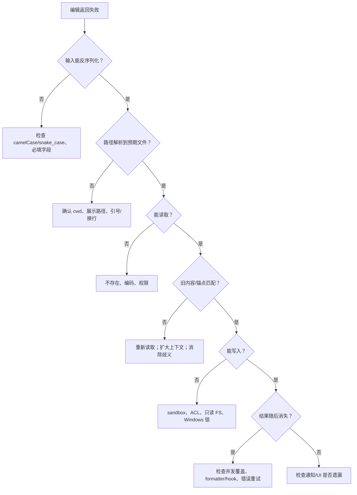

# 07：文件编辑链路——为何一次看似正确的修改会失败

## 1. 编辑不是单一步骤


“编辑失败”可能发生在任何一层。只看到最后的 error 文本，很容易把 schema、匹配、权限和 OS 写锁混成同一问题。

## 2. 三类编辑协议

| 方案 | 代表实现 | 定位方式 | 适用场景 |
|---|---|---|---|
| Patch | `codex/apply_patch` | 上下文 hunk | 多文件、增删改移组合 |
| 精确替换/写入 | `opencode/edit`、`write`、search_replace | `old_string` 精确匹配 | 小范围明确修改 |
| Hashline | `grok_build_hashline/edit` | 行内容生成的锚点/hash | 文件在读取后可能发生行号漂移 |

它们最终都通过 `AsyncFileSystem`，但并不共享完全相同的冲突语义。

## 3. `apply_patch` 的 Parse—Compute—Write

`ApplyPatchTool` 先把自定义补丁语言解析为 `Hunk`，再由 `compute_all_changes` 读取文件并计算全部 `FileChange`：



“先全量计算”能避免第三个 hunk 匹配失败时，前两个已写入。但计算成功后逐文件落盘仍不等同数据库事务：中途 OS 错误可能留下部分已写文件。

## 4. Patch hunk 怎样定位

Patch 不是按固定行号修改，而是用上下文寻找旧片段：

```diff
@@ fn greet()
 let name = user.name();
-println!("Hi {name}");
+println!("Hello {name}");
```

定位失败常见原因：

- 文件自读取后已变化，旧上下文不存在；
- 复制的空格、tab 或换行不一致；
- 相同片段出现多次，缺少足够上下文；
- patch 文件路径相对的 cwd 不正确；
- Add 行缺少 `+`，或 Begin/End/header 语法错误。

解决思路是重新读取、扩大上下文或增加 `@@` 函数/类定位，而不是重复提交完全相同的 patch。

## 5. 精确替换为何强调“唯一”

OpenCode `edit` 的输入为 `filePath`、`oldString`、`newString`、`replaceAll`。正常单点修改要求旧字符串只出现一次。



唯一性失败是一种保护：若工具随意替换第一个匹配，可能改到另一个同名函数。`replace_all` 只有在确实希望所有位置变化时才安全。

特殊规则：`old_string` 为空代表创建文件；旧新字符串相同、目标为目录等输入会提前返回 `InvalidInput`。

## 6. Hashline 的思路

普通行号在插入几行后会漂移。Hashline 把读取时看到的行内容编码成锚点，编辑时验证锚点仍对应预期内容：



它不能消除并发冲突，但能更可靠地检测“我编辑的不是刚才看到的版本”。

## 7. 路径解析是安全边界

模型给出的路径先经 `resolve_model_path`，结合真实 cwd 与展示 cwd 处理：

- 相对路径；
- 容器/远端展示路径映射；
- 引号和意外尾随换行；
- 空路径；
- `..`；
- 绝对路径。

路径解析正确不等于有写权限。真正 I/O 还会受 Workspace policy、sandbox、ACL 和只读文件系统限制。错误应保留原始路径与 OS cause，但避免泄露无关环境信息。

## 8. `AsyncFileSystem` 的抽象

具体工具依赖 `Arc<dyn AsyncFileSystem>`，而不直接在各处调用 `tokio::fs`：



这样可在测试中注入内存/Mock FS，也能让远端 computer 实现同一能力。`Arc` 解决共享所有权，trait object 隔离具体后端。

本地写实现会对 Windows 特定的短暂共享冲突做有限重试，但不会把 ACL、sandbox deny 或持久锁伪装成瞬时错误。

## 9. 并发编辑的 TOCTOU 风险

典型编辑是：

```text
read old -> compute new -> write new
```

若两个任务同时读取版本 V：



仓库存在 `editor_infra/file_operation_lock.rs`，但判断某条编辑路径是否安全，必须确认调用链真的获取了该锁；“有锁模块”不代表所有工具自动受保护。更强方案包括按规范化路径加锁、写前比较版本/hash、临时文件加原子 rename。

## 10. 写入、通知与会话恢复

成功落盘后发出 `FileWritten` 通知，通知可驱动：

- UI 展示改动；
- 记录 Agent 编辑过的路径；
- rewind/restore 快照；
- LSP 诊断；
- 审计或 hooks。

通知失败与磁盘写失败不是同一件事。若文件已写但通知通道关闭，重试整个工具可能重复修改，因此输出应明确“副作用是否已发生”。

## 11. “代码无法编辑成功”排障树



## 12. Rust 学习点

- `enum FileChange` 让 Add/Delete/Update/Move 携带各自必需字段，避免无效字段组合。
- `Arc<dyn AsyncFileSystem>` 是依赖倒置；测试不需真实写磁盘。
- “计算阶段返回 `Vec<FileChange>`”将纯变换与副作用阶段分开，便于测试。
- `String::from_utf8_lossy` 会替换非法 UTF-8；对二进制文件使用文本编辑可能破坏内容。
- 锁 guard 不应无意跨长时间 `.await`；但读改写一致性又需要覆盖整个临界区，二者需专门设计。

## 13. 验证路径

```bash
rg -n "compute_all_changes|derive_new_contents" \
  crates/codegen/xai-grok-tools/src/implementations/codex/apply_patch

rg -n "handle_replacement|replace_all|old_string" \
  crates/codegen/xai-grok-tools/src/implementations/opencode/edit

rg -n "FileOperationLock|write_file_with_transient_lock_retries" \
  crates/codegen/xai-grok-tools/src
```

下一章转向 Chat State，解释这些 ToolResult 与文件副作用如何成为可持久化、可恢复的会话事实。
