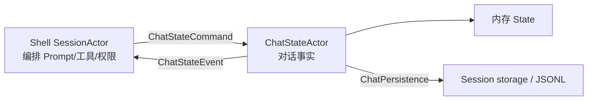
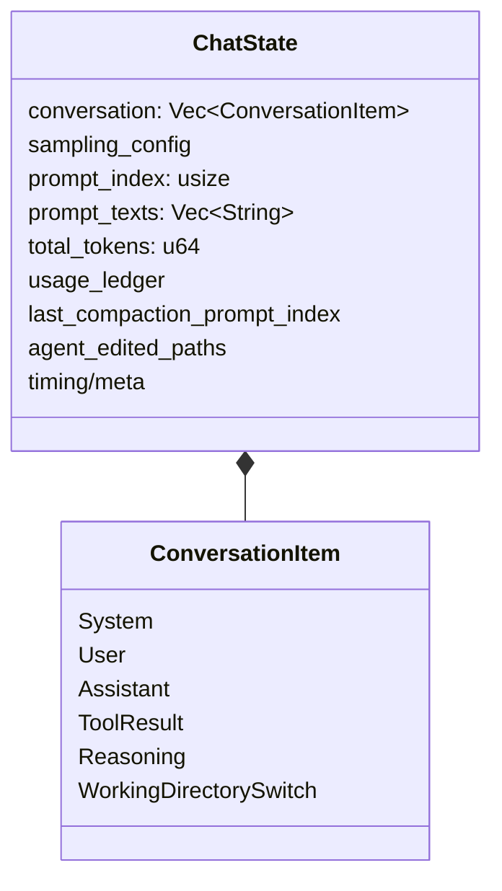
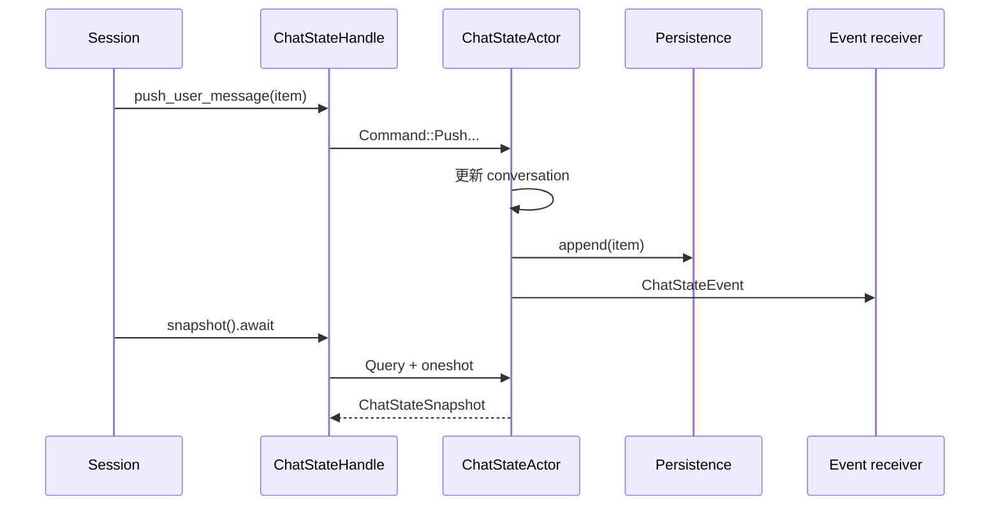
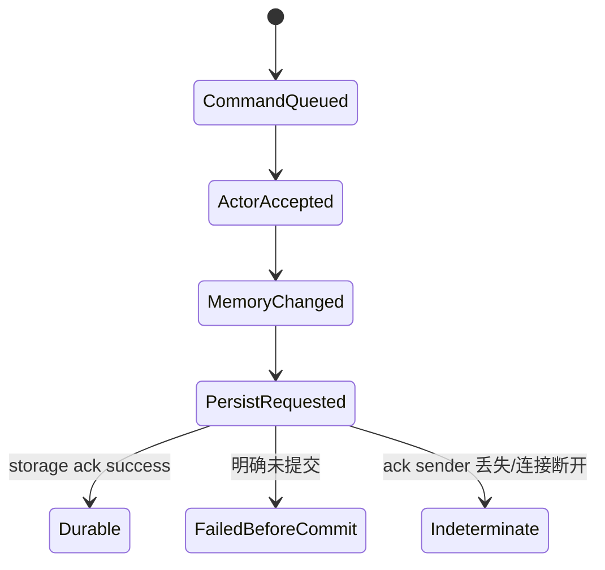
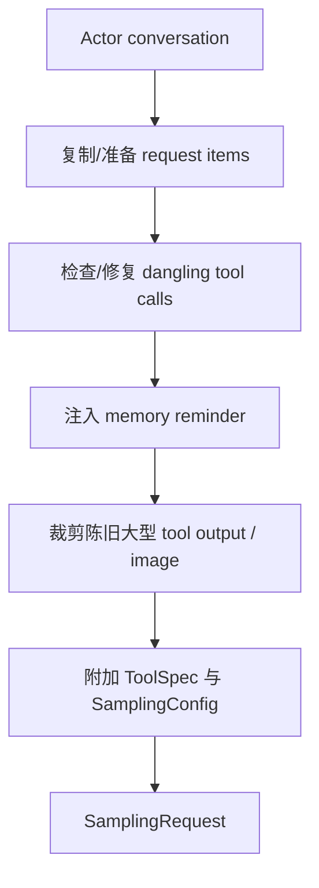
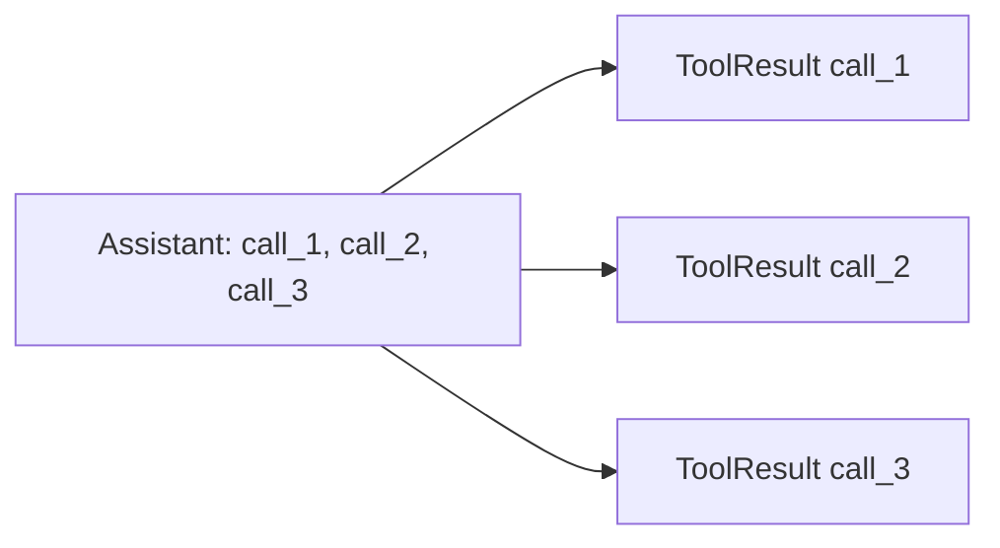
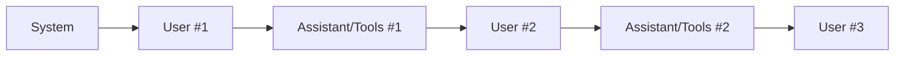
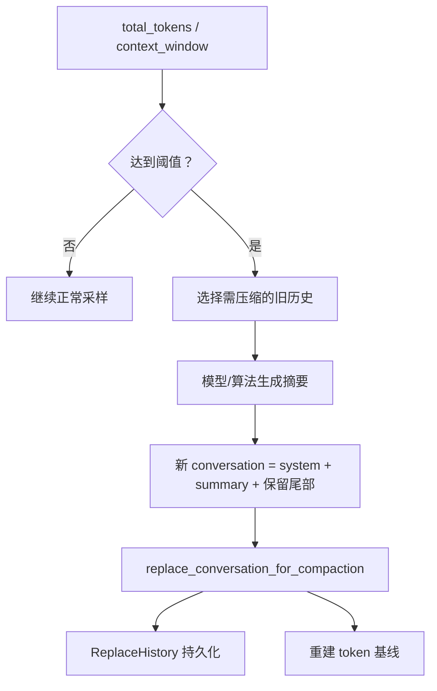
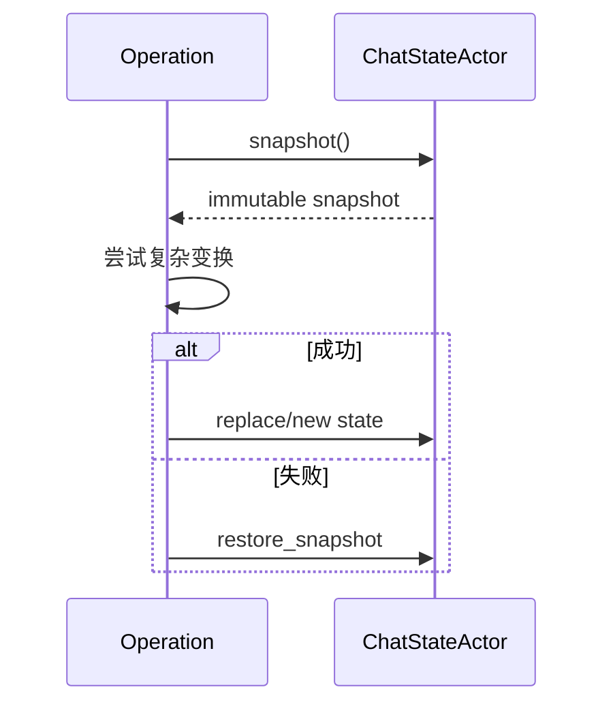

# 08：会话状态与持久化——谁是真相、何时才算保存成功

## 1. 两层状态不要混淆



Shell Session 管理“正在做什么”；Chat State 管理“对话里已经发生了什么”。持久化层负责让事实跨进程恢复，而不是替代内存 Actor 的业务判断。

## 2. ChatState 保存的主要数据



`conversation` 是发给模型的语义历史；`prompt_index` 是用户轮次边界；usage 与 metadata 是控制压缩、展示和诊断的辅助事实。

## 3. Actor 为什么不直接共享 Mutex

`ChatStateActor` 在专用 Tokio task 内拥有 `State`，外界只通过 `ChatStateHandle` 发命令。



Actor 内部无需给每个字段加锁，也避免 conversation、prompt index、token 同步更新到一半时被其他任务读到。

## 4. 命令分三类

| 类型 | 示例 | 是否需要回执 |
|---|---|---|
| 追加/变更 | push user/assistant/tool result、记录 usage | 常见路径可 fire-and-forget |
| 查询 | snapshot、conversation、prompt index、build request | `oneshot` 返回值 |
| 屏障/严格持久化 | strict append、flush | 必须等待 persistence 确认 |

不是所有 `send()` 成功都表示磁盘已保存。它只表示命令进入 Actor 通道。需要 durable 语义的操作必须使用带 ack 的路径。

## 5. 内存提交与磁盘提交



“Indeterminate” 比普通错误难处理：调用者不知道写入是否已经发生，盲目重试可能重复记录。严格 append 的返回类型区分 committed、already present、uncommitted failure 等结果，用于实现幂等和状态收敛。

## 6. 持久化接口

`ChatPersistence` 把 Chat State 与具体 session storage 隔离。典型操作包括：

- 追加一条 message；
- 用新历史替换全部 history；
- flush；
- 带确认的严格追加。

`NullChatPersistence` 支持无需落盘的场景；`MockChatPersistence` 能让测试观察记录并手动控制 ack，从而验证 Actor 确实等待 durable barrier。

## 7. `build_request` 不是简单 clone

从 conversation 构造采样请求时可能执行只针对请求视图的变换：



有些变换只作用于 clone，不能改变长期历史；有些（例如明确要求持久化的 memory 注入或完整性修复）会更新 live state 并 replace history。阅读调用参数时要确认是哪一种。

## 8. 工具调用闭合不变量

每个 assistant tool call id 最终都必须有一个 ToolResult：



进程可能在 call_1 完成后崩溃。恢复时 Chat State 会为缺失结果生成“未执行/已取消”的合成结果，保证下一次请求满足模型协议。修复需幂等：再次 `build_request` 不能重复插入。

纯查询如 `snapshot()` 不应偷偷修复状态，否则读取会产生意外写入。修复通常发生在初始化、新用户消息或明确 repair 命令的边界。

## 9. Prompt index 与 rewind

`truncate_to_prompt_index(n)` 不是按 vector 下标截断，而是找到目标用户轮次后的语义边界：



rewind 到 1 应保留 System 与第 1 轮，删除后续 conversation，同时截断 prompt texts、重算 token、持久化 replacement 并发出 `ConversationReset`。只改 `prompt_index` 会留下模型仍可见的未来消息。

## 10. Compaction 的数据流



压缩后不能简单把 token 设为字符估算值。供应商返回的真实 input token 包含 schema、格式和协议 overhead。实现保存“上次响应时的 provider total 与本地估算比例”，压缩后按比例重建基线，同时排除响应后的新 delta，防止 token 账本突然失真。

压缩只替换 conversation，不应把当前 `SamplingConfig` 重置成默认模型。测试专门覆盖了这一回归风险。

## 11. Usage ledger

Token 至少有三种视角：

| 数据 | 用途 |
|---|---|
| 本地估算 | 尚未收到 provider usage 时预测上下文占用 |
| provider usage | 已完成响应的权威计数 |
| 当前 prompt 累计 | 多次重试/多 turn 的成本与响应 meta |

工具结果或合成用户消息会增加估算 delta；模型响应到达后用 provider 数字校准。rewind、replace 和 compaction 必须同步重置或重建相关账本。

## 12. 快照与恢复

`ChatStateSnapshot` 用于在复杂操作前保存一致视图，也支持恢复。一个完整快照需包含 conversation 之外的 prompt index、usage、sampling config、compaction 元数据和 prompt texts。



快照向后兼容字段通常用 serde default；恢复旧快照时缺失的 token 基线应回退到重新估算。

## 13. Rust 学习点

- `Vec<ConversationItem>` 配合 enum 表达有序异构消息。
- Actor 用所有权代替细粒度锁：只有 Actor task 持有可变 State。
- `oneshot` 把查询结果与某次命令对应；sender drop 是显式错误状态。
- trait 注入持久化实现，使业务状态机可用 Mock 做确定性测试。
- clone request view 的成本换来隔离：请求裁剪不必直接破坏长期事实。

## 14. 建议验证

```bash
rg -n "truncate_to_prompt_index|check_auto_compact_needed|build_request" \
  crates/codegen/xai-chat-state/src

rg -n "StrictAppend|AcknowledgedMessage|persistence_ack" \
  crates/codegen/xai-chat-state/src

rg -n "dangling_tool_calls|replace_conversation_for_compaction" \
  crates/codegen/xai-chat-state/src/actor/tests.rs
```

下一章回到 Pager，研究状态事件怎样被归约为界面状态并渲染到终端。
