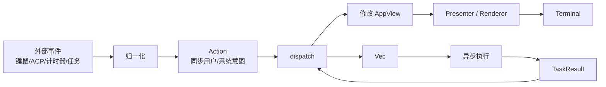
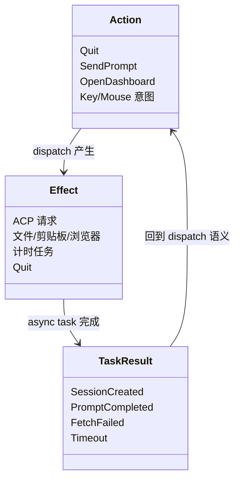
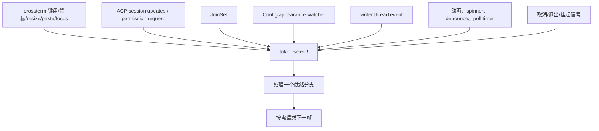
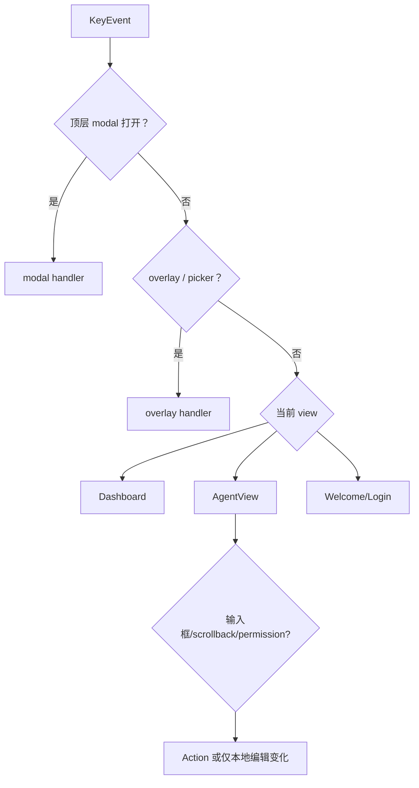
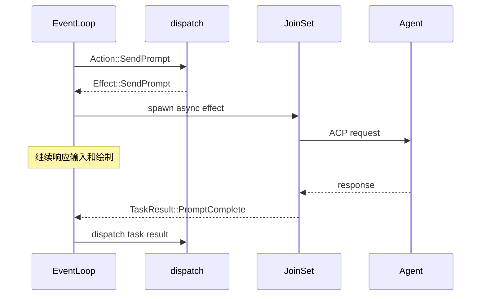
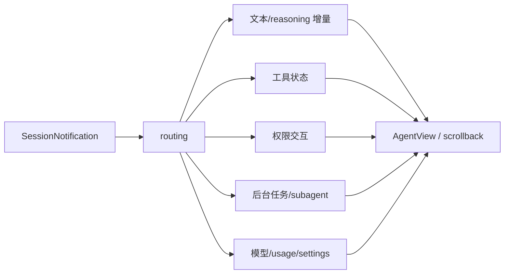
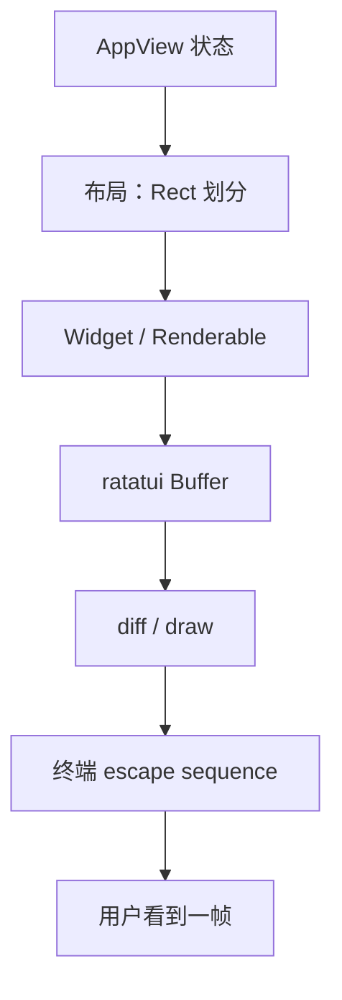
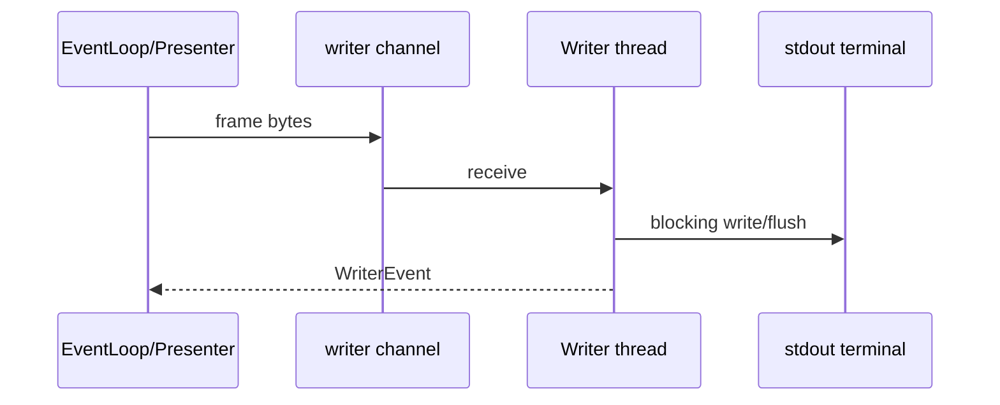
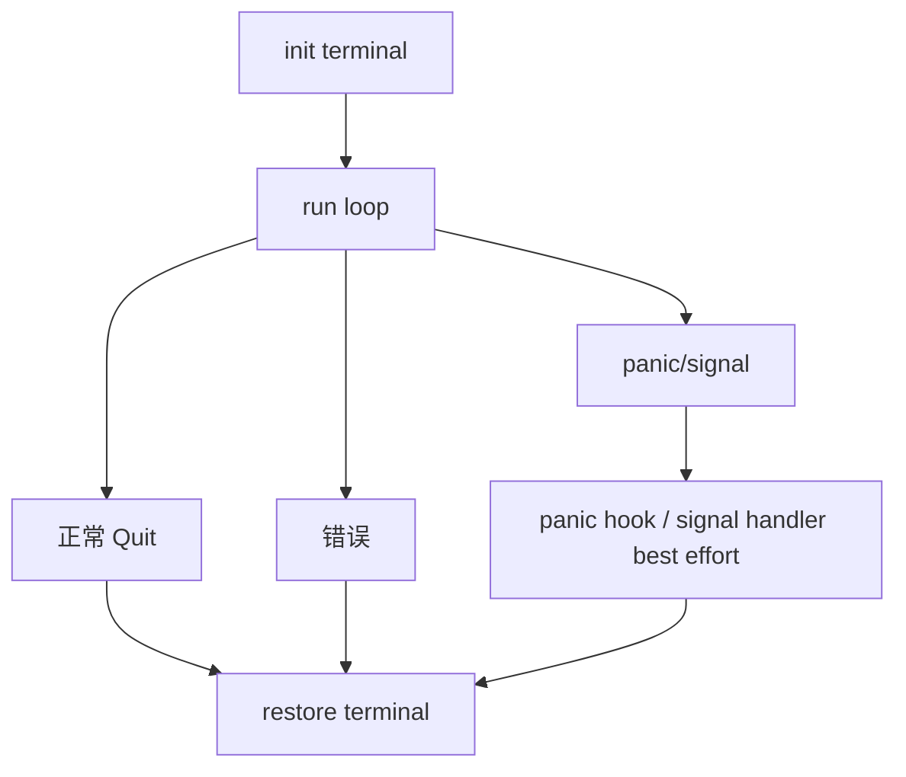

# 09：TUI 事件与渲染——状态如何变成终端上的一帧

## 1. 总体模式：Event → Action → State + Effect → Render



这是 Elm/Redux 风格的单向数据流。同步状态变更与异步副作用分开，使输入处理可以快速、可测试，并减少 UI 状态被后台 task 直接修改的竞态。

## 2. 文件地图

| 文件 | 职责 |
|---|---|
| `app/event_loop.rs` | `tokio::select!` 汇合事件源、安排 dispatch/effect/render |
| `app/actions.rs` | `Action`、`Effect`、`TaskResult` 三类协议 |
| `app/dispatch/*` | 同步 reducer：修改 `AppView` 并返回 effects |
| `app/effects/mod.rs` | 在 `JoinSet` 中执行网络、文件、定时等异步工作 |
| `app/app_view.rs` | 顶层 UI 状态 |
| `app/agent_view/*` | 单 Agent 页状态、输入和局部渲染 |
| `xai-grok-pager-render` | 终端绘制、换行、颜色、overlay、图片与主题 |

## 3. 三种 enum 的边界



- `Action` 应表达“想做什么”，通常同步且尽量无副作用。
- `Effect` 表达“需要外部世界做什么”。
- `TaskResult` 把异步结果重新带回主循环，只有主循环修改 UI 状态。

## 4. 事件循环汇合哪些来源

`event_loop::run` 是一个较薄的 `tokio::select!` 循环。主要输入可归为：



`select!` 每次只选择一个就绪分支，因此 AppView 的同步修改天然串行。若某个分支执行很久，其他输入就会饥饿，所以网络和磁盘工作必须转成 Effect 后 spawn。

## 5. 输入路由不是直接改字段

键盘事件先根据当前 UI 层级路由：



这体现“焦点优先级”：Esc 在 permission modal、搜索框和普通 prompt 中含义不同。路由层决定语义，dispatch 层实现跨模块状态迁移。

## 6. `dispatch` 为何同步

示意签名：

```rust
fn dispatch(action: Action, app: &mut AppView) -> Vec<Effect>
```

它可以：

1. 立即修改 `app`，形成下一帧一致状态；
2. 返回零到多个 Effect；
3. 在测试中不启动真实网络即可断言状态与 effects。

例如 SendPrompt 可先乐观地加入用户消息/清空输入框，再返回向 ACP 发 Prompt 的 effect。若任务失败，`TaskResult` 再触发错误状态或回滚。

## 7. Effect 通过 `JoinSet` 执行



`JoinSet` 同时管理多个任务并在完成时回收结果。退出时还需取消/等待任务，否则它们可能持有 ACP sender、文件或进程资源。

## 8. Agent 更新如何进入视图

ACP notification 先在 `acp_handler` 按类别解析，再更新对应 AgentView：



路由时必须用 session/agent id 定位目标页。迟到事件不能写进用户刚切换到的新会话，这是多会话 TUI 的核心一致性约束。

## 9. 渲染管线



渲染函数应主要是状态的纯投影。部分组件会缓存上次绘制的 Rect 供鼠标 hit-test，这形成一个约束：点击判断必须使用最近一帧的布局，并在元素滚出视口时清除陈旧 Rect。

`pager-render` 额外处理：

- Unicode 宽度与换行；
- 语法高亮与 Markdown；
- OSC 8 超链接；
- 图片/视频 overlay；
- scrollbar 与选择；
- 主题、颜色能力降级；
- Windows legacy console 字形替换。

## 10. 三种 ScreenMode

| 模式 | 终端策略 | 典型体验 |
|---|---|---|
| Fullscreen | alternate screen，全帧重绘 | 独立应用界面 |
| Inline | 与 shell scrollback 协作 | 输出保留在终端历史 |
| Minimal | 更保守的终端能力/布局 | 兼容有限终端 |

模式影响 action registry、鼠标、绘制和退出清理。某些切换通过 re-exec 重启程序，以重新初始化终端能力，而不是在复杂运行状态中热切换。

## 11. Writer thread 与背压

终端写入可能阻塞。启动阶段建立 writer channel/thread，渲染侧把输出交给 writer；`WriterEvent` 再反馈完成或错误。



若每个高速 token 都立即完整 draw，渲染耗时可能超过事件到达间隔。实现需要合并刷新请求、限制 in-flight frame，并只在状态脏时重绘。

## 12. 终端恢复是正确性要求

程序进入 raw mode、mouse capture、focus/paste reporting、alternate screen 后，任何退出路径都要恢复。否则 shell 可能不回显、光标消失或鼠标事件打印成乱码。



RAII guard、panic hook 与显式 cleanup 共同兜底，但异常终止如 SIGKILL 无法清理。

## 13. Rust 学习点

- `tokio::select!` 在多个 future 中选择就绪者；被取消的分支 future 必须具备 cancellation safety。
- 大 enum 让事件协议可穷尽匹配，但也可能造成 variant 较大，项目用 `allow(clippy::large_enum_variant)` 明确接受权衡。
- `&mut AppView` 保证一次 dispatch 独占修改顶层 UI 状态。
- `JoinSet<TaskResult>` 把异步任务生命周期和结果类型统一管理。
- render 使用不可变状态读取，减少“绘制一半状态变化”的问题。

## 14. 验证阅读

```bash
rg -n "tokio::select!|effects::execute|dispatch::dispatch" \
  crates/codegen/xai-grok-pager/src/app/event_loop.rs

rg -n "^pub enum (Action|Effect|TaskResult)" \
  crates/codegen/xai-grok-pager/src/app/actions.rs

rg -n "fn render|fn draw" \
  crates/codegen/xai-grok-pager/src/app/agent_view \
  crates/codegen/xai-grok-pager-render/src/render
```

最后一章进入权限与沙箱，说明 UI 的“允许/拒绝”怎样连接到真正的 OS 执行限制。
