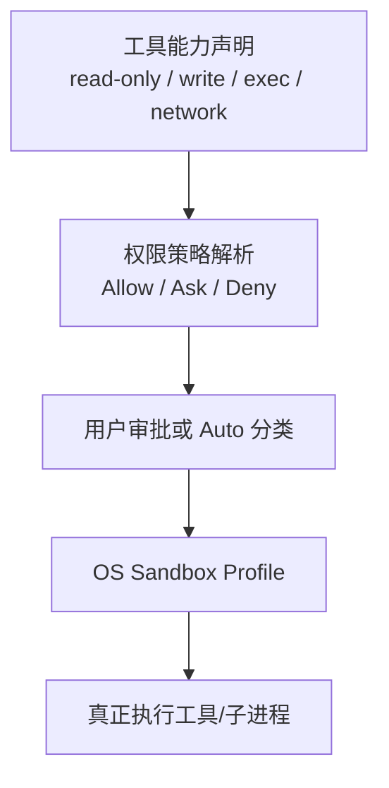
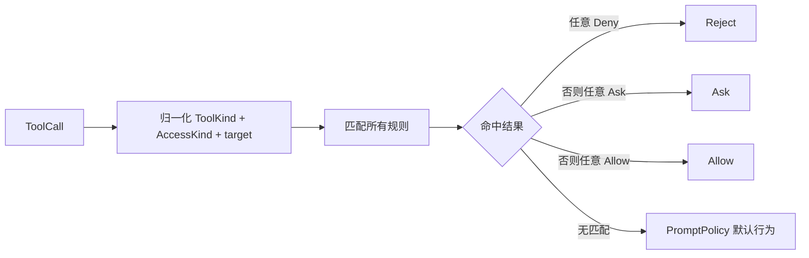
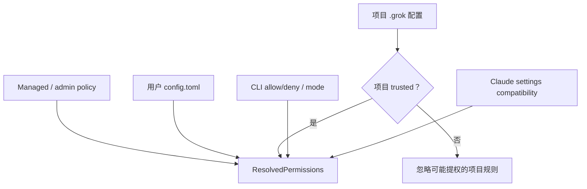
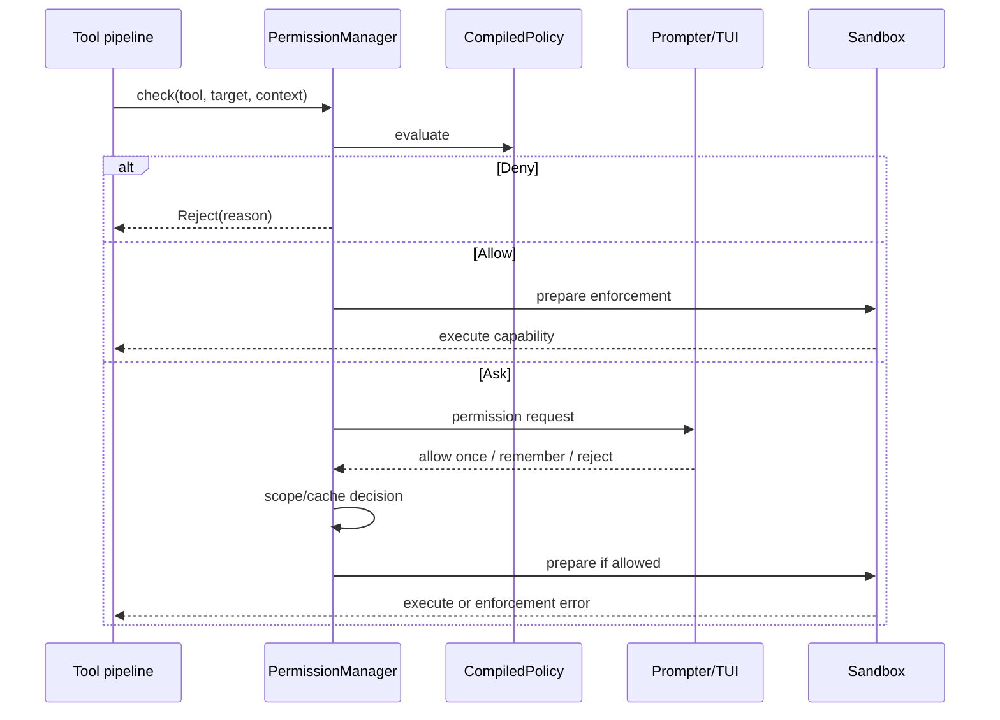
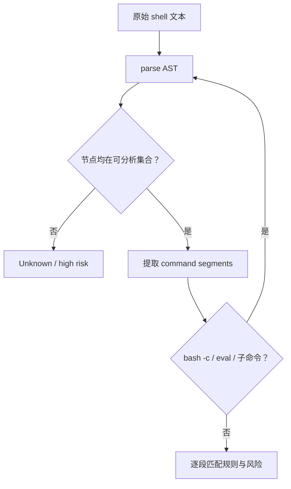
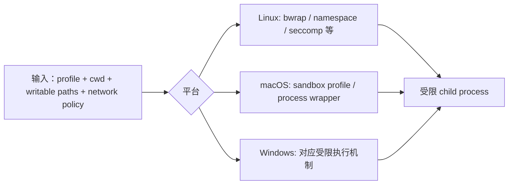
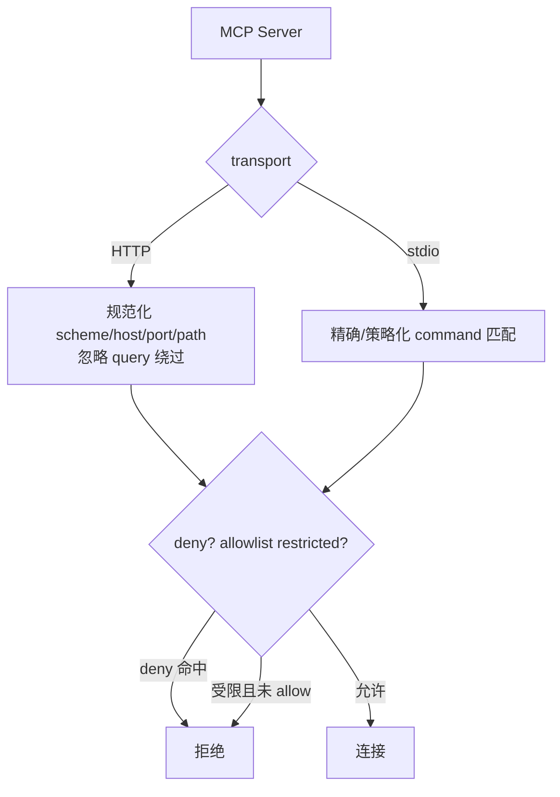
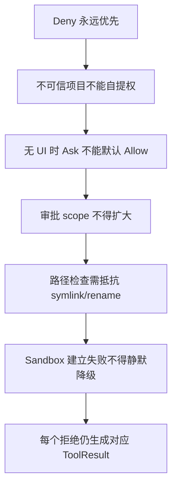

# 10：权限与沙箱——“用户允许”与“操作系统允许”是两回事

## 1. 四层防线



权限系统决定“应不应该执行”，沙箱决定“即使代码想做，实际能做什么”。只有 UI 弹窗而没有 OS 限制，无法防住工具实现漏洞或子进程绕过。

## 2. 源码地图

| 文件/模块 | 职责 |
|---|---|
| `xai-grok-config-types/src/permission.rs` | 可序列化的规则配置类型 |
| `workspace/permission/resolution.rs` | 合并 managed、用户、项目、CLI、Claude 配置 |
| `workspace/permission/policy.rs` | 编译和匹配规则 |
| `workspace/permission/manager.rs` | 运行时决策、prompt、缓存 |
| `workspace/permission/auto_mode.rs` | 自动审批分类 |
| `workspace/permission/bash_command_splitting.rs` | 安全拆分/分析 shell 命令 |
| `workspace/permission/prompter.rs` | 向客户端发审批请求 |
| `xai-grok-sandbox` | 平台 sandbox profile、路径与网络限制 |

## 3. 规则数据模型

`PermissionRule` 大体由三部分构成：

```text
RuleAction × ToolFilter × Pattern/PatternMode
```

- Action：Allow、Ask、Deny；
- ToolFilter：Read、Edit、Write、Bash 或其他工具类别；
- Pattern：路径、命令或资源的匹配表达式。



合并后采用 `deny > ask > allow`，而不是“最后一条规则获胜”。这样低优先级配置不能用一个 broad allow 覆盖企业 deny。

## 4. 配置来源与信任



项目仓库是潜在攻击输入：刚 clone 的项目不能通过自带配置宣布“所有 Bash 自动允许”。未信任项目的提权规则需忽略，并记录 skipped 原因供 inspect/诊断。

Managed policy 可禁止 always-approve；这时来自用户、项目或 CLI 的 catch-all allow 会被剔除，管理员来源的约束仍保留。

## 5. PromptPolicy 与运行模式

| 模式 | 无显式规则时 |
|---|---|
| Ask/default | 请求用户批准 |
| Deny / dontAsk | 自动拒绝 |
| Auto | 风险分类器决定允许或询问/拒绝 |
| Always approve / yolo | 尽量自动允许，但仍受 managed pin 和硬性 deny 约束 |

“yolo”不是关闭所有安全：管理员禁止、明确 deny、工具不可用和 OS sandbox 仍可阻止操作。UI 显示的模式也不是最终权威，PermissionManager 在决策时要重新 clamp 当前策略。

## 6. 一次审批的时序



审批请求需展示实际命令、路径、cwd 和风险，而不是只显示工具名。响应必须与 request/call id 对应，避免迟到批准应用到另一条调用。

## 7. “允许一次”与规则持久化

用户批准可能有不同作用域：

- 仅本次 call；
- 当前会话的同类命令/路径；
- 写入持久规则；
- 全局 always approve。

缓存 key 不能只用工具名。例如允许 `bash: cargo test` 不应顺带允许 `bash: rm -rf ...`。持久化规则前还要规范化 target，防止同一命令通过空白、路径别名或 shell 包装绕过。

## 8. Shell 命令为何要语法分析

简单按空格或 `;` split 不理解引号、管道、重定向、子命令：

```bash
echo "a;b"
safe && dangerous
env X=1 command
bash -c 'nested command'
echo "$(dangerous)"
```

`bash_command_splitting.rs` 使用语法树与 allowlist 识别可信的“纯单词命令序列”，对嵌套脚本递归分析。无法高置信解析时应升级为 Ask/Deny，而不是假定安全。



## 9. Auto mode 不是静态 Allow

Auto mode 根据命令类型、写入范围、网络/进程行为和历史上下文做风险判断。它的输出仍进入统一 `Decision`，并受显式 deny 优先级约束。

高风险例子：

- 删除或覆盖大量文件；
- 修改仓库外路径；
- 凭证/环境变量访问；
- 下载后立即执行；
- 权限提升；
- 难以解析的 shell 动态构造。

分类失败必须 fail closed，即询问或拒绝。

## 10. Sandbox Profile

`xai-grok-sandbox` 将抽象能力变成平台执行限制：



具体可用机制随平台与构建 feature 不同。若要求的安全配置无法建立，敏感模式应返回错误，而不是悄悄无沙箱运行。

## 11. 路径与网络策略

路径 policy 至少要考虑：

- cwd/workspace 的 canonicalization；
- symlink 跳转；
- `..`；
- 不存在目标的父目录；
- 大小写/平台路径差异；
- rename 前后的对象身份。

Hook 写保护代码会记录 `PathIdentity`，在应用 sandbox 前重新验证，防止检查后被 rename/symlink 替换的 TOCTOU。

网络策略与文件策略正交：只读文件系统不等于禁止上传数据。sandbox 还需单独约束 child network、namespace 操作和允许的 endpoint。

## 12. MCP 与外部工具边界

MCP server 既可能是 HTTP URL，也可能是本地 stdio command。Managed allowlist/denylist分别匹配 server name、URL 或命令：



Deny 匹配要防止大小写、query/fragment、嵌入 URL 等绕过；Allow 解析不确定时不授予权限，体现 fail closed。

## 13. 错误与审计

最终结果至少区分：

| 结果 | 含义 |
|---|---|
| PolicyReject | 明确规则拒绝 |
| UserReject | 用户拒绝 |
| AutoReject/Ask | 分类器认为不安全/不确定 |
| PromptUnavailable | 无交互客户端，不能询问 |
| SandboxPrepareFailed | 允许了，但无法建立执行隔离 |
| SandboxViolation | 子进程尝试越权 |
| Cancelled | 会话取消 |

审计应记录规则来源、匹配类别、决策和目标摘要，但不得记录 secret、完整敏感文件内容或 bearer。

## 14. Rust 学习点

- `Decision`、`RuleAction`、`PromptPolicy` 用不同 enum 表达不同阶段，避免一个 bool 丢失原因。
- `Sourced<T>` 把值与来源绑定，合并后仍可解释“哪条策略导致结果”。
- 平台代码通过 `#[cfg(target_os = ...)]` 编译；只在 macOS 阅读会漏掉 Linux 安全路径。
- newtype 可阻止把未经规范化路径误当作已验证路径。
- 错误 enum 配合 `thiserror` 保留可匹配原因，上层不必解析字符串。

## 15. 安全不变量清单



## 16. 验证阅读

```bash
rg -n "deny > ask > allow|CompiledPolicy|Decision::" \
  crates/codegen/xai-grok-workspace/src/permission

rg -n "drop_untrusted_catchall_allows|project_trusted|yolo_disabled" \
  crates/codegen/xai-grok-workspace/src/permission/resolution.rs

rg -n "ProfileName|NetworkPolicy|hook_write_deny|is_inside_bwrap" \
  crates/codegen/xai-grok-sandbox/src
```

至此，主阅读链已经闭合：入口与 CLI → TUI 启动 → Agent 循环 → Sampler → 工具 → 文件副作用 → Chat State → TUI 渲染 → 权限与 OS 执行边界。
