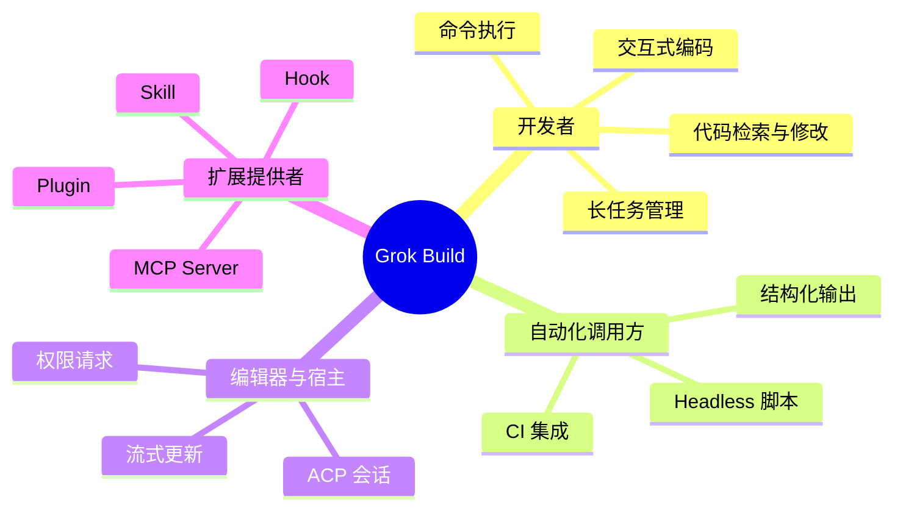
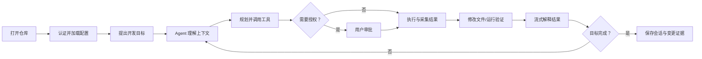
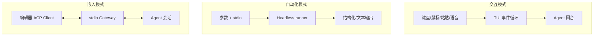

# 产品功能全景

## 产品定位与角色

Grok Build 是面向软件开发者的终端 AI 编码代理：理解代码库、编辑文件、执行命令、调用本地或远程工具，并以 TUI、无头模式或 ACP 嵌入模式运行。

## 用户价值闭环

## 分层功能树

| ID | 能力域 | 功能组 | 用户结果 | 主要实现 |
|---|---|---|---|---|
| F-ENTRY-01 | 多入口 | 全屏 TUI | 在终端中查看流式回答、工具卡片、Diff、弹窗和状态 | `xai-grok-pager*` |
| F-ENTRY-02 | 多入口 | Headless | 在脚本/CI 中执行一次性或持续任务 | `xai-grok-shell` |
| F-ENTRY-03 | 多入口 | ACP | 从兼容编辑器建立、恢复和驱动 Agent 会话 | `xai-acp-lib`、`xai-grok-shell` |
| F-CHAT-01 | 对话 | 会话生命周期 | 新建、继续、持久化、恢复会话 | `xai-chat-state`、shell persistence |
| F-CHAT-02 | 对话 | 流式交互 | 实时看到文本、思考、工具和用量变化 | sampler、shell、pager |
| F-CHAT-03 | 对话 | 上下文压缩 | 长会话接近窗口限制时保留关键信息 | `xai-grok-compaction` |
| F-AGENT-01 | Agent | 定义与提示词 | 按预设、角色、仓库和插件组装 Agent | `xai-grok-agent` |
| F-AGENT-02 | Agent | 子 Agent | 解析角色、人格和运行时覆盖并管理生命周期 | lifecycle、subagent-resolution |
| F-AGENT-03 | Agent | 中途插话 | 在长回合中接收并格式化用户追加输入 | `xai-interjection-core` |
| F-TOOL-01 | 工具 | 内置工具 | 搜索、读写文件、补丁、终端执行等 | `xai-grok-tools` |
| F-TOOL-02 | 工具 | 工具发现 | 通过统一注册表、搜索索引和 Scope 查找工具 | tool-runtime、computer-hub |
| F-TOOL-03 | 工具 | MCP | 发现、认证并调用外部 MCP Server | `xai-grok-mcp`、MCP adapter |
| F-WS-01 | 工作区 | 文件与 Git | 安全读取/修改工作区并跟踪变更归因 | workspace、hunk-tracker、gix-status |
| F-WS-02 | 工作区 | 命令与 PTY | 执行命令、管理进程组和交互终端 | workspace、ptyctl、tty-utils |
| F-WS-03 | 工作区 | 代码图 | 用 tree-sitter 索引符号并导航 | `xai-codebase-graph` |
| F-WS-04 | 工作区 | Worktree | 快速创建隔离 Git worktree | `xai-fast-worktree` |
| F-EXT-01 | 扩展 | Skill/Plugin | 发现并装配可复用能力包 | agent、plugin-marketplace |
| F-EXT-02 | 扩展 | Hook | 在生命周期事件上执行命令和策略 | `xai-grok-hooks` |
| F-UX-01 | 体验 | Markdown/图表 | 在终端渲染代码、表格、链接、LaTeX、Mermaid | markdown、mermaid、render |
| F-UX-02 | 体验 | 语音 | 采集音频并以流式 STT 生成提示 | `xai-grok-voice` |
| F-OPS-01 | 运行 | 更新与崩溃 | 检查更新、生成崩溃报告、恢复终端 | update、crash-handler |
| F-OPS-02 | 运行 | 遥测 | 采集脱敏产品事件、错误和链路信息 | telemetry、tracing、secrets |

## 主要交互模式

## 关键功能边界

- 产品以本地开发工作区为主要作用域，不是通用云端 IDE。
- TUI 是主要交互入口，但领域行为由 shell/agent/workspace 层承担，界面不应复制执行规则。
- MCP、Plugin、Skill 和 Hook 都是扩展机制，但分别解决远程工具协议、能力打包、提示/流程知识和事件策略问题。
- 管理后台不在本仓库范围内；配置治理通过本地/托管配置、签名策略与运行时校验实现。
- 服务端模型推理、云存储和托管配置的内部实现不在本仓库，只记录客户端契约。

## 可观察失败与恢复

| 场景 | 用户可见行为 | 恢复入口 |
|---|---|---|
| 认证缺失/过期 | 启动认证或返回明确认证错误 | 浏览器登录、凭据刷新后重试 |
| 模型流中断 | 保留已接收流片段并报告传输错误 | 受策略限制的重试或新回合 |
| 工具需审批 | 暂停在权限请求状态 | 允许、拒绝或取消 |
| 命令失败 | 展示退出码、stdout/stderr | 修改命令或重新执行 |
| 文件冲突 | 不静默覆盖外部改动 | 重新读取、重算补丁 |
| 上下文过长 | 触发压缩或拒绝继续增长 | 压缩历史、创建新会话 |
| 终端挂起/恢复 | 延后不安全工作并恢复绘制 | 系统唤醒事件驱动恢复 |
