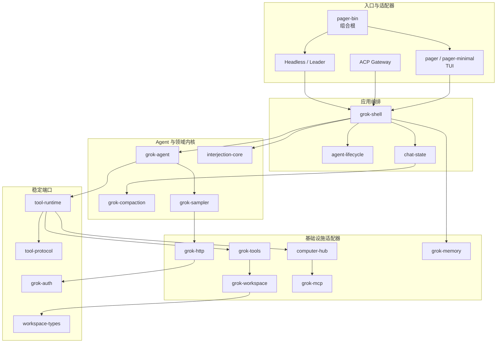
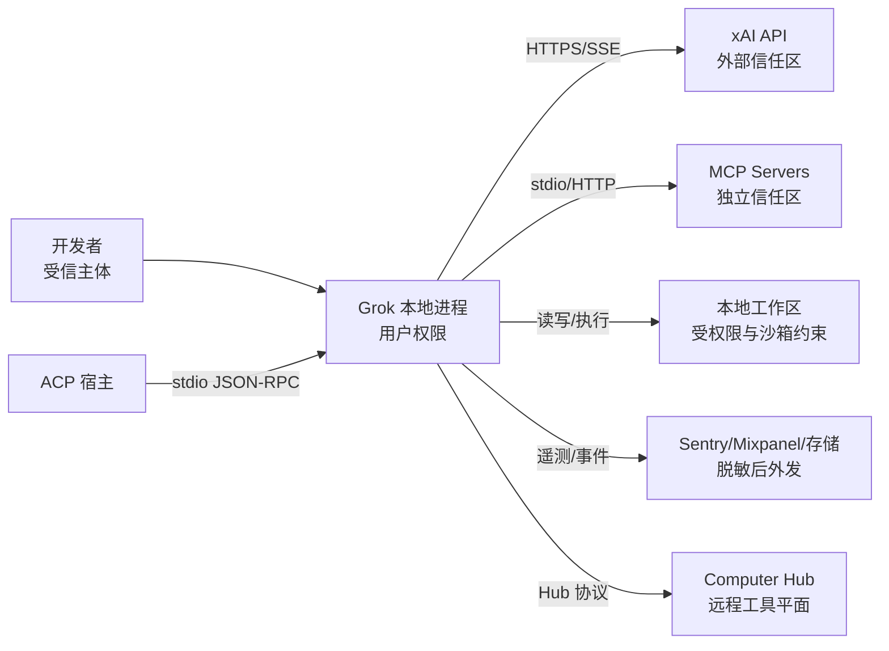
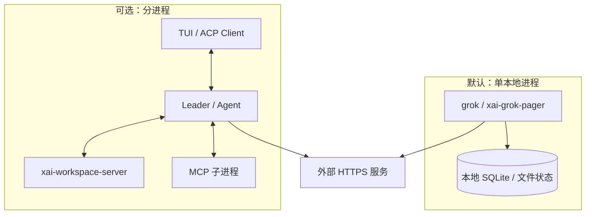

# 系统架构总览

## 架构摘要

系统采用 Rust workspace 内的模块化单体与少量可选进程边界。`xai-grok-pager-bin` 是组合根；Pager 负责呈现，Shell 负责编排，Agent/Chat State 负责对话决策与状态，Tool Runtime/Computer Hub 统一工具，Workspace 隔离宿主能力，Sampler 封装推理传输。

## 系统上下文与信任边界

信任规则：模型输出、仓库内容、MCP 返回值和命令输出都视为不可信数据；只有工具参数校验、权限决策和操作系统沙箱共同决定副作用是否允许。

## 逻辑层与依赖规则

| 层 | 代表模块 | 可以依赖 | 不应承担 |
|---|---|---|---|
| 组合根 | pager-bin | 全部装配模块 | 领域规则、持久状态 |
| 展示层 | pager、pager-render、markdown | Shell 公共事件、纯渲染库 | 文件/命令执行规则 |
| 应用层 | grok-shell | Agent、Chat、Workspace、端口 | 终端像素布局、供应商细节扩散 |
| 领域层 | grok-agent、chat-state、compaction | 纯类型、稳定端口 | OS 操作、UI |
| 端口层 | tool-runtime、tool-protocol、workspace-types、auth | 纯类型和最小公共库 | 具体 HTTP/进程实现 |
| 适配器层 | tools、workspace、mcp、sampler、memory | 端口、外部库 | 上层交互流程 |

## 物理部署形态

默认拓扑减少本地工具的序列化成本；Leader、Workspace Server、MCP 子进程和 ACP stdio 在需要隔离、宿主集成或远程代理时形成进程边界。

## 核心技术选型

| 领域 | 技术 | 选择原因与替换边界 |
|---|---|---|
| 异步运行时 | Tokio | 网络、进程、通道和取消统一；通过 trait/消息边界隔离业务代码 |
| TUI | Ratatui + Crossterm | 跨平台终端绘制与输入；render crate 隔离表现层 |
| HTTP/流 | Reqwest + SSE utilities | Rustls、流式响应、代理；sampler/http 隔离 API 细节 |
| ACP | agent-client-protocol + JSON-RPC stdio | 编辑器嵌入；`xai-acp-lib` 负责通道和规范化 |
| MCP | rmcp（隔离的 reqwest 0.13） | 外部工具生态；独立 crate 避免 HTTP 依赖版本污染 |
| 本地状态 | SQLite + 文件 | 会话、记忆、缓存等本地持久化；journal crate 按文件系统选 WAL/rollback |
| 代码索引 | tree-sitter + petgraph | 多语言符号解析和关系图；LanguageRegistry 隔离语言支持 |
| Git | gix + Git CLI 辅助 | 高性能状态读取及成熟命令能力；workspace 统一封装 |
| 沙箱 | Landlock/Seatbelt 内核能力 | 在 OS 层限制文件/进程副作用；Windows/能力不足时必须显式降级 |
| 遥测 | tracing/fastrace/OTLP、Sentry、Mixpanel | 技术链路与产品事件分离，外发前由 secrets sanitizer 脱敏 |
