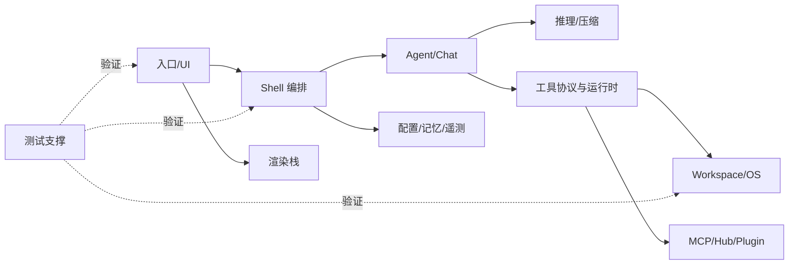
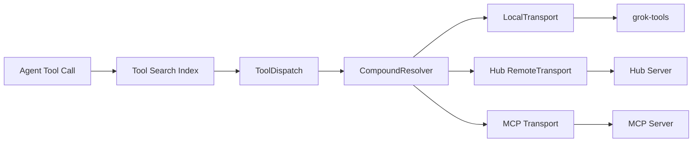

# 模块详细设计

## 模块依赖地图

## A. 入口、终端与呈现

| crate | 详细功能 | 架构与技术细节 |
|---|---|---|
| `xai-grok-pager-bin` | 官方二进制组合根；解析启动方式，选择 TUI、headless、stdio agent、leader、workspace 管理等路径 | 初始化 Tokio、jemalloc、崩溃处理、遥测、取消令牌；只装配，不持有领域逻辑 |
| `xai-grok-pager` | 全屏 TUI：事件循环、scrollback、prompt、命令面板、设置、权限问题、工具结果、选择、会话和工作区 UI | 大型组件化 crate；通过消息/事件连接 shell；Ratatui/Crossterm；大量 PTY E2E 场景验证真实终端行为 |
| `xai-grok-pager-minimal` | 依赖更少的精简 Pager 启动/测试形态 | 复用 pager 公共能力，适合最小运行环境和回归定位 |
| `xai-grok-pager-render` | 主题、语法高亮、剪贴板、链接、图片、终端宿主和通用渲染组件 | 把纯展示依赖从应用事件循环中分离；支持 test-support feature |
| `xai-grok-markdown` | 流式 Markdown、代码块、表格、链接、LaTeX、Mermaid、source map | `StreamingMarkdownRenderer` 维护增量缓冲和 checkpoint，避免每个 token 全量重排；Syntect 高亮 |
| `xai-grok-markdown-core` | 无 UI 的 Markdown 结构分析和统计 | 与渲染器共享 pulldown-cmark 选项；用于结构问题检测和测试 |
| `xai-grok-mermaid` | Mermaid 文本转 PNG | `engine trait` 隔离具体渲染器；当前经 vendored `mermaid-to-svg`、resvg 栅格化 |
| `xai-ratatui-inline` | inline viewport/终端绘制辅助 | 处理非全屏或嵌入式 Ratatui 呈现 |
| `xai-ratatui-textarea` | 多行编辑器、换行、选择和渲染 | editor/render/textarea/wrapping 分层，供 prompt 输入复用 |
| `ptyctl` / `ptyctl-cli` | 无头 PTY 控制、屏幕状态、按键注入、等待条件与 CLI | 基于 alacritty_terminal 建模终端；用于自动化和 E2E，不等同于 Agent shell 工具 |
| `xai-grok-pager-pty-harness` | 共享 PTY 场景库、基准和截图式屏幕断言 | 使用 portable-pty 驱动真实二进制，覆盖粘贴、滚动、选择和性能基线 |

## B. 应用编排、Agent 与会话

| crate | 详细功能 | 架构与技术细节 |
|---|---|---|
| `xai-grok-shell` | 核心应用服务：启动、认证、会话、回合循环、工具编排、权限、持久化、headless、ACP、leader、插件与 hooks 协调 | 最大的应用层 crate；Tokio actor/channel + CancellationToken；连接 TUI/ACP 输入与 Agent、Sampler、Workspace 输出 |
| `xai-grok-agent` | 解析 Agent Definition、发现预设/仓库 Agent、构建工具集和 system prompt | `AgentBuilder` 组合 PromptContext、插件、hooks、compaction 与 toolset；把 Agent 定义与执行循环分开 |
| `xai-chat-state` | actor 化会话状态、命令/事件、持久化、用量账本和压缩转录 | 单写者 actor 串行化状态变更；Handle 提供异步命令端口，Event 提供观察端口 |
| `xai-agent-lifecycle` | 本地/远程 Agent 发送、结束和生命周期结果 | 封装父子任务传播与发送语义，减少 shell 对具体运行位置的耦合 |
| `xai-grok-subagent-resolution` | 合并 persona、role 和 spawn-time override | 生成不可歧义的 resolved spec；避免子 Agent 参数在多层重复解释 |
| `xai-interjection-core` | 回合中用户插话的缓冲、事件队列和格式化 | 客户端/服务端共享纯逻辑；在安全边界处把追加输入包装为用户消息 |
| `xai-prompt-queue` | Pager 与 Shell 间的提示队列 wire type | 只放传输 DTO，防止 UI 和 shell 循环依赖 |
| `xai-grok-shared` | Shell/Pager 共用配置和模型辅助 | 有意保持小型，承载跨边界但非领域所有权的公共代码 |
| `xai-acp-lib` | ACP 通道、gateway、消息规范化、行读取和 stdin reader | stdio JSON-RPC 的适配层；紧凑 JSON 和逐行 framing，避免协议逻辑散落在 shell |
| `xai-hooks-plugins-types` | Hook/Plugin ACP 扩展 DTO | wire-only crate，保证宿主与 Agent 对扩展消息的兼容 |

## C. 推理、上下文与记忆

| crate | 详细功能 | 架构与技术细节 |
|---|---|---|
| `xai-grok-sampling-types` | 对话、消息、错误、doom-loop 和 Responses API 数据类型 | 纯数据层；复用 async-openai Responses 类型但屏蔽 shell 依赖 |
| `xai-grok-sampler` | xAI HTTP 流式采样、重试、Actor 化请求执行 | 把 transport/retry 与 Agent 循环解耦；事件流向上游报告 delta、usage 和错误 |
| `xai-grok-http` | 统一 Reqwest client、User-Agent、认证中间件与传输错误分类 | rustls、HTTP/2、proxy；`TransportFailureKind` 为重试和诊断提供稳定分类 |
| `xai-grok-auth` | `HttpAuth`、凭据快照和认证重试 seam | 依赖倒置：HTTP 客户端只依赖凭据提供接口，可替换静态、刷新或宿主凭据 |
| `xai-grok-compaction` | transport-agnostic 上下文压缩：选择、prompt、跨/回合内压缩、token 计算 | 将待压缩历史转为 `CompactionItem`，由 `CompactionSampler` 端口调用模型；不持有 UI 状态 |
| `xai-token-estimation` | 共享 token 估算原语 | 纯函数叶子 crate，供 chat、agent、telemetry 一致计算 |
| `xai-grok-memory` | 记忆归档、分块、embedding、SQLite 向量索引、MMR、查询扩展、watcher 和 dream | `MemoryBackend` 隔离远端 embedding；SQLite/vec 是本地事实；MMR 平衡相关性与多样性 |
| `xai-grok-models` | 内嵌默认模型 ID | 从 `default_models.json` 加载，集中默认值避免各入口漂移 |

## D. 工具协议、运行时和扩展

| crate | 详细功能 | 架构与技术细节 |
|---|---|---|
| `xai-tool-types` | 规范化工具描述、任务、Schema 宽容解析和 extension | 最底层语义类型，不绑定传输 |
| `xai-tool-protocol` | Hub wire protocol：hello、注册、帧、方法、错误、通知、输出、session event | 带 `PROTOCOL_VERSION`；明确 ToolId/CallId/Scope/Capabilities，是跨进程兼容边界 |
| `xai-tool-runtime` | `Tool` trait、dispatch、context、错误分类、通知、流式结果和搜索索引 | 统一内置与远程工具；调用上下文携带身份、scope、取消和关联标识 |
| `xai-computer-hub-core` | ToolRegistry、resolver、local/remote transport | `CompoundResolver` 选择工具来源；注册表与传输分离 |
| `xai-computer-hub-sdk` | 连接池、握手、透明重连、server harness、OIDC、日志/指标/trace donation | 适合独立工具服务；demux 将并发调用按 ID 路由；连接引用计数和重连事件显式化 |
| `xai-computer-hub-mcp-adapter` | 把 MCP 发现的工具注册为 Hub 原生工具 | bridge/transport/types 分层，转换 MCP 内容、错误和调用结果 |
| `xai-grok-tools` | 终端、文件、补丁、搜索、Web 等内置 Tool 实现及工具集合 | 每项工具遵循 runtime trait；副作用通过 workspace/sandbox/permission 上下文执行 |
| `xai-grok-tools-api` | 工具 protobuf、配置校验、slash command API | build.rs 通过 `xai-proto-build` 生成 Rust 类型；供 workspace RPC/工具边界共享 |
| `xai-grok-mcp` | MCP server 管理、stdio/HTTP transport、OAuth、credential store、liveness、wire | 隔离 rmcp 与 reqwest 0.13；支持 ACP transport 桥接；凭据不进入普通配置 |
| `xai-grok-hooks` | 文件发现、事件 hook、外部命令和策略执行 | Hook 可以观察或阻断特定生命周期事件；执行必须受超时、工作目录和权限限制 |
| `xai-grok-plugin-marketplace` | Marketplace catalog/config/index、Git 获取、扫描、匹配和安装解析 | 解析可安装资产，不直接承担 Agent 执行；安装结果交给 agent/plugin 装配 |

## E. Workspace、代码与操作系统

| crate | 详细功能 | 架构与技术细节 |
|---|---|---|
| `xai-grok-workspace` | 文件系统、VCS、执行、发现、权限、checkpoint、Workspace Server 和 Hub 工具注册 | 宿主能力主适配器；本地与代理模式共享 types/client；所有路径和命令副作用在此收口 |
| `xai-grok-workspace-types` | workspace request/chunk/event wire enum | client/server 共用版本化 DTO；支持流式 chunk 与事件 |
| `xai-grok-workspace-client` | Hub 代理的 `workspace.*` typed RPC client | 轻量客户端；把代理失败映射为稳定 ToolError |
| `xai-grok-paths` | UTF-8 绝对/相对路径强类型 | 在编译期减少路径域混用和隐式相对路径错误 |
| `xai-grok-sandbox` | Linux Landlock、macOS Seatbelt 等 OS 沙箱 | 基于能力探测生成策略；沙箱不是权限 UI 的替代，两者叠加 |
| `xai-tty-utils` | 非交互进程启动、pager 抑制、控制终端分离、进程组生命周期 | ProcessScope/ProcessGroup 负责子进程回收和信号传播，避免孤儿进程 |
| `xai-codebase-graph` | tree-sitter 多语言索引、scope graph、符号导航和增量管理 | String interner 降低重复符号内存；Navigator 基于稳定位置/范围返回结果 |
| `xai-fsnotify` | 文件系统事件去抖、语义化、Git 元信息和因果顺序 | 单一 `FsEvent` 流；settle window 合并编辑器批量写入 |
| `xai-hunk-tracker` | diff hunk 的 Agent/外部归因 | Actor 监听文件/Git 变化，维护 hunk 生命周期和 removal reason |
| `xai-fast-worktree` | CoW/reflink 优先的高速 Git worktree 池 | 回退到常规复制/checkout；SQLite 可选记录池 metadata |
| `xai-gix-status` | 在进程限制下安全配置 gix 状态扫描线程数 | 读取 RLIMIT_NPROC 并预算 worker，避免 panic=abort 下线程创建致命失败 |
| `xai-file-utils` | 本地事件采集、上传队列、GCS/S3 client、trace context、workspace 分类 | 带 circuit breaker；上传与主 Agent 路径解耦，失败不应破坏用户工作 |
| `xai-sqlite-journal` | 按本地/网络文件系统选择 SQLite WAL 或 rollback journal | 避免网络挂载上 WAL `-shm` mmap 不安全；支持环境覆盖与平台探测 |
| `xai-system-power` | 系统休眠/唤醒通知 | 长任务在 suspend 边界避免误判超时，唤醒后触发恢复 |

## F. 配置、运行与观测

| crate | 详细功能 | 架构与技术细节 |
|---|---|---|
| `xai-grok-config` | grok_home、用户/managed/requirements 配置合并、原子写、签名策略、版本覆盖 | 有效优先级为 requirements > user > managed（具体字段受校验限制）；非法配置显式失败 |
| `xai-grok-config-types` | flags、memory、MCP、permission、pool、remote settings 类型 | 作为叶子类型支持 serde；集中默认值、远程配置 DTO 与权限枚举 |
| `xai-grok-env` | 后端 endpoint 预设和环境变量测试支持 | 将部署差异与业务逻辑隔离 |
| `xai-grok-shell-base` | 环境、CPU profile、进程/文件通用辅助 | Shell 家族基础层，避免主 crate 重复初始化逻辑 |
| `xai-grok-shell-session-support` | managed MCP credential/catalog cache 与文件访问跟踪 | 会话级支持组件；feature 控制可选 file-utils |
| `xai-grok-telemetry` | 产品事件、Mixpanel、Sentry、会话指标 | 遥测失败与用户流程隔离；调用 sanitizer 后外发 |
| `xai-tracing` / `xai-tracing-macros` | fastrace、OTLP、HTTP/gRPC tracing 与 timing macros | 技术观测统一关联；测试可捕获 tracing 输出 |
| `xai-mixpanel` | 轻量 Mixpanel HTTP client | 避免旧 Reqwest 依赖；发送前使用 `xai-grok-secrets` |
| `xai-grok-secrets` | 出站内容正则脱敏 | 保护 token/secret；属于纵深防御，不能替代禁止记录敏感载荷 |
| `xai-circuit-breaker` | 状态机、滑动窗口、retry policy、registry 和 observer | Closed/Open/Half-open；依赖调用按稳定 key 共享 breaker |
| `xai-grok-update` | 版本检查与更新流程 | 与 shell/tools 组合执行安装或提示；版本来源集中于 version crate |
| `xai-grok-version` | lockstep CLI semver | 单一版本事实源 |
| `xai-crash-handler` | Unix signal/Windows SEH、启动期崩溃检测、符号化和终端恢复 | 尽量生成可诊断报告并恢复终端模式；signal handler 内限制非安全操作 |
| `xai-grok-announcements` | 公告类型、持久化、CTA 和格式化 | 远程公告与本地已读状态分离 |
| `xai-mixpanel` | 产品事件 HTTP 发送 | 独立小客户端，降低 telemetry 依赖面 |

## G. 构建、测试、生产 DTO 与第三方

| crate | 详细功能 | 架构与技术细节 |
|---|---|---|
| `xai-proto-build` | 定位 protoc、执行 prost/tonic/pbjson 构建 | 优先仓库 `bin/protoc`（DotSlash），再回退 `$PROTOC`/PATH |
| `xai-grok-test-support` | Mock inference SSE、ACP stdio client、headless runner、env sandbox | 跨 crate 集成测试复用，避免每个包自建不一致 mock |
| `xai-test-utils` | hermetic Git、环境、图片、runfiles、trace capture | 叶子测试库，不进入生产路径 |
| `prod-mc-cli-chat-proxy-types` | 部署配置、反馈、metadata、session、storage、subagent bundle DTO | 客户端与未同步服务端共享 wire schema，不包含服务业务实现 |
| `third_party/graphlib_rust` | 图数据结构 | Mermaid 布局栈的 vendored 依赖 |
| `third_party/dagre_rust` | Dagre 有向图布局 | library-only port |
| `third_party/mermaid-to-svg` | Mermaid 子集到 SVG | 由 grok-mermaid 封装，不向上层暴露布局细节 |
| `third_party/ordered_hashmap` | 保序 HashMap | Mermaid 栈确定性遍历需要 |
