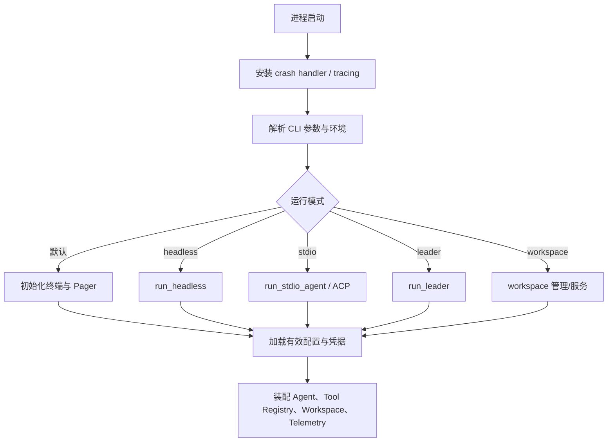
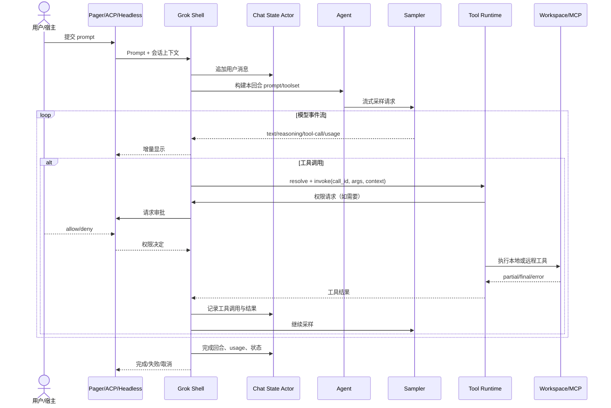
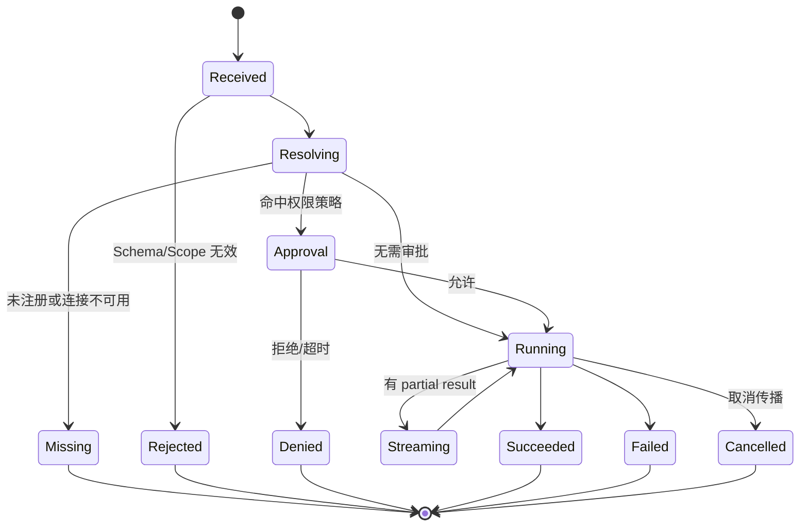
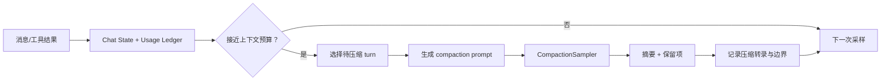
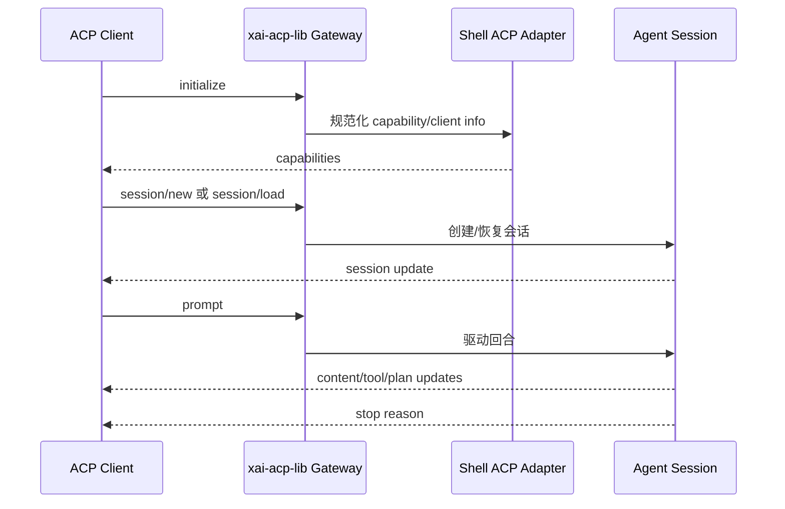
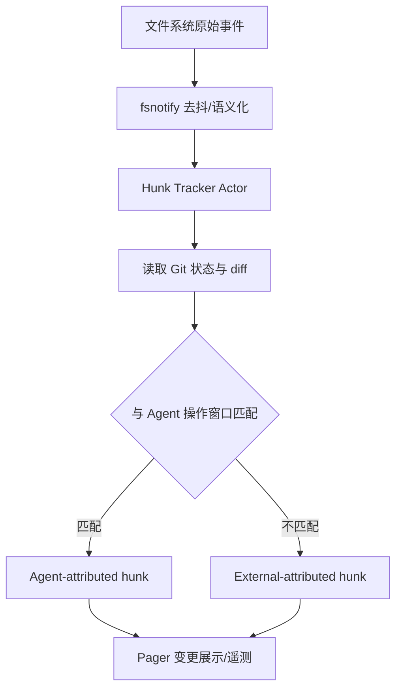
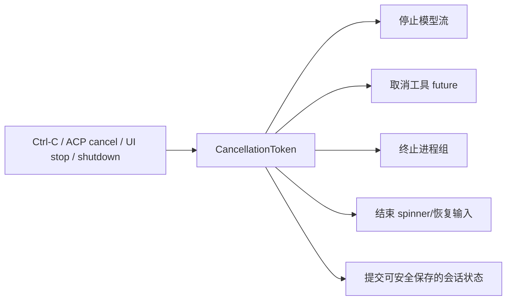

# 关键运行流程

## 启动与入口选择

## 一次 Agent 回合

## 工具解析与调用

调用身份由 Tool Context 携带，工具解析按 `ToolId/Scope/Capabilities` 选择 Local、Hub 或 MCP transport。UI 隐藏不是授权；最终拒绝必须发生在执行端口。

## 会话状态与压缩

压缩不是删除审计事实：活跃 prompt 使用压缩视图，持久化层仍需保留足以解释压缩来源的元数据；具体保留策略由配置和代码版本决定。

## ACP 嵌入流程

stdio 以逐行消息 framing；`xai-acp-lib` 负责通道、读取和消息规范化，Shell 负责 ACP 语义映射，Agent 不直接依赖编辑器。

## 文件变更归因

## 取消与关停传播

取消是协作式的；已经提交到外部系统的副作用不能靠丢弃 Future 撤销，必须查询结果或补偿，详见可靠性说明书。
