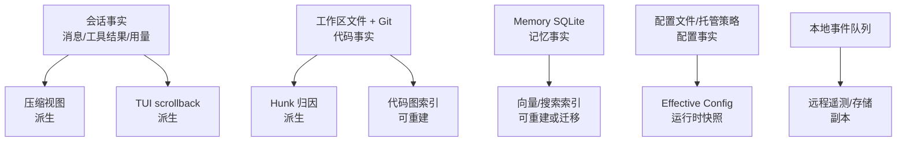
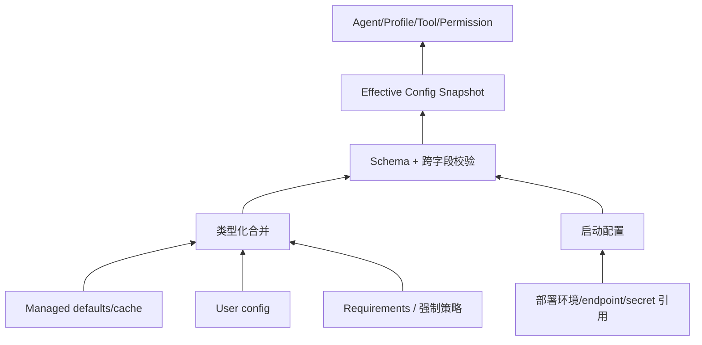
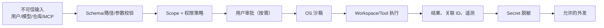
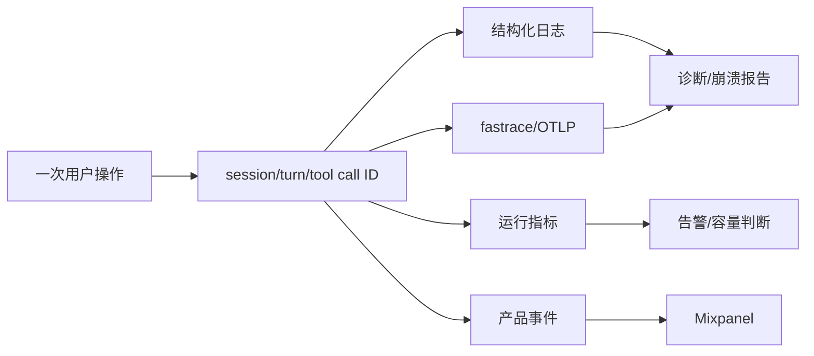

# 数据、配置、安全与可观测性

## 数据事实源

| 数据域 | 权威来源 | 一致性/并发 | 生命周期 |
|---|---|---|---|
| 会话 | Chat State actor + 持久化文件/记录 | actor 单写；事件观察 | 创建、追加、压缩视图、归档/恢复 |
| 工作区 | 本地文件系统与 Git | 外部进程可并发修改；写前需重读/校验 | 由用户仓库管理 |
| Hunk 归因 | Hunk Tracker 状态 | 基于事件与 Git diff，最终收敛 | 随 diff 消失而移除并保留原因 |
| 代码图 | tree-sitter 索引 | 基于 FsEvent 增量更新 | 可从源码重建 |
| 记忆 | Memory SQLite | SQLite 事务；journal 模式依文件系统 | scope、归档和重建策略由配置控制 |
| 配置 | managed/用户/requirements 来源 | 启动或刷新时合并和校验 | 版本覆盖、废弃和原子写 |
| 工具注册 | ToolRegistry + 远端连接状态 | 注册/注销事件驱动 | 连接和插件生命周期 |

## 配置架构

| 类别 | 示例 | 所有者/来源 | 生效与回滚 |
|---|---|---|---|
| 启动/部署配置 | endpoint、代理、日志、凭据引用 | 环境/宿主 | 进程启动；恢复旧环境后重启 |
| 用户偏好 | 主题、模型偏好、TUI 行为 | 用户配置 | 原子写后刷新或重启 |
| 强制策略 | 权限下限、托管要求、签名策略 | 管理方/requirements | 高优先级合并；不能被用户放宽 |
| 动态远程设置 | announcements、campaign、feature settings | 远端配置 + 本地 cache | 校验后刷新；失败使用最后有效值/保守默认 |
| Agent/Plugin 配置 | system prompt、toolset、角色、hook | 仓库/用户/插件 | 构建 Agent 时固定快照 |
| Secret | access token、OAuth credential | credential store/环境引用 | 不进入普通 TOML、日志和 prompt；独立轮换 |

核心规则：未知或非法的安全相关字段不得静默忽略；低层配置不能放宽强制策略；长回合应记录模型、Agent 定义、工具集和关键配置版本，保证问题可复现。

## 安全纵深

### 主要威胁与控制

| 威胁 | 控制 | 剩余风险 |
|---|---|---|
| Prompt injection 诱导执行 | 工具 Schema、服务端授权、用户审批、沙箱 | 用户主动批准高风险动作 |
| 路径逃逸/符号链接 | 强类型路径、canonicalization、workspace root 和 OS policy | TOCTOU 需在执行点复核 |
| 命令孤儿/信号失控 | ProcessGroup/ProcessScope、取消传播、TTY detach | 外部进程自行 daemonize |
| MCP Server 恶意返回 | 内容视为数据、独立凭据和 transport、scope | MCP 自身外部副作用由其信任域负责 |
| Secret 泄漏 | credential provider、禁止普通配置、出站 sanitizer | 正则脱敏不能识别所有语义秘密 |
| 跨会话工具混淆 | ToolCallId、SessionId、Principal、Scope | 自定义 adapter 必须完整传播上下文 |
| 遥测影响主流程 | 异步队列、circuit breaker、失败隔离 | 队列占用磁盘需容量限制 |

## 可观测性

建议/现有设计应统一关联：会话 ID、回合 ID、sample attempt、tool call ID、workspace ID、subagent ID 和 transport connection ID。敏感 prompt、文件内容、token 和完整命令输出默认不作为通用日志字段。

### 需要确认的生产指标

仓库可确认观测机制，但无法确认正式 SLO、保留期和告警阈值。上线责任方需补齐：模型首 token/总时延、工具成功率、取消收敛时长、会话恢复成功率、上传队列年龄、Hub/MCP 重连率、SQLite 错误率、崩溃率，以及对应 P0–P3 阈值和数据保留策略。
