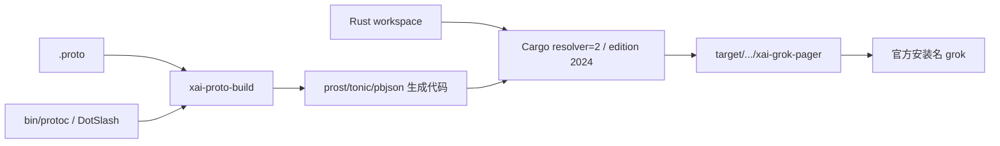
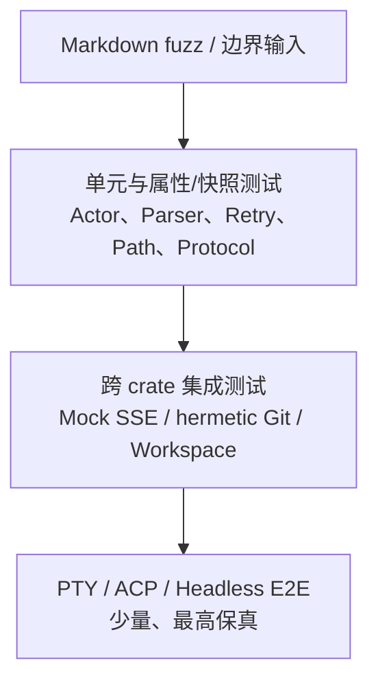
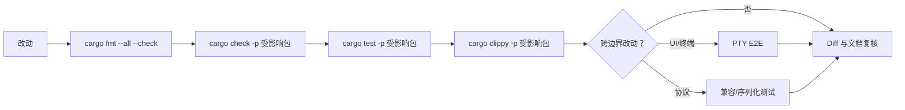
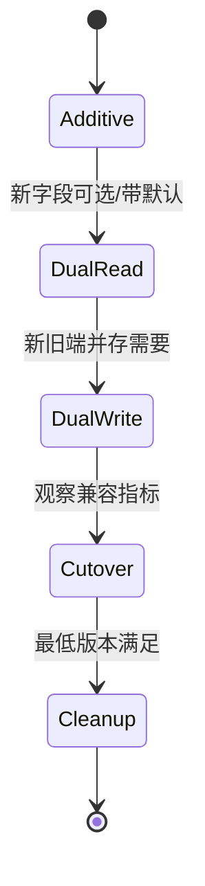
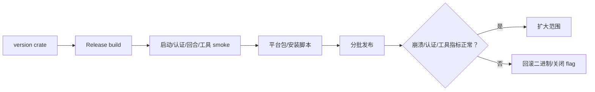

# 工程构建、测试与演进

## 构建链路

根 `Cargo.toml` 自动生成，应修改各 crate manifest 的直接依赖和 feature。工具链由 `rust-toolchain.toml` 固定；格式和 lint 分别由 `rustfmt.toml`、`clippy.toml` 管理。

## 测试金字塔

| 层 | 主要设施 | 应覆盖 |
|---|---|---|
| 单元 | crate 内 `#[cfg(test)]`、`xai-test-utils` | 状态机、错误分类、配置合并、序列化、路径和纯算法 |
| 集成 | `xai-grok-test-support` | 模型 SSE、ACP stdio、headless、认证和环境隔离 |
| 终端 E2E | pager PTY harness | 实际按键、粘贴、滚动、选择、权限弹窗、持久化和终端恢复 |
| 性能 | Criterion/PTY baselines | worktree、代码索引、渲染、粘贴延迟和内存 |
| 模糊测试 | markdown fuzz | 不可信 Markdown 不 panic、不越界 |

## 推荐质量门

全 workspace 构建成本高，日常优先按 package 验证；修改公共叶子 crate、workspace feature 或协议时，再扩展到反向依赖集合。

## 变更边界

| 改动类型 | 必须同步检查 |
|---|---|
| Tool schema/type | tool-types、protocol、runtime、Hub/MCP adapter、模型可见描述、兼容测试 |
| Workspace RPC | workspace-types、client、server、tools-api、版本兼容和代理失败语义 |
| Chat persistence | 迁移、降级工具、压缩转录、恢复测试 |
| Config field | config-types、默认值、loader/validation、managed override、示例/用户文档 |
| Pager event | Shell event 契约、render、PTY E2E、headless/ACP 不受影响证明 |
| Retry/timeout | 可靠性说明、配置、遥测、mock 故障测试，避免多层叠加 |
| 第三方升级 | license/notice、feature、MSRV/工具链、网络/crypto 行为和锁文件 |

## 协议和 Schema 演进

- Tool Protocol 以 `PROTOCOL_VERSION` 和 capabilities 协商；未知字段/方法按协议定义处理。
- 持久化数据先扩展读取能力，再写新格式；保留 downgrade/migration 路径。
- Protobuf 新增字段使用新 tag，禁止复用删除 tag；JSON DTO 需要明确默认和未知字段策略。
- Feature flag 必须有所有者、启用条件、观测指标、回滚和删除日期；不能永久替代架构边界。

## 发布与回滚

数据库/配置格式发生变化时，回滚必须验证旧二进制能否读取新状态；不能读取时需先保持双读或提供 downgrade 工具。崩溃处理和自动更新路径本身属于发布 smoke 范围。

## 开发完成定义

一个技术工作项完成时应同时具备：实现；成功、失败、权限、取消和恢复测试；必要遥测；安全默认配置；Schema/持久化迁移；回滚办法；用户/设计文档更新；以及对应功能或模块的可追踪说明。
