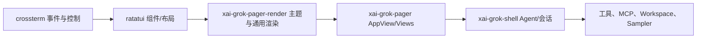
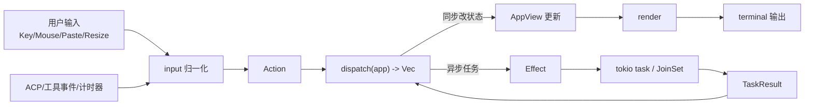
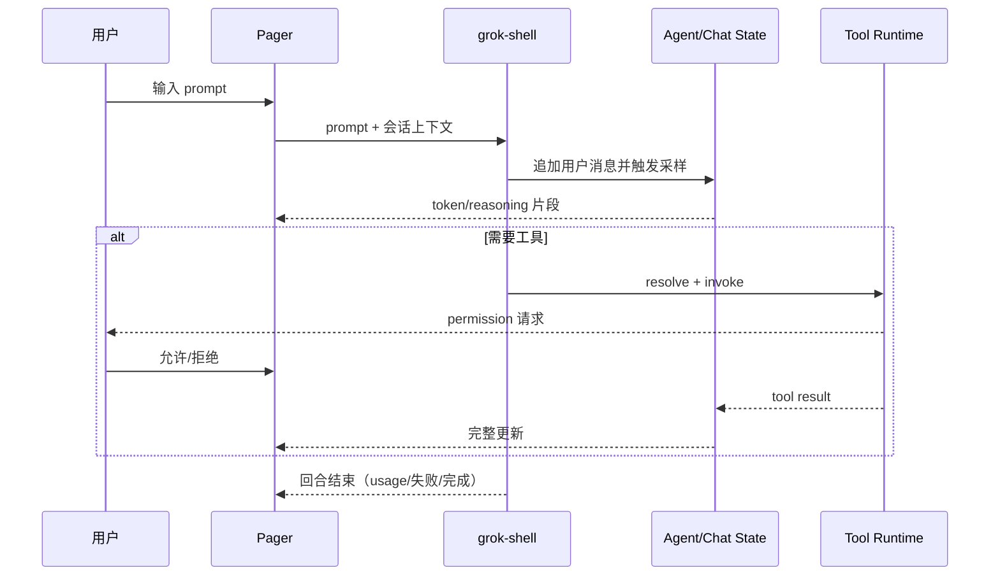

# 07：TUI 专题设计（grok pager）

## 1. 结论：当前工程的界面技术不是 Web，而是 **Rust 终端交互界面（TUI）**

Grok Build 的主交互界面在这个仓库里由 `xai-grok-pager` 提供，定义为“full-screen TUI”，不依赖浏览器运行时，不是 React/Vue/Flutter 这类 GUI 框架。  
核心实现是通过终端控制与帧渲染驱动的组件化界面，而不是 DOM/Canvas 渲染。

---

## 2. TUI 技术栈与第三方框架

### 2.1 一级技术栈

1. `ratatui`：布局、Widget、渲染缓冲与 diff 的基础框架（`crossterm` feature）。  
2. `crossterm`：键盘/鼠标事件、终端 raw mode、alternate screen、终端控制序列、粘贴事件等输入与输出底层。
3. `portable-pty`：需要时与 PTY 场景联动（命令执行、回放、终端状态校验）。
4. `tokio`：主事件循环与异步任务执行的运行时。
5. `unicode-width` / `unicode-segmentation`：面向终端单元格宽度和文本切分，保证中日韩/emoji 对齐。
6. `ratatui-textarea`、`ratatui-inline`：文本输入和内嵌视口输入组件能力（prompt 多行/自动换行/光标行为）。
7. `textwrap` / `syntect` / `ansi-to-tui`：内容排版、语法高亮和 ANSI 语义处理。
8. `xai-grok-markdown`：流式 Markdown、代码块、表格、链接、Math/Mermaid 等消息渲染。
9. `xai-grok-mermaid`：Mermaid 文本转渲染图内容（内置引擎链路）。
10. `xai-grok-pager-render`：把公共展示层（主题、渲染组件、媒体/链接相关）从主应用中提取到独立 crate，降低耦合度。

### 2.2 依赖链路（TUI 范围）



---

## 3. TUI 设计目标

1. 高频输入不阻塞：UI 主循环必须始终可响应键盘/鼠标，否则采样流和渲染会卡顿。  
2. 单向状态更新：尽量避免副作用直接修改 UI 状态，避免并发竞态。  
3. 渐进式显示：模型 token 与工具进展要流式可视化，支持部分结果回填。  
4. 会话多样性：一个进程内支持多个 session 与任务上下文切换。  
5. 终端兼容性：支持缩放、ANSI、宽字符、不同终端能力差异。  
6. 可恢复：异常/终止后尽量恢复终端状态，避免“脏终端”。

---

## 4. TUI 层架构（按 crate 与模块）

### 4.1 结构化分层

```text
xai-grok-pager (UI Shell)
├── app/
│   ├── event_loop.rs      // 主事件循环（tokio::select! 汇总事件）
│   ├── app_view.rs        // 全局状态：welcome/agent/会话/全局模态
│   ├── dispatch/          // Action -> Effect -> TaskResult
│   ├── effects.rs         // 异步副作用执行
│   ├── agent/             // 每会话逻辑（agent_view）
│   ├── status_blocks.rs    // 运行状态块
│   └── ...
├── views/                 // 各类 Widget 与视图组件
│   ├── prompt_widget/     // prompt 输入（@ 补全、/ 命令、历史等）
│   ├── scrollback          // 对话内容渲染
│   ├── welcome            // 首屏 logo/menu/toast
│   ├── settings_modal     // 设置/参数面板
│   ├── dashboard          // 任务/会话聚合面板
│   └── ... 
├── input/                 // 键盘、鼠标、粘贴、终端事件归一化
├── notifications/         // 通知桥接与终端标题/焦点等外部反馈
└── acp/                  // 与 shell 通讯桥接（会话事件）
```

### 4.2 数据与控制边界

- `app/app_view.rs`：UI 的“状态树”与会话索引。
- `app/dispatch`：把外部输入转为 `Action`，再分派 `Effect`。
- `app/effects`：异步执行（tool 调用、剪贴板、网络请求、文件 I/O、倒计时、后台任务启动）并产出 `TaskResult`。
- `views/*`：仅负责把状态绘制成终端 buffer。
- `input/*`：所有事件入口归一化为统一结构，避免不同终端行为差异影响上层语义。

---

## 5. 核心数据流（单向流）



`Action/Effect/TaskResult` 三元模型是 TUI 的行为基石：  
- `Action` 只描述“意图”；  
- `Effect` 封装“副作用”；  
- `TaskResult` 将副作用结果再回到同一 `dispatch` 通道，确保状态只在主循环内更新。

---

## 6. 事件循环与并发模型

`event_loop` 的核心是 `tokio::select!` 合并多源事件：  
- 键盘/鼠标输入  
- 大小变化  
- ACP/session 通知  
- 异步任务结果  
- 配置监控与配置变更  
- 计时器（spinner/防抖/轮询）  
- 信号（退出/中断/恢复）

约束要求：  
1. 不能在循环主分支执行重阻塞网络/磁盘任务；  
2. 长耗时统一走 `Effect`，回传 `TaskResult`；  
3. 每次 event loop tick 只处理一次事件分支，避免重入。  

Writer 与渲染分离：  
- UI 渲染将最终 frame 放入专用输出通道；  
- 独立 writer 线程负责阻塞式 `stdout` 写入与 `flush`，降低对输入处理的影响。  

---

## 7. 渲染流程（Frame to terminal）

1. 从 `AppView` 计算布局（Rect）与组件树。  
2. 各 `views/*` Widget 产出 ratatui buffer。  
3. 计算/更新鼠标和滚动可见区域。  
4. 交给 `xai-grok-pager-render` 做统一主题、颜色、链接、块渲染语义。  
5. 逐帧向终端发出 ANSI 序列。  

常见渲染风险处理：  
- Unicode 字符宽度不一致导致列对齐异常；  
- 未完成 Markdown block（例如未闭合代码块）时的渐进显示；  
- 高频 token 带来的重绘压力，需要 frame 合并；  
- 超长 scrollback 导致内存占用，需要裁剪与懒加载策略。  

---

## 8. 主要交互与操作（TUI 操作语义）

下列高频操作来自 pager 说明文档：  
- `/`：命令盘（slash command）  
- `@`：文件补全（file search）  
- `Ctrl+P` 或 `?`：打开命令盘  
- `Tab`：prompt 与 scrollback 切换  
- `Esc`：不同场景下用于取消、清空 prompt、打开时间回滚选择器等  
- `Ctrl+C`：清空输入或中断运行中 turn  
- `Ctrl+M`：多行输入开关  
- `Shift+Enter`：插入换行  
- `Ctrl+G`：任务面板切换（不同模式差异）  
- `!`（空 prompt）：进入 bash mode  

提示：同一个键位行为与焦点上下文耦合（欢迎页/会话页/Modal/Picker/Prompt 不同）。  

---

## 9. 画面模式（ScreenMode）

TUI 内存在多种屏幕模式，意味着渲染能力与输入行为不同：  
1. Fullscreen：占据 alternate screen，标准全屏 UI。  
2. Inline：与 shell scrollback 协作的轻量模式。  
3. Minimal：能力更保守，适用于受限终端环境。  

模式切换会影响：  
- 注册 action 映射；  
- 鼠标/粘贴/焦点行为；  
- 画面恢复策略。  

---

## 10. 与 Shell/Agent 的交互流程

### 10.1 一次输入到输出



### 10.2 ACP/外部客户端

TUI 也会接收 ACP 异步事件（session、tool progress、权限、usage、文本）。  
这些事件需按会话 id 绑定到正确 `AgentView`，避免用户切页后写入错误上下文。  

---

## 11. 文件与配置边界（TUI 侧）

TUI 负责展示相关配置参数与持久化设置：  
- 外观：主题、mermaid 开关、字体/颜色策略、滚动/布局参数；  
- 快捷键行为与交互偏好；  
- 会话显示配置（任务面板、dashboard、日志级别）。  

注意：实际权限、模型、工具链、网络策略仍归更底层应用（workspace/shell/telemetry）管理，TUI 不直接持有执行权限真值；它只执行“展示 + 触发 + 展示结果”。  

---

## 12. 风险点与改进建议（TUI 视角）

1. 高频 `tokio::select!` 事件分支若包含阻塞操作会导致输入延迟。  
2. frame 写入可能成为瓶颈，需保障 redraw 频率合并。  
3. 终端能力差异（kitty image/protocol、鼠标事件、paste 模式）应降级兼容。  
4. 长上下文 Markdown 与未闭合语法块可能触发渲染抖动，需要保持流式一致性。

---

## 13. 验证建议（不改运行命令，先给审查路径）

### 代码定位建议
- `crates/codegen/xai-grok-pager/src/app/event_loop.rs`：事件主循环和 `tokio::select!`。  
- `crates/codegen/xai-grok-pager/src/app/dispatch`：Action/Effect 路由与副作用边界。  
- `crates/codegen/xai-grok-pager/src/app/app_view.rs`：状态树与会话/模态管理。  
- `crates/codegen/xai-grok-pager/src/views`：所有 UI 组件与终端布局。  
- `crates/codegen/xai-grok-pager/src/input`：输入归一化（keyboard/mouse/paste）。  
- `crates/codegen/xai-grok-pager/src/render` 与 `crates/codegen/xai-grok-pager/src/app/csi_filter.rs`：渲染与终端控制行为。  
- `crates/codegen/xai-grok-pager/Cargo.toml`：TUI 依赖边界（`ratatui`、`crossterm` 等）。  

---

## 14. 结语

这套 TUI 的关键特征是：  
- 用标准化的 `Action -> Effect -> TaskResult` 建立可测试的异步界面模型；  
- 用 ratatui + crossterm 落地高复杂度终端交互；  
- 在一个全局事件循环里统一协调用户输入、ACP 通知、后台任务与渲染；  
- 通过独立 render crate 与状态分层，让 TUI 能承载复杂 agent 操作而不退化为“只输文字”工具。
