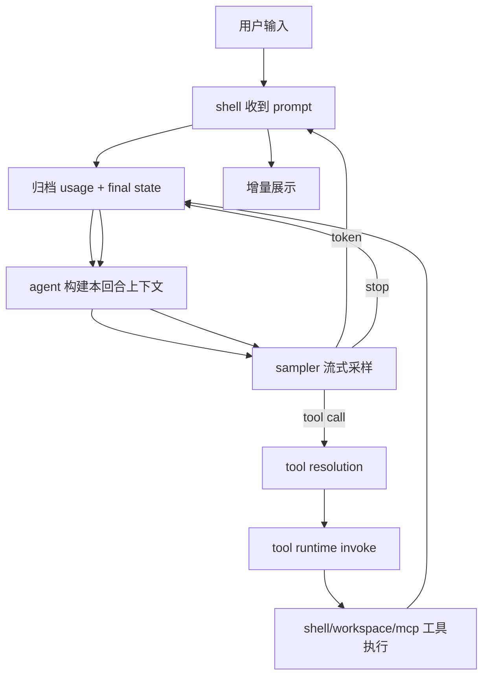

# 08：运行时与会话专题（Shell/Agent/ACP/Headless）

## 1. 定位

这一层是 TUI 之外的“主控大脑”，负责：
- 进程入口路由（TUI / headless / ACP / leader / workspace）
- 会话生命周期（创建、恢复、fork、停止）
- 与模型采样、工具运行时、工作区的编排

核心实现主要在 `xai-grok-shell`、`xai-grok-agent`、`xai-chat-state`、`xai-acp-lib`。

---

## 2. 启动入口与模式分发

在组合二进制 `xai-grok-pager-bin` 中根据 CLI 参数进入不同模式：

1. 默认：进入 Pager（TUI）；
2. `--headless`：走无头模式，便于 CI/脚本；
3. `--stdio`：以 ACP host/client stdio 方式接入 IDE；
4. `leader/workspace`：启动服务端或 workspace 模式协作链路；
5. 初始化阶段统一完成：crash handler、tracing、telemetry、panic 恢复、安全环境。

设计意图：**入口职责精简，业务逻辑在 `xai-grok-shell` 内组合**，避免在 `-bin` 里承载领域规则。

---

## 3. 会话与回合生命周期

## 3.1 会话创建与恢复

- 会话状态来自 `xai-chat-state` 的 actor 状态机；
- 恢复路径要求：可重建上下文、工具结果、usage、system/prompt 边界；
- 子会话（subagent）通过 `xai-grok-subagent-resolution` 做 spec 合并，避免 persona/role 重复解释冲突。

状态更新一般走 `Command`/`Event`/`EventSink`（或等价的消息队列）模型，尽量单写入口减少竞态。

## 3.2 一次回合执行链

重点：
- 模型采样是流式；
- 工具调用中可穿插权限确认；
- 取消信号可传播到采样与工具未来任务。

---

## 4. Shell 与 Agent 的分工

### 4.1 `xai-grok-shell`
- 会话编排、消息合并、tool 生命周期；
- 与配置、凭据、遥测、hook、插件边界对齐；
- 统一协调 headless 与 TUI/ACP 的差异化输入。

### 4.2 `xai-grok-agent`
- 负责 prompt 组装、persona/agent 定义解析、工具能力注入；
- 与模型协议字段映射（输入类型、系统提示、tool schema）；
- 让采样调用和模型适配逻辑与 shell 解耦。

### 4.3 `xai-chat-state`
- 会话主状态 actor，保持历史、工具调用记录、预算/usage ledger；
- 归档与压缩前后的一致性边界（压缩不等于丢历史元信息）。

---

## 5. ACP 与外部嵌入

`xai-acp-lib` 提供通道与消息标准化，职责是：
- stdio channel framing；
- capability/初始化消息规范化；
- session 生命周期语义的可复用解析。

Shell 承担语义映射（session/new/load/prompt/stop），确保 IDE/编辑器客户端不能直接耦合到具体 Agent 类型。

---

## 6. 关键第三方/跨 crate 依赖

- `tokio`：多任务、取消令牌、joinset、通道；
- `reqwest`（在 http 子域）和 xAI SDK 生态：用于模型/HTTP 交互；
- `prost/tonic`：proto 与类型接口；
- `portable-pty`：运行层需要时用于会话外壳能力；
- `serde/serde_json`：事件与状态持久化接口；
- 若干安全/连接库：按平台分层在 runtime crate 中注入。

---

## 7. 流量与故障边界

1. 入口层只做最小路由，不在此处理复杂业务；
2. 状态变化只允许落回状态 actor/持久层；
3. 失败分类（schema/网络/权限/超时）沿 task result 回到统一处理；
4. 终止/取消是协作式：已下发外部副作用通常无法撤销，需要补偿查询。

---

## 8. 推荐阅读定位

- `crates/codegen/xai-grok-shell/src`
- `crates/codegen/xai-grok-agent/src`
- `crates/codegen/xai-chat-state/src`
- `crates/codegen/xai-acp-lib/src`
- `crates/codegen/xai-grok-pager-*/`（入口与 TUI 桥接）

---

## 9. 与 TUI 的关系

TUI 不持有“执行真相”，它只是把“会话状态变化 + 工具进展”展示出来并收集用户确认；  
真实决策、权限、持久化、重试和恢复策略在这一层运行时中完成。
