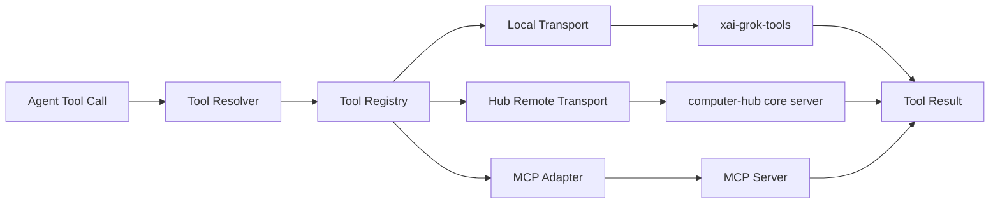
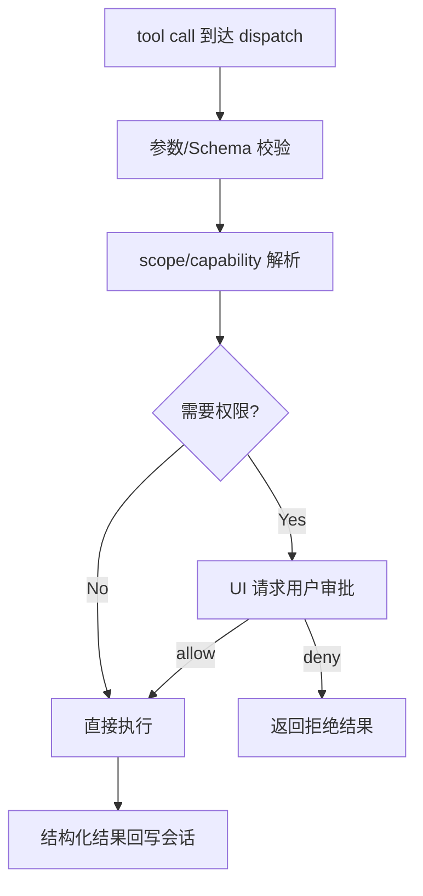

# 09：工具与扩展专题（Tool Runtime / MCP / Hook / Plugin）

## 1. 定位

这一专题回答“工具如何被发现、路由、执行、受控，以及如何被插件与 MCP 扩展”。

关键 crate：
- `xai-tool-types`、`xai-tool-protocol`、`xai-tool-runtime`
- `xai-computer-hub-*`
- `xai-grok-tools`、`xai-grok-tools-api`
- `xai-grok-mcp`、`xai-grok-plugin-marketplace`
- `xai-grok-hooks`

---

## 2. 工具执行总线

核心目标：将调用来源和执行方式解耦，调用方只关心工具能力与返回，而非具体协议实现。

---

## 3. 协议与类型层

### 3.1 `xai-tool-types` 与 `xai-tool-protocol`
- 工具 ID、参数 schema、scope、能力字段统一；
- 协议层给出 hello/注册/错误/通知/输出事件等报文语义；
- 版本化约束使工具扩展可演进。

### 3.2 `xai-tool-runtime`
- 统一 `Tool` trait、上下文、执行生命周期；
- 通过 context 持有权限、鉴权信息、取消 token；
- 支持流式与分段结果。

---

## 4. Hub 与 MCP 适配

- `xai-computer-hub-core`：resolver + transport 分离，支持多源融合；
- `xai-computer-hub-sdk`：连接池、握手、重连、连接引用计数；
- `xai-computer-hub-mcp-adapter`：将 MCP 工具映射为 hub native 工具；
- `xai-grok-mcp`：MCP server 管理（stdio/http/oAuth/credential store）；
- 执行时走统一错误语义，失败与能力缺失会在 resolver/dispatch 阶段被分类归并。

---

## 5. 本地工具（`xai-grok-tools`）与外部扩展

`xai-grok-tools` 提供终端、文件、搜索、补丁、web、工作区等内置 tool。  
外部扩展主要来自：
- MCP server（标准协议路径）；
- 插件市场（安装源、目录、版本、可见性管理）；
- Hooks（按事件生命周期注入执行或阻断）。

---

## 6. 权限与审批流

工具调用不直接在运行时末端自动执行，应经过统一鉴权门：

这样可保证“工具行为决策”不被 UI 展示层吞没，且审计统一落在 shell/agent 层。

---

## 7. 并发与可观测性

- Tool 解析与执行应支持并发隔离，避免一个阻塞阻塞整个回合循环；
- 调用上下文需要透传会话ID、trace、tool call id；
- 工具失败要有稳定分类（schema、missing tool、permission、transport、runtime）；
- 与 workspace/watcher 的变化归因分离（后续通过 hunk tracker）。

---

## 8. 第三方框架/依赖

与工具体系高相关的外部能力包括：
- MCP 生态（协议客户端/服务端适配链）；
- `tokio` 运行时（async 调度）；
- `serde/serde_json`（参数与结果编码）；
- `uuid`（调用 ID）与 tracing/logging。

---

## 9. 实现建议（落地）

1. 保持 resolver 层稳定输出，不直接让 UI/agent 处理网络与命名歧义；
2. 在工具定义中把 side-effect 范围（文件/网络/exec）显式化；
3. 对插件与 MCP source 增加权限分层（可见性、受信任源、离线缓存）；
4. 把工具执行失败映射为统一结构，避免上层重复判断字符串。

---

## 10. 代码定位（阅读建议）

- `crates/codegen/xai-computer-hub-core`
- `crates/codegen/xai-computer-hub-sdk`
- `crates/codegen/xai-computer-hub-mcp-adapter`
- `crates/codegen/xai-grok-tools`
- `crates/codegen/xai-grok-tools-api`
- `crates/codegen/xai-grok-mcp`
- `crates/codegen/xai-grok-plugin-marketplace`
- `crates/codegen/xai-grok-hooks`
