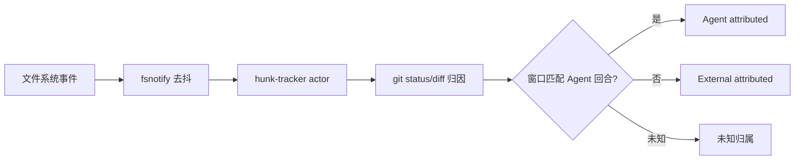

# 10：工作区与数据专题（Workspace / Filesystem / Storage）

## 1. 定位

该专题覆盖代码仓库内的操作层：文件系统、git/vcs、命令执行、路径/权限、checkpoint、持久化与索引。

关键 crate：
- `xai-grok-workspace`、`xai-grok-workspace-types`、`xai-grok-workspace-client`
- `xai-codebase-graph`、`xai-fast-worktree`、`xai-gix-status`
- `xai-file-utils`、`xai-sqlite-journal`、`xai-fsnotify`、`xai-hunk-tracker`
- `xai-grok-sandbox`、`xai-system-power`

---

## 2. 核心职责划分

### 2.1 `xai-grok-workspace`
- 统一 FS/执行/发现能力入口；
- Workspace server 与工具侧请求统一映射；
- 把路径解析、命令能力、权限与结果事件收敛在一层。

### 2.2 `xai-grok-workspace-types` / `xai-grok-workspace-client`
- RPC 请求/事件类型版本化；
- Client 仅作为稳定 DTO 通道，减少上层对服务实现依赖；
- 错误映射为稳定 `ToolError` 语义。

### 2.3 代码视图与图分析
- `xai-codebase-graph` 做符号索引（tree-sitter 语义信息）；
- 基础索引 + 增量更新支撑快速查询与编辑定位；
- `xai-gix-status` 处理状态扫描并发限制（防止线程耗尽）。

---

## 3. 文件与变更归因

归因用于 UI 展示和审计，减少“用户外部编辑与 Agent 编辑”混淆。

---

## 4. 存储与数据库策略

- `xai-sqlite-journal`：按本地/网络文件系统自适应 WAL 或 rollback 策略；
- 会话/记忆/日志类状态优先本地可恢复；
- `xai-file-utils` 提供上传队列与追踪隔离，不阻塞主会话主链路。

---

## 5. 运行与沙箱边界

- `xai-grok-sandbox`：平台能力探测 + 沙箱策略；
- 与权限确认形成互补关系：沙箱提供 OS 层约束，权限策略提供业务层意图约束；
- `xai-system-power`：休眠/唤醒事件处理，避免超时与执行误判。

---

## 6. 工作区命令与执行模型

外部命令执行并非直接由 UI 触发，而是经由 shell → workspace/tool runtime 走统一入口。  
其要点是：
1. 进程组与生命周期托管；
2. 信号传播（中断/退出）一致；
3. 异步执行的可取消性与状态回写；
4. 失败分类可追踪（启动失败/权限不足/超时/退出码）。

---

## 7. 性能与稳定性注意点

- 文件事件去抖避免频繁触发无意义刷新；
- 快速索引路径不应与 UI 主线程耦合；
- 大仓库下的状态扫描需要 worker 上限控制和超时保护；
- 写入过程尽量原子化 + 失败可诊断（避免“写成功但未展示/覆盖旧值”）。

---

## 8. 推荐阅读入口

- `crates/codegen/xai-grok-workspace/src`
- `crates/codegen/xai-codebase-graph/src`
- `crates/codegen/xai-fsnotify/src`
- `crates/codegen/xai-hunk-tracker/src`
- `crates/codegen/xai-sqlite-journal/src`
- `crates/codegen/xai-grok-sandbox`
- `crates/codegen/xai-system-power`

---

## 9. 与 TUI 的交互关系

TUI 只展示文件改动、会话信息和执行状态；  
“能改什么、改谁、能不能改、改完归谁”这些最终判定来自 workspace 与工具/权限链路。
