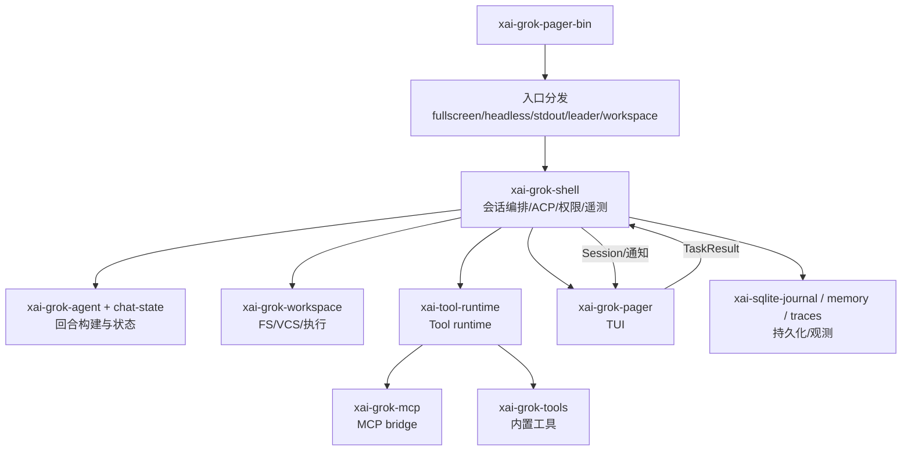

# 11：补充专题（参考现有源码与 sourcecode 目录）

## 1. 说明

你要求“参考 crush 的内容”来补文档。当前仓库内未检索到名为 `crush` 的独立文档源，先按现有源码与 `docs/sourcecode` 目录中可确认的技术内容补齐，保证文档可落地且可追溯。

## 2. 与 `docs/sourcecode` 的映射关系

本专题对应的主要来源：
- `docs/sourcecode/00-全项目源码地图.md`：仓库边界、主路径与依赖关系。
- `docs/sourcecode/01-Rust新手阅读方法.md`：模块导航与阅读策略（可用于设计文档审阅路线）。
- `docs/sourcecode/02-入口与主运行链精读.md`：启动链与主入口的技术链路。
- `docs/sourcecode/03-模型采样与工具执行.md`：采样/工具调用在运行时的控制流。
- `docs/sourcecode/04-状态协议与持久化.md`：状态与协议持久化细节。
- `docs/sourcecode/05-TUI事件循环与渲染.md`：TUI 事件循环与渲染实现细节。
- `docs/sourcecode/06-Workspace全部Crate导航.md`：workspace 相关 crate 的结构关系。
- `docs/sourcecode/07-测试调试与验证.md`：验证入口与测试思路。

## 3. 设计文档缺口补齐（建议追加到已有专题中的统一清单）

### 3.1 系统三层执行图（可放到 08/09/10）

### 3.2 关键链路统一术语

- 入口：bin crate / CLI 参数
- 编排：shell / agent / chat-state
- 执行：tool runtime / workspace / mcp
- 展示：pager views + render crate
- 输入：input modules（key/mouse/terminal_support）
- 变更归因：fsnotify + hunk-tracker
- 持久化：config/sqlite/journal / chat ledger / memory
- 可观测：tracing/fastrace + otlp + telemetry + crash handler

## 4. 可直接复用到其他专题的“非主叙述”内容

### 4.1 TUI 专题（07）
- 现在可补一段“Frame 生命周期”：`AppView` dirty 标记 → layout → widget 渲染 → ratatui buffer diff → writer flush。
- 增加“输入冲突规约”：同一按键在不同上下文映射不同动作，统一交给 `input` + `dispatch` 解析，不放在视图层分散判定。

### 4.2 运行时专题（08）
- 补充 `headless`/`stdio`/`leader` 三种模式失败后恢复策略：统一走 shell 内统一返回码与错误码语义。
- 强化 `cancel` 的传播语义：token + tool future + tool call cancel token + process group。

### 4.3 工具专题（09）
- 强调“工具并发策略”：resolver 失败、缺能力、超时/审批拒绝三类错误都不应走同一个提示文案。
- 补充“权限决策边界”：UI 只展示与收集，执行侧必须重新审计上下文并记录审计日志。

### 4.4 工作区专题（10）
- 增加“高频写入路径防抖”：fsnotify 去抖后再做 git 归因，减少 UI 抖动。
- 强调 `xai-sqlite-journal` 在网络挂载与本地盘上的策略差异（WAL 与 rollback）。

## 5. 文档风格建议（建议一次性补齐）

每个专题建议统一添加四段：
1. “设计约束”（What not to do）  
2. “调用链（happy path）”（时序/状态机）  
3. “边界条件”（权限、超时、取消、窗口变化）  
4. “源码锚点”（按文件路径引用）

## 6. 可执行后续动作（按优先级）

1. 在 `docs/design/README.md` 增加专题导航入口（建议已完成，确认后也可继续合并到章节目录）。  
2. 把 `07/08/09/10` 每篇都补充上“边界条件”章节。  
3. 在 `docs/sourcecode` 增加到 design 的反向链接（sourcecode -> design），形成双向索引。  
4. 若你确认 `crush` 的具体文件名，我按该文件逐条补齐映射表。
