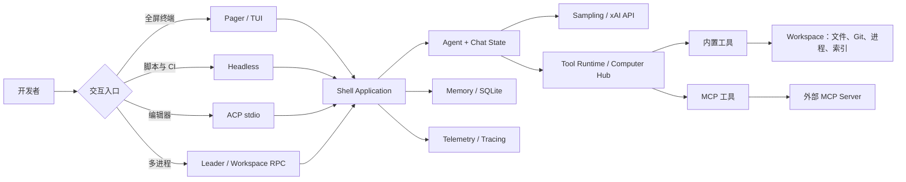
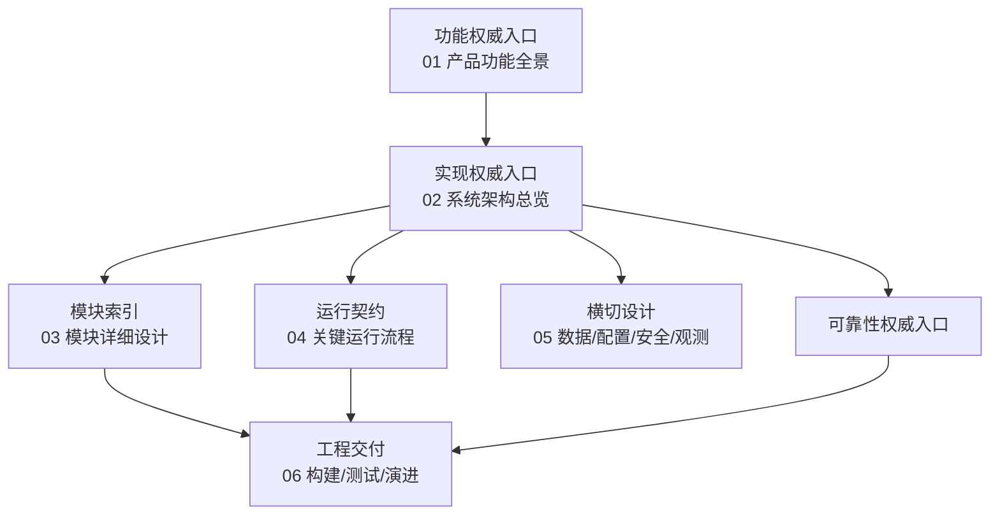

# Grok Build 设计文档

> 本目录依据当前仓库代码、Cargo 清单和已有用户文档整理。它描述“当前实现”，不是未来路线图。无法从代码确认的生产指标均标为待确认。

## 一图读懂

## 阅读路径

| 文档 | 回答的问题 | 主要读者 |
|---|---|---|
| [01-产品功能全景.md](01-产品功能全景.md) | 用户能做什么，各能力怎样组成闭环？ | 产品、研发、测试 |
| [02-系统架构总览.md](02-系统架构总览.md) | 进程、逻辑层、信任边界和依赖方向是什么？ | 架构师、研发 |
| [03-模块详细设计.md](03-模块详细设计.md) | 每个 workspace crate 负责什么、如何实现？ | 研发、代码审查者 |
| [04-关键运行流程.md](04-关键运行流程.md) | 启动、对话、工具调用、ACP、恢复怎样流转？ | 研发、测试、运维 |
| [05-数据配置安全与可观测性.md](05-数据配置安全与可观测性.md) | 状态保存在哪里，配置怎样合并，安全边界是什么？ | 研发、安全、运维 |
| [可靠性与通用技术实现说明书.md](可靠性与通用技术实现说明书.md) | 失败、重试、取消、熔断、恢复的真实保证是什么？ | 研发、SRE |
| [06-工程构建测试与演进.md](06-工程构建测试与演进.md) | 如何构建、验证、发布和安全演进？ | 贡献者、维护者 |

## 文档边界

## 事实来源与限制

- workspace 根 `Cargo.toml` 是自动生成文件；模块事实以各 crate 的 `Cargo.toml`、`src/lib.rs`、`src/main.rs` 为准。
- 本仓库是 SpaceXAI 单体仓库的同步子集，`SOURCE_REV` 记录来源修订；部分服务端实现不在本仓库。
- 官方发布物把二进制 `xai-grok-pager` 安装为 `grok`。
- 本设计不把外部 API、托管服务或未同步代码的内部实现当作已知事实。
- Mermaid 图完成了源码级围栏与关系复核，未在仓库 CI 中进行浏览器渲染验证。
