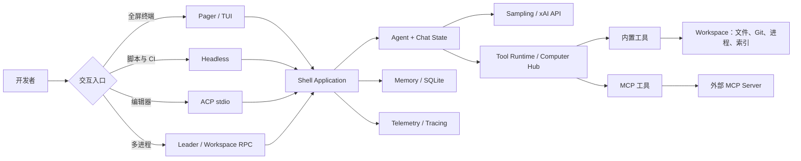
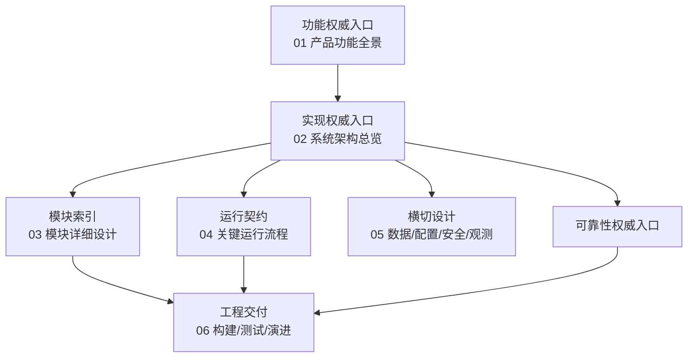
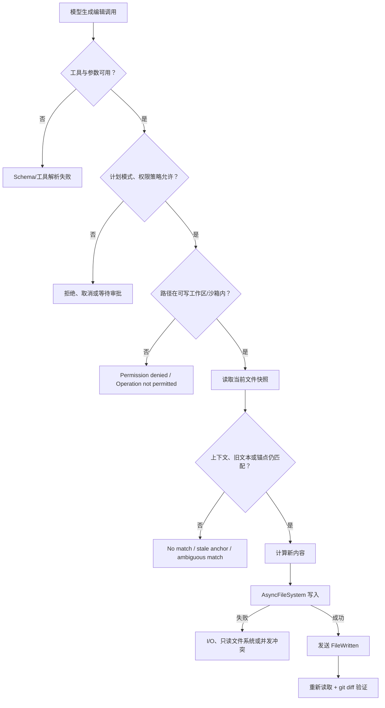
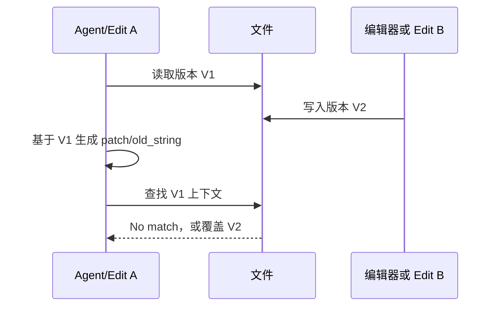
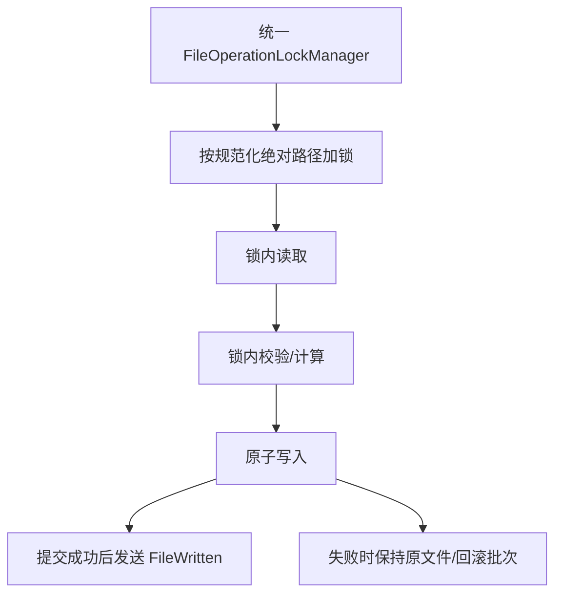

# Grok Build 设计文档

> 本目录依据当前仓库代码、Cargo 清单和已有用户文档整理。它描述“当前实现”，不是未来路线图。无法从代码确认的生产指标均标为待确认。

## 一图读懂

## 阅读路径

| 文档 | 回答的问题 | 主要读者 |
|---|---|---|
| [01-产品功能全景.md](01-产品功能全景.md) | 用户能做什么，各能力怎样组成闭环？ | 产品、研发、测试 |
| [02-系统架构总览.md](02-系统架构总览.md) | 进程、逻辑层、信任边界和依赖方向是什么？ | 架构师、研发 |
| [03-模块详细设计.md](03-模块详细设计.md) | 每个 workspace crate 负责什么、如何实现？ | 研发、代码审查者 |
| [04-关键运行流程.md](04-关键运行流程.md) | 启动、对话、工具调用、ACP、恢复怎样流转？ | 研发、测试、运维 |
| [05-数据配置安全与可观测性.md](05-数据配置安全与可观测性.md) | 状态保存在哪里，配置怎样合并，安全边界是什么？ | 研发、安全、运维 |
| [可靠性与通用技术实现说明书.md](可靠性与通用技术实现说明书.md) | 失败、重试、取消、熔断、恢复的真实保证是什么？ | 研发、SRE |
| [06-工程构建测试与演进.md](06-工程构建测试与演进.md) | 如何构建、验证、发布和安全演进？ | 贡献者、维护者 |

## 文档边界

## 事实来源与限制

- workspace 根 `Cargo.toml` 是自动生成文件；模块事实以各 crate 的 `Cargo.toml`、`src/lib.rs`、`src/main.rs` 为准。
- 本仓库是 SpaceXAI 单体仓库的同步子集，`SOURCE_REV` 记录来源修订；部分服务端实现不在本仓库。
- 官方发布物把二进制 `xai-grok-pager` 安装为 `grok`。
- 本设计不把外部 API、托管服务或未同步代码的内部实现当作已知事实。
- Mermaid 图完成了源码级围栏与关系复核，未在仓库 CI 中进行浏览器渲染验证。

## 代码编辑失败：现状、原因与排查过程

### 当前结论

当前环境并不是“整个仓库都无法编辑”：工作区 `/Users/vincent/workspace/16_AI/grok-build` 具有写权限，普通源码和文档可以修改；`.git` 目录只有读权限，因此修改文件可以成功，但 `git add`、`git commit` 等需要写 `.git/index`、对象库或引用的操作会收到 `Operation not permitted`。这类失败需要单独申请 Git 写权限，不能通过重新生成补丁解决。

项目自身提供 `apply_patch`、`edit`、`write` 和 hashline edit 多条编辑路径。它们都声明 `ToolScope::Write`，最终通过 `AsyncFileSystem` 写文件并发送 `FileWritten` 通知。一次编辑只有在收到成功输出并重新读取文件确认内容后，才能视为成功；TUI 展示出 Diff 并不等于文件已经写入。

### 编辑工具的实际处理过程

| 编辑方式 | 处理过程 | 常见失败条件 |
|---|---|---|
| `apply_patch` | 解析 `Begin/End Patch` 和文件 hunk；先读取所有目标并在内存计算变更；然后逐文件写入 | 补丁格式错误、使用绝对路径、文件不存在、上下文或旧行找不到、目录/文件不可写 |
| `edit` | 解析路径；读取全文；精确查找 `old_string`；计算替换；写回全文 | 新旧文本相同、目标是目录、文本不存在、文本出现多次但未指定 `replace_all`、缩进或 Unicode 不一致 |
| `write` | 读取旧文件用于 Diff；创建父目录；使用完整 `content` 覆盖文件 | 错误路径、只读目录、内容截断；它不会自动防止覆盖外部新修改 |
| hashline edit | 读取带哈希锚点的行；一次性校验所有锚点和重叠范围；自底向上应用；写回 | 锚点过期/歧义、错误复制行号与哈希前缀、编辑范围重叠、文件已被其他进程改变 |

`apply_patch` 的“先计算所有变更”只保证计算阶段失败时不写文件，不保证写入阶段的事务性：如果多文件补丁写到中途发生 I/O 错误，前面的文件已经改变，当前实现没有自动回滚。移动操作也是“先写目标、再删源文件”，删除失败时可能同时留下新旧文件。

### 为什么会出现“刚读完仍然编辑失败”

仓库定义了 `FileOperationLockManager`，设计目标是按路径串行化读写，并为 `Write`/批量修改提供排他锁；但当前代码搜索显示，它只在自身模块和测试中出现，`apply_patch`、`edit`、`write` 并未实际获取该锁。因此现状存在两个窗口：

1. 其他工具或外部编辑器在“读取—计算—写入”之间修改文件，导致精确匹配失败。
2. 两个编辑调用同时读取同一旧版本，随后后写者覆盖先写者，甚至两次调用都报告成功。

hashline edit 能用锚点发现一部分陈旧快照，但如果变化发生在它完成校验之后、真正写入之前，仍存在竞争窗口。`apply_patch` 和普通 `write` 的窗口更明显。

### 错误信息到原因的映射

| 现象或错误 | 最可能原因 | 正确处理 |
|---|---|---|
| `Invalid patch` / `Invalid patch hunk` | 补丁包络、文件头、`@@` 或行前缀不符合语法 | 重新生成最小补丁；新增文件每行必须以 `+` 开头 |
| `Failed to find expected lines` | 文件已变化，或上下文/空白不精确 | 重新读取文件，缩小修改，并使用新的原文上下文 |
| `string ... was not found` | `old_string` 与文件字节不一致 | 不要复制行号前缀；核对 tab、空格、换行和 Unicode 标点 |
| `found multiple times` | 搜索文本不唯一 | 增加上下文；只有确实要全量替换时才使用 `replace_all` |
| stale/invalid/ambiguous anchor | hashline 行号或哈希来自旧快照，或候选不唯一 | 重新 hashline read，并用最新锚点重试整个批次 |
| permission rejected/cancelled | 用户、ACP 宿主、计划模式或策略拒绝写操作 | 切换到允许写入的模式，重新审批；不要绕过策略 |
| `Permission denied` | Unix 文件/目录权限不足 | 检查目标及父目录权限；修复权限后重试 |
| `Operation not permitted` | 沙箱/受管文件系统拒绝，例如当前 `.git` 只读 | 申请精确范围授权；源码写入和 Git 元数据写入分开判断 |
| 编辑显示成功但 `git diff` 为空 | 写到了错误 cwd/path、内容没有实质变化，或随后被覆盖 | 打印解析后的绝对路径，重新读取文件并检查 Git 状态 |
| 多文件补丁部分生效 | 写入阶段中途失败且没有事务回滚 | 逐个核对目标文件，根据原始快照人工恢复或补齐 |

### 推荐排查顺序

具体执行清单：

1. 记录工具名、call ID、原始错误、cwd、目标路径和是否处于 Plan/ACP 模式。
2. 使用只读命令确认文件存在、不是目录，且路径解析到预期 workspace；不要先重复写。
3. 区分源码文件权限与 `.git` 权限。能改源码不代表能暂存，反之亦然。
4. 重新读取目标；`apply_patch` 使用相对 cwd 的路径，`edit` 必须精确复制真实内容，不能带读取工具生成的行号/锚点前缀。
5. 一次只改一个小区域；多处修改先确保每个上下文唯一，再合并为批次。
6. 成功返回后重新读取文件并运行 `git diff -- <path>`；不能只相信通知或 TUI Diff 卡片。
7. 若结果不稳定，暂停并行 Agent、格式化器和 IDE 自动保存，确认是否存在同文件竞争。
8. 权限类失败检查 permission requested/resolved、沙箱配置和宿主授权；不要把权限失败误诊为补丁语法错误。

### 建议的代码修复方向

- 把 `FileOperationLockManager` 注入共享 Resources，并让 `edit`、`write`、hashline edit 获取规范化路径锁；`apply_patch` 按排序后的全部目标路径获取批量锁，避免死锁。
- 将读取、匹配/锚点校验和写入放在同一锁的生命周期内；写入前再比较文件摘要，拒绝覆盖未知的新版本。
- 单文件使用同目录临时文件、`fsync`（按持久性要求）和原子 rename；多文件补丁建立 journal/备份并定义失败回滚，或明确改为逐文件结果而非伪原子成功。
- `Add File` 应拒绝意外覆盖已有非空文件；Move 应检查目标存在性，并为“写目标成功、删源失败”提供恢复结果。
- 为路径越界、符号链接、绝对路径、并发编辑、部分写入、通知失败和取消补充集成测试；让错误输出稳定携带 `tool_call_id`、解析后路径和失败阶段。
- UI 将 `computed`、`written`、`verified` 三个阶段分开显示，避免用户把“已生成 Diff”理解为“文件已可靠落盘”。
