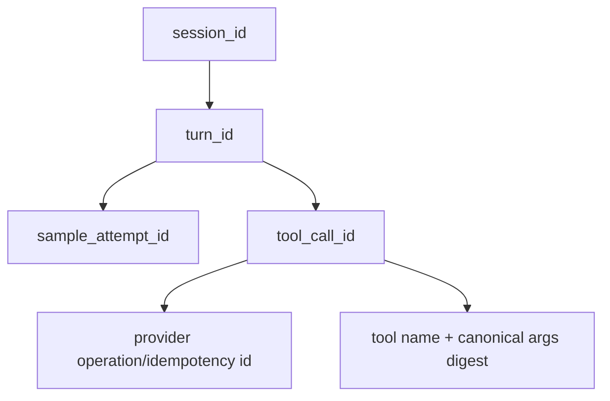
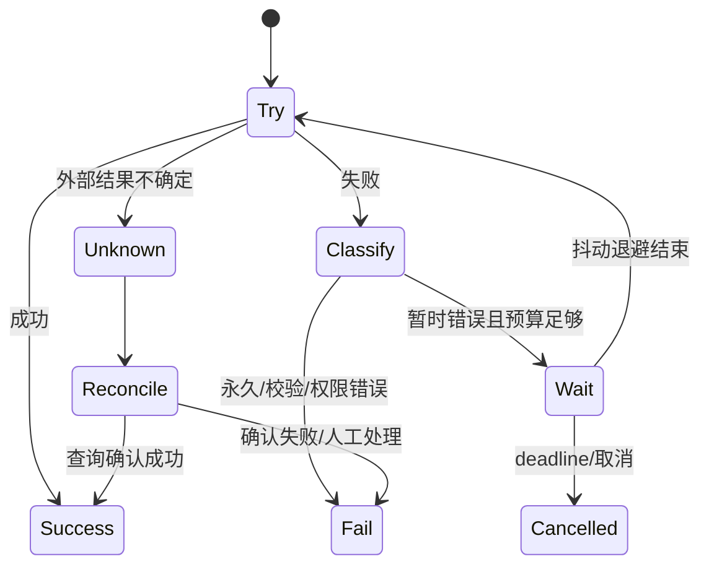
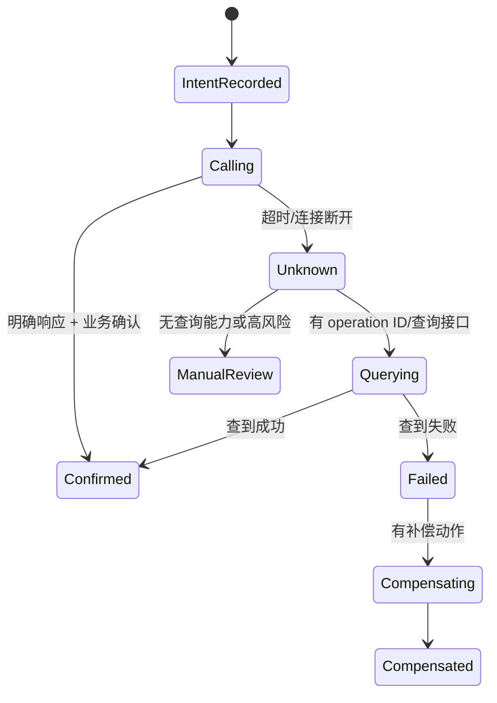

# Grok Build 可靠性与通用技术实现说明书

## 保证边界

- “已接受”只能在输入进入会话事实源后宣告；只进入 UI 队列或内存 channel 不等于持久接受。
- 本地进程默认不能承诺分布式 exactly-once。工具和网络调用采用 at-least-once 风险模型，依赖幂等键、状态查询和对账实现 effectively-once。
- 进程被 `SIGKILL`、设备损坏、外部服务不可用和用户批准的不可逆命令不保证自动恢复。

## 失败矩阵

| 故障 | 可观察状态 | 自动动作 | 禁止行为 |
|---|---|---|---|
| 接受事务前崩溃 | prompt 不存在 | 客户端可安全重提 | 宣称已接受 |
| 接受后响应丢失 | prompt 可能已存在 | 用 session/request ID 查询 | 无 ID 盲目重复提交 |
| 模型流中断 | 部分 delta + transport error | 仅按错误分类重试 | 把部分回答当完整终态 |
| Tool worker/进程崩溃 | call 为 running/unknown | 终止进程组、查询外部状态 | 直接标记成功 |
| 外部调用结果未知 | unknown/reconciliation-needed | 查询 provider operation ID | 对高风险副作用盲目重试 |
| 通知/遥测失败 | 主任务完成、观测降级 | 有界排队/熔断 | 阻断核心编码流程 |

## 幂等与标识

- 重试必须复用逻辑请求 ID，attempt 使用新 ID；历史 attempt 不覆盖。
- 文件编辑幂等性基于期望旧内容/文件摘要与补丁结果，发现版本漂移即冲突。
- 终端命令一般非幂等，默认不自动重复；只有工具声明或调用方证明安全时才重试。
- Hub/MCP frame 使用 ToolCallId 关联；重连后未确认调用进入 unknown，不能假定未执行。

## 重试、退避和预算

建议统一算法：`delay = min(cap, base * 2^attempt) * random(0.5, 1.5)`，同时受最大尝试数、累计重试时间、用户 deadline、取消令牌、`Retry-After` 和 circuit breaker 约束。实际 `base/cap/max_attempts` 属于类型化配置；当前数值需以代码默认值为准，不在本文复制。

禁止 HTTP、Sampler、Shell 和 Tool 四层同时进行无界重试；最靠近依赖的层负责短暂传输重试，上层只负责语义级重新发起。

## 超时、取消、熔断与背压

| 控制 | 实现位置 | 语义 |
|---|---|---|
| 连接/请求/流空闲超时 | HTTP/Sampler/MCP/Hub | 区分无法连接、请求超时和流停滞 |
| 步骤/总回合 deadline | Shell | 向采样、工具和子 Agent 传播 |
| 取消 | CancellationToken + Tool Context | 协作式停止；进程工具再向进程组发信号 |
| 熔断 | `xai-circuit-breaker` | 按依赖 key 进入 Open/Half-open，防止故障放大 |
| 背压 | 有界 channel/队列/并发限制 | 达软阈值延迟或降级，硬阈值明确拒绝 |
| 隔离 | 独立 transport/任务/进程 | MCP、上传、遥测失败不拖垮 Agent 主循环 |

## 外部副作用与结果未知

文件写入使用临时文件/原子替换或带前置条件的修改；Git、shell、MCP 和外部 API 可能产生不可逆副作用，调用前需记录意图和参数摘要，调用后记录明确结果。凭“HTTP 200”不能替代业务事实确认。

## 本地队列、Outbox/Inbox 与死信

当前仓库可见本地事件上传队列与多种 actor/channel，但没有统一持久任务队列。因此：

- 内存 channel 不是唯一事实源；进程退出后允许丢失的仅限可重建通知。
- 需要“接受后必达”的未来任务必须以 SQLite 事务同时写业务状态和 outbox，再由 worker 至少一次投递。
- Inbox 以 `(source, message_id)` 去重；处理结果和 ack 必须在同一事务边界或可对账边界内。
- 死信保存原始摘要、schema/version、attempt、错误分类、时间和关联 ID；重放创建新 attempt，需校验权限、版本和副作用风险。

引入持久队列的触发条件：跨进程必达任务、离线恢复、队列需超过进程生命周期、外部副作用需系统化对账，或内存背压已不能满足容量要求。

## Actor、租约与崩溃恢复

本地 Chat State/Hunk Tracker 采用单进程 actor，所有权随 task 生命周期，不需要分布式租约。若 Workspace/Agent 任务跨进程接管，则必须增加 `owner_id + epoch + lease_until`：只有当前 epoch 可以写终态；心跳续租；过期后新 owner 增加 epoch；旧 worker 的迟到结果被 fencing 拒绝。

检查点必须位于可重复边界：已持久化消息、已确认工具结果、已完成压缩步骤。不得在“外部调用已发出但结果未知”处当作安全检查点。

## SQLite 与文件系统恢复

- `xai-sqlite-journal` 在本地文件系统优先 WAL，在不安全网络挂载上使用 rollback journal。
- 数据库迁移需备份/版本检查/事务化；失败保持旧版本可读或明确阻止启动。
- 代码图、渲染缓存等派生数据应可删除重建；会话和记忆事实不可依赖仅存缓存。
- 备份成功不等于恢复成功；正式发布需在隔离目录演练恢复并验证消息顺序、工具结果关联和记忆查询。

## 遥测与故障注入验收

| 场景 | 注入方式 | 验收信号 |
|---|---|---|
| 模型流半途断开 | mock SSE 主动断链 | 部分流可见、错误分类正确、重试有界 |
| 工具超时 | test tool 阻塞 | deadline 传播、进程回收、终态非成功 |
| ACP stdin 截断 | 关闭 pipe | 会话安全结束、无 busy loop |
| MCP/Hub 重连 | 断开 transport | 连接恢复，未知调用不被重复确认 |
| 外部文件并发修改 | 编辑期间改文件 | 前置条件冲突，不覆盖用户变化 |
| 网络盘 SQLite | 模拟/检测网络 mount | 选择 rollback journal |
| 休眠跨超时 | 注入 suspend/wake | 不把休眠时间误算为依赖故障 |
| 遥测端持续 5xx | mock endpoint | breaker 打开，Agent 主流程继续 |

SLO、RPO/RTO、队列容量和阈值在仓库中无充分证据，均为“待生产负责人确认”；确认后应进入配置 Schema、仪表盘、告警和 Runbook，而不是只写在文档中。
