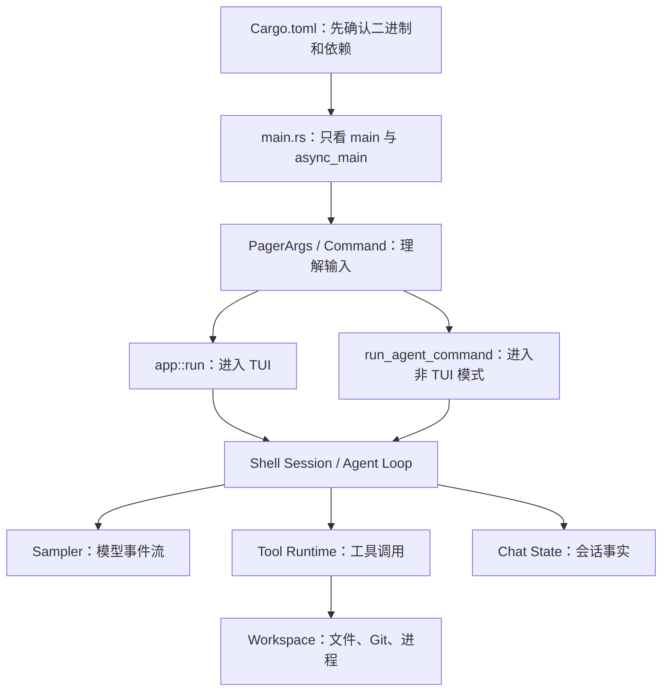

# Grok Build Rust 源码阅读笔记

这套文档面向刚开始学习 Rust、希望通过真实大型项目理解语言和工程实践的读者。记录原则不是简单翻译函数名，而是回答：代码从哪里进入、数据如何流动、为什么这样设计、失败时怎样返回，以及其中涉及哪些 Rust 语法。

## 当前阅读进度

| 序号 | 主题 | 源码范围 | 状态 |
|---|---|---|---|
| 01 | [程序入口与启动分发](01-程序入口与启动分发.md) | `xai-grok-pager-bin/src/main.rs`、该 crate 的 `Cargo.toml` | 已完成第一轮精读 |
| 02 | [CLI 参数模型与 Clap](02-CLI参数模型与Clap.md) | `xai-grok-pager/src/app/cli.rs`、`PagerArgs`、`Command` | 已完成第一轮精读 |
| 03 | [TUI 应用启动](03-TUI应用启动.md) | `xai-grok-pager::app::run` | 已完成第一轮精读 |
| 04 | [Agent 应用循环](04-Agent应用循环.md) | `xai-grok-shell` 的 agent/session | 已完成第一轮精读 |
| 05 | 模型流式采样 | `xai-grok-sampler`、sampling types | 待阅读 |
| 06 | 工具发现与调用 | tool runtime、computer hub、grok tools | 待阅读 |
| 07 | 文件编辑链路 | apply_patch、edit、write、workspace FS | 待阅读 |
| 08 | 会话状态与持久化 | chat state、session storage、compaction | 待阅读 |
| 09 | TUI 事件与渲染 | pager、pager-render、markdown | 待阅读 |
| 10 | 权限与沙箱 | workspace permission、grok-sandbox | 待阅读 |

## 推荐阅读路线



第一次阅读 `main.rs` 不建议从第 1 行顺序读到第 3166 行。先读下面四个位置：

1. `Cargo.toml` 的 `[[bin]]` 和依赖，确认编译产物。
2. `main()`，理解同步启动壳。
3. `async_main()`，理解顶层命令分发。
4. `run_agent_command()` 和 `xai_grok_pager::app::run()` 的调用点，理解两条主干。

jemalloc、Leader 重连、Workspace 管理和自动更新属于第二轮阅读内容。它们重要，但不是理解“用户输入如何进入 Agent”的最短路径。

## 每篇笔记的记录模板

```text
1. 文件职责：为什么存在、谁调用、调用谁
2. 入口和出口：参数、返回值、副作用
3. 主流程图：正常路径和早退路径
4. 逐段逻辑：按语义块解释，不机械逐行翻译
5. Rust 知识：所有权、借用、模式匹配、trait、async、错误处理
6. 工程技术：配置、并发、资源、日志、安全、可靠性
7. 易错点：新手容易误读或漏掉的行为
8. 验证方法：怎样用命令、日志或测试证明理解正确
9. 下一跳：从当前调用点继续读哪些文件
```

## 贯穿项目的 Rust 概念

| Rust 概念 | 项目中的用途 | 阅读时注意 |
|---|---|---|
| crate / workspace | 用多个 crate 划分 TUI、Shell、Agent、工具和 Workspace | crate 边界比文件夹名称更能说明依赖方向 |
| `Result<T, E>` 与 `?` | 将错误沿调用栈向上传播 | `?` 不是忽略错误，而是提前返回转换后的错误 |
| `Option<T>` | 表达参数未提供、配置未知、资源不存在 | 区分 `None` 与 false/空字符串 |
| `match` | 命令、状态和结果的穷尽分发 | enum 新增 variant 时编译器会要求处理 |
| `async fn` / `.await` | 网络、进程、通道、模型流等非阻塞任务 | `.await` 是可挂起点，状态可能在等待期间变化 |
| `tokio::spawn` | 后台更新、stdin/stdout 泵、并发任务 | JoinHandle 是否等待决定任务生命周期 |
| `Arc<Mutex<T>>` | 多任务共享可变状态 | 锁跨 `.await` 可能阻塞其他任务，需检查作用域 |
| trait | 隔离文件系统、工具、认证和传输实现 | 先找 trait，再找具体 impl |
| `#[cfg(...)]` | 平台和 feature 条件编译 | 当前平台看不到的代码仍可能影响发布构建 |
| RAII / Drop | Sentry guard、运行时、终端和锁的资源清理 | 变量名前的 `_` 不代表无用，可能依赖 Drop 副作用 |

## 如何验证阅读结论

```bash
# 确认入口包和二进制能通过类型检查
cargo check -p xai-grok-pager-bin

# 查看 CLI 分支，不进入完整 TUI
cargo run -p xai-grok-pager-bin -- --help
cargo run -p xai-grok-pager-bin -- --version

# 查看该包的依赖树
cargo tree -p xai-grok-pager-bin --depth 2

# 定位符号定义和调用点
rg -n 'fn main|async fn async_main|run_agent_command|xai_grok_pager::app::run' \
  crates/codegen/xai-grok-pager-bin/src/main.rs
```

运行真实 TUI、登录、更新或远程调用可能产生外部副作用；源码学习阶段优先使用 `cargo check`、`--help`、单元测试和只读搜索。
