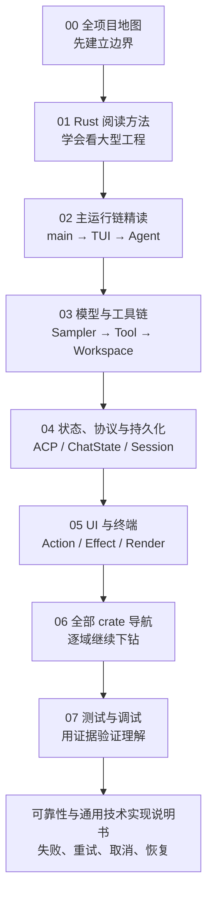

# Grok Build 源码精读手册

这套文档面向刚开始学习 Rust、希望通过真实大型项目建立工程能力的读者。目标不是把源码注释翻译成中文，而是回答以下问题：

- 程序从哪里开始，运行时如何分支？
- 每个 crate 为什么存在，边界在哪里？
- 数据、命令、事件和错误怎样跨模块流动？
- 所有权、trait、enum、Actor、异步 Stream 在真实工程中怎样使用？
- 正常、失败、取消、重试、恢复和权限路径分别怎样工作？
- 阅读结论如何通过测试、日志和命令验证？

## 一页阅读地图



## 文档目录

| 顺序 | 文档 | 解决的问题 |
|---|---|---|
| 00 | [全项目源码地图](00-全项目源码地图.md) | 项目是什么、代码怎样分层、应从哪里开始 |
| 01 | [Rust 新手阅读方法](01-Rust新手阅读方法.md) | 如何阅读 Cargo workspace、trait、Actor 和 async 代码 |
| 02 | [入口与主运行链精读](02-入口与主运行链精读.md) | 从 `main()` 到一轮 Agent 对话的完整控制流 |
| 03 | [模型采样与工具执行](03-模型采样与工具执行.md) | 模型流、工具发现、权限和文件副作用 |
| 04 | [状态协议与持久化](04-状态协议与持久化.md) | ACP、Session、ChatState、JSONL 与压缩 |
| 05 | [TUI事件循环与渲染](05-TUI事件循环与渲染.md) | 终端输入怎样变成界面状态和输出帧 |
| 06 | [Workspace全部Crate导航](06-Workspace全部Crate导航.md) | 每个 crate 的职责、入口和学习重点 |
| 07 | [测试调试与验证](07-测试调试与验证.md) | 如何安全地运行、定位、断点和验证 |
| 横切 | [可靠性与通用技术实现说明书](可靠性与通用技术实现说明书.md) | 失败分类、重试、取消、背压、恢复和审计 |

## 与已有文档的关系

`docs/source-reading/` 是按 01–10 形成的第一轮调用链笔记；本目录是全项目学习入口。遇到需要逐函数展开的主题，可继续阅读：

- [程序入口与启动分发](../source-reading/01-程序入口与启动分发.md)
- [CLI 参数模型与 Clap](../source-reading/02-CLI参数模型与Clap.md)
- [TUI 应用启动](../source-reading/03-TUI应用启动.md)
- [Agent 应用循环](../source-reading/04-Agent应用循环.md)
- [模型流式采样](../source-reading/05-模型流式采样.md)
- [工具发现与调用](../source-reading/06-工具发现与调用.md)
- [文件编辑链路](../source-reading/07-文件编辑链路.md)
- [会话状态与持久化](../source-reading/08-会话状态与持久化.md)
- [TUI 事件与渲染](../source-reading/09-TUI事件与渲染.md)
- [权限与沙箱](../source-reading/10-权限与沙箱.md)

## 每次阅读的固定记录法

```text
1. 定位：crate、文件、符号、谁调用它
2. 契约：输入、输出、错误、副作用
3. 主路径：用图画出正常控制流
4. 状态：哪些数据在何处拥有，谁能修改
5. 异步：每个 await、通道、spawn 的生命周期
6. 失败：取消、超时、重试、部分成功、恢复
7. Rust：本段代码体现的语言机制
8. 验证：测试名、日志、cargo/rg 命令
9. 下一跳：继续跟进的 1–3 个符号
```

## 阅读时的三个原则

1. **先沿调用链，再读实现细节。** 不要从一个数千行文件第一行顺序读到底。
2. **先找类型和 trait，再找 impl。** 类型定义说明允许的状态，trait 说明稳定边界，impl 才是某个具体方案。
3. **成功路径和失败路径同时读。** 大型异步程序的真实设计通常藏在取消、重试、通道关闭和恢复代码中。

